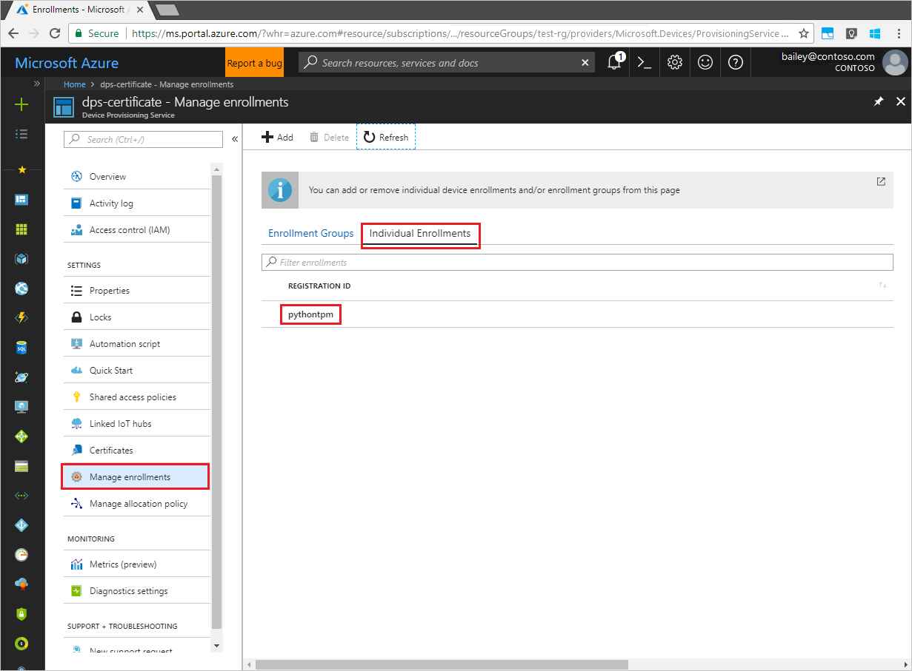

# Quickstart: Enroll TPM device to IoT Hub Device Provisioning Service using Python provisioning service SDK

[!INCLUDE [iot-dps-selector-quick-enroll-device-tpm](../../includes/iot-dps-selector-quick-enroll-device-tpm.md)]

These steps show how to programmatically create an individual enrollment for a TPM device in the Azure IoT Hub Device Provisioning Service, using the [V1 Python Provisioning Service SDK](https://github.com/Azure/azure-iot-sdk-python/tree/v1-deprecated/provisioning_service_client) with the help of a sample Python application. Although the Python Service SDK works on both Windows and Linux machines, this article uses a Windows development machine to walk through the enrollment process.

> [!IMPORTANT]
> This article only applies to the deprecated V1 Python SDK. Device and service clients for the Iot Hub Device Provisioning Service are not yet available in V2. The team is currently hard at work to bring V2 to feature parity.

Make sure to [set up IoT Hub Device Provisioning Service with the Azure portal](./quick-setup-auto-provision.md) before you proceed.


<a id="prepareenvironment"></a>

## Prepare the environment 

1. Download and install [Python 2.x or 3.x](https://www.python.org/downloads/). Make sure to use the 32-bit or 64-bit installation as required by your setup. When prompted during the installation, make sure to add Python to your platform-specific environment variables. 

1. Choose one of the following options:

    - Build and compile the **Azure IoT Python SDK**. Follow [these instructions](https://github.com/Azure/azure-iot-sdk-python/blob/v1-deprecated/doc/python-devbox-setup.md) to build the Python packages. If you are using Windows OS, then also install [Visual C++ redistributable package](https://support.microsoft.com/help/2977003/the-latest-supported-visual-c-downloads) to allow the use of native DLLs from Python.

    - [Install or upgrade *pip*, the Python package management system](https://pip.pypa.io/en/stable/installing/) and install the package via the following command:

        ```cmd/sh
        pip install azure-iothub-provisioningserviceclient
        ```

1. You need the endorsement key for your device. If you have followed the [Create and provision a simulated device](quick-create-simulated-device.md) quickstart to create a simulated TPM device, use the key created for that device. Otherwise, you can use the following endorsement key supplied with the SDK:

    ```
    AToAAQALAAMAsgAgg3GXZ0SEs/gakMyNRqXXJP1S124GUgtk8qHaGzMUaaoABgCAAEMAEAgAAAAAAAEAtW6MOyCu/Nih47atIIoZtlYkhLeCTiSrtRN3q6hqgOllA979No4BOcDWF90OyzJvjQknMfXS/Dx/IJIBnORgCg1YX/j4EEtO7Ase29Xd63HjvG8M94+u2XINu79rkTxeueqW7gPeRZQPnl1xYmqawYcyzJS6GKWKdoIdS+UWu6bJr58V3xwvOQI4NibXKD7htvz07jLItWTFhsWnTdZbJ7PnmfCa2vbRH/9pZIow+CcAL9mNTNNN4FdzYwapNVO+6SY/W4XU0Q+dLMCKYarqVNH5GzAWDfKT8nKzg69yQejJM8oeUWag/8odWOfbszA+iFjw3wVNrA5n8grUieRkPQ==
    ```


## Modify the Python sample code

This section shows how to add the provisioning details of your TPM device to the sample code. 

1. Using a text editor, create a new **TpmEnrollment.py** file.

1. Add the following `import` statements and variables at the start of the **TpmEnrollment.py** file. Then replace `dpsConnectionString` with your connection string found under **Shared access policies** in your **Device Provisioning Service** on the **Azure portal**. Replace `endorsementKey` with the value noted previously in [Prepare the environment](quick-enroll-device-tpm-python.md#prepareenvironment). Finally, create a unique `registrationid` and be sure that it only consists of lower-case alphanumerics and hyphens.  
   
    ```python
    from provisioningserviceclient import ProvisioningServiceClient
    from provisioningserviceclient.models import IndividualEnrollment, AttestationMechanism

    CONNECTION_STRING = "{dpsConnectionString}"

    ENDORSEMENT_KEY = "{endorsementKey}"

    REGISTRATION_ID = "{registrationid}"
    ```

1. Add the following function and function call to implement the group enrollment creation:
   
    ```python
    def main():
        print ( "Starting individual enrollment..." )

        psc = ProvisioningServiceClient.create_from_connection_string(CONNECTION_STRING)

        att = AttestationMechanism.create_with_tpm(ENDORSEMENT_KEY)
        ie = IndividualEnrollment.create(REGISTRATION_ID, att)

        ie = psc.create_or_update(ie)
	
        print ( "Individual enrollment successful." )
    
    if __name__ == '__main__':
        main()
    ```

1. Save and close the **TpmEnrollment.py** file.
 

## Run the sample TPM enrollment

1. Open a command prompt, and run the script.

    ```cmd/sh
    python TpmEnrollment.py
    ```

1. Observe the output for the successful enrollment.

1. Navigate to your provisioning service in the Azure portal. Select **Manage enrollments**. Notice that your TPM device appears under the **Individual Enrollments** tab, with the name `registrationid` created earlier. 

      


## Clean up resources
If you plan to explore the Java service sample, do not clean up the resources created in this quickstart. If you do not plan to continue, use the following steps to delete all resources created by this quickstart.

1. Close the Python sample output window on your machine.
1. If you created a simulated TPM device, close the TPM simulator window.
1. Navigate to your Device Provisioning service in the Azure portal, select **Manage enrollments**, and then select the **Individual Enrollments** tab. Select the check box next to the *Registration ID* for the enrollment entry you created using this quickstart, and press the **Delete** button at the top of the pane.


## Next steps
In this quickstart, you’ve programmatically created an individual enrollment entry for a TPM device, and, optionally, created a TPM simulated device on your machine and provisioned it to your IoT hub using the Azure IoT Hub Device Provisioning Service. To learn about device provisioning in depth, continue to the tutorial for the Device Provisioning Service setup in the Azure portal.

> [!div class="nextstepaction"]
> [Azure IoT Hub Device Provisioning Service tutorials](./tutorial-set-up-cloud.md)
