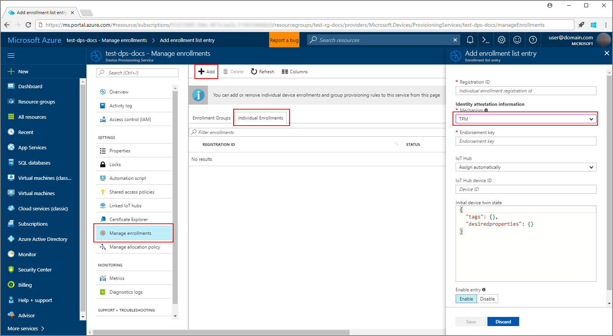
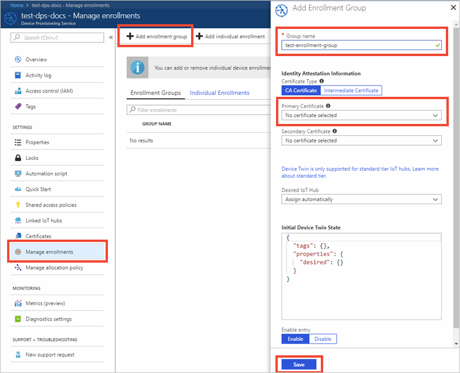
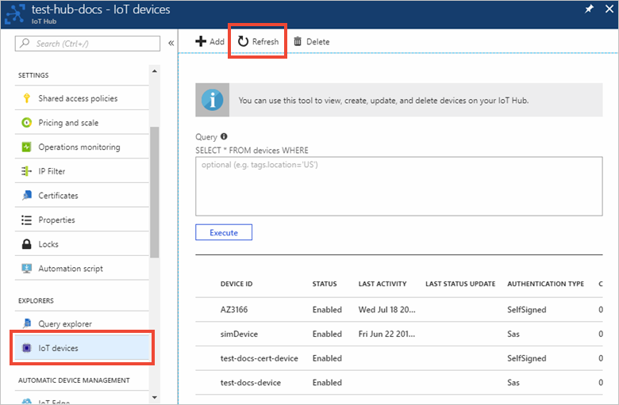

# Tutorial: Provision the device to an IoT hub using the Azure IoT Hub Device Provisioning Service

In the previous tutorial, you learned how to set up a device to connect to your Device Provisioning service. In this tutorial, you learn how to use this service to provision your device to a single IoT hub, using auto-provisioning and **_enrollment lists_**. This tutorial shows you how to:

> [!div class="checklist"]
> * Enroll the device
> * Start the device
> * Verify the device is registered

## Prerequisites

Before you proceed, make sure to configure your device as discussed in the tutorial [Setup a device to provision using Azure IoT Hub Device Provisioning Service](./tutorial-set-up-device.md).

If you're unfamiliar with the process of auto-provisioning, review the [provisioning](about-iot-dps.md#provisioning-process) overview before continuing.

## Enroll the device

This step involves adding the device's unique security artifacts to the Device Provisioning Service. These security artifacts are based on the device's [Attestation mechanism](concepts-service.md#attestation-mechanism) as follows:

- For TPM-based devices you need:
    - The *Endorsement Key* that is unique to each TPM chip or simulation, which is obtained from the TPM chip manufacturer.  Read the [Understand TPM Endorsement Key](https://technet.microsoft.com/library/cc770443.aspx) for more information.
    - The *Registration ID* that is used to uniquely identify a device in the namespace/scope. This ID may or may not be the same as the device ID. The ID is mandatory for every device. For TPM-based devices, the registration ID may be derived from the TPM itself, for example, an SHA-256 hash of the TPM Endorsement Key.

        

- For X.509 based devices you need:
    - The [certificate issued to the X.509](https://msdn.microsoft.com/library/windows/desktop/bb540819.aspx) chip or simulation, in the form of either a *.pem* or a *.cer* file. For individual enrollment, you need to use the per-device  *signed certificate* for your X.509 system, while for enrollment groups, you need to use the *root certificate*. 

      

There are two ways to enroll the device to the Device Provisioning Service:

- **Enrollment Groups**
    This represents a group of devices that share a specific attestation mechanism. We recommend using an enrollment group for a large number of devices, which share a desired initial configuration, or for devices all going to the same tenant. For more information on Identity attestation for enrollment groups, see [Security](concepts-x509-attestation.md#controlling-device-access-to-the-provisioning-service-with-x509-certificates).

    

- **Individual Enrollments**
    This represents an entry for a single device that may register with the Device Provisioning Service. Individual enrollments may use either x509 certificates or SAS tokens (in a real or virtual TPM) as attestation mechanisms. We recommend using individual enrollments for devices that require unique initial configurations, and devices that can only use SAS tokens via TPM or virtual TPM as the attestation mechanism. Individual enrollments may have the desired IoT hub device ID specified.

Now you enroll the device with your Device Provisioning Service instance, using the required security artifacts based on the device's attestation mechanism: 

1. Sign in to the Azure portal, click on the **All resources** button on the left-hand menu and open your Device Provisioning service.

2. On the Device Provisioning Service summary blade, select **Manage enrollments**. Select either **Individual Enrollments** tab or the **Enrollment Groups** tab as per your device setup. Click the **Add** button at the top. Select **TPM** or **X.509** as the identity attestation *Mechanism*, and enter the appropriate security artifacts as discussed previously. You may enter a new **IoT Hub device ID**. Once complete, click the **Save** button. 

3. When the device is successfully enrolled, you should see it displayed in the portal as follows:

    

After enrollment, the provisioning service then waits for the device to boot and connect with it at any later point in time. When your device boots for the first time, the client SDK library interacts with your chip to extract the security artifacts from the device, and verifies registration with your Device Provisioning service. 

## Start the IoT device

Your IoT device can be a real device, or a simulated device. Since the IoT device has now been enrolled with a Device Provisioning Service instance, the device can now boot up, and call the provisioning service to be recognized using the attestation mechanism. Once the provisioning service has recognized the device, it will be assigned to an IoT hub. 

Simulated device examples, using both TPM and X.509 attestation, are included for C, Java, C#, Node.js, and Python. For example, a simulated device using TPM and the [Azure IoT C SDK](https://github.com/Azure/azure-iot-sdk-c) would follow the process covered in the [Simulate first boot sequence for a device](quick-create-simulated-device.md#simulate-first-boot-sequence-for-the-device) section. The same device using X.509 certificate attestation would refer to this [boot sequence](quick-create-simulated-device-x509.md#simulate-first-boot-sequence-for-the-device) section.

Refer to the [How-to guide for the MXChip Iot DevKit](how-to-connect-mxchip-iot-devkit.md) as an example for a real device.

Start the device to allow your device's client application to start the registration with your Device Provisioning service.  

## Verify the device is registered

Once your device boots, the following actions should take place:

1. The device sends a registration request to your Device Provisioning service.
2. For TPM devices, the Device Provisioning Service sends back a registration challenge to which your device responds. 
3. On successful registration, the Device Provisioning Service sends the IoT hub URI, device ID, and the encrypted key back to the device. 
4. The IoT Hub client application on the device then connects to your hub. 
5. On successful connection to the hub, you should see the device appear in the IoT hub's **IoT Devices** explorer. 

    

For more information, see the provisioning device client sample, [prov_dev_client_sample.c](https://github.com/Azure/azure-iot-sdk-c/blob/master/provisioning_client/samples/prov_dev_client_sample/prov_dev_client_sample.c). The sample demonstrates provisioning a simulated device using TPM, X.509 certificates and symmetric keys. Refer back to the [TPM](https://docs.microsoft.com/azure/iot-dps/quick-create-simulated-device), [X.509](https://docs.microsoft.com/azure/iot-dps/quick-create-simulated-device-x509), and [Symmetric key](https://docs.microsoft.com/azure/iot-dps/quick-create-simulated-device-symm-key) attestation quickstarts for step-by-step instructions on using the sample.

## Next steps
In this tutorial, you learned how to:

> [!div class="checklist"]
> * Enroll the device
> * Start the device
> * Verify the device is registered

Advance to the next tutorial to learn how to provision multiple devices across load-balanced hubs. 

> [!div class="nextstepaction"]
> [Provision devices across load-balanced IoT hubs](./tutorial-provision-multiple-hubs.md)
