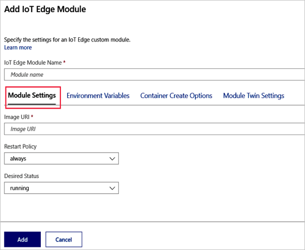
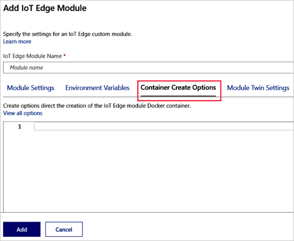
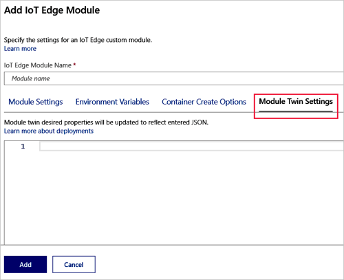
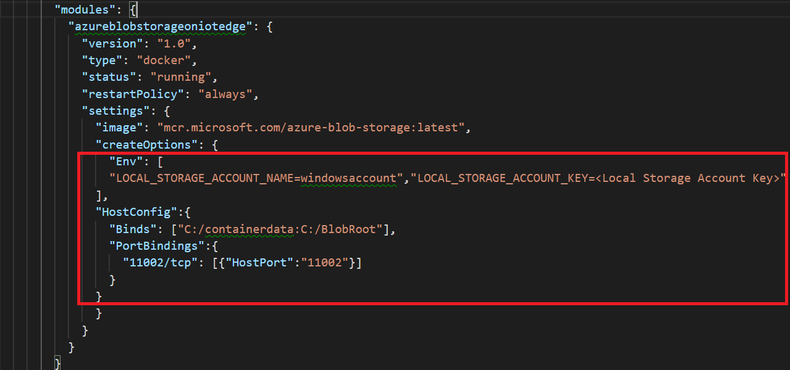
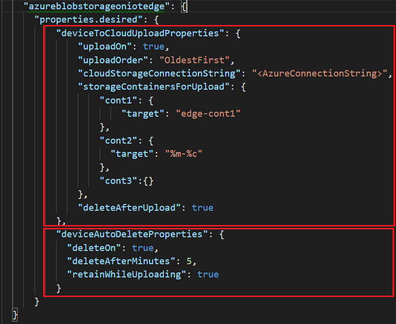
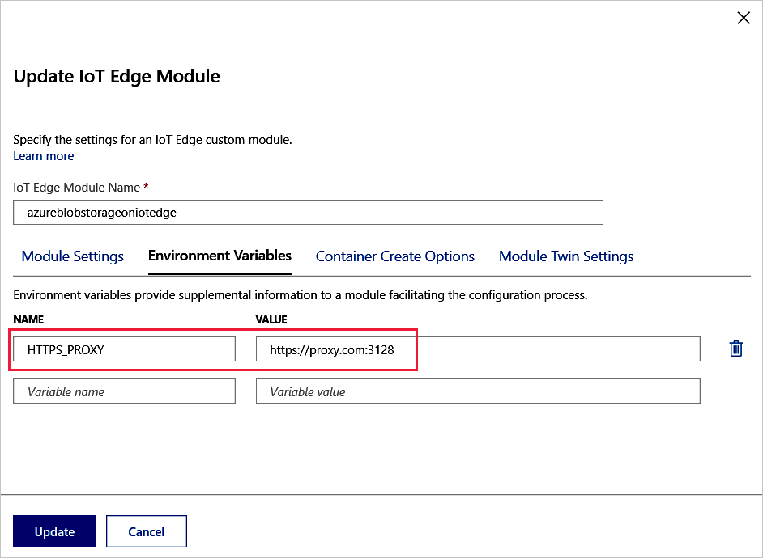

# Deploy the Azure Blob Storage on IoT Edge module to your device

There are several ways to deploy modules to an IoT Edge device and all of them work for Azure Blob Storage on IoT Edge modules. The two simplest methods are to use the Azure portal or Visual Studio Code templates.

## Prerequisites

- An [IoT hub](../iot-hub/iot-hub-create-through-portal.md) in your Azure subscription.
- An [IoT Edge device](how-to-register-device.md) with the IoT Edge runtime installed.
- [Visual Studio Code](https://code.visualstudio.com/) and the [Azure IoT Tools](https://marketplace.visualstudio.com/items?itemName=vsciot-vscode.azure-iot-tools) if deploying from Visual Studio Code.

## Deploy from the Azure portal

The Azure portal guides you through creating a deployment manifest and pushing the deployment to an IoT Edge device.

### Select your device

1. Sign in to the [Azure portal](https://portal.azure.com) and navigate to your IoT hub.
1. Select **IoT Edge** from the menu.
1. Click on the ID of the target device from the list of devices.'
1. Select **Set Modules**.

### Configure a deployment manifest

A deployment manifest is a JSON document that describes which modules to deploy, how data flows between the modules, and desired properties of the module twins. The Azure portal has a wizard that walks you through creating a deployment manifest. It has three steps organized into tabs: **Modules**, **Routes**, and **Review + Create**.

#### Add modules

1. In the **IoT Edge Modules** section of the page, click the **Add** dropdown and select **IoT Edge Module** to display the **Add IoT Edge Module** page.

2. On the **Module Settings** tab, provide a name for the module and then specify the container image URI:

   Examples:
  
   - **IoT Edge Module Name**: `azureblobstorageoniotedge`
   - **Image URI**: `mcr.microsoft.com/azure-blob-storage:latest`

   

   Don't select **Add** until you've specified values on the **Module Settings**, **Container Create Options**, and  **Module Twin Settings** tabs as described in this procedure.

   > [!IMPORTANT]
   > Azure IoT Edge is case-sensitive when you make calls to modules, and the Storage SDK also defaults to lowercase. Although the name of the module in the [Azure Marketplace](how-to-deploy-modules-portal.md#deploy-modules-from-azure-marketplace) is **AzureBlobStorageonIoTEdge**, changing the name to lowercase helps to ensure that your connections to the Azure Blob Storage on IoT Edge module aren't interrupted.

3. Open the **Container Create Options** tab.

   

   Copy and paste the following JSON into the box, to provide storage account information and a mount for the storage on your device.
  
   ```json
   {
     "Env":[
       "LOCAL_STORAGE_ACCOUNT_NAME=<your storage account name>",
       "LOCAL_STORAGE_ACCOUNT_KEY=<your storage account key>"
     ],
     "HostConfig":{
       "Binds":[
           "<storage mount>"
       ],
       "PortBindings":{
         "11002/tcp":[{"HostPort":"11002"}]
       }
     }
   }
   ```

4. Update the JSON that you copied into **Container Create Options** with the following information:

   - Replace `<your storage account name>` with a name that you can remember. Account names should be 3 to 24 characters long, with lowercase letters and numbers. No spaces.

   - Replace `<your storage account key>` with a 64-byte base64 key. You can generate a key with tools like [GeneratePlus](https://generate.plus/en/base64). You'll use these credentials to access the blob storage from other modules.

   - Replace `<storage mount>` according to your container operating system. Provide the name of a [volume](https://docs.docker.com/storage/volumes/) or the absolute path to an existing directory on your IoT Edge device where the blob module will store its data. The storage mount maps a location on your device that you provide to a set location in the module.

     - For Linux containers, the format is **\<your storage path or volume>:/blobroot**. For example:
         - use [volume mount](https://docs.docker.com/storage/volumes/): `my-volume:/blobroot`
         - use [bind mount](https://docs.docker.com/storage/bind-mounts/): `/srv/containerdata:/blobroot`. Make sure to follow the steps to [grant directory access to the container user](how-to-store-data-blob.md#granting-directory-access-to-container-user-on-linux)
     - For Windows containers, the format is **\<your storage path or volume>:C:/BlobRoot**. For example:
         - use [volume mount](https://docs.docker.com/storage/volumes/): `my-volume:C:/BlobRoot`.
         - use [bind mount](https://docs.docker.com/storage/bind-mounts/): `C:/ContainerData:C:/BlobRoot`.
         - Instead of using your local drive, you can map your SMB network location, for more information, see [using SMB share as your local storage](how-to-store-data-blob.md#using-smb-share-as-your-local-storage)

     > [!IMPORTANT]
     > Do not change the second half of the storage mount value, which points to a specific location in the Blob Storage on IoT Edge module. The storage mount must always end with **:/blobroot** for Linux containers and **:C:/BlobRoot** for Windows containers.

5. On the **Module Twin Settings** tab, copy the following JSON and paste it into the box.

   

   Configure each property with an appropriate value, as indicated by the placeholders. If you are using the IoT Edge simulator, set the values to the related environment variables for these properties as described by [deviceToCloudUploadProperties](how-to-store-data-blob.md#devicetoclouduploadproperties) and [deviceAutoDeleteProperties](how-to-store-data-blob.md#deviceautodeleteproperties).

   ```json
   {
     "deviceAutoDeleteProperties": {
       "deleteOn": <true, false>,
       "deleteAfterMinutes": <timeToLiveInMinutes>,
       "retainWhileUploading": <true,false>
     },
     "deviceToCloudUploadProperties": {
       "uploadOn": <true, false>,
       "uploadOrder": "<NewestFirst, OldestFirst>",
       "cloudStorageConnectionString": "DefaultEndpointsProtocol=https;AccountName=<your Azure Storage Account Name>;AccountKey=<your Azure Storage Account Key>; EndpointSuffix=<your end point suffix>",
       "storageContainersForUpload": {
         "<source container name1>": {
           "target": "<target container name1>"
         }
       },
       "deleteAfterUpload": <true,false>
     }
   }
   ```

   For information on configuring deviceToCloudUploadProperties and deviceAutoDeleteProperties after your module has been deployed, see [Edit the Module Twin](https://github.com/Microsoft/vscode-azure-iot-toolkit/wiki/Edit-Module-Twin). For more information about desired properties, see [Define or update desired properties](module-composition.md#define-or-update-desired-properties).

6. Select **Add**.

7. Select **Next: Routes** to continue to the routes section.

#### Specify routes

Keep the default routes and select **Next: Review + create** to continue to the review section.

#### Review deployment

The review section shows you the JSON deployment manifest that was created based on your selections in the previous two sections. There are also two modules declared that you didn't add: **$edgeAgent** and **$edgeHub**. These two modules make up the [IoT Edge runtime](iot-edge-runtime.md) and are required defaults in every deployment.

Review your deployment information, then select **Create**.

### Verify your deployment

After you create the deployment, you return to the **IoT Edge** page of your IoT hub.

1. Select the IoT Edge device that you targeted with the deployment to open its details.
1. In the device details, verify that the blob storage module is listed as both **Specified in deployment** and **Reported by device**.

It may take a few moments for the module to be started on the device and then reported back to IoT Hub. Refresh the page to see an updated status.

## Deploy from Visual Studio Code

Azure IoT Edge provides templates in Visual Studio Code to help you develop edge solutions. Use the following steps to create a new IoT Edge solution with a blob storage module and to configure the deployment manifest.

1. Select **View** > **Command Palette**.

1. In the command palette, enter and run the command **Azure IoT Edge: New IoT Edge solution**.

   

   Follow the prompts in the command palette to create your solution.

   | Field | Value |
   | ----- | ----- |
   | Select folder | Choose the location on your development machine for Visual Studio Code to create the solution files. |
   | Provide a solution name | Enter a descriptive name for your solution or accept the default **EdgeSolution**. |
   | Select module template | Choose **Existing Module (Enter full image URL)**. |
   | Provide a module name | Enter an all-lowercase name for your module, like **azureblobstorageoniotedge**.<br/><br/>It's important to use a lowercase name for the Azure Blob Storage on IoT Edge module. IoT Edge is case-sensitive when referring to modules, and the Storage SDK defaults to lowercase. |
   | Provide Docker image for the module | Provide the image URI: **mcr.microsoft.com/azure-blob-storage:latest** |

   Visual Studio Code takes the information you provided, creates an IoT Edge solution, and then loads it in a new window. The solution template creates a deployment manifest template that includes your blob storage module image, but you need to configure the module's create options.

1. Open *deployment.template.json* in your new solution workspace and find the **modules** section. Make the following configuration changes:

   1. Delete the **SimulatedTemperatureSensor** module, as it's not necessary for this deployment.

   1. Copy and paste the following code into the `createOptions` field:

      ```json
      "Env":[
       "LOCAL_STORAGE_ACCOUNT_NAME=<your storage account name>",
       "LOCAL_STORAGE_ACCOUNT_KEY=<your storage account key>"
      ],
      "HostConfig":{
        "Binds": ["<storage mount>"],
        "PortBindings":{
          "11002/tcp": [{"HostPort":"11002"}]
        }
      }
      ```

      

1. Replace `<your storage account name>` with a name that you can remember. Account names should be 3 to 24 characters long, with lowercase letters and numbers. No spaces.

1. Replace `<your storage account key>` with a 64-byte base64 key. You can generate a key with tools like [GeneratePlus](https://generate.plus/en/base64). You'll use these credentials to access the blob storage from other modules.

1. Replace `<storage mount>` according to your container operating system. Provide the name of a [volume](https://docs.docker.com/storage/volumes/) or the absolute path to a directory on your IoT Edge device where you want the blob module to store its data. The storage mount maps a location on your device that you provide to a set location in the module.  

     - For Linux containers, the format is **\<your storage path or volume>:/blobroot**. For example:
         - use [volume mount](https://docs.docker.com/storage/volumes/): `my-volume:/blobroot`
         - use [bind mount](https://docs.docker.com/storage/bind-mounts/): `/srv/containerdata:/blobroot`. Make sure to follow the steps to [grant directory access to the container user](how-to-store-data-blob.md#granting-directory-access-to-container-user-on-linux)
     - For Windows containers, the format is **\<your storage path or volume>:C:/BlobRoot**. For example
         - use [volume mount](https://docs.docker.com/storage/volumes/): `my-volume:C:/BlobRoot`.
         - use [bind mount](https://docs.docker.com/storage/bind-mounts/): `C:/ContainerData:C:/BlobRoot`.
         - Instead of using your local drive, you can map your SMB network location, for more information see [using SMB share as your local storage](how-to-store-data-blob.md#using-smb-share-as-your-local-storage)

     > [!IMPORTANT]
     > Do not change the second half of the storage mount value, which points to a specific location in the Blob Storage on IoT Edge module. The storage mount must always end with **:/blobroot** for Linux containers and **:C:/BlobRoot** for Windows containers.

1. Configure [deviceToCloudUploadProperties](how-to-store-data-blob.md#devicetoclouduploadproperties) and [deviceAutoDeleteProperties](how-to-store-data-blob.md#deviceautodeleteproperties) for your module by adding the following JSON to the *deployment.template.json* file. Configure each property with an appropriate value and save the file. If you are using the IoT Edge simulator, set the values to the related environment variables for these properties, which you can find in the explanation section of [deviceToCloudUploadProperties](how-to-store-data-blob.md#devicetoclouduploadproperties) and [deviceAutoDeleteProperties](how-to-store-data-blob.md#deviceautodeleteproperties)

   ```json
   "<your azureblobstorageoniotedge module name>":{
     "properties.desired": {
       "deviceAutoDeleteProperties": {
         "deleteOn": <true, false>,
         "deleteAfterMinutes": <timeToLiveInMinutes>,
         "retainWhileUploading": <true, false>
       },
       "deviceToCloudUploadProperties": {
         "uploadOn": <true, false>,
         "uploadOrder": "<NewestFirst, OldestFirst>",
         "cloudStorageConnectionString": "DefaultEndpointsProtocol=https;AccountName=<your Azure Storage Account Name>;AccountKey=<your Azure Storage Account Key>;EndpointSuffix=<your end point suffix>",
         "storageContainersForUpload": {
           "<source container name1>": {
             "target": "<target container name1>"
           }
         },
         "deleteAfterUpload": <true, false>
       }
     }
   }
   ```

   

   For information on configuring deviceToCloudUploadProperties and deviceAutoDeleteProperties after your module has been deployed, see [Edit the Module Twin](https://github.com/Microsoft/vscode-azure-iot-toolkit/wiki/Edit-Module-Twin). For more information about container create options, restart policy, and desired status, see [EdgeAgent desired properties](module-edgeagent-edgehub.md#edgeagent-desired-properties).

1. Save the *deployment.template.json* file.

1. Right-click **deployment.template.json** and select **Generate IoT Edge deployment manifest**.

1. Visual Studio Code takes the information that you provided in *deployment.template.json* and uses it to create a new deployment manifest file. The deployment manifest is created in a new **config** folder in your solution workspace. Once you have that file, you can follow the steps in [Deploy Azure IoT Edge modules from Visual Studio Code](how-to-deploy-modules-vscode.md) or [Deploy Azure IoT Edge modules with Azure CLI 2.0](how-to-deploy-modules-cli.md).

## Deploy multiple module instances

If you want to deploy multiple instances of the Azure Blob Storage on IoT Edge module, you need to provide a different storage path and change the `HostPort` value that the module binds to. The blob storage modules always expose port 11002 in the container, but you can declare which port it's bound to on the host.

Edit **Container Create Options** (in the Azure portal) or the **createOptions** field (in the *deployment.template.json* file in Visual Studio Code) to change the `HostPort` value:

```json
"PortBindings":{
  "11002/tcp": [{"HostPort":"<port number>"}]
}
```

When you connect to additional blob storage modules, change the endpoint to point to the updated host port.

## Configure proxy support

If your organization is using a proxy server, you will need to configure proxy support for the edgeAgent and edgeHub runtime modules. This process involves two tasks:

- Configure the runtime daemons and the IoT Edge agent on the device.
- Set the HTTPS_PROXY environment variable for modules in the deployment manifest JSON file.

This process is described in [Configure an IoT Edge device to communicate through a proxy server](how-to-configure-proxy-support.md).

In addition, a blob storage module also requires the HTTPS_PROXY setting in the manifest deployment file. You can directly edit the deployment manifest file, or use the Azure portal.

1. Navigate to your Iot hub in the Azure portal and select **Iot Edge** from the left pane menu.

1. Select the device with the module to configure.

1. Select **Set Modules**.

1. In the **IoT Edge Modules** section of the page, select the blob storage module.

1. On the **Update IoT Edge Module** page, select the **Environment Variables** tab.

1. Add `HTTPS_PROXY` for the **Name** and your proxy URL for the **Value**.

      

1. Click **Update**, then **Review + Create**.

1. Note that the proxy is added to the module in deployment manifest and select **Create**.

1. Verify the setting by selecting the module from the device details page, and on the lower part of the **IoT Edge Modules Details** page select the **Environment Variables** tab.

      

## Next steps

Learn more about [Azure Blob Storage on IoT Edge](how-to-store-data-blob.md).

For more information about how deployment manifests work and how to create them, see [Understand how IoT Edge modules can be used, configured, and reused](module-composition.md).
