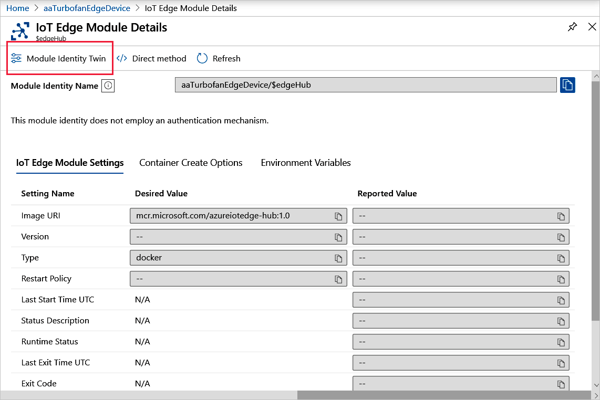
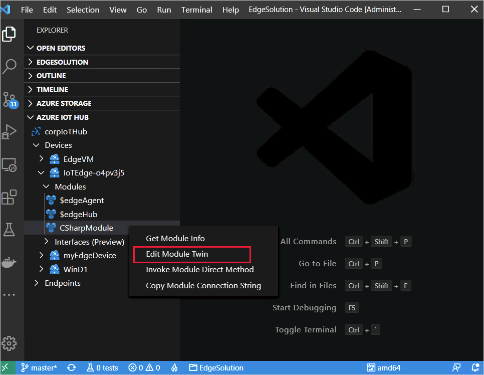
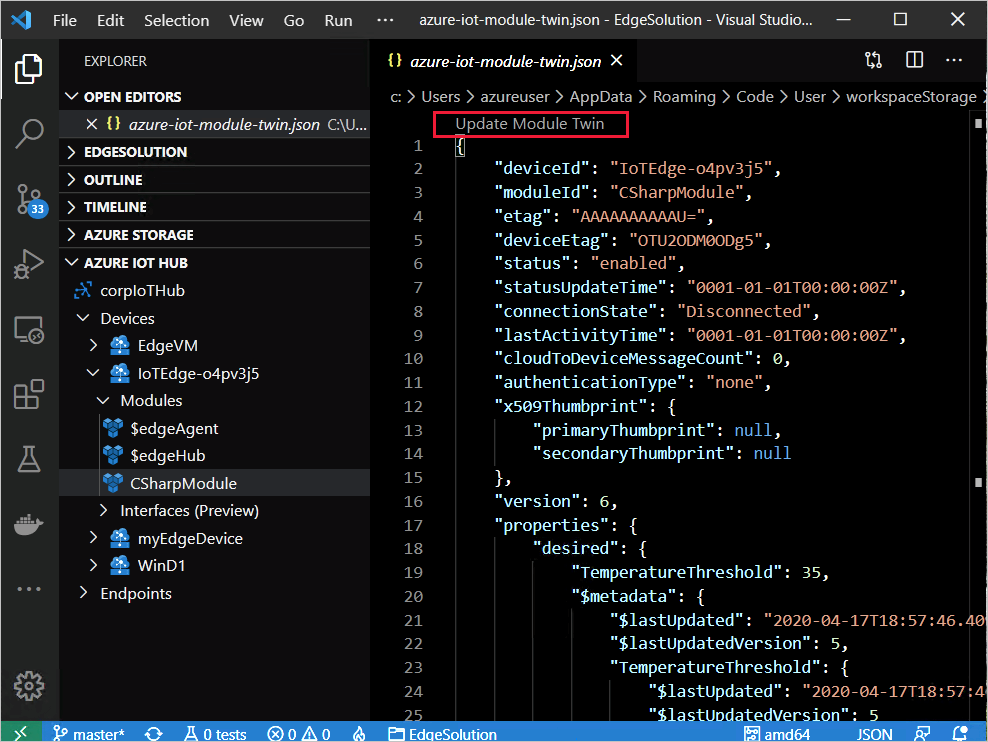

# Monitor module twins

Module twins in Azure IoT Hub enable monitoring the connectivity and health of your IoT Edge deployments. Module twins store useful information in your IoT hub about the performance of your running modules. The [IoT Edge agent](iot-edge-runtime.md#iot-edge-agent) and the [IoT Edge hub](iot-edge-runtime.md#iot-edge-hub) runtime modules each maintain their module twins, `$edgeAgent` and `$edgeHub`, respectively:

* `$edgeAgent` contains health and connectivity data about both the IoT Edge agent and IoT Edge hub runtime modules, and your custom modules. The IoT Edge agent is responsible for deploying the modules, monitoring them, and reporting connection status to your Azure IoT hub.
* `$edgeHub` contains data about communications between the IoT Edge hub running on a device and your Azure IoT hub. This includes processing incoming messages from downstream devices. IoT Edge hub is responsible for processing the communications between the Azure IoT Hub and the IoT Edge devices and modules.

The data is organized into metadata, tags, along with desired and reported property sets in the module twins' JSON structures. The desired properties you specified in your deployment.json file are copied to the module twins. The IoT Edge agent and the IoT Edge hub each update the reported properties for their modules.

Similarly, the desired properties specified for your custom modules in the deployment.json file are copied to its module twin, but your solution is responsible for providing its reported property values.

This article describes how to review the module twins in the Azure portal, Azure CLI, and in Visual Studio Code. For information on monitoring how your devices receive the deployments, see [Monitor IoT Edge deployments](how-to-monitor-iot-edge-deployments.md). For an overview on the concept of module twins, see [Understand and use module twins in IoT Hub](../iot-hub/iot-hub-devguide-module-twins.md).

> [!TIP]
> The reported properties of a runtime module could be stale if an IoT Edge device gets disconnected from its IoT hub. You can [ping](how-to-edgeagent-direct-method.md#ping) the `$edgeAgent` module to determine if the connection was lost.

## Monitor runtime module twins

To troubleshoot deployment connectivity issues, review the IoT Edge agent and IoT Edge hub runtime module twins and then drill down into other modules.

### Monitor IoT Edge agent module twin

The following JSON shows the `$edgeAgent` module twin in Visual Studio Code with most of the JSON sections collapsed.

```json
{
  "deviceId": "Windows109",
  "moduleId": "$edgeAgent",
  "etag": "AAAAAAAAAAU=",
  "deviceEtag": "NzgwNjA1MDUz",
  "status": "enabled",
  "statusUpdateTime": "0001-01-01T00:00:00Z",
  "connectionState": "Disconnected",
  "lastActivityTime": "0001-01-01T00:00:00Z",
  "cloudToDeviceMessageCount": 0,
  "authenticationType": "sas",
  "x509Thumbprint": {
    "primaryThumbprint": null,
    "secondaryThumbprint": null
  },
  "version": 53,
  "properties": {
    "desired": { "···" },
    "reported": {
      "schemaVersion": "1.0",
      "version": { "···" },
      "lastDesiredStatus": { "···" },
      "runtime": { "···" },
      "systemModules": {
        "edgeAgent": { "···" },
        "edgeHub": { "···" }
      },
      "lastDesiredVersion": 5,
      "modules": {
        "SimulatedTemperatureSensor": { "···" }
      },
      "$metadata": { "···" },
      "$version": 48
    }
  }
}
```

The JSON can be described in the following sections, starting from the top:

* Metadata - Contains connectivity data. Interestingly, the connection state for the IoT Edge agent is always in a disconnected state: `"connectionState": "Disconnected"`. The reason being the connection state pertains to device-to-cloud (D2C) messages and the IoT Edge agent doesn't send D2C messages.
* Properties - Contains the `desired` and `reported` subsections.
* Properties.desired - (shown collapsed) Expected property values set by the operator in the deployment.json file.
* Properties.reported - Latest property values reported by IoT Edge agent.

Both the `properties.desired` and `properties.reported` sections have a similar structure and contain additional metadata for schema, version, and runtime information. Also included is the `modules` section for any custom modules (such as `SimulatedTemperatureSensor`), and the `systemModules` section for `$edgeAgent` and the `$edgeHub` runtime modules.

By comparing the reported property values against the desired values, you can determine discrepancies and identify disconnections that can help you troubleshoot issues. In doing these comparisons, check the `$lastUpdated` reported value in the `metadata` section for the property you're investigating.

The following properties are important to examine for troubleshooting:

* **exitcode** - Any value other than zero indicates that the module stopped with a failure. However, error codes 137 or 143 are used if a module was intentionally set to a stopped status.

* **lastStartTimeUtc** - Shows the **DateTime** that the container was last started. This value is 0001-01-01T00:00:00Z if the container wasn't started.

* **lastExitTimeUtc** - Shows the **DateTime** that the container last finished. This value is 0001-01-01T00:00:00Z if the container is running and was never stopped.

* **runtimeStatus** - Can be one of the following values:

    | Value | Description |
    | --- | --- |
    | unknown | Default state until deployment is created. |
    | backoff | The module is scheduled to start but isn't currently running. This value is useful for a module undergoing state changes in restarting. When a failing module is awaiting restart during the cool-off period, the module will be in a backoff state. |
    | running | Indicates that the module is currently running. |
    | unhealthy | Indicates a health-probe check failed or timed out. |
    | stopped | Indicates that the module exited successfully (with a zero exit code). |
    | failed | Indicates that the module exited with a failure exit code (non-zero). The module can transition back to backoff from this state depending on the restart policy in effect. This state can indicate that the module has experienced an unrecoverable error. Failure occurs when the Microsoft Monitoring Agent (MMA) can no longer resuscitate the module, requiring a new deployment. |

See [EdgeAgent reported properties](module-edgeagent-edgehub.md#edgeagent-reported-properties) for details.

### Monitor IoT Edge hub module twin

The following JSON shows the `$edgeHub` module twin in Visual Studio Code with most of the JSON sections collapsed.

```json
{
  "deviceId": "Windows109",
  "moduleId": "$edgeHub",
  "etag": "AAAAAAAAAAU=",
  "deviceEtag": "NzgwNjA1MDU2",
  "status": "enabled",
  "statusUpdateTime": "0001-01-01T00:00:00Z",
  "connectionState": "Connected",
  "lastActivityTime": "0001-01-01T00:00:00Z",
  "cloudToDeviceMessageCount": 0,
  "authenticationType": "sas",
  "x509Thumbprint": {
    "primaryThumbprint": null,
    "secondaryThumbprint": null
  },
  "version": 102,
    "properties": {
      "desired": { "···" },
      "reported": {
        "schemaVersion": "1.0",
        "version": { "···" },
      "lastDesiredVersion": 5,
      "lastDesiredStatus": { "···" },
      "clients": {
        "Windows109/SimulatedTemperatureSensor": {
          "status": "Disconnected",
          "lastConnectedTimeUtc": "2020-04-08T21:42:42.1743956Z",
          "lastDisconnectedTimeUtc": "2020-04-09T07:02:42.1398325Z"
        }
      },
      "$metadata": { "···" },
      "$version": 97
    }
  }
}

```

The JSON can be described in the following sections, starting from the top:

* Metadata - Contains connectivity data.

* Properties - Contains the `desired` and `reported` subsections.
* Properties.desired - (shown collapsed) Expected property values set by the operator in the deployment.json file.
* Properties.reported - Latest property values reported by IoT Edge hub.

If you're experiencing issues with your downstream devices, examining this data would be a good place to start.

## Monitor custom module twins

The information about the connectivity of your custom modules is maintained in the IoT Edge agent module twin. The module twin for your custom module is used primarily for maintaining data for your solution. The desired properties you defined in your deployment.json file are reflected in the module twin, and your module can update reported property values as needed.

You can use your preferred programming language with the [Azure IoT Hub Device SDKs](../iot-hub/iot-hub-devguide-sdks.md#azure-iot-hub-device-sdks) to update reported property values in the module twin, based on your module's application code. The following procedure uses the Azure SDK for .NET to do this, using code from the [SimulatedTemperatureSensor](https://github.com/Azure/iotedge/blob/dd5be125df165783e4e1800f393be18e6a8275a3/edge-modules/SimulatedTemperatureSensor/src/Program.cs) module:

1. Create an instance of the [ModuleClient](/dotnet/api/microsoft.azure.devices.client.moduleclient) with the [CreateFromEnvironmentAysnc](/dotnet/api/microsoft.azure.devices.client.moduleclient.createfromenvironmentasync) method.

1. Get a collection of the module twin's properties with the [GetTwinAsync](/dotnet/api/microsoft.azure.devices.client.moduleclient.gettwinasync) method.

1. Create a listener (passing a callback) to catch changes to desired properties with the [SetDesiredPropertyUpdateCallbackAsync](/dotnet/api/microsoft.azure.devices.client.deviceclient.setdesiredpropertyupdatecallbackasync) method.

1. In your callback method, update the reported properties in the module twin with the [UpdateReportedPropertiesAsync](/dotnet/api/microsoft.azure.devices.client.moduleclient) method, passing a [TwinCollection](/dotnet/api/microsoft.azure.devices.shared.twincollection) of the property values that you want to set.

## Access the module twins

You can review the JSON for module twins in the Azure IoT Hub, in Visual Studio Code, and with Azure CLI.

### Monitor in Azure IoT Hub

To view the JSON for the module twin:

1. Sign in to the [Azure portal](https://portal.azure.com) and navigate to your IoT hub.
1. Select **IoT Edge** from the left pane menu.
1. On the **IoT Edge devices** tab, select the **Device ID** of the device with the modules you want to monitor.
1. Select the module name from the **Modules** tab and then select **Module Identity Twin** from the upper menu bar.

  

If you see the message "A module identity doesn't exist for this module", this error indicates that the back-end solution is no longer available that originally created the identity.

### Monitor module twins in Visual Studio Code

To review and edit a module twin:

1. If not already installed, install the [Azure IoT Tools Extension](https://marketplace.visualstudio.com/items?itemName=vsciot-vscode.azure-iot-tools) for Visual Studio Code.
1. In the **Explorer**, expand the **Azure IoT Hub**, and then expand the device with the module you want to monitor.
1. Right-click the module and select **Edit Module Twin**. A temporary file of the module twin is downloaded to your computer and displayed in Visual Studio Code.

  

If you make changes, select **Update Module Twin** above the code in the editor to save changes to your IoT hub.

  

### Monitor module twins in Azure CLI

To see if IoT Edge is running, use the [az iot hub invoke-module-method](how-to-edgeagent-direct-method.md#ping) to ping the IoT Edge agent.

The [az iot hub module-twin](/cli/azure/ext/azure-cli-iot-ext/iot/hub/module-twin) structure provides these commands:

* **az iot hub module-twin show** - Show a module twin definition.
* **az iot hub module-twin update** - Update a module twin definition.
* **az iot hub module-twin replace** - Replace a module twin definition with a target JSON.

## Next steps

Learn how to [communicate with EdgeAgent using built-in direct methods](how-to-edgeagent-direct-method.md).
