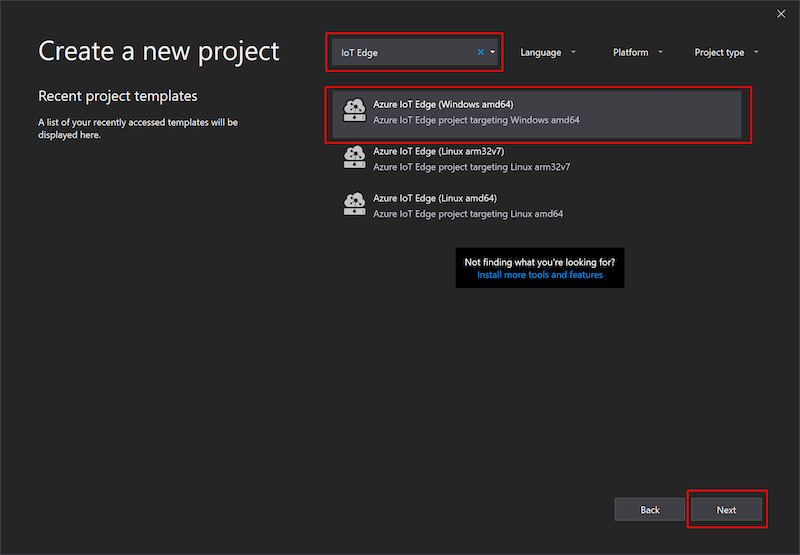
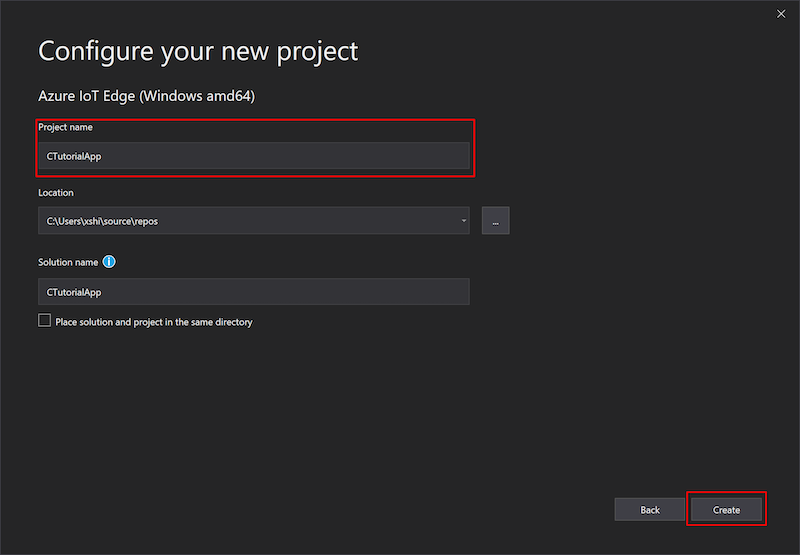
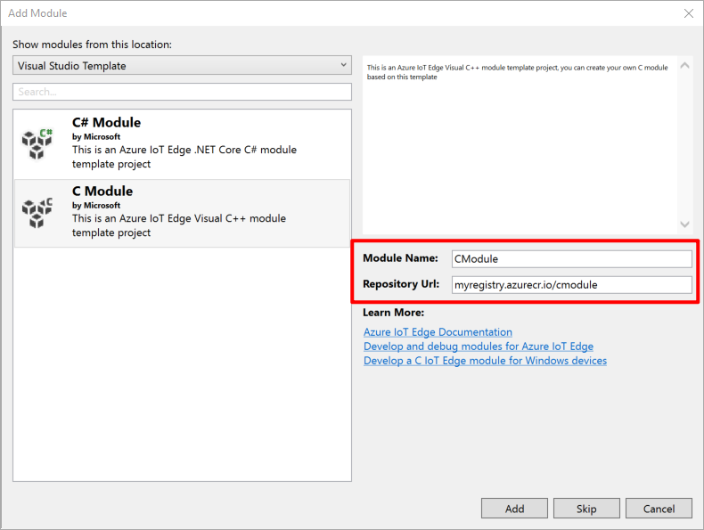
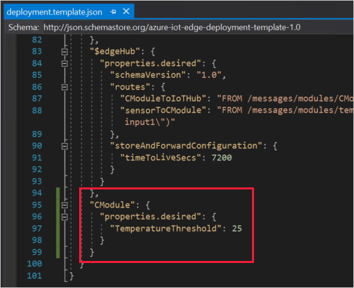
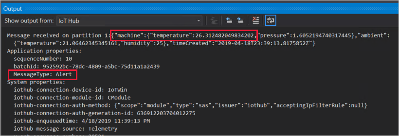

---
# Mandatory fields. See more on aka.ms/skyeye/meta.
title: Tutorial develop C module for Windows - Azure IoT Edge | Microsoft Docs 
description: This tutorial shows you how to create an IoT Edge module with C code and deploy it to a Windows device running IoT Edge
services: iot-edge
author: shizn
manager: philmea

ms.author: xshi
ms.date: 05/28/2019
ms.topic: tutorial
ms.service: iot-edge
ms.custom: mvc

---

# Tutorial: Develop a C IoT Edge module for Windows devices

Use Visual Studio to develop C code and deploy it to a Windows device running Azure IoT Edge. 

You can use Azure IoT Edge modules to deploy code that implements your business logic directly to your IoT Edge devices. This tutorial walks you through creating and deploying an IoT Edge module that filters sensor data. In this tutorial, you learn how to:    

> [!div class="checklist"]
> * Use Visual Studio to create an IoT Edge module that's based on the C SDK.
> * Use Visual Studio and Docker to create a Docker image and publish it to your registry.
> * Deploy the module to your IoT Edge device.
> * View generated data.

The IoT Edge module that you create in this tutorial filters the temperature data that's generated by your device. It only sends messages upstream if the temperature is above a specified threshold. This type of analysis at the edge is useful for reducing the amount of data that's communicated to and stored in the cloud. 

[!INCLUDE [quickstarts-free-trial-note](../../includes/quickstarts-free-trial-note.md)]

## Solution scope

This tutorial demonstrates how to develop a module in **C** using **Visual Studio 2019**, and how to deploy it to a **Windows device**. If you're developing modules for Linux devices, go to [Develop a C IoT Edge module for Linux devices](tutorial-c-module.md) instead. 

Use the following table to understand your options for developing and deploying C modules to Windows devices: 

| C | Visual Studio Code | Visual Studio 2017/2019 | 
| -- | ------------------ | ------------------ |
| **Windows AMD64** |  |  |

## Prerequisites

Before beginning this tutorial, you should have gone through the previous tutorial to set up your development environment for Windows container development: [Develop IoT Edge modules for Windows devices](tutorial-develop-for-windows.md). After completing that tutorial, you should have the following prerequisites in place: 

* A free or standard-tier [IoT Hub](../iot-hub/iot-hub-create-through-portal.md) in Azure.
* A [Windows device running Azure IoT Edge](quickstart.md).
* A container registry, like [Azure Container Registry](https://docs.microsoft.com/azure/container-registry/).
* [Visual Studio 2019](https://docs.microsoft.com/visualstudio/install/install-visual-studio) configured with the [Azure IoT Edge Tools](https://marketplace.visualstudio.com/items?itemName=vsc-iot.vs16iotedgetools) extension.
* [Docker Desktop](https://docs.docker.com/docker-for-windows/install/) configured to run Windows containers.
* Install the Azure IoT C SDK for Windows x64 through vcpkg:

   ```powershell
   git clone https://github.com/Microsoft/vcpkg
   cd vcpkg
   .\bootstrap-vcpkg.bat
   .\vcpkg install azure-iot-sdk-c:x64-windows
   .\vcpkg --triplet x64-windows integrate install
   ```
   
> [!TIP]
> If you are using Visual Studio 2017 (version 15.7 or higher), please download and install [Azure IoT Edge Tools](https://marketplace.visualstudio.com/items?itemName=vsc-iot.vsiotedgetools) for VS 2017 from the Visual Studio marketplace

## Create a module project

The following steps create an IoT Edge module project that's based on the C SDK by using Visual Studio and the Azure IoT Edge Tools extension. Once you have a project template created, add new code so that the module filters out messages based on their reported properties. 

### Create a new project

Create a C solution template that you can customize with your own code.

1. Launch Visual Studio 2019 and select **Create New Project**.

2. In the new project window, search **IoT Edge** project and choose the **Azure IoT Edge (Windows amd64)** project. Click **Next**. 

   

3. In the configure your new project window, rename the project and solution to something descriptive like **CTutorialApp**. Click **Create** to create the project. 

   

4. In the IoT Edge application and module window, configure your project with the following values: 

   | Field | Value |
   | ----- | ----- |
   | Select a template | Select **C Module**. | 
   | Module project name | Name your module **CModule**. | 
   | Docker image repository | An image repository includes the name of your container registry and the name of your container image. Your container image is prepopulated from the module project name value. Replace **localhost:5000** with the login server value from your Azure container registry. You can retrieve the login server from the Overview page of your container registry in the Azure portal. <br><br> The final image repository looks like \<registry name\>.azurecr.io/cmodule. |

   

5. Select **Add** to create the project. 

### Add your registry credentials

The deployment manifest shares the credentials for your container registry with the IoT Edge runtime. The runtime needs these credentials to pull your private images onto the IoT Edge device. Use the credentials from the **Access keys** section of your Azure container registry. 

1. In the Visual Studio solution explorer, open the **deployment.template.json** file. 

2. Find the **registryCredentials** property in the $edgeAgent desired properties. 

3. Update the property with your credentials, following this format: 

   ```json
   "registryCredentials": {
     "<registry name>": {
       "username": "<username>",
       "password": "<password>",
       "address": "<registry name>.azurecr.io"
     }
   }
   ```

4. Save the deployment.template.json file. 

### Update the module with custom code

The default module code receives messages on an input queue and passes them along through an output queue. Let's add some additional code so that the module processes the messages at the edge before forwarding them to IoT Hub. Update the module so that it analyzes the temperature data in each message, and only sends the message to IoT Hub if the temperature exceeds a certain threshold. 


1. The data from the sensor in this scenario comes in JSON format. To filter messages in JSON format, import a JSON library for C. This tutorial uses Parson.

   1. Download the [Parson GitHub repository](https://github.com/kgabis/parson). Copy the **parson.c** and **parson.h** files into the **CModule** project.

   2. In Visual Studio, open the **CMakeLists.txt** file from the CModule project folder. At the top of the file, import the Parson files as a library called **my_parson**.

      ```
      add_library(my_parson
          parson.c
          parson.h
      )
      ```

   3. Add **my_parson** to the list of libraries in the **target_link_libraries** section of the CMakeLists.txt file.

   4. Save the **CMakeLists.txt** file.

   5. Open **CModule** > **main.c**. At the bottom of the list of include statements, add a new one to include `parson.h` for JSON support:

      ```c
      #include "parson.h"
      ```

2.  In the **main.c** file, add a global variable called `temperatureThreshold` next to the messagesReceivedByInput1Queue variable. This variable sets the value that the measured temperature must exceed in order for the data to be sent to IoT Hub.

    ```c
    static double temperatureThreshold = 25;
    ```

3. Find the `CreateMessageInstance` function in main.c. Replace the inner if-else statement with the following code that adds a few lines of functionality: 

   ```c
   if ((messageInstance->messageHandle = IoTHubMessage_Clone(message)) == NULL)
   {
       free(messageInstance);
       messageInstance = NULL;
   }
   else
   {
       messageInstance->messageTrackingId = messagesReceivedByInput1Queue;
       MAP_HANDLE propMap = IoTHubMessage_Properties(messageInstance->messageHandle);
       if (Map_AddOrUpdate(propMap, "MessageType", "Alert") != MAP_OK)
       {
          printf("ERROR: Map_AddOrUpdate Failed!\r\n");
       }
   }
   ```

   The new lines of code in the else statement add a new property to the message, which labels the message as an alert. This code labels all messages as alerts, because we'll add functionality that only sends messages to IoT Hub if they report high temperatures. 

4. Find the `InputQueue1Callback` function, and replace the whole function with the following code. This function implements the actual messaging filter. When a message is received, it checks whether the reported temperature exceeds the threshold. If yes, then it forwards the message through its output queue. If not, then it ignores the message. 

    ```c
    static IOTHUBMESSAGE_DISPOSITION_RESULT InputQueue1Callback(IOTHUB_MESSAGE_HANDLE message, void* userContextCallback)
    {
        IOTHUBMESSAGE_DISPOSITION_RESULT result;
        IOTHUB_CLIENT_RESULT clientResult;
        IOTHUB_MODULE_CLIENT_LL_HANDLE iotHubModuleClientHandle = (IOTHUB_MODULE_CLIENT_LL_HANDLE)userContextCallback;

        unsigned const char* messageBody;
        size_t contentSize;

        if (IoTHubMessage_GetByteArray(message, &messageBody, &contentSize) != IOTHUB_MESSAGE_OK)
        {
            messageBody = "<null>";
        }

        printf("Received Message [%zu]\r\n Data: [%s]\r\n",
                messagesReceivedByInput1Queue, messageBody);

        // Check if the message reports temperatures higher than the threshold
        JSON_Value *root_value = json_parse_string(messageBody);
        JSON_Object *root_object = json_value_get_object(root_value);
        double temperature;

        // If temperature exceeds threshold, send to output1
        if (json_object_dotget_value(root_object, "machine.temperature") != NULL && (temperature = json_object_dotget_number(root_object, "machine.temperature")) > temperatureThreshold)
        {
            printf("Machine temperature %f exceeds threshold %f\r\n", temperature, temperatureThreshold);
            // This message should be sent to next stop in the pipeline, namely "output1".  What happens at "outpu1" is determined
            // by the configuration of the Edge routing table setup.
            MESSAGE_INSTANCE *messageInstance = CreateMessageInstance(message);
            if (NULL == messageInstance)
            {
                result = IOTHUBMESSAGE_ABANDONED;
            }
            else
            {
                printf("Sending message (%zu) to the next stage in pipeline\n", messagesReceivedByInput1Queue);

                clientResult = IoTHubModuleClient_LL_SendEventToOutputAsync(iotHubModuleClientHandle, messageInstance->messageHandle, "output1", SendConfirmationCallback, (void *)messageInstance);
                if (clientResult != IOTHUB_CLIENT_OK)
                {
                    IoTHubMessage_Destroy(messageInstance->messageHandle);
                    free(messageInstance);
                    printf("IoTHubModuleClient_LL_SendEventToOutputAsync failed on sending msg#=%zu, err=%d\n", messagesReceivedByInput1Queue, clientResult);
                    result = IOTHUBMESSAGE_ABANDONED;
                }
                else
                {
                    result = IOTHUBMESSAGE_ACCEPTED;
                }
            }
        }
        // If message does not exceed threshold, do not forward
        else
        {
            printf("Not sending message (%zu) to the next stage in pipeline.\r\n", messagesReceivedByInput1Queue);
            result = IOTHUBMESSAGE_ACCEPTED;
        }

        messagesReceivedByInput1Queue++;
        return result;
    }
    ```

5. Add a `moduleTwinCallback` function. This method receives updates on the desired properties from the module twin, and updates the **temperatureThreshold** variable to match. All modules have their own module twin, which lets you configure the code running inside a module directly from the cloud.

    ```c
    static void moduleTwinCallback(DEVICE_TWIN_UPDATE_STATE update_state, const unsigned char* payLoad, size_t size, void* userContextCallback)
    {
        printf("\r\nTwin callback called with (state=%s, size=%zu):\r\n%s\r\n",
            MU_ENUM_TO_STRING(DEVICE_TWIN_UPDATE_STATE, update_state), size, payLoad);
        JSON_Value *root_value = json_parse_string(payLoad);
        JSON_Object *root_object = json_value_get_object(root_value);
        if (json_object_dotget_value(root_object, "desired.TemperatureThreshold") != NULL) {
            temperatureThreshold = json_object_dotget_number(root_object, "desired.TemperatureThreshold");
        }
        if (json_object_get_value(root_object, "TemperatureThreshold") != NULL) {
            temperatureThreshold = json_object_get_number(root_object, "TemperatureThreshold");
        }
    }
    ```

6. Find the `SetupCallbacksForModule` function. Replace the function with the following code that adds an **else if** statement to check if the module twin has been updated. 

   ```c
   static int SetupCallbacksForModule(IOTHUB_MODULE_CLIENT_LL_HANDLE iotHubModuleClientHandle)
   {
       int ret;

       if (IoTHubModuleClient_LL_SetInputMessageCallback(iotHubModuleClientHandle, "input1", InputQueue1Callback, (void*)iotHubModuleClientHandle) != IOTHUB_CLIENT_OK)
       {
           printf("ERROR: IoTHubModuleClient_LL_SetInputMessageCallback(\"input1\")..........FAILED!\r\n");
           ret = MU_FAILURE;
       }
       else if (IoTHubModuleClient_LL_SetModuleTwinCallback(iotHubModuleClientHandle, moduleTwinCallback, (void*)iotHubModuleClientHandle) != IOTHUB_CLIENT_OK)
       {
           printf("ERROR: IoTHubModuleClient_LL_SetModuleTwinCallback(default)..........FAILED!\r\n");
           ret = MU_FAILURE;
       }
       else
       {
           ret = 0;
       }

       return ret;
   }
   ```

7. Save the main.c file.

8. Open the **deployment.template.json** file. 

9. Add the CModule module twin to the deployment manifest. Insert the following JSON content at the bottom of the `moduleContent` section, after the `$edgeHub` module twin:

   ```json
   "CModule": {
       "properties.desired":{
           "TemperatureThreshold":25
       }
   }
   ```

   

1. Save the **deployment.template.json** file.

## Build and push your module

In the previous section, you created an IoT Edge solution and added code to the **CModule** to filter out messages where the reported machine temperature is below the acceptable threshold. Now you need to build the solution as a container image and push it to your container registry. 

1. Use the following command to sign in to Docker on your development machine. Sign in with the username, password, and login server from your Azure container registry. You can retrieve these values from the **Access keys** section of your registry in the Azure portal.

   ```cmd
   docker login -u <ACR username> -p <ACR password> <ACR login server>
   ```

   You may receive a security warning recommending the use of `--password-stdin`. While that best practice is recommended for production scenarios, it's outside the scope of this tutorial. For more information, see the [docker login](https://docs.docker.com/engine/reference/commandline/login/#provide-a-password-using-stdin) reference.

2. In the Visual Studio solution explorer, right-click the project name that you want to build. The default name is **AzureIotEdgeApp1** and since you're building a Windows module, the extension should be **Windows.Amd64**. 

3. Select **Build and Push IoT Edge Modules**. 

   The build and push command starts three operations. First, it creates a new folder in the solution called **config** that holds the full deployment manifest, built out of information in the deployment template, and other solution files. Second, it runs `docker build` to build the container image based on the appropriate dockerfile for your target architecture. Then, it runs `docker push` to push the image repository to your container registry. 

## Deploy modules to device

Use the Visual Studio cloud explorer and the Azure IoT Edge Tools extension to deploy the module project to your IoT Edge device. You already have a deployment manifest prepared for your scenario, the **deployment.json** file in the config folder. All you need to do now is select a device to receive the deployment.

Make sure that your IoT Edge device is up and running. 

1. In the Visual Studio cloud explorer, expand the resources to see your list of IoT devices. 

2. Right-click the name of the IoT Edge device that you want to receive the deployment. 

3. Select **Create Deployment**.

4. In the file explorer, select the **deployment.windows-amd64** file in the config folder of your solution. 

5. Refresh the cloud explorer to see the deployed modules listed under your device. 


## View generated data

Once you apply the deployment manifest to your IoT Edge device, the IoT Edge runtime on the device collects the new deployment information and starts executing on it. Any modules running on the device that aren't included in the deployment manifest are stopped. Any modules missing from the device are started. 

You can use the IoT Edge Tools extension to view messages as they arrive at your IoT Hub. 

1. In the Visual Studio cloud explorer, select the name of your IoT Edge device. 

2. In the **Actions** list, select **Start Monitoring Built-in Event Endpoint**. 

3. View the messages arriving at your IoT Hub. It may take a while for the messages to arrive, because the IoT Edge device has to receive its new deployment and start all the modules. Then, the changes we made to the CModule code wait until the machine temperature reaches 25 degrees before sending messages. It also adds the message type **Alert** to any messages that reach that temperature threshold. 

   

## Edit the module twin

We used the CModule module twin to set the temperature threshold at 25 degrees. You can use the module twin to change the functionality without having to update the module code.

1. In Visual Studio, open the **deployment.windows-amd64.json** file. (Not the deployment.template file. If you don't see the deployment manifest in the config file in the solution explorer, select the **Show all files** icon in the explorer toolbar.)

2. Find the CModule twin and change the value of the **temperatureThreshold** parameter to a new temperature 5 degrees to 10 degrees higher than the latest reported temperature. 

3. Save the **deployment.windows-amd64.json** file.

4. Follow the deployment steps again to apply the updated deployment manifest to your device. 

5. Monitor the incoming device-to-cloud messages. You should see the messages stop until the new temperature threshold is reached. 

## Clean up resources 

If you plan to continue to the next recommended article, you can keep the resources and configurations that you created and reuse them. You can also keep using the same IoT Edge device as a test device. 

Otherwise, you can delete the local configurations and the Azure resources that you used in this article to avoid charges. 

[!INCLUDE [iot-edge-clean-up-cloud-resources](../../includes/iot-edge-clean-up-cloud-resources.md)]

## Next steps

In this tutorial, you created an IoT Edge module with code to filter raw data that's generated by your IoT Edge device. When you're ready to build your own modules, you can learn more about [developing your own IoT Edge modules](module-development.md) or how to [develop modules with Visual Studio](how-to-visual-studio-develop-module.md). You can continue on to the next tutorials to learn how Azure IoT Edge can help you deploy Azure cloud services to process and analyze data at the edge.

> [!div class="nextstepaction"]
> [Functions](tutorial-deploy-function.md)
> [Stream Analytics](tutorial-deploy-stream-analytics.md)
> [Machine Learning](tutorial-deploy-machine-learning.md)
> [Custom Vision Service](tutorial-deploy-custom-vision.md)
