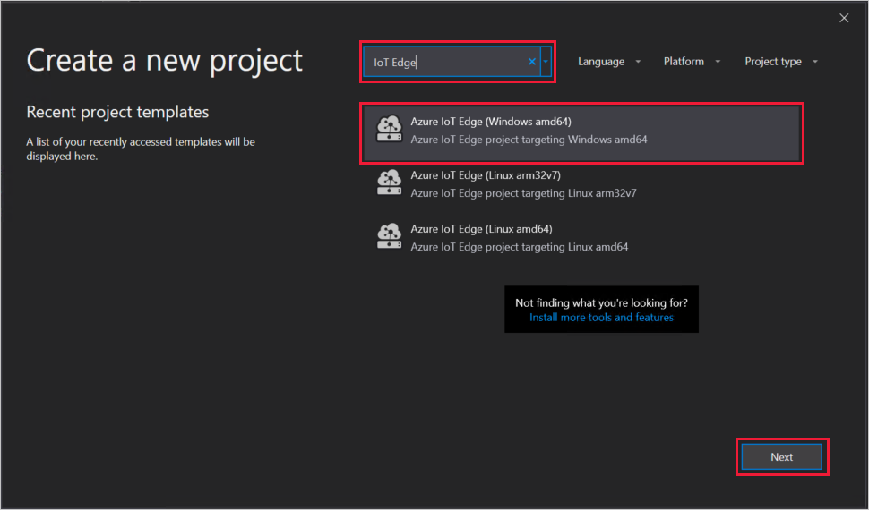
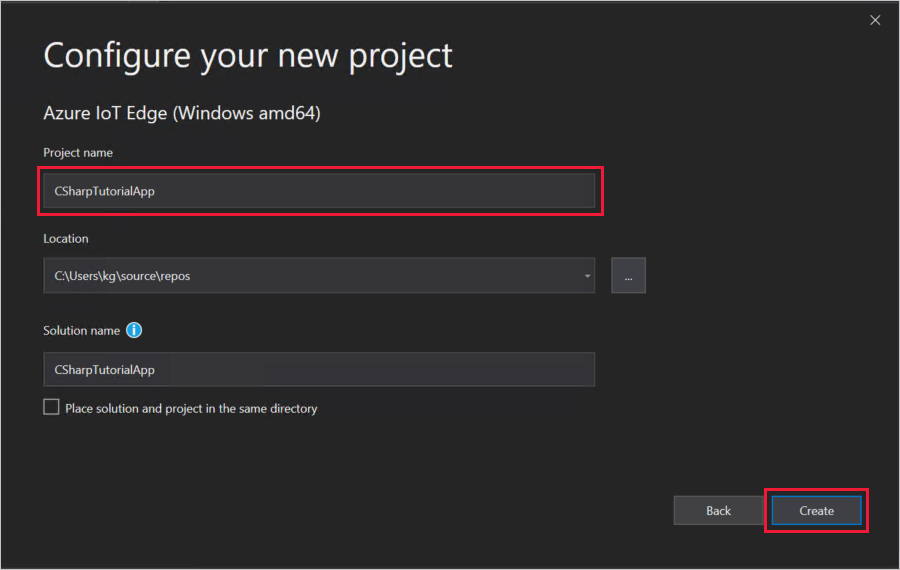
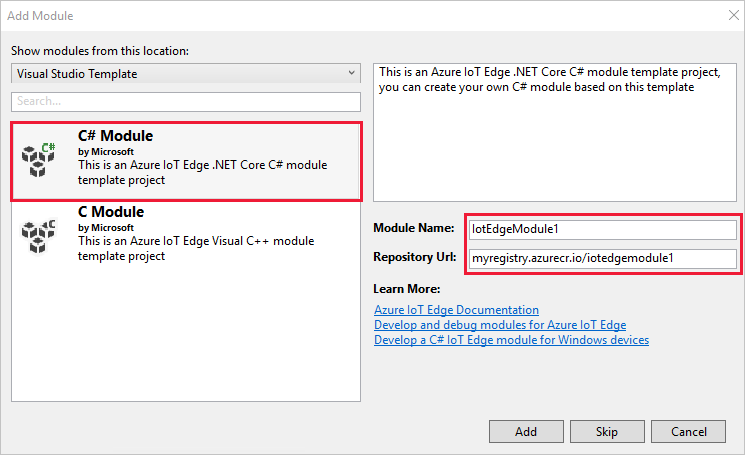
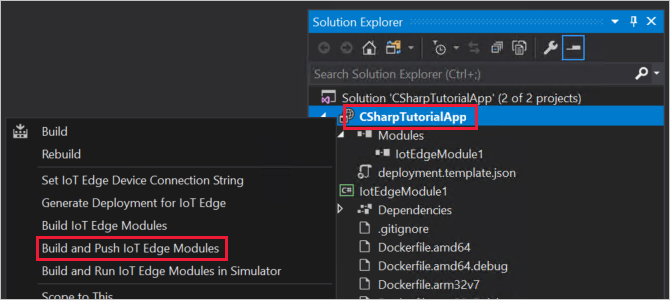
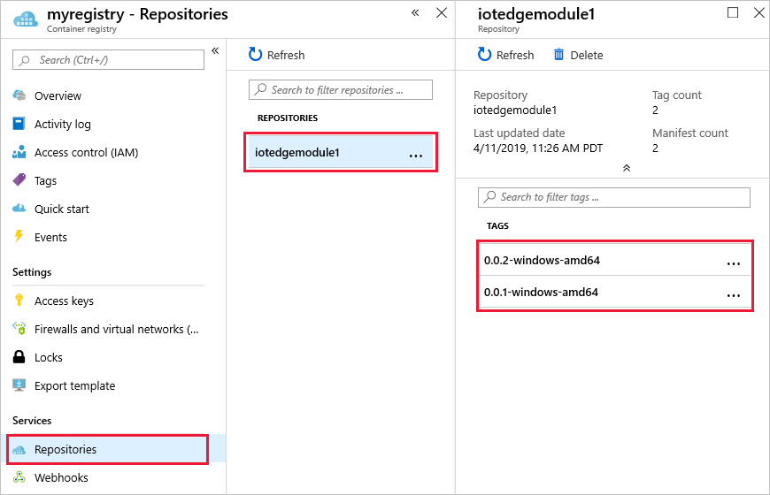
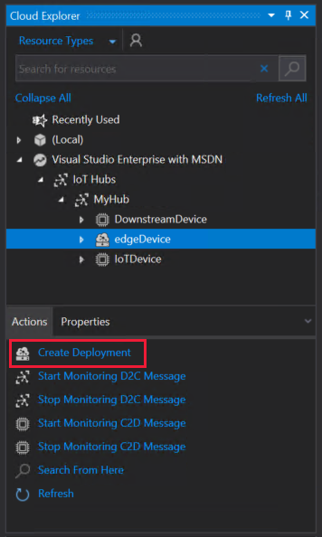
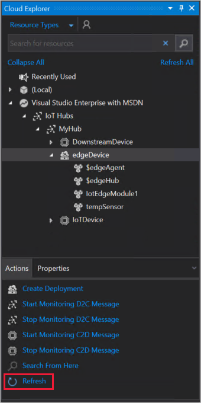
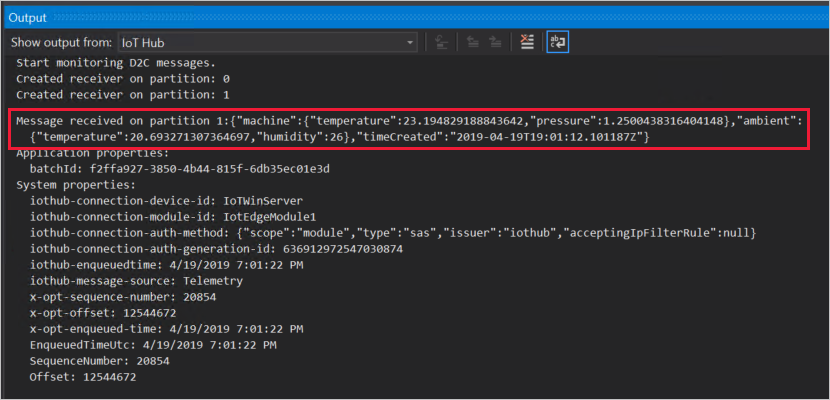

# Tutorial: Develop IoT Edge modules using Windows containers

[!INCLUDE [iot-edge-version-201806](../../includes/iot-edge-version-201806.md)]

Use Visual Studio to develop and deploy code to Windows devices running IoT Edge.

>[!NOTE]
>IoT Edge 1.1 LTS is the last release channel that supports Windows containers. Starting with version 1.2, Windows containers are not supported. Consider using or moving to [IoT Edge for Linux on Windows](iot-edge-for-linux-on-windows.md) to run IoT Edge on Windows devices.

This tutorial walks through what it takes to develop and deploy your own code to an IoT Edge device. This tutorial is a useful prerequisite for the other tutorials, which go into more detail about specific programming languages or Azure services.

This tutorial uses the example of deploying a **C# module to a Windows device**. This example was chosen because it's the most common development scenario. If you're interested in developing in a different language, or plan on deploying Azure services as modules, this tutorial will still be helpful to learn about the development tools. Once you understand the development concepts, then you can choose your preferred language or Azure service to dive into the details.

In this tutorial, you learn how to:

> [!div class="checklist"]
>
> * Set up your development machine.
> * Use the IoT Edge tools for Visual Studio to create a new project.
> * Build your project as a container and store it in an Azure container registry.
> * Deploy your code to an IoT Edge device.

## Prerequisites

A development machine:

* Windows 10 with 1809 update or newer.
* You can use your own computer or a virtual machine, depending on your development preferences.
  * Make sure that your development machine supports nested virtualization. This capability is necessary for running a container engine, which you install in the next section.
* Install [Git](https://git-scm.com/).

An Azure IoT Edge device on Windows:

* [Install and manage Azure IoT Edge with Windows containers](how-to-install-iot-edge-windows-on-windows.md).
* We recommend that you don't run IoT Edge on your development machine, but instead use a separate device if possible. This distinction between development machine and IoT Edge device more accurately mirrors a true deployment scenario, and helps to keep the different concepts straight.

Cloud resources:

* A free or standard-tier [IoT hub](../iot-hub/iot-hub-create-through-portal.md) in Azure.

[!INCLUDE [quickstarts-free-trial-note](../../includes/quickstarts-free-trial-note.md)]

## Key concepts

This tutorial walks through the development of an IoT Edge module. An *IoT Edge module*, or sometimes just *module* for short, is a container that contains executable code. You can deploy one or more modules to an IoT Edge device. Modules perform specific tasks like ingesting data from sensors, performing data analytics or data cleaning operations, or sending messages to an IoT hub. For more information, see [Understand Azure IoT Edge modules](iot-edge-modules.md).

When developing IoT Edge modules, it's important to understand the difference between the development machine and the target IoT Edge device where the module will eventually be deployed. The container that you build to hold your module code must match the operating system (OS) of the *target device*. For Windows container development, this concept is simpler because Windows containers only run on Windows operating systems. But you could, for example, use your Windows development machine to build modules for Linux IoT Edge devices. In that scenario, you'd have to make sure that your development machine was running Linux containers. As you go through this tutorial, keep in mind the difference between *development machine OS* and the *container OS*.

This tutorial targets Windows devices running IoT Edge. Windows IoT Edge devices use Windows containers. We recommend using Visual Studio to develop for Windows devices, so that's what this tutorial will use. You can use Visual Studio Code as well, although there are differences in support between the two tools.

The following table lists the supported development scenarios for **Windows containers** in Visual Studio Code and Visual Studio.

|   | Visual Studio Code | Visual Studio 2017/2019 |
| - | ------------------ | ------------------ |
| **Azure services** | Azure Functions <br> Azure Stream Analytics |   |
| **Languages** | C# (debugging not supported) | C <br> C# |
| **More information** | [Azure IoT Edge for Visual Studio Code](https://marketplace.visualstudio.com/items?itemName=vsciot-vscode.azure-iot-edge) | [Azure IoT Edge Tools for Visual Studio 2017](https://marketplace.visualstudio.com/items?itemName=vsc-iot.vsiotedgetools)<br>[Azure IoT Edge Tools for Visual Studio 2019](https://marketplace.visualstudio.com/items?itemName=vsc-iot.vs16iotedgetools) |

## Install container engine

IoT Edge modules are packaged as containers, so you need a container engine on your development machine to build and manage the containers. We recommend using Docker Desktop for development because of its many features and popularity as a container engine. With Docker Desktop on a Windows computer, you can switch between Linux containers and Windows containers so that you can easily develop modules for different types of IoT Edge devices.

Use the Docker documentation to install on your development machine:

* [Install Docker Desktop for Windows](https://docs.docker.com/docker-for-windows/install/)

  * When you install Docker Desktop for Windows, you're asked whether you want to use Linux or Windows containers. For this tutorial, use **Windows containers**. For more information, see [Switch between Windows and Linux containers](https://docs.docker.com/docker-for-windows/#switch-between-windows-and-linux-containers).

## Set up Visual Studio and tools

The IoT extensions for Visual Studio help you to develop IoT Edge modules. These extensions provide project templates, automate the creation of the deployment manifest, and allow you to monitor and manage IoT Edge devices. In this section, you install Visual Studio and the IoT Edge extension, then set up your Azure account to manage IoT Hub resources from within Visual Studio.

This tutorial teaches the development steps for Visual Studio 2019. If you are using Visual Studio 2017 (version 15.7 or higher), the steps are similar. If you would rather use Visual Studio Code, refer to the instructions in [Use Visual Studio Code to develop and debug modules for Azure IoT Edge](how-to-vs-code-develop-module.md).

1. Prepare Visual Studio 2019 on your development machine.

   * If you don't already have Visual Studio on your development machine, [Install Visual Studio 2019](/visualstudio/install/install-visual-studio) with the following workloads:

      * Azure development
      * Desktop development with C++
      * .NET Core cross-platform development

   * If you do already have Visual Studio 2019 on your development machine, follow the steps in [Modify Visual Studio](/visualstudio/install/modify-visual-studio) to add the required workloads.

2. Download and install the [Azure IoT Edge Tools](https://marketplace.visualstudio.com/items?itemName=vsc-iot.vs16iotedgetools) extension for Visual Studio 2019.

   If you are using Visual Studio 2017 (version 15.7 or higher), download and install the [Azure IoT Edge Tools for Visual Studio 2017](https://marketplace.visualstudio.com/items?itemName=vsc-iot.vsiotedgetools).

3. When your installations are complete, open Visual Studio 2019 and select **Continue without code**.

4. Select **View** > **Cloud Explorer**.

5. Select the profile icon in the cloud explorer and sign in to your Azure account if you aren't signed in already.

6. Once you sign in, your Azure subscriptions are listed. Expand the subscription that has your IoT hub.

7. Under your subscription, expand **IoT Hubs** then your IoT hub. You should see a list of your IoT devices, and can use this explorer to manage them.

   

[!INCLUDE [iot-edge-create-container-registry](../../includes/iot-edge-create-container-registry.md)]

## Create a new module project

The Azure IoT Edge Tools extension provides project templates for all supported IoT Edge module languages in Visual Studio. These templates have all the files and code that you need to deploy a working module to test IoT Edge, or give you a starting point to customize the template with your own business logic.

1. Select **File** > **New** > **Project...**

2. In the new project window, search for **IoT Edge** and choose the **Azure IoT Edge (Windows amd64)** project. Click **Next**.

   

3. In the configure your new project window, rename the project and solution to something descriptive like **CSharpTutorialApp**. Click **Create** to create the project.

   

4. In the Add Module window, configure your project with the following values:

   | Field | Value |
   | ----- | ----- |
   | Visual Studio Template | Select **C# Module**. |
   | Module Name | Accept the default **IotEdgeModule1**. |
   | Repository Url | An image repository includes the name of your container registry and the name of your container image. Your container image is prepopulated from the module project name value. Replace **localhost:5000** with the **Login server** value from your Azure container registry. You can retrieve the Login server value from the Overview page of your container registry in the Azure portal. <br><br> The final image repository looks like \<registry name\>.azurecr.io/iotedgemodule1. |

      

5. Select **Add** to create the module.

Once your new project loads in the Visual Studio window, take a moment to familiarize yourself with the files that it created:

* An IoT Edge project called **CSharpTutorialApp**.
  * The **Modules** folder contains pointers to the modules included in the project. In this case, it should be just IotEdgeModule1.
  * The hidden **.env** file holds the credentials to your container registry. These credentials are shared with your IoT Edge device so that it has access to pull the container images.
  * The **deployment.template.json** file is a template to help you create a deployment manifest. A *deployment manifest* is a file that defines exactly which modules you want deployed on a device, how they should be configured, and how they can communicate with each other and the cloud.
    > [!TIP]
    > In the registry credentials section, the address is autofilled from the information you provided when you created the solution. However, the username and password reference variables stored in the .env file. This is for security, as the .env file is git ignored, but the deployment template is not.
* An IoT Edge module project called **IotEdgeModule1**.
  * The **program.cs** file contains the default C# module code that comes with the project template. The default module takes input from a source and passes it along to IoT Hub.
  * The **module.json** file hold details about the module, including the full image repository, image version, and which Dockerfile to use for each supported platform.

### Provide your registry credentials to the IoT Edge agent

The IoT Edge runtime needs your registry credentials to pull your container images onto the IoT Edge device. The IoT Edge extension tries to pull your container registry information from Azure and populate it in the deployment template.

1. Open the **deployment.template.json** file in your module solution.

1. Find the **registryCredentials** property in the $edgeAgent desired properties. It should have your registry address autofilled from the information you provided when creating the project, and then username and password fields should contain variable names. For example:

   ```json
   "registryCredentials": {
     "<registry name>": {
       "username": "$CONTAINER_REGISTRY_USERNAME_<registry name>",
       "password": "$CONTAINER_REGISTRY_PASSWORD_<registry name>",
       "address": "<registry name>.azurecr.io"
     }
   }
   ```

1. Open the **.env** file in your module solution. (It's hidden by default in the Solution Explorer, so you might need to select the **Show All Files** button to display it.)

1. Add the **Username** and **Password** values that you copied from your Azure container registry.

1. Save your changes to the .env file.

### Review the sample code

The solution template that you created includes sample code for an IoT Edge module. This sample module simply receives messages and then passes them on. The pipeline functionality demonstrates an important concept in IoT Edge, which is how modules communicate with each other.

Each module can have multiple *input* and *output* queues declared in their code. The IoT Edge hub running on the device routes messages from the output of one module into the input of one or more modules. The specific code for declaring inputs and outputs varies between languages, but the concept is the same across all modules. For more information about routing between modules, see [Declare routes](module-composition.md#declare-routes).

The sample C# code that comes with the project template uses the [ModuleClient Class](/dotnet/api/microsoft.azure.devices.client.moduleclient) from the IoT Hub SDK for .NET.

1. In the **program.cs** file, find the **SetInputMessageHandlerAsync** method.

2. The [SetInputMessageHandlerAsync](/dotnet/api/microsoft.azure.devices.client.moduleclient.setinputmessagehandlerasync) method sets up an input queue to receive incoming messages. Review this method and see how it initializes an input queue called **input1**.

   

3. Next, find the **SendEventAsync** method.

4. The [SendEventAsync](/dotnet/api/microsoft.azure.devices.client.moduleclient.sendeventasync) method processes received messages and sets up an output queue to pass them along. Review this method and see that it initializes an output queue called **output1**.

   

5. Open the **deployment.template.json** file.

6. Find the **modules** property of the $edgeAgent desired properties.

   There should be two modules listed here. One is the **SimulatedTemperatureSensor** module, which is included in all the templates by default to provide simulated temperature data that you can use to test your modules. The other is the **IotEdgeModule1** module that you created as part of this project.

   This modules property declares which modules should be included in the deployment to your device or devices.

7. Find the **routes** property of the $edgeHub desired properties.

   One of the functions of the IoT Edge hub module is to route messages between all the modules in a deployment. Review the values in the routes property. One route, **IotEdgeModule1ToIoTHub**, uses a wildcard character (**\***) to include any message coming from any output queue in the IotEdgeModule1 module. These messages go into *$upstream*, which is a reserved name that indicates IoT Hub. The other route, **sensorToIotEdgeModule1**, takes messages coming from the SimulatedTemperatureSensor module and routes them to the *input1* input queue of the IotEdgeModule1 module.

   

## Build and push your solution

You've reviewed the module code and the deployment template to understand some key deployment concepts. Now, you're ready to build the IotEdgeModule1 container image and push it to your container registry. With the IoT tools extension for Visual Studio, this step also generates the deployment manifest based on the information in the template file and the module information from the solution files.

### Sign in to Docker

Provide your container registry credentials to Docker on your development machine so that it can push your container image to be stored in the registry.

1. Open PowerShell or a command prompt.

2. Sign in to Docker with the Azure container registry credentials that you saved after creating the registry.

   ```cmd
   docker login -u <ACR username> -p <ACR password> <ACR login server>
   ```

   You may receive a security warning recommending the use of `--password-stdin`. While that best practice is recommended for production scenarios, it's outside the scope of this tutorial. For more information, see the [docker login](https://docs.docker.com/engine/reference/commandline/login/#provide-a-password-using-stdin) reference.

### Build and push

Your development machine now has access to your container registry, and your IoT Edge devices will too. It's time to turn the project code into a container image.

1. Right-click the **CSharpTutorialApp** project folder and select **Build and Push IoT Edge Modules**.

   

   The build and push command starts three operations. First, it creates a new folder in the solution called **config** that holds the full deployment manifest, built out of information in the deployment template and other solution files. Second, it runs `docker build` to build the container image based on the appropriate dockerfile for your target architecture. Then, it runs `docker push` to push the image repository to your container registry.

   This process may take several minutes the first time, but is faster the next time that you run the commands.

2. Open the **deployment.windows-amd64.json** file in the newly created config folder. (The config folder may not appear in the Solution Explorer in Visual Studio. If that's the case, select the **Show all files** icon in the Solution Explorer taskbar.)

3. Find the **image** parameter of the IotEdgeModule1 section. Notice that the image contains the full image repository with the name, version, and architecture tag from the module.json file.

4. Open the **module.json** file in the IotEdgeModule1 folder.

5. Change the version number for the module image. (The version, not the $schema-version.) For example, increment the patch version number to **0.0.2** as though we had made a small fix in the module code.

   >[!TIP]
   >Module versions enable version control, and allow you to test changes on a small set of devices before deploying updates to production. If you don't increment the module version before building and pushing, then you overwrite the repository in your container registry.

6. Save your changes to the module.json file.

7. Right-click the **CSharpTutorialApp** project folder again, and select **Build and Push IoT Edge Modules** again.

8. Open the **deployment.windows-amd64.json** file again. Notice that a new file wasn't created when you ran the build and push command again. Rather, the same file was updated to reflect the changes. The IotEdgeModule1 image now points to the 0.0.2 version of the container. This change in the deployment manifest is how you tell the IoT Edge device that there's a new version of a module to pull.

9. To further verify what the build and push command did, go to the [Azure portal](https://portal.azure.com) and navigate to your container registry.

10. In your container registry, select **Repositories** then **iotedgemodule1**. Verify that both versions of the image were pushed to the registry.

    

### Troubleshoot

If you encounter errors when building and pushing your module image, it often has to do with Docker configuration on your development machine. Use the following checks to review your configuration:

* Did you run the `docker login` command using the credentials that you copied from your container registry? These credentials are different than the ones that you use to sign in to Azure.
* Is your container repository correct? Does it have your correct container registry name and your correct module name? Open the **module.json** file in the IotEdgeModule1 folder to check. The repository value should look like **\<registry name\>.azurecr.io/iotedgemodule1**.
* If you used a different name than **IotEdgeModule1** for your module, is that name consistent throughout the solution?
* Is your machine running the same type of containers that you're building? This tutorial is for Windows IoT Edge devices, so your Visual Studio files should have the **windows-amd64** extension, and Docker Desktop should be running Windows containers.

## Deploy modules to device

You verified that the built container images are stored in your container registry, so it's time to deploy them to a device. Make sure that your IoT Edge device is up and running.

1. Open Cloud Explorer in Visual Studio and expand the details for your IoT hub.

2. Select the name of the device that you want to deploy to. In the **Actions** list, select **Create Deployment**.

   

3. In the file explorer, navigate to the config folder of your project and select the **deployment.windows-amd64.json** file. This file is often located at `C:\Users\<username>\source\repos\CSharpTutorialApp\CSharpTutorialApp\config\deployment.windows-amd64.json`

   Do not use the deployment.template.json file, which doesn't have the full module image values in it.

4. Expand the details for your IoT Edge device in Cloud Explorer to see the modules on your device.

5. Use the **Refresh** button to update the device status to see that the SimulatedTemperatureSensor and IotEdgeModule1 modules are deployed your device.

   

## View messages from device

The IotEdgeModule1 code receives messages through its input queue and passes them along through its output queue. The deployment manifest declared routes that passed messages from SimulatedTemperatureSensor to IotEdgeModule1, and then forwarded messages from IotEdgeModule1 to IoT Hub. The Azure IoT Edge tools for Visual Studio allow you to see messages as they arrive at IoT Hub from your individual devices.

1. In Visual Studio Cloud Explorer, select the name of the IoT Edge device that you deployed to.

2. In the **Actions** menu, select **Start Monitoring Built-in Event Endpoint**.

3. Watch the **Output** section in Visual Studio to see messages arriving at your IoT hub.

   It may take a few minutes for both modules to start. The IoT Edge runtime needs to receive its new deployment manifest, pull down the module images from the container runtime, then start each new module.

   

## View changes on device

If you want to see what's happening on your device itself, use the commands in this section to inspect the IoT Edge runtime and modules running on your device.

The commands in this section are for your IoT Edge device, not your development machine. If you're using a virtual machine for your IoT Edge device, connect to it now. In Azure, go to the virtual machine's overview page and select **Connect** to access the remote desktop connection. On the device, open a command or PowerShell window to run the `iotedge` commands.

* View all modules deployed to your device, and check their status:

   ```cmd
   iotedge list
   ```

   You should see four modules: the two IoT Edge runtime modules, SimulatedTemperatureSensor, and IotEdgeModule1. All four should be listed as running.

* Inspect the logs for a specific module:

   ```cmd
   iotedge logs <module name>
   ```

   IoT Edge modules are case-sensitive.

   The SimulatedTemperatureSensor and IotEdgeModule1 logs should show the messages they're processing. The edgeAgent module is responsible for starting the other modules, so its logs will have information about implementing the deployment manifest. If any module isn't listed or isn't running, the edgeAgent logs will probably have the errors. The edgeHub module is responsible for communications between the modules and IoT Hub. If the modules are up and running, but the messages aren't arriving at your IoT hub, the edgeHub logs will probably have the errors.

## Clean up resources

If you plan to continue to the next recommended article, you can keep the resources and configurations that you created and reuse them. You can also keep using the same IoT Edge device as a test device.

Otherwise, you can delete the local configurations and the Azure resources that you used in this article to avoid charges.

[!INCLUDE [iot-edge-clean-up-cloud-resources](../../includes/iot-edge-clean-up-cloud-resources.md)]

## Next steps

In this tutorial, you set up Visual Studio 2019 on your development machine and deployed your first IoT Edge module from it. Now that you know the basic concepts, try adding functionality to a module so that it can analyze the data passing through it. Choose your preferred language:

> [!div class="nextstepaction"]
> [C](tutorial-c-module-windows.md)
> [C#](tutorial-csharp-module-windows.md)