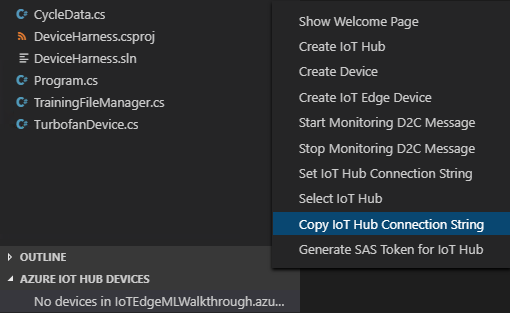
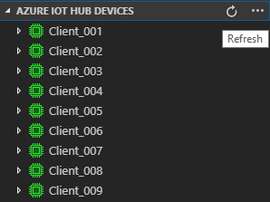
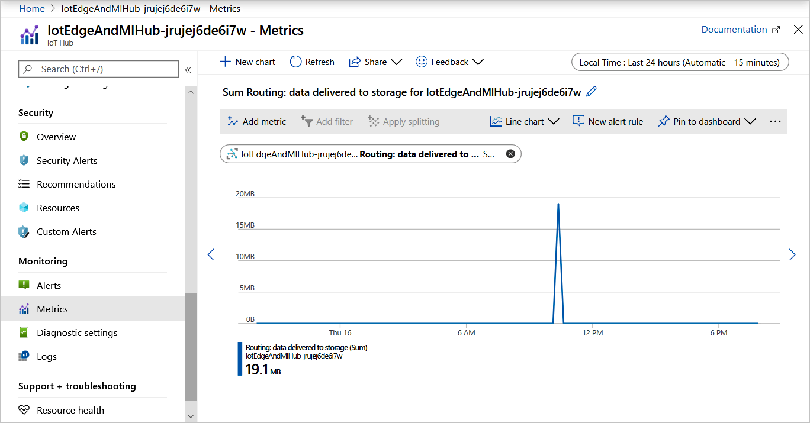

# Tutorial: Generate simulated device data

> [!NOTE]
> This article is part of a series for a tutorial about using Azure Machine Learning on IoT Edge. If you have arrived at this article directly, we encourage you to begin with the [first article](tutorial-machine-learning-edge-01-intro.md) in the series for the best results.

In this article, we use machine learning training data to simulate a device sending telemetry to IoT Hub. As stated in the introduction, this end-to-end tutorial uses the [Turbofan engine degradation simulation data set](https://c3.nasa.gov/dashlink/resources/139/) to simulate data from a set of airplane engines for training and testing.

From the accompanying readme.txt we know that:

* The data consists of multiple multivariate time series
* Each data set is divided into training and test subsets
* Each time series is from a different engine
* Each engine starts with different degrees of initial wear and manufacturing variation

For this tutorial, we use the training data subset of a single data set (FD003).

In reality, each engine would be an independent IoT device. Assuming you do not have a collection of internet-connected turbofan engines available, we will build a software stand-in for these devices.

The simulator is a C# program that uses the IoT Hub APIs to programmatically register virtual devices with IoT Hub. We then read the data for each device from the NASA-provided data subset and send it to your IoT hub using a simulated IoT Device. All the code for this portion of the tutorial can be found in the DeviceHarness directory of the repository.

The DeviceHarness project is a .NET core project written in C# consisting of four classes:

* **Program:** The entry point for execution responsible for handling user input and overall coordination.
* **TrainingFileManager:** responsible for reading and parsing the selected data file.
* **CycleData:** represents a single row of data in a file converted to message format.
* **TurbofanDevice:** responsible for creating an IoT Device that corresponds to a single device (time series) in the data and transmitting the data to IoT Hub via the IoT Device.

The tasks described in this article should take about 20 minutes to complete.

The real-world equivalent to the work in this step would likely be performed by device developers and cloud developers.

## Configure Visual Studio Code and build DeviceHarness project

1. Open a remote desktop session to your virtual machine, as demonstrated in the previous article.

1. Open Visual Studio Code.

1. In Visual Studio Code, select **File** > **Open Folder...**.

1. In the **Folder** textbox, enter `C:\source\IoTEdgeAndMlSample\DeviceHarness` and click the **Select Folder** button.

   If OmniSharp errors appear in the output window, you’ll need to uninstall the C# extension, close and reopen VS Code, install the C# extension, and then reload the window.

1. Since you're using extensions on this machine for the first time, some extensions will update and install their dependencies. You may be prompted to update extension. If so, select **Reload Window**.

1. You will be prompted to add required assets for DeviceHarness. Select **Yes** to add them.

   * The notification may take a few seconds to appear.
   * If you missed this notification, check the “bell” icon in the lower right-hand corner.

   

1. Select **Restore** to restore the package dependencies.

   

1. Validate that your environment is properly set up by triggering a build, `Ctrl + Shift + B` or **Terminal** > **Run Build Task**.

1. You are prompted to select the build task to run. Select **Build**.

1. The build runs and outputs a success message.

   

1. You can make this build the default build task by selecting **Terminal** > **Configure Default Build Task...** and choosing **Build** from the prompt.

## Connect to IoT Hub and run DeviceHarness

Now that we have the project building, connect to your IoT hub to access the connection string and monitor the progress of the data generation.

### Sign in to Azure in Visual Studio Code

1. Sign into your Azure subscription in Visual Studio Code by opening the command palette, `Ctrl + Shift + P` or **View** > **Command Palette...**.

1. At the prompt search for and select **Azure: Sign In**.

1. A browser window opens and prompts you for your credentials. When you are redirected to a success page, you can close the browser.

### Connect to your IoT hub and retrieve hub connection string

1. In the bottom section of the Visual Studio Code explorer, select the **Azure IoT Hub devices** frame to expand it.

1. In the expanded frame, click on **Select IoT Hub**.

1. When prompted, select your Azure subscription and then your IoT hub.

1. Click into the **Azure IoT Hub devices** frame and click **...** for more actions. Select **Copy IoT Hub connection string**.

   

### Run the DeviceHarness project

1. Select **View** > **Terminal** to open the Visual Studio Code terminal.

   If you do not see a prompt, select Enter.

1. Enter `dotnet run` in the terminal.

1. When prompted for the IoT Hub Connection String, paste the connection string copied in the previous section.

1. In the **Azure IoT Hub devices** frame, click on the refresh button.

   

1. Note that devices are added to the IoT Hub and that the devices show up in green to indicate that data is being sent via that device.

1. You can view the messages being sent to the hub by right-clicking on any device and selecting **Start Monitoring D2C Message**. The messages will show in the output pane in Visual Studio Code.

1. Stop monitoring by clicking in the **Azure IoT Hub Toolkit** output pane and choose **Stop Monitoring D2C Message**.

1. Let the application run to completion, which takes a few minutes.

## Check IoT Hub for activity

The data sent by the DeviceHarness went to your IoT hub. It is easy to verify that data has reached your hub using the Azure portal.

1. Open the [Azure portal](https://portal.azure.com/) and navigate to your IoT hub.

1. In the overview page you should see that data has been sent to the hub:  

   

## Validate data in Azure Storage

The data we just sent to your IoT hub was routed to the storage container that we created in the previous article. Let’s look at the data in our storage account.

1. In the Azure portal, navigate to your storage account.

1. From the storage account navigator, select **Storage Explorer (preview)**.

1. In the storage explorer, select **Blob Containers** then **devicedata**.

1. In the content pane click on the folder for the name of the IoT hub, then the year, the month, the day, and the hour. You will see several folders representing the minutes when the data was written.

   

1. Click into one of those folders to find data files labeled **00** and **01** corresponding to the partition.

1. The files are written in [Avro](https://avro.apache.org/) format but double-clicking on one of these files will open another browser tab and partially render the data. If instead you are prompted to open the file in a program, you can choose VS Code and it will render correctly.

1. There is no need to try to read or interpret the data right now; we will do it in next article.

## Next steps

In this article, we used a .NET Core project to create a set of virtual devices and send data through those devices through our IoT Hub and into an Azure Storage container. This project simulates a real-world scenario where physical devices send data including sensor readings, operational settings, failure signals and modes, and so on, to an IoT Hub and onward into a curated storage. Once enough data has been collected, we use it to train models that predict the remaining useful life (RUL) for the device, which we will demonstrate in the next article.

Continue to the next article to train a machine learning model with the data.

> [!div class="nextstepaction"]
> [Train and deploy an Azure Machine Learning model](tutorial-machine-learning-edge-04-train-model.md)
