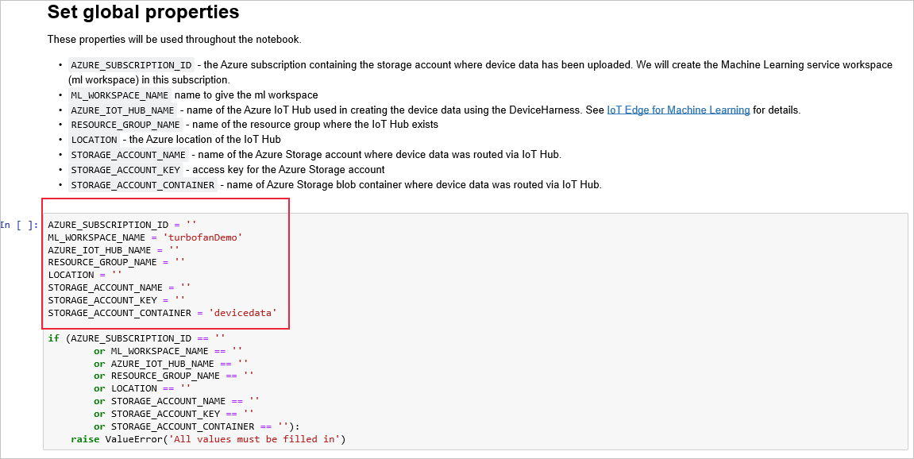
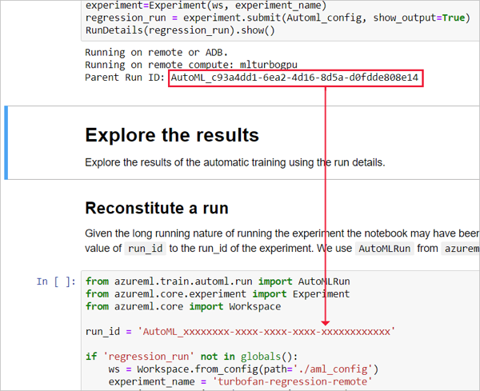

# Tutorial: Train and deploy an Azure Machine Learning model

[!INCLUDE [iot-edge-version-201806](../../includes/iot-edge-version-201806.md)]

In this article, we do the following tasks:

* Use Azure Machine Learning Studio to train a machine learning model.
* Package the trained model as a container image.
* Deploy the container image as an Azure IoT Edge module.

Machine Learning Studio is a foundational block used to experiment, train, and deploy machine learning models.

The steps in this article might be typically performed by data scientists.

In this section of the tutorial, you'll learn how to:

> [!div class="checklist"]
> * Create Jupyter notebooks in an Azure Machine Learning workspace to train a machine learning model.
> * Containerize the trained machine learning model.
> * Create an IoT Edge module from the containerized machine learning model.

## Prerequisites

This article is part of a series for a tutorial about using Machine Learning on IoT Edge. Each article in the series builds on the work in the previous article. If you've arrived at this article directly, see the [first article](tutorial-machine-learning-edge-01-intro.md) in the series.

## Set up Azure Machine Learning

We use Machine Learning Studio to host the two Jupyter notebooks and supporting files. Here we create and configure a Machine Learning project. If you haven't used Jupyter or Machine Learning Studio, here are two introductory documents:

* **Jupyter Notebook**: [Working with Jupyter notebooks in Visual Studio Code](https://code.visualstudio.com/docs/python/jupyter-support)
* **Azure Machine Learning**: [Get started with Azure Machine Learning in Jupyter notebooks](../machine-learning/tutorial-1st-experiment-sdk-setup.md)

> [!NOTE]
> After the service is set up, Machine Learning can be accessed from any machine. During setup, you should use the development VM, which has all of the files that you'll need.

### Install Azure Machine Learning Visual Studio Code extension

Visual Studio Code on the development VM should have this extension installed. If you're running on a different instance, reinstall the extension as described in [Set up the Visual Studio Code extension](../machine-learning/tutorial-setup-vscode-extension.md).

### Create an Azure Machine Learning account

To provision resources and run workloads on Azure, sign in with your Azure account credentials.

1. In Visual Studio Code, open the command palette by selecting **View** > **Command Palette** from the menu bar.

1. Enter the command `Azure: Sign In` in the command palette to start the sign-in process. Follow the instructions to complete sign in.

1. Create a Machine Learning compute instance to run your workload. On the command palette, enter the command `Azure ML: Create Compute`.
1. Select your Azure subscription.
1. Select **+ Create new Azure ML Workspace**, and enter the name **turbofandemo**.
1. Select the resource group that you've been using for this demo.
1. You should see the progress of workspace creation in the lower-right corner of your Visual Studio Code window: **Creating Workspace: turobofandemo**. This step can take a minute or two.
1. Wait for the workspace to be created successfully. It should say **Azure ML workspace turbofandemo created**.

### Upload Jupyter Notebook files

We'll upload sample notebook files into a new Machine Learning workspace.

1. Go to ml.azure.com and sign in.
1. Select your Microsoft directory, Azure subscription, and the newly created Machine Learning workspace.

    :::image type="content" source="media/tutorial-machine-learning-edge-04-train-model/select-studio-workspace.png" alt-text="Screenshot that shows selecting your Azure Machine Learning workspace." :::

1. After you've signed in to your Machine Learning workspace, go to the **Notebooks** section by using the menu on the left side.
1. Select the **My files** tab.

1. Select **Upload** (the up arrow icon).

1. Go to **C:\source\IoTEdgeAndMlSample\AzureNotebooks**. Select all the files in the list, and select **Open**.

1. Select the **I trust the content of these files** check box.

1. Select **Upload** to begin uploading. Then select **Done** after the process is complete.

### Jupyter Notebook files

Let's review the files you uploaded into your Machine Learning workspace. The activities in this portion of the tutorial span across two notebook files, which use a few supporting files.

* **01-turbofan\_regression.ipynb**: This notebook uses the Machine Learning workspace to create and run a machine learning experiment. Broadly, the notebook does the following steps:

  1. Downloads data from the Azure Storage account that was generated by the device harness.
  1. Explores and prepares the data, and then uses the data to train the classifier model.
  1. Evaluates the model from the experiment by using a test dataset (Test\_FD003.txt).
  1. Publishes the best classifier model to the Machine Learning workspace.

* **02-turbofan\_deploy\_model.ipynb**: This notebook takes the model created in the previous notebook and uses it to create a container image ready to be deployed to an IoT Edge device. The notebook performs the following steps:

  1. Creates a scoring script for the model.
  1. Produces a container image by using the classifier model that was saved in the Machine Learning workspace.
  1. Deploys the image as a web service on Azure Container Instances.
  1. Uses the web service to validate the model and the image work as expected. The validated image will be deployed to our IoT Edge device in the [Create and deploy custom IoT Edge modules](tutorial-machine-learning-edge-06-custom-modules.md) portion of this tutorial.

* **Test\_FD003.txt**: This file contains the data we'll use as our test set when we validate our trained classifier. We chose to use the test data, as provided for the original contest, as our test set for its simplicity.
* **RUL\_FD003.txt**: This file contains the remaining useful life (RUL) for the last cycle of each device in the Test\_FD003.txt file. See the readme.txt and the Damage Propagation Modeling.pdf files in C:\\source\\IoTEdgeAndMlSample\\data\\Turbofan for a detailed explanation of the data.
* **Utils.py**: This file contains a set of Python utility functions for working with data. The first notebook contains a detailed explanation of the functions.
* **README.md**: This readme file describes the use of the notebooks.

## Run the Jupyter notebooks

Now that the workspace is created, you can run the notebooks.

1. From your **My files** page, select **01-turbofan\_regression.ipynb**.

    :::image type="content" source="media/tutorial-machine-learning-edge-04-train-model/select-turbofan-notebook.png" alt-text="Screenshot that shows selecting the first notebook to run.":::

1. If the notebook is listed as **Not Trusted**, select the **Not Trusted** widget in the upper-right corner of the notebook. When the dialog box appears, select **Trust**.

1. For best results, read the documentation for each cell and run it individually. Select **Run** on the toolbar. Later on, you'll find it expedient to run multiple cells. You can disregard upgrade and deprecation warnings.

    When a cell is running, it displays an asterisk between the square brackets ([\*]). When the cell's operation is complete, the asterisk is replaced with a number and relevant output might appear. The cells in a notebook build sequentially, and only one cell can run at a time.

    You can also use run options from the **Cell** menu. Select **Ctrl+Enter** to run a cell, and select **Shift+Enter** to run a cell and advance to the next cell.

    > [!TIP]
    > For consistent cell operations, avoid running the same notebook from multiple tabs in your browser.

1. In the cell that follows the **Set global properties** instructions, enter the values for your Azure subscription, settings, and resources. Then run the cell.

    

1. In the cell previous to **Workspace details**, after it has run, look for the link that instructs you to sign in to authenticate.

    

    Open the link, and enter the specified code. This sign-in procedure authenticates the Jupyter notebook to access Azure resources by using the Microsoft Azure Cross-Platform Command Line Interface.

    

1. In the cell that precedes **Explore the results**, copy the value from the run ID and paste it for the run ID in the cell that follows **Reconstitute a run**.

   

1. Run the remaining cells in the notebook.

1. Save the notebook, and return to your project page.

1. Open **02-turbofan\_deploy\_model.ipynb**, and run each cell. You'll need to sign in to authenticate in the cell that follows **Configure workspace**.

1. Save the notebook, and return to your project page.

### Verify success

To verify that the notebooks have completed successfully, verify that a few items were created.

1. On your Machine Learning notebooks **My files** tab, select **refresh**.

1. Verify that the following files were created.

    | File | Description |
    | --- | --- |
    | ./aml_config/.azureml/config.json | Configuration file used to create the Machine Learning workspace. |
    | ./aml_config/model_config.json | Configuration file that we'll need to deploy the model in the **turbofanDemo** Machine Learning workspace in Azure. |
    | myenv.yml| Provides information about the dependencies for the deployed Machine Learning model.|

1. Verify that the following Azure resources were created. Some resource names are appended with random characters.

    | Azure resource | Name |
    | --- | --- |
    | Azure Machine Learning workspace | turborfanDemo |
    | Azure Container Registry | turbofandemoxxxxxxxx |
    | Application Insights | turbofaninsightxxxxxxxx |
    | Azure Key Vault | turbofankeyvaultbxxxxxxxx |
    | Azure Storage | turbofanstoragexxxxxxxxx |

### Debugging

You can insert Python statements into the notebook for debugging, such as the `print()` command to show values. If you see variables or objects that aren't defined, run the cells where they're first declared or instantiated.

You might have to delete previously created files and Azure resources if you need to redo the notebooks.

## Clean up resources

This tutorial is part of a set where each article builds on the work done in the previous ones. Wait to clean up any resources until you complete the final tutorial.

## Next steps

In this article, we used two Jupyter notebooks running in Machine Learning Studio to use the data from the turbofan devices to:

- Train an RUL classifier.
- Save the classifier as a model.
- Create a container image.
- Deploy and test the image as a web service.

Continue to the next article to create an IoT Edge device.

> [!div class="nextstepaction"]
> [Configure an IoT Edge device](tutorial-machine-learning-edge-05-configure-edge-device.md)