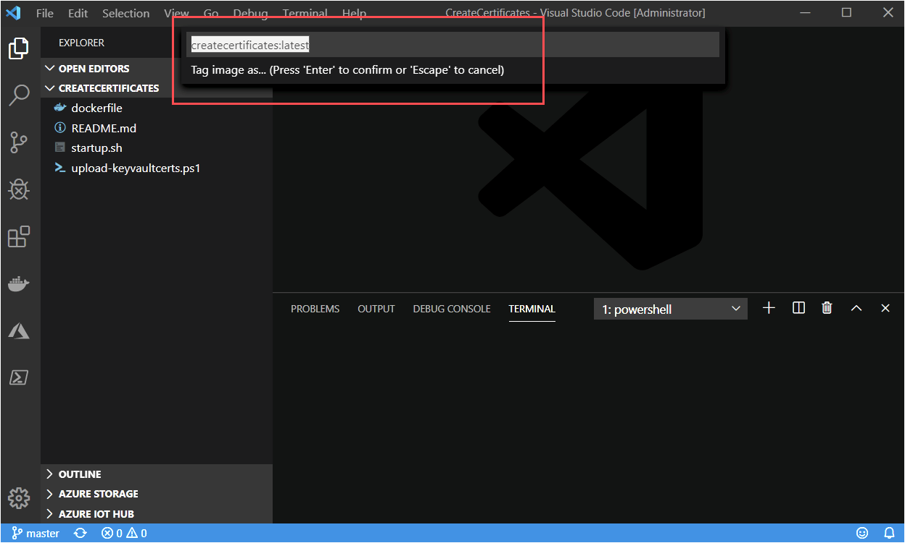
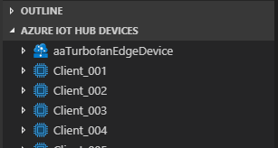
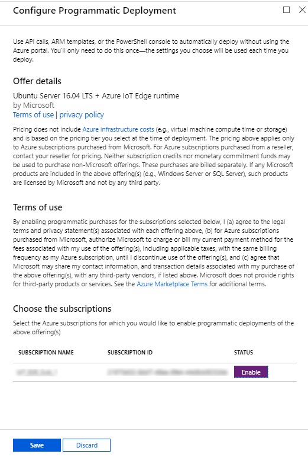
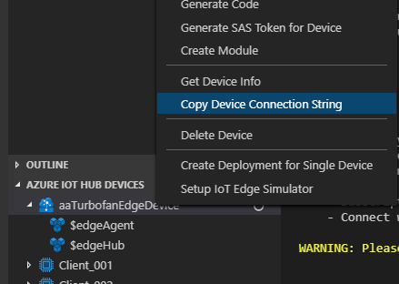

# Tutorial: Configure an IoT Edge device

> [!NOTE]
> This article is part of a series for a tutorial about using Azure Machine Learning on IoT Edge. If you have arrived at this article directly, we encourage you to begin with the [first article](tutorial-machine-learning-edge-01-intro.md) in the series for the best results.

In this article, we configure an Azure virtual machine running Linux to be an IoT Edge device that acts as a transparent gateway. A transparent gateway configuration allows devices to connect to Azure IoT Hub through the gateway without knowing that the gateway exists. At the same time, a user interacting with the devices in Azure IoT Hub is unaware of the intermediate gateway device. Ultimately, we will add edge analytics to our system by adding IoT Edge modules to the transparent gateway.

The steps in this article are typically performed by a cloud developer.

## Create certificates

For a device to function as a gateway it needs to be able to securely connect to downstream devices. Azure IoT Edge allows you to use a public key infrastructure (PKI) to set up secure connections between devices. In this case, we're allowing a downstream IoT device to connect to an IoT Edge device acting as a transparent gateway. To maintain reasonable security, the downstream device should confirm the identity of the IoT Edge device. For more information about how IoT Edge devices use certificates, see [Azure IoT Edge certificate usage details](iot-edge-certs.md).

In this section, we create the self-signed certificates using a Docker image that we then build and run. We chose to use a Docker image to complete this step because it significantly reduces the number of steps needed to create the certificates on the Windows development machine. See [Create demo certificates to test IoT Edge device features](how-to-create-test-certificates.md) to understand what we automated with the Docker image.

1. Sign in to your development VM.

2. Create a new folder with the path and name `c:\edgeCertificates`.

3. If not already running, start **Docker for Windows** from the Windows Start menu.

4. Open Visual Studio Code.

5. Select **File** > **Open Folder...** and choose **C:\\source\\IoTEdgeAndMlSample\\CreateCertificates**.

6. In the Explorer pane, right-click on **dockerfile** and choose **Build Image**.

7. In the dialog, accept the default value for the image name and tag: **createcertificates: latest**.

    

8. Wait for the build to complete.

    > [!NOTE]
    > You may see a warning for about a missing public key. It is safe to ignore this warning. Likewise, you will see a security warning that recommends you check/reset permissions on your image, which is safe to ignore for this image.

9. In the Visual Studio Code terminal window, run the createcertificates container.

    ```cmd
    docker run --name createcertificates --rm -v c:\edgeCertificates:/edgeCertificates createcertificates /edgeCertificates
    ```

10. Docker will prompt for access to the **c:\\** drive. Select **Share it**.

11. Provide your credentials when prompted.

12. Once the container finishes running, check for the following files in **c:\\edgeCertificates**:

    * c:\\edgeCertificates\\certs\\azure-iot-test-only.root.ca.cert.pem
    * c:\\edgeCertificates\\certs\\new-edge-device-full-chain.cert.pem
    * c:\\edgeCertificates\\certs\\new-edge-device.cert.pem
    * c:\\edgeCertificates\\certs\\new-edge-device.cert.pfx
    * c:\\edgeCertificates\\private\\new-edge-device.key.pem

## Upload certificates to Azure Key Vault

To store our certificates securely and to make them accessible from multiple devices, we will upload the certificates into Azure Key Vault. As you can see from the list above, we have two types of certificate files: PFX and PEM. We will treat the PFX as Key Vault certificates to be uploaded to Key Vault. The PEM files are plain text and we will treat them as Key Vault secrets. We will use the Key Vault associated with the Azure Machine Learning workspace we created by running the [Azure Notebooks](tutorial-machine-learning-edge-04-train-model.md#run-azure-notebooks).

1. From the [Azure portal](https://portal.azure.com), navigate to your Azure Machine Learning workspace.

2. From the overview page of the Azure Machine Learning workspace, find the name of the **Key Vault**.

    

3. On your development machine, upload the certificates to Key Vault. Replace **\<subscriptionId\>** and **\<keyvaultname\>** with your resource information.

    ```powershell
    c:\source\IoTEdgeAndMlSample\CreateCertificates\upload-keyvaultcerts.ps1 -SubscriptionId <subscriptionId> -KeyVaultName <keyvaultname>
    ```

4. If prompted, sign in to Azure.

5. The script will run for few minutes with output that lists the new Key Vault entries.

    

## Create IoT Edge device

To connect an Azure IoT Edge device to an IoT hub, we first create an identity for the device in the hub. We take the connection string from the device identity in the cloud and use it to configure the runtime on our IoT Edge device. Once a configured device connects to the hub, we are able to deploy modules and send messages. We can also change the configuration of the physical IoT Edge device by changing its corresponding device identity in IoT hub.

For this tutorial, we create the new device identity using Visual Studio Code. You can also complete these steps using the [Azure portal](how-to-register-device.md#register-in-the-azure-portal), or [Azure CLI](how-to-register-device.md#register-with-the-azure-cli).

1. On your development machine, open Visual Studio Code.

2. Expand the **Azure IoT Hub** frame from the Visual Studio Code explorer view.

3. Click on the ellipsis and select **Create IoT Edge Device**.

4. Give the device a name. For convenience, we use the name **aaTurbofanEdgeDevice** so it sorts to the top of listed devices.

5. The new device will appear in the list of devices.

    

## Deploy Azure Virtual Machine

We use the [Azure IoT Edge on Ubuntu](https://azuremarketplace.microsoft.com/marketplace/apps/microsoft_iot_edge.iot_edge_vm_ubuntu?tab=Overview) image from the Azure Marketplace to create our IoT Edge device for this tutorial. The Azure IoT Edge on Ubuntu image installs the latest Azure IoT Edge runtime and its dependencies on startup. We deploy the VM using a PowerShell script, `Create-EdgeVM.ps1`; a Resource Manager template, `IoTEdgeVMTemplate.json`; and a shell script, `install packages.sh`.

### Enable programmatic deployment

To use the image from the Marketplace in a scripted deployment, we need to enable programmatic deployment for the image.

1. Sign in to the Azure portal.

1. Select **All services**.

1. In the search bar, enter and select **Marketplace**.

1. In the Marketplace search bar, enter and select **Azure IoT Edge on Ubuntu**.

1. Select the **Get started** hyperlink to deploy programmatically.

1. Select the **Enable** button, then **Save**.

    

1. You will see a success notification.

### Create virtual machine

Next, run the script to create the virtual machine for your IoT Edge device.

1. Open a PowerShell window and navigate to the **EdgeVM** directory.

    ```powershell
    cd c:\source\IoTEdgeAndMlSample\EdgeVM
    ```

2. Run the script to create the virtual machine.

    ```powershell
    .\Create-EdgeVm.ps1
    ```

3. When prompted, provide values for each parameter. For subscription, resource group, and location we recommend you use the same as you have for all resources throughout this tutorial.

    * **Azure Subscription ID**: found in the Azure portal
    * **Resource Group Name**: memorable name for grouping the resources for this tutorial
    * **Location**: Azure location where the virtual machine will be created. For example, westus2 or northeurope. For more, see all [Azure locations](https://azure.microsoft.com/global-infrastructure/locations/).
    * **AdminUsername**: the name for the admin account you will use to sign in to the virtual machine
    * **AdminPassword**: the password to set for the AdminUsername on the virtual machine

4. For the script to be able to set up the VM, you need to sign in to Azure with the credentials associated with the Azure Subscription you are using.

5. The script confirms the information for the creation of your VM. Select **y** or **Enter** to continue.

6. The script runs for several minutes as it executes the following steps:

    * Create the resource group if it does not exist already
    * Create the virtual machine
    * Add NSG exceptions for the VM for ports 22 (SSH), 5671 (AMQP), 5672 (AMPQ), and 443 (TLS)
    * Install the [Azure CLI](/cli/azure/install-azure-cli-apt)

7. The script outputs the SSH connection string for connecting to the VM. Copy the connection string for the next step.

    

## Connect to your IoT Edge device

The next several sections configure the Azure virtual machine we created. The first step is to connect to the virtual machine.

1. Open a command prompt and paste the SSH connection string you copied from the script output. Enter your own information for username, suffix, and region according to the values you supplied to the PowerShell script in the previous section.

    ```cmd
    ssh -l <username> iotedge-<suffix>.<region>.cloudapp.azure.com
    ```

2. When prompted to validate the authenticity of the host, type **yes** and select **Enter**.

3. When prompted, provide your password.

4. Ubuntu displays a welcome message and then you should see a prompt like `<username>@<machinename>:~$`.

## Download Key Vault certificates

Earlier in this article, we uploaded certificates to Key Vault to make them available for our IoT Edge device and our leaf device. The leaf device is a downstream device that uses the IoT Edge device as a gateway to communicate with IoT Hub.

We will deal with the leaf device later in the tutorial. In this section, download the certificates to the IoT Edge device.

1. From the SSH session on the Linux virtual machine, sign in to Azure with the Azure CLI.

    ```azurecli
    az login
    ```

1. You will be prompted to open a browser to <https://microsoft.com/devicelogin> and provide a unique code. You can perform these steps on your local machine. Close the browser window when you're done authenticating.

1. When you successfully authenticate, the Linux VM will sign in and list your Azure subscriptions.

1. Set the Azure subscription that you want to use for Azure CLI commands.

    ```azurecli
    az account set --subscription <subscriptionId>
    ```

1. Create a directory on the VM for the certificates.

    ```bash
    sudo mkdir /edgeMlCertificates
    ```

1. Download the certificates that you stored in the key vault: new-edge-device-full-chain.cert.pem, new-edge-device.key.pem, and azure-iot-test-only.root.ca.cert.pem

    ```azurecli
    key_vault_name="<key vault name>"
    sudo az keyvault secret download --vault-name $key_vault_name --name new-edge-device-full-chain-cert-pem -f /edgeMlCertificates/new-edge-device-full-chain.cert.pem
    sudo az keyvault secret download --vault-name $key_vault_name --name new-edge-device-key-pem -f /edgeMlCertificates/new-edge-device.key.pem
    sudo az keyvault secret download --vault-name $key_vault_name --name azure-iot-test-only-root-ca-cert-pem -f /edgeMlCertificates/azure-iot-test-only.root.ca.cert.pem
    ```

## Update the IoT Edge device configuration

The IoT Edge runtime uses the file `/etc/iotedge/config.yaml` to persist its configuration. We need to update three pieces of information in this file:

* **Device connection string**: the connection string from this device's identity in IoT Hub
* **Certificates:** the certificates to use for connections made with downstream devices
* **Hostname:** the fully qualified domain name (FQDN) of the VM IoT Edge device.

The *Azure IoT Edge on Ubuntu* image that we used to create the IoT Edge VM comes with a shell script that updates the config.yaml with the connection string.

1. In Visual Studio Code right-click on the IoT Edge device, then select **Copy Device Connection String**.

    

2. In your SSH session, run the command to update the config.yaml file with your device connection string.

    ```bash
    sudo /etc/iotedge/configedge.sh "<your_iothub_edge_device_connection_string>"
    ```

Next we will update the certificates and hostname by directly editing the config.yaml.

1. Open the config.yaml file.

    ```bash
    sudo nano /etc/iotedge/config.yaml
    ```

2. Update the certificates section of the config.yaml by removing the leading `#` and setting the path so the file looks like the following example:

    ```yaml
    certificates:
      device_ca_cert: "/edgeMlCertificates/new-edge-device-full-chain.cert.pem"
      device_ca_pk: "/edgeMlCertificates/new-edge-device.key.pem"
      trusted_ca_certs: "/edgeMlCertificates/azure-iot-test-only.root.ca.cert.pem"
    ```

    Make sure the **certificates:** line has no preceding whitespace and that each of the nested certificates is indented by two spaces.

    Right-clicking in nano will paste the contents of your clipboard to the current cursor position. To replace the string, use your keyboard arrows to navigate to the string you want to replace, delete the string, then right-click to paste from the buffer.

3. In the Azure portal, navigate to your virtual machine. Copy the DNS name (FQDN of the machine) from the **Overview** section.

4. Paste the FQDN into the hostname section of the config.yml. Make sure that the name is all lowercase.

    ```yaml
    hostname: '<machinename>.<region>.cloudapp.azure.com'
    ```

5. Save and close the file (`Ctrl + X`, `Y`, `Enter`).

6. Restart the iotedge daemon.

    ```bash
    sudo systemctl restart iotedge
    ```

7. Check the status of the IoT Edge Daemon (after the command, type ":q" to exit).

    ```bash
    systemctl status iotedge
    ```

8. If you see errors (colored text prefixed with "\[ERROR\]") in the status Examine daemon logs for detailed error information.

    ```bash
    journalctl -u iotedge --no-pager --no-full
    ```
## Next steps

We just completed configuring an Azure VM as Azure IoT Edge Transparent Gateway. We started by generating test certificates that we uploaded to Azure Key Vault. Next, we used a script and Resource Manager template to deploy the VM with the "Ubuntu Server 16.04 LTS + Azure IoT Edge runtime" image from the Azure Marketplace. With the VM up and running we connected via SSH, we signed into Azure and downloaded certificates from Key Vault. We made several updates to the configuration of the IoT Edge Runtime by updating the config.yaml file.

Continue to the next article to build IoT Edge modules.

> [!div class="nextstepaction"]
> [Create and deploy custom IoT Edge modules](tutorial-machine-learning-edge-06-custom-modules.md)
