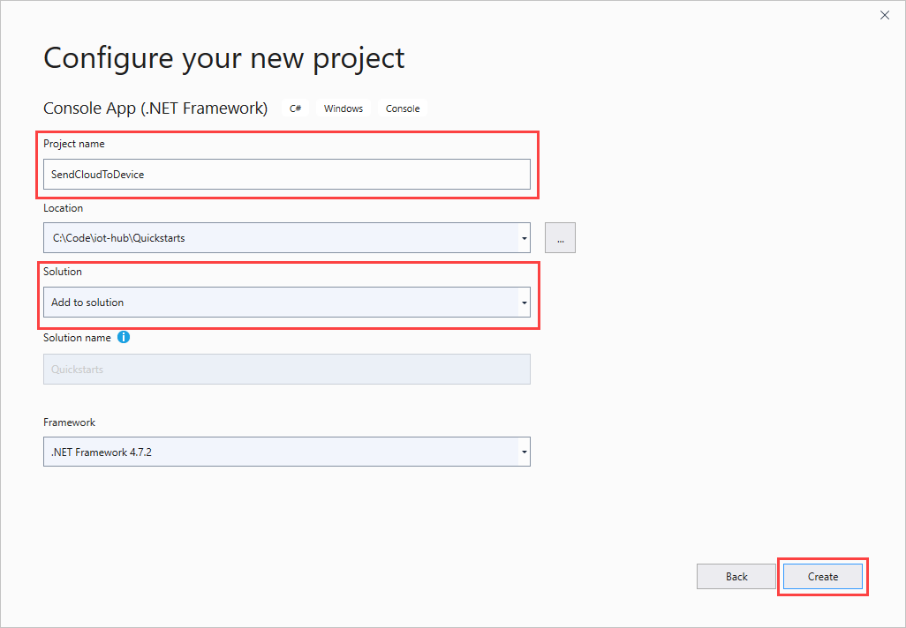
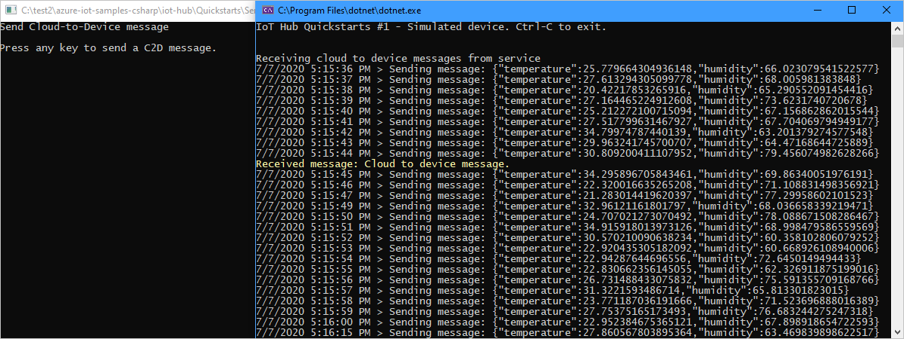
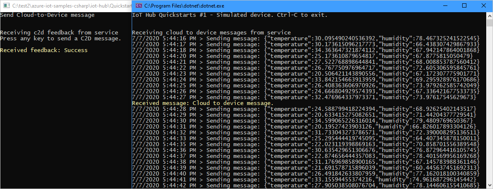

# Send messages from the cloud to your device with IoT Hub (.NET)

[!INCLUDE [iot-hub-selector-c2d](../../includes/iot-hub-selector-c2d.md)]

Azure IoT Hub is a fully managed service that helps enable reliable and secure bi-directional communications between millions of devices and a solution back end. The [Send telemetry from a device to an IoT hub](quickstart-send-telemetry-dotnet.md) quickstart shows how to create an IoT hub, provision a device identity in it, and code a device app that sends device-to-cloud messages.

[!INCLUDE [iot-hub-basic](../../includes/iot-hub-basic-whole.md)]

This tutorial builds on [Send telemetry from a device to an IoT hub](quickstart-send-telemetry-dotnet.md). It shows you how to do the following tasks:

* From your solution back end, send cloud-to-device messages to a single device through IoT Hub.

* Receive cloud-to-device messages on a device.

* From your solution back end, request delivery acknowledgment (*feedback*) for messages sent to a device from IoT Hub.

You can find more information on cloud-to-device messages in [D2C and C2D Messaging with IoT Hub](iot-hub-devguide-messaging.md).

At the end of this tutorial, you run two .NET console apps.

* **SimulatedDevice**. This app connects to your IoT hub and receives cloud-to-device messages. This app is a modified version of the app created in [Send telemetry from a device to an IoT hub](quickstart-send-telemetry-dotnet.md).

* **SendCloudToDevice**. This app sends a cloud-to-device message to the device app through IoT Hub, and then receives its delivery acknowledgment.

> [!NOTE]
> IoT Hub has SDK support for many device platforms and languages, including C, Java, Python, and Javascript, through [Azure IoT device SDKs](iot-hub-devguide-sdks.md). For step-by-step instructions on how to connect your device to this tutorial's code, and generally to Azure IoT Hub, see the [IoT Hub developer guide](iot-hub-devguide.md).
>

## Prerequisites

* Visual Studio

* An active Azure account. If you don't have an account, you can create a [free account](https://azure.microsoft.com/pricing/free-trial/) in just a couple of minutes.

* Make sure that port 8883 is open in your firewall. The device sample in this article uses MQTT protocol, which communicates over port 8883. This port may be blocked in some corporate and educational network environments. For more information and ways to work around this issue, see [Connecting to IoT Hub (MQTT)](iot-hub-mqtt-support.md#connecting-to-iot-hub).

## Receive messages in the device app

In this section, modify the device app you created in [Send telemetry from a device to an IoT hub](quickstart-send-telemetry-dotnet.md) to receive cloud-to-device messages from the IoT hub.

1. In Visual Studio, in the **SimulatedDevice** project, add the following method to the **SimulatedDevice** class.

   ```csharp
    private static async void ReceiveC2dAsync()
    {
        Console.WriteLine("\nReceiving cloud to device messages from service");
        while (true)
        {
            Message receivedMessage = await s_deviceClient.ReceiveAsync();
            if (receivedMessage == null) continue;

            Console.ForegroundColor = ConsoleColor.Yellow;
            Console.WriteLine("Received message: {0}", 
            Encoding.ASCII.GetString(receivedMessage.GetBytes()));
            Console.ResetColor();

            await s_deviceClient.CompleteAsync(receivedMessage);
        }
    }
   ```

1. Add the following method in the **Main** method, right before the `Console.ReadLine()` line:

   ```csharp
   ReceiveC2dAsync();
   ```

The `ReceiveAsync` method asynchronously returns the received message at the time that it is received by the device. It returns *null* after a specifiable timeout period. In this example, the default of one minute is used. When the app receives a *null*, it should continue to wait for new messages. This requirement is the reason for the `if (receivedMessage == null) continue` line.

The call to `CompleteAsync()` notifies IoT Hub that the message has been successfully processed and that the message can be safely removed from the device queue. The device should call this method when its processing successfully completes regardless of the protocol it's using.

With AMQP and HTTPS, but not MQTT, the device can also:

* Abandon a message, which results in IoT Hub retaining the message in the device queue for future consumption.
* Reject a message, which which permanently removes the message from the device queue.

If something happens that prevents the device from completing, abandoning, or rejecting the message, IoT Hub will, after a fixed timeout period, queue the message for delivery again. For this reason, the message processing logic in the device app must be *idempotent*, so that receiving the same message multiple times produces the same result.

For more detailed information about how IoT Hub processes cloud-to-device messages, including details of the cloud-to-device message lifecycle, see [Send cloud-to-device messages from an IoT hub](iot-hub-devguide-messages-c2d.md).

> [!NOTE]
> When using HTTPS instead of MQTT or AMQP as a transport, the `ReceiveAsync` method returns immediately. The supported pattern for cloud-to-device messages with HTTPS is intermittently connected devices that check for messages infrequently (a minimum of every 25 minutes). Issuing more HTTPS receives results in IoT Hub throttling the requests. For more information about the differences between MQTT, AMQP, and HTTPS support, see [Cloud-to-device communications guidance](iot-hub-devguide-c2d-guidance.md) and [Choose a communication protocol](iot-hub-devguide-protocols.md).
>

## Get the IoT hub connection string

In this article, you create a back-end service to send cloud-to-device messages through the IoT hub you created in [Send telemetry from a device to an IoT hub](quickstart-send-telemetry-dotnet.md). To send cloud-to-device messages, your service needs the **service connect** permission. By default, every IoT Hub is created with a shared access policy named **service** that grants this permission.

[!INCLUDE [iot-hub-include-find-service-connection-string](../../includes/iot-hub-include-find-service-connection-string.md)]

## Send a cloud-to-device message

In this section, you create a .NET console app that sends cloud-to-device messages to the simulated device app.

1. In the current Visual Studio solution, select **File** > **New** > **Project**. In **Create a new project**, select **Console App (.NET Framework)**, and then select **Next**.

1. Name the project *SendCloudToDevice*. Under **Solution**, select **Add to solution** and accept the most recent version of the .NET Framework. Select **Create** to create the project.

   

1. In Solution Explorer, right-click the new project, and then select **Manage NuGet Packages**.

1. In **Manage NuGet Packages**, select **Browse**, and then search for and select **Microsoft.Azure.Devices**. Select  **Install**.

   This step downloads, installs, and adds a reference to the [Azure IoT service SDK NuGet package](https://www.nuget.org/packages/Microsoft.Azure.Devices/).

1. Add the following `using` statement at the top of the **Program.cs** file.

   ``` csharp
   using Microsoft.Azure.Devices;
   ```

1. Add the following fields to the **Program** class. Replace the `{iot hub connection string}` placeholder value with the IoT hub connection string you noted previously in [Get the IoT hub connection string](#get-the-iot-hub-connection-string). Replace the `{device id}` placeholder value with the device ID of the device you added in the [Send telemetry from a device to an IoT hub](quickstart-send-telemetry-dotnet.md) quickstart.

   ``` csharp
   static ServiceClient serviceClient;
   static string connectionString = "{iot hub connection string}";
   static string targetDevice = "{device id}";
   ```

1. Add the following method to the **Program** class to send a message to your device.

   ``` csharp
   private async static Task SendCloudToDeviceMessageAsync()
   {
        var commandMessage = new
         Message(Encoding.ASCII.GetBytes("Cloud to device message."));
        await serviceClient.SendAsync(targetDevice, commandMessage);
   }
   ```

1. Finally, add the following lines to the **Main** method.

   ``` csharp
   Console.WriteLine("Send Cloud-to-Device message\n");
   serviceClient = ServiceClient.CreateFromConnectionString(connectionString);

   Console.WriteLine("Press any key to send a C2D message.");
   Console.ReadLine();
   SendCloudToDeviceMessageAsync().Wait();
   Console.ReadLine();
   ```

1. In Solutions Explorer, right-click your solution, and select **Set StartUp Projects**.

1. In **Common Properties** > **Startup Project**, select **Multiple startup projects**, then select the **Start** action for **SimulatedDevice** and **SendCloudToDevice**. Select **OK** to save your changes.

1. Press **F5**. Both applications should start. Select the **SendCloudToDevice** window, and press **Enter**. You should see the message being received by the device app.

   

## Receive delivery feedback

It is possible to request delivery (or expiration) acknowledgments from IoT Hub for each cloud-to-device message. This option enables the solution back end to easily inform retry or compensation logic. For more information about cloud-to-device feedback, see [D2C and C2D Messaging with IoT Hub](iot-hub-devguide-messaging.md).

In this section, you modify the **SendCloudToDevice** app to request feedback, and receive it from the IoT hub.

1. In Visual Studio, in the **SendCloudToDevice** project, add the following method to the **Program** class.

   ```csharp
   private async static void ReceiveFeedbackAsync()
   {
        var feedbackReceiver = serviceClient.GetFeedbackReceiver();

        Console.WriteLine("\nReceiving c2d feedback from service");
        while (true)
        {
            var feedbackBatch = await feedbackReceiver.ReceiveAsync();
            if (feedbackBatch == null) continue;

            Console.ForegroundColor = ConsoleColor.Yellow;
            Console.WriteLine("Received feedback: {0}",
              string.Join(", ", feedbackBatch.Records.Select(f => f.StatusCode)));
            Console.ResetColor();

            await feedbackReceiver.CompleteAsync(feedbackBatch);
        }
    }
    ```

    Note this receive pattern is the same one used to receive cloud-to-device messages from the device app.

1. Add the following line in the **Main** method, right after `serviceClient = ServiceClient.CreateFromConnectionString(connectionString)`.

   ``` csharp
   ReceiveFeedbackAsync();
   ```

1. To request feedback for the delivery of your cloud-to-device message, you have to specify a property in the **SendCloudToDeviceMessageAsync** method. Add the following line, right after the `var commandMessage = new Message(...);` line.

   ``` csharp
   commandMessage.Ack = DeliveryAcknowledgement.Full;
   ```

1. Run the apps by pressing **F5**. You should see both applications start. Select the **SendCloudToDevice** window, and press **Enter**. You should see the message being received by the device app, and after a few seconds, the feedback message being received by your **SendCloudToDevice** application.

   

> [!NOTE]
> For simplicity, this tutorial does not implement any retry policy. In production code, you should implement retry policies, such as exponential backoff, as suggested in [Transient fault handling](/azure/architecture/best-practices/transient-faults).
>

## Next steps

In this how-to, you learned how to send and receive cloud-to-device messages.

To see examples of complete end-to-end solutions that use IoT Hub, see [Azure IoT Remote Monitoring solution accelerator](/azure/iot-suite/).

To learn more about developing solutions with IoT Hub, see the [IoT Hub developer guide](iot-hub-devguide.md).