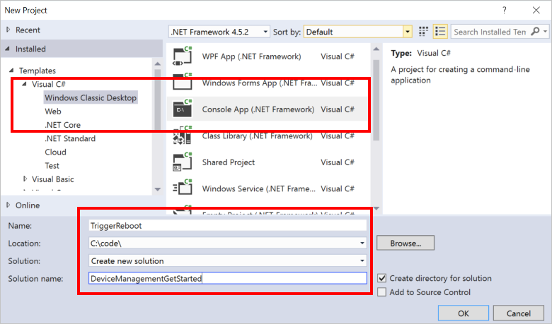
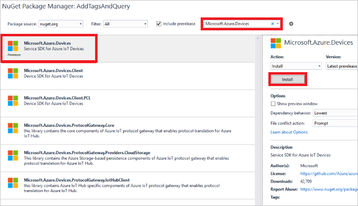
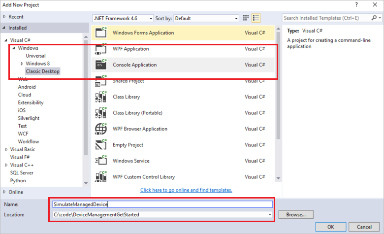

# Get started with device management (.NET/.NET)

[!INCLUDE [iot-hub-selector-dm-getstarted](../../includes/iot-hub-selector-dm-getstarted.md)]

This tutorial shows you how to:

* Use the Azure portal to create an IoT Hub and create a device identity in your IoT hub.

* Create a simulated device app that contains a direct method that reboots that device. Direct methods are invoked from the cloud.

* Create a .NET console app that calls the reboot direct method in the simulated device app through your IoT hub.

At the end of this tutorial, you have two .NET console apps:

* **SimulateManagedDevice**, which connects to your IoT hub with the device identity created earlier, receives a reboot direct method, simulates a physical reboot, and reports the time for the last reboot.

* **TriggerReboot**, which calls a direct method in the simulated device app, displays the response, and displays the updated reported properties.

To complete this tutorial, you need the following:

* Visual Studio.

* An active Azure account. (If you don't have an account, you can create a [free account](https://azure.microsoft.com/pricing/free-trial/) in just a couple of minutes.)

## Create an IoT hub

[!INCLUDE [iot-hub-include-create-hub](../../includes/iot-hub-include-create-hub.md)]

### Retrieve connection string for IoT hub

[!INCLUDE [iot-hub-find-include-connection-string](../../includes/iot-hub-include-find-connection-string.md)]

## Register a new device in the IoT hub

[!INCLUDE [iot-hub-include-create-device](../../includes/iot-hub-include-create-device.md)]

## Trigger a remote reboot on the device using a direct method

In this section, you create a .NET console app (using C#) that initiates a remote reboot on a device using a direct method. The app uses device twin queries to discover the last reboot time for that device.

1. In Visual Studio, add a Visual C# Windows Classic Desktop project to a new solution by using the **Console App (.NET Framework)** project template. Make sure the .NET Framework version is 4.5.1 or later. Name the project **TriggerReboot**.

    

2. In Solution Explorer, right-click the **TriggerReboot** project, and then click **Manage NuGet Packages**.

3. In the **NuGet Package Manager** window, select **Browse**, search for **Microsoft.Azure.Devices**, select **Install** to install the **Microsoft.Azure.Devices** package, and accept the terms of use. This procedure downloads, installs, and adds a reference to the [Azure IoT service SDK](https://www.nuget.org/packages/Microsoft.Azure.Devices/) NuGet package and its dependencies.

    

4. Add the following `using` statements at the top of the **Program.cs** file:
   
   ```csharp
   using Microsoft.Azure.Devices;
   using Microsoft.Azure.Devices.Shared;
   ```
        
5. Add the following fields to the **Program** class. Replace the placeholder value with the IoT Hub connection string for the hub that you created in the section "Create an IoT hub." 
   
   ```csharp
   static RegistryManager registryManager;
   static string connString = "{iot hub connection string}";
   static ServiceClient client;
   static string targetDevice = "myDeviceId";
   ```

6. Add the following method to the **Program** class.  This code gets the device twin for the rebooting device and outputs the reported properties.
   
   ```csharp
   public static async Task QueryTwinRebootReported()
   {
       Twin twin = await registryManager.GetTwinAsync(targetDevice);
       Console.WriteLine(twin.Properties.Reported.ToJson());
   }
   ```
        
7. Add the following method to the **Program** class.  This code initiates the reboot on the device using a direct method.

   ```csharp
   public static async Task StartReboot()
   {
       client = ServiceClient.CreateFromConnectionString(connString);
       CloudToDeviceMethod method = new CloudToDeviceMethod("reboot");
       method.ResponseTimeout = TimeSpan.FromSeconds(30);

       CloudToDeviceMethodResult result = await 
         client.InvokeDeviceMethodAsync(targetDevice, method);

       Console.WriteLine("Invoked firmware update on device.");
   }
   ```

7. Finally, add the following lines to the **Main** method:
   
   ```csharp
   registryManager = RegistryManager.CreateFromConnectionString(connString);
   StartReboot().Wait();
   QueryTwinRebootReported().Wait();
   Console.WriteLine("Press ENTER to exit.");
   Console.ReadLine();
   ```

8. Build the solution.

> [!NOTE]
> This tutorial performs only a single query for the device's reported properties. In production code, we recommend polling to detect changes in the reported properties.

## Create a simulated device app

In this section, you do the following:

* Create a .NET console app that responds to a direct method called by the cloud.

* Trigger a simulated device reboot.

* Use the reported properties to enable device twin queries to identify devices and when they were last rebooted.

1. In Visual Studio, add a Visual C# Windows Classic Desktop project to the current solution by using the **Console Application** project template. Name the project **SimulateManagedDevice**.
   
    
    
2. In Solution Explorer, right-click the **SimulateManagedDevice** project, and then click **Manage NuGet Packages...**.

3. In the **NuGet Package Manager** window, select **Browse** and search for **Microsoft.Azure.Devices.Client**. Select **Install** to install the **Microsoft.Azure.Devices.Client** package, and accept the terms of use. This procedure downloads, installs, and adds a reference to the [Azure IoT device SDK](https://www.nuget.org/packages/Microsoft.Azure.Devices.Client/) NuGet package and its dependencies.
   
    
    
4. Add the following `using` statements at the top of the **Program.cs** file:
   
    ```csharp
    using Microsoft.Azure.Devices.Client;
    using Microsoft.Azure.Devices.Shared;
    ```

5. Add the following fields to the **Program** class. Replace the placeholder value with the device connection string that you noted in the previous section.

    ```csharp
    static string DeviceConnectionString = 
      "HostName=<yourIotHubName>.azure-devices.net;DeviceId=<yourIotDeviceName>;SharedAccessKey=<yourIotDeviceAccessKey>";
    static DeviceClient Client = null;
    ```
6. Add the following to implement the direct method on the device:

   ```csharp
   static Task<MethodResponse> onReboot(MethodRequest methodRequest, object userContext)
   {
       // In a production device, you would trigger a reboot 
       //   scheduled to start after this method returns.
       // For this sample, we simulate the reboot by writing to the console
       //   and updating the reported properties.
       try
       {
           Console.WriteLine("Rebooting!");

           // Update device twin with reboot time. 
           TwinCollection reportedProperties, reboot, lastReboot;
           lastReboot = new TwinCollection();
           reboot = new TwinCollection();
           reportedProperties = new TwinCollection();
           lastReboot["lastReboot"] = DateTime.Now;
           reboot["reboot"] = lastReboot;
           reportedProperties["iothubDM"] = reboot;
           Client.UpdateReportedPropertiesAsync(reportedProperties).Wait();
       }
       catch (Exception ex)
       {
           Console.WriteLine();
           Console.WriteLine("Error in sample: {0}", ex.Message);
       }

       string result = "'Reboot started.'";
       return Task.FromResult(new MethodResponse(Encoding.UTF8.GetBytes(result), 200));
   }
   ```

7. Finally, add the following code to the **Main** method to open the connection to your IoT hub and initialize the method listener:

   ```csharp
   try
   {
       Console.WriteLine("Connecting to hub");
       Client = DeviceClient.CreateFromConnectionString(DeviceConnectionString, 
         TransportType.Mqtt);

       // setup callback for "reboot" method
       Client.SetMethodHandlerAsync("reboot", onReboot, null).Wait();
       Console.WriteLine("Waiting for reboot method\n Press enter to exit.");
       Console.ReadLine();

       Console.WriteLine("Exiting...");

       // as a good practice, remove the "reboot" handler
       Client.SetMethodHandlerAsync("reboot", null, null).Wait();
       Client.CloseAsync().Wait();
   }
   catch (Exception ex)
   {
       Console.WriteLine();
       Console.WriteLine("Error in sample: {0}", ex.Message);
   }
   ```
        
8. In the Visual Studio Solution Explorer, right-click your solution, and then click **Set StartUp Projects...**. Select **Single startup project**, and then select the **SimulateManagedDevice** project in the dropdown menu. Build the solution.       

> [!NOTE]
> To keep things simple, this tutorial does not implement any retry policy. In production code, you should implement retry policies (such as an exponential backoff), as suggested in the article, [Transient Fault Handling](/azure/architecture/best-practices/transient-faults).

## Run the apps

You are now ready to run the apps.

1. To run the .NET device app **SimulateManagedDevice**. right-click the **SimulateManagedDevice** project, select **Debug**, and then select **Start new instance**. It should start listening for method calls from your IoT hub. 

2. Now that the device is connected and waiting for method invocations, run the .NET **TriggerReboot** app to invoke the reboot method in the simulated device app. To do this, right-click the **TriggerReboot** project, select **Debug**, and then select **Start new instance**. You should see "Rebooting!" written in the **SimulatedManagedDevice** console and the reported properties of the device, which include the last reboot time,  written in the **TriggerReboot** console.
   
    

[!INCLUDE [iot-hub-dm-followup](../../includes/iot-hub-dm-followup.md)]
