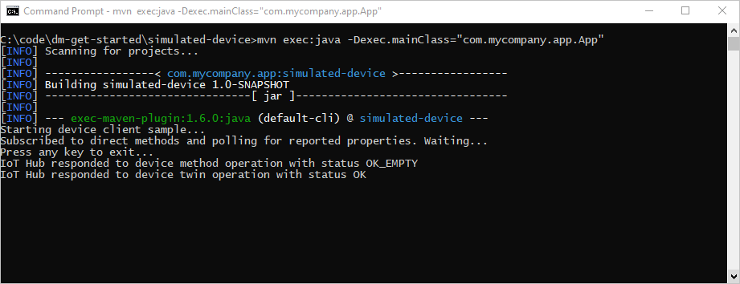
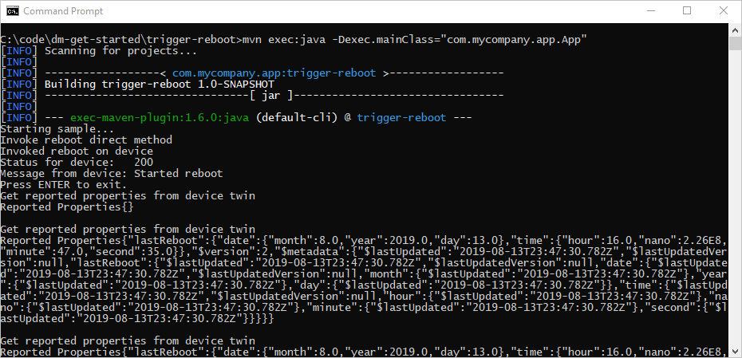
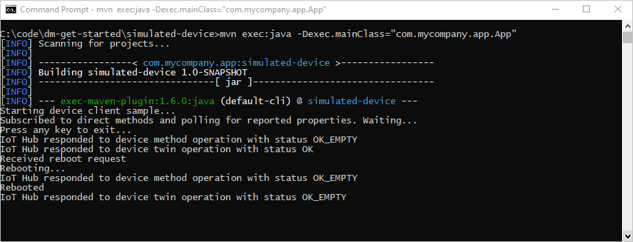

# Get started with device management (Java)

[!INCLUDE [iot-hub-selector-dm-getstarted](../../includes/iot-hub-selector-dm-getstarted.md)]

This tutorial shows you how to:

* Use the Azure portal to create an IoT Hub and create a device identity in your IoT hub.

* Create a simulated device app that implements a direct method to reboot the device. Direct methods are invoked from the cloud.

* Create an app that invokes the reboot direct method in the simulated device app through your IoT hub. This app then monitors the reported properties from the device to see when the reboot operation is complete.

At the end of this tutorial, you have two Java console apps:

**simulated-device**. This app:

* Connects to your IoT hub with the device identity created earlier.

* Receives a reboot direct method call.

* Simulates a physical reboot.

* Reports the time of the last reboot through a reported property.

**trigger-reboot**. This app:

* Calls a direct method in the simulated device app.

* Displays the response to the direct method call sent by the simulated device.

* Displays the updated reported properties.

> [!NOTE]
> For information about the SDKs that you can use to build applications to run on devices and your solution back end, see [Azure IoT SDKs](iot-hub-devguide-sdks.md).

## Prerequisites

* [Java SE Development Kit 8](https://docs.microsoft.com/java/azure/jdk/?view=azure-java-stable). Make sure you select **Java 8** under **Long-term support** to get to downloads for JDK 8.

* [Maven 3](https://maven.apache.org/download.cgi)

* An active Azure account. (If you don't have an account, you can create a [free account](https://azure.microsoft.com/pricing/free-trial/) in just a couple of minutes.)

* Make sure that port 8883 is open in your firewall. The device sample in this article uses MQTT protocol, which communicates over port 8883. This port may be blocked in some corporate and educational network environments. For more information and ways to work around this issue, see [Connecting to IoT Hub (MQTT)](iot-hub-mqtt-support.md#connecting-to-iot-hub).

## Create an IoT hub

[!INCLUDE [iot-hub-include-create-hub](../../includes/iot-hub-include-create-hub.md)]

## Register a new device in the IoT hub

[!INCLUDE [iot-hub-get-started-create-device-identity](../../includes/iot-hub-get-started-create-device-identity.md)]

## Get the IoT hub connection string

[!INCLUDE [iot-hub-howto-device-management-shared-access-policy-text](../../includes/iot-hub-howto-device-management-shared-access-policy-text.md)]

[!INCLUDE [iot-hub-include-find-service-connection-string](../../includes/iot-hub-include-find-service-connection-string.md)]

## Trigger a remote reboot on the device using a direct method

In this section, you create a Java console app that:

1. Invokes the reboot direct method in the simulated device app.

2. Displays the response.

3. Polls the reported properties sent from the device to determine when the reboot is complete.

This console app connects to your IoT Hub to invoke the direct method and read the reported properties.

1. Create an empty folder called **dm-get-started**.

2. In the **dm-get-started** folder, create a Maven project called **trigger-reboot** using the following command at your command prompt:

    ```cmd/sh
    mvn archetype:generate -DgroupId=com.mycompany.app -DartifactId=trigger-reboot -DarchetypeArtifactId=maven-archetype-quickstart -DinteractiveMode=false
    ```

3. At your command prompt, navigate to the **trigger-reboot** folder.

4. Using a text editor, open the **pom.xml** file in the **trigger-reboot** folder and add the following dependency to the **dependencies** node. This dependency enables you to use the iot-service-client package in your app to communicate with your IoT hub:

    ```xml
    <dependency>
      <groupId>com.microsoft.azure.sdk.iot</groupId>
      <artifactId>iot-service-client</artifactId>
      <version>1.17.1</version>
      <type>jar</type>
    </dependency>
    ```

    > [!NOTE]
    > You can check for the latest version of **iot-service-client** using [Maven search](https://search.maven.org/#search%7Cga%7C1%7Ca%3A%22iot-service-client%22%20g%3A%22com.microsoft.azure.sdk.iot%22).

5. Add the following **build** node after the **dependencies** node. This configuration instructs Maven to use Java 1.8 to build the app:

    ```xml
    <build>
      <plugins>
        <plugin>
          <groupId>org.apache.maven.plugins</groupId>
          <artifactId>maven-compiler-plugin</artifactId>
          <version>3.3</version>
          <configuration>
            <source>1.8</source>
            <target>1.8</target>
          </configuration>
        </plugin>
      </plugins>
    </build>
    ```

6. Save and close the **pom.xml** file.

7. Using a text editor, open the **trigger-reboot\src\main\java\com\mycompany\app\App.java** source file.

8. Add the following **import** statements to the file:

    ```java
    import com.microsoft.azure.sdk.iot.service.devicetwin.DeviceMethod;
    import com.microsoft.azure.sdk.iot.service.devicetwin.MethodResult;
    import com.microsoft.azure.sdk.iot.service.exceptions.IotHubException;
    import com.microsoft.azure.sdk.iot.service.devicetwin.DeviceTwin;
    import com.microsoft.azure.sdk.iot.service.devicetwin.DeviceTwinDevice;

    import java.io.IOException;
    import java.util.concurrent.TimeUnit;
    import java.util.concurrent.Executors;
    import java.util.concurrent.ExecutorService;
    ```

9. Add the following class-level variables to the **App** class. Replace `{youriothubconnectionstring}` with the IoT Hub connection string you copied previously in [Get the IoT hub connection string](#get-the-iot-hub-connection-string):

    ```java
    public static final String iotHubConnectionString = "{youriothubconnectionstring}";
    public static final String deviceId = "myDeviceId";

    private static final String methodName = "reboot";
    private static final Long responseTimeout = TimeUnit.SECONDS.toSeconds(30);
    private static final Long connectTimeout = TimeUnit.SECONDS.toSeconds(5);
    ```

10. To implement a thread that reads the reported properties from the device twin every 10 seconds, add the following nested class to the **App** class:

    ```java
    private static class ShowReportedProperties implements Runnable {
      public void run() {
        try {
          DeviceTwin deviceTwins = DeviceTwin.createFromConnectionString(iotHubConnectionString);
          DeviceTwinDevice twinDevice = new DeviceTwinDevice(deviceId);
          while (true) {
            System.out.println("Get reported properties from device twin");
            deviceTwins.getTwin(twinDevice);
            System.out.println(twinDevice.reportedPropertiesToString());
            Thread.sleep(10000);
          }
        } catch (Exception ex) {
          System.out.println("Exception reading reported properties: " + ex.getMessage());
        }
      }
    }
    ```

11. Modify the signature of the **main** method to throw the following exception:

    ```java
    public static void main(String[] args) throws IOException
    ```

12. To invoke the reboot direct method on the simulated device, replace the code in the **main** method with the following code:

    ```java
    System.out.println("Starting sample...");
    DeviceMethod methodClient = DeviceMethod.createFromConnectionString(iotHubConnectionString);

    try
    {
      System.out.println("Invoke reboot direct method");
      MethodResult result = methodClient.invoke(deviceId, methodName, responseTimeout, connectTimeout, null);

      if(result == null)
      {
        throw new IOException("Invoke direct method reboot returns null");
      }
      System.out.println("Invoked reboot on device");
      System.out.println("Status for device:   " + result.getStatus());
      System.out.println("Message from device: " + result.getPayload());
    }
    catch (IotHubException e)
    {
        System.out.println(e.getMessage());
    }
    ```

13. To start the thread to poll the reported properties from the simulated device, add the following code to the **main** method:

    ```java
    ShowReportedProperties showReportedProperties = new ShowReportedProperties();
    ExecutorService executor = Executors.newFixedThreadPool(1);
    executor.execute(showReportedProperties);
    ```

14. To enable you to stop the app, add the following code to the **main** method:

    ```java
    System.out.println("Press ENTER to exit.");
    System.in.read();
    executor.shutdownNow();
    System.out.println("Shutting down sample...");
    ```

15. Save and close the **trigger-reboot\src\main\java\com\mycompany\app\App.java** file.

16. Build the **trigger-reboot** back-end app and correct any errors. At your command prompt, navigate to the **trigger-reboot** folder and run the following command:

    ```cmd/sh
    mvn clean package -DskipTests
    ```

## Create a simulated device app

In this section, you create a Java console app that simulates a device. The app listens for the reboot direct method call from your IoT hub and immediately responds to that call. The app then sleeps for a while to simulate the reboot process before it uses a reported property to notify the **trigger-reboot** back-end app that the reboot is complete.

1. In the **dm-get-started** folder, create a Maven project called **simulated-device** using the following command at your command prompt:

    ```cmd/sh
    mvn archetype:generate -DgroupId=com.mycompany.app -DartifactId=simulated-device -DarchetypeArtifactId=maven-archetype-quickstart -DinteractiveMode=false
    ```

2. At your command prompt, navigate to the **simulated-device** folder.

3. Using a text editor, open the **pom.xml** file in the **simulated-device** folder and add the following dependency to the **dependencies** node. This dependency enables you to use the iot-service-client package in your app to communicate with your IoT hub:

    ```xml
    <dependency>
      <groupId>com.microsoft.azure.sdk.iot</groupId>
      <artifactId>iot-device-client</artifactId>
      <version>1.17.5</version>
    </dependency>
    ```

    > [!NOTE]
    > You can check for the latest version of **iot-device-client** using [Maven search](https://search.maven.org/#search%7Cga%7C1%7Ca%3A%22iot-device-client%22%20g%3A%22com.microsoft.azure.sdk.iot%22).

4. Add the following dependency to the **dependencies** node. This dependency configures a NOP for the Apache [SLF4J](https://www.slf4j.org/) logging facade, which is used by the device client SDK to implement logging. This configuration is optional, but, if you omit it, you may see a warning in the console when you run the app. For more information about logging in the device client SDK, see [Logging](https://github.com/Azure/azure-iot-sdk-java/blob/master/device/iot-device-samples/readme.md#logging) in the *Samples for the Azure IoT device SDK for Java* readme file.

    ```xml
    <dependency>
      <groupId>org.slf4j</groupId>
      <artifactId>slf4j-nop</artifactId>
      <version>1.7.28</version>
    </dependency>
    ```

5. Add the following **build** node after the **dependencies** node. This configuration instructs Maven to use Java 1.8 to build the app:

    ```xml
    <build>
      <plugins>
        <plugin>
          <groupId>org.apache.maven.plugins</groupId>
          <artifactId>maven-compiler-plugin</artifactId>
          <version>3.3</version>
          <configuration>
            <source>1.8</source>
            <target>1.8</target>
          </configuration>
        </plugin>
      </plugins>
    </build>
    ```

6. Save and close the **pom.xml** file.

7. Using a text editor, open the **simulated-device\src\main\java\com\mycompany\app\App.java** source file.

8. Add the following **import** statements to the file:

    ```java
    import com.microsoft.azure.sdk.iot.device.*;
    import com.microsoft.azure.sdk.iot.device.DeviceTwin.*;

    import java.io.IOException;
    import java.net.URISyntaxException;
    import java.time.LocalDateTime;
    import java.util.Scanner;
    import java.util.Set;
    import java.util.HashSet;
    ```

9. Add the following class-level variables to the **App** class. Replace `{yourdeviceconnectionstring}` with the device connection string you noted in the [Register a new device in the IoT hub](#register-a-new-device-in-the-iot-hub) section:

    ```java
    private static final int METHOD_SUCCESS = 200;
    private static final int METHOD_NOT_DEFINED = 404;

    private static IotHubClientProtocol protocol = IotHubClientProtocol.MQTT;
    private static String connString = "{yourdeviceconnectionstring}";
    private static DeviceClient client;
    ```

10. To implement a callback handler for direct method status events, add the following nested class to the **App** class:

    ```java
    protected static class DirectMethodStatusCallback implements IotHubEventCallback
    {
      public void execute(IotHubStatusCode status, Object context)
      {
        System.out.println("IoT Hub responded to device method operation with status " + status.name());
      }
    }
    ```

11. To implement a callback handler for device twin status events, add the following nested class to the **App** class:

    ```java
    protected static class DeviceTwinStatusCallback implements IotHubEventCallback
    {
        public void execute(IotHubStatusCode status, Object context)
        {
            System.out.println("IoT Hub responded to device twin operation with status " + status.name());
        }
    }
    ```

12. To implement a callback handler for property events, add the following nested class to the **App** class:

    ```java
    protected static class PropertyCallback implements PropertyCallBack<String, String>
    {
      public void PropertyCall(String propertyKey, String propertyValue, Object context)
      {
        System.out.println("PropertyKey:     " + propertyKey);
        System.out.println("PropertyKvalue:  " + propertyKey);
      }
    }
    ```

13. To implement a thread to simulate the device reboot, add the following nested class to the **App** class. The thread sleeps for five seconds and then sets the **lastReboot** reported property:

    ```java
    protected static class RebootDeviceThread implements Runnable {
      public void run() {
        try {
          System.out.println("Rebooting...");
          Thread.sleep(5000);
          Property property = new Property("lastReboot", LocalDateTime.now());
          Set<Property> properties = new HashSet<Property>();
          properties.add(property);
          client.sendReportedProperties(properties);
          System.out.println("Rebooted");
        }
        catch (Exception ex) {
          System.out.println("Exception in reboot thread: " + ex.getMessage());
        }
      }
    }
    ```

14. To implement the direct method on the device, add the following nested class to the **App** class. When the simulated app receives a call to the **reboot** direct method, it returns an acknowledgment to the caller and then starts a thread to process the reboot:

    ```java
    protected static class DirectMethodCallback implements com.microsoft.azure.sdk.iot.device.DeviceTwin.DeviceMethodCallback
    {
      @Override
      public DeviceMethodData call(String methodName, Object methodData, Object context)
      {
        DeviceMethodData deviceMethodData;
        switch (methodName)
        {
          case "reboot" :
          {
            int status = METHOD_SUCCESS;
            System.out.println("Received reboot request");
            deviceMethodData = new DeviceMethodData(status, "Started reboot");
            RebootDeviceThread rebootThread = new RebootDeviceThread();
            Thread t = new Thread(rebootThread);
            t.start();
            break;
          }
          default:
          {
            int status = METHOD_NOT_DEFINED;
            deviceMethodData = new DeviceMethodData(status, "Not defined direct method " + methodName);
          }
        }
        return deviceMethodData;
      }
    }
    ```

15. Modify the signature of the **main** method to throw the following exceptions:

    ```java
    public static void main(String[] args) throws IOException, URISyntaxException
    ```

16. To instantiate a **DeviceClient**, replace the code in the **main** method with the following code:

    ```java
    System.out.println("Starting device client sample...");
    client = new DeviceClient(connString, protocol);
    ```

17. To start listening for direct method calls, add the following code to the **main** method:

    ```java
    try
    {
      client.open();
      client.subscribeToDeviceMethod(new DirectMethodCallback(), null, new DirectMethodStatusCallback(), null);
      client.startDeviceTwin(new DeviceTwinStatusCallback(), null, new PropertyCallback(), null);
      System.out.println("Subscribed to direct methods and polling for reported properties. Waiting...");
    }
    catch (Exception e)
    {
      System.out.println("On exception, shutting down \n" + " Cause: " + e.getCause() + " \n" +  e.getMessage());
      client.close();
      System.out.println("Shutting down...");
    }
    ```

18. To shut down the device simulator, add the following code to the **main** method:

    ```java
    System.out.println("Press any key to exit...");
    Scanner scanner = new Scanner(System.in);
    scanner.nextLine();
    scanner.close();
    client.close();
    System.out.println("Shutting down...");
    ```

19. Save and close the simulated-device\src\main\java\com\mycompany\app\App.java file.

20. Build the **simulated-device** app and correct any errors. At your command prompt, navigate to the **simulated-device** folder and run the following command:

    ```cmd/sh
    mvn clean package -DskipTests
    ```

## Run the apps

You're now ready to run the apps.

1. At a command prompt in the **simulated-device** folder, run the following command to begin listening for reboot method calls from your IoT hub:

    ```cmd/sh
    mvn exec:java -Dexec.mainClass="com.mycompany.app.App"
    ```

    

2. At a command prompt in the **trigger-reboot** folder, run the following command to call the reboot method on your simulated device from your IoT hub:

    ```cmd/sh
    mvn exec:java -Dexec.mainClass="com.mycompany.app.App"
    ```

    

3. The simulated device responds to the reboot direct method call:

    

[!INCLUDE [iot-hub-dm-followup](../../includes/iot-hub-dm-followup.md)]
