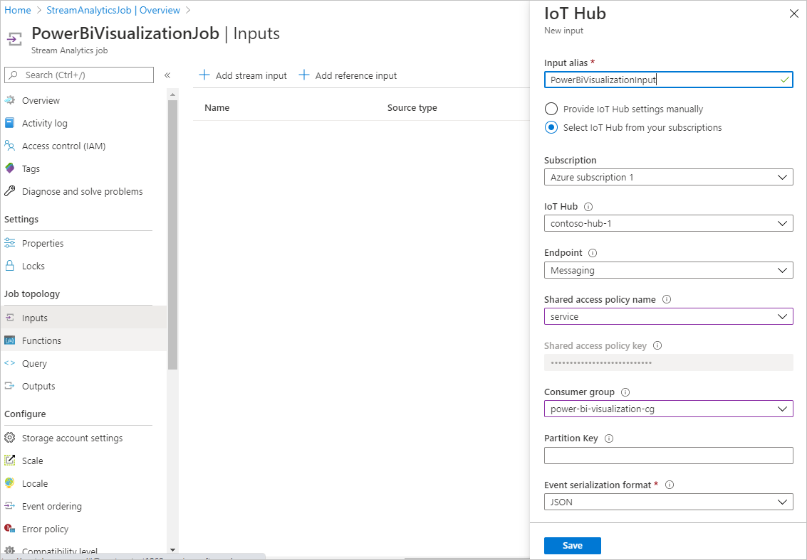
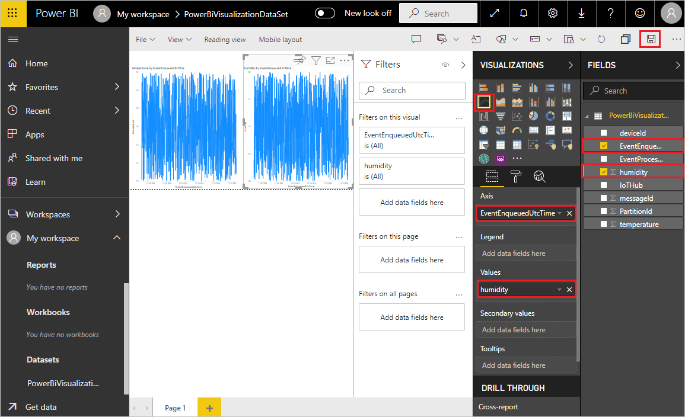
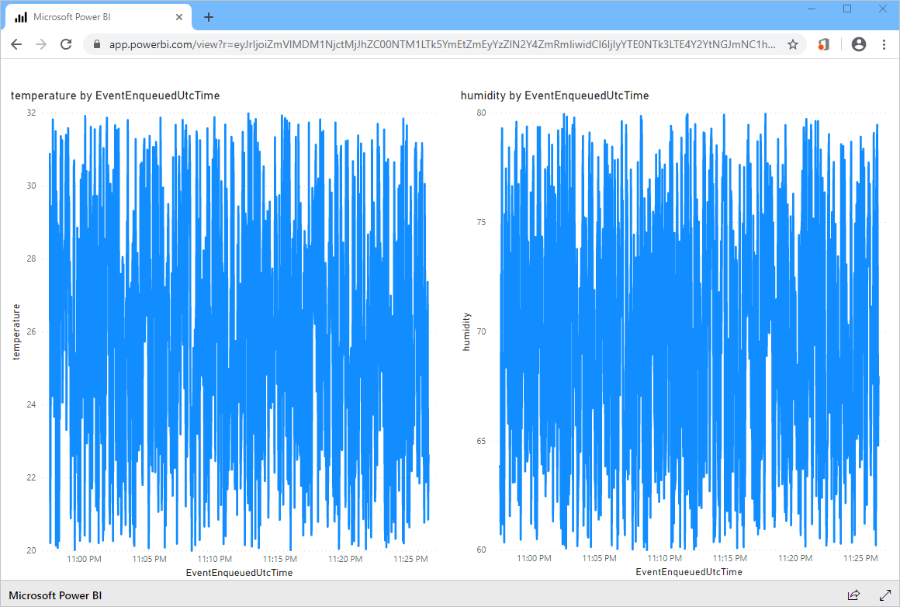

# Visualize real-time sensor data from Azure IoT Hub using Power BI

[!INCLUDE [iot-hub-get-started-note](../../includes/iot-hub-get-started-note.md)]

## What you learn

You learn how to visualize real-time sensor data that your Azure IoT hub receives by using Power BI. If you want to try to visualize the data in your IoT hub with a web app, see [Use a web app to visualize real-time sensor data from Azure IoT Hub](iot-hub-live-data-visualization-in-web-apps.md).

## What you do

* Get your IoT hub ready for data access by adding a consumer group.

* Create, configure, and run a Stream Analytics job for data transfer from your IoT hub to your Power BI account.

* Create and publish a Power BI report to visualize the data.

## What you need

* Complete the [Raspberry Pi online simulator](iot-hub-raspberry-pi-web-simulator-get-started.md) tutorial or one of the device tutorials; for example, [Raspberry Pi with node.js](iot-hub-raspberry-pi-kit-node-get-started.md). These articles cover the following requirements:
  
  * An active Azure subscription.
  * An Azure IoT hub under your subscription.
  * A client application that sends messages to your Azure IoT hub.

* A Power BI account. ([Try Power BI for free](https://powerbi.microsoft.com/))

[!INCLUDE [iot-hub-get-started-create-consumer-group](../../includes/iot-hub-get-started-create-consumer-group.md)]

## Create, configure, and run a Stream Analytics job

Let's start by creating a Stream Analytics job. After you create the job, you define the inputs, outputs, and the query used to retrieve the data.

### Create a Stream Analytics job

1. In the [Azure portal](https://portal.azure.com), select **Create a resource** > **Internet of Things** > **Stream Analytics job**.

2. Enter the following information for the job.

   **Job name**: The name of the job. The name must be globally unique.

   **Resource group**: Use the same resource group that your IoT hub uses.

   **Location**: Use the same location as your resource group.

   

3. Select **Create**.

### Add an input to the Stream Analytics job

1. Open the Stream Analytics job.

2. Under **Job topology**, select **Inputs**.

3. In the **Inputs** pane, select **Add stream input**, then select **IoT Hub** from the drop-down list. On the new input pane, enter the following information:

   **Input alias**: Enter a unique alias for the input.

   **Select IoT Hub from your subscription**: Select this radio button.

   **Subscription**: Select the Azure subscription you're using for this tutorial.

   **IoT Hub**: Select the IoT Hub you're using for this tutorial.

   **Endpoint**: Select **Messaging**.

   **Shared access policy name**: Select the name of the shared access policy you want the Stream Analytics job to use for your IoT hub. For this tutorial, you can select *service*. The *service* policy is created by default on new IoT hubs and grants permission to send and receive on cloud-side endpoints exposed by the IoT hub. To learn more, see [Access control and permissions](iot-hub-devguide-security.md#access-control-and-permissions).

   **Shared access policy key**: This field is auto-filled based on your selection for the shared access policy name.

   **Consumer group**: Select the consumer group you created previously.

   Leave all other fields at their defaults.

   

4. Select **Save**.

### Add an output to the Stream Analytics job

1. Under **Job topology**, select **Outputs**.

2. In the **Outputs** pane, select **Add** and **Power BI**.

3. On the **Power BI - New output** pane, select **Authorize** and follow the prompts to sign in to your Power BI account.

4. After you've signed in to Power BI, enter the following information:

   **Output alias**: A unique alias for the output.

   **Group workspace**: Select your target group workspace.

   **Dataset name**: Enter a dataset name.

   **Table name**: Enter a table name.

   **Authentication mode**: Leave at the default.

   

5. Select **Save**.

### Configure the query of the Stream Analytics job

1. Under **Job topology**, select **Query**.

2. Replace `[YourInputAlias]` with the input alias of the job.

3. Replace `[YourOutputAlias]` with the output alias of the job.

   

4. Select **Save query**.

### Run the Stream Analytics job

In the Stream Analytics job, select **Overview**, then select **Start** > **Now** > **Start**. Once the job successfully starts, the job status changes from **Stopped** to **Running**.

## Create and publish a Power BI report to visualize the data

The following steps show you how to create and publish a report using the Power BI service. You can follow these steps, with some modification, if you want to use the "new look" in Power BI. To understand the differences and how to navigate in the "new look", see [The 'new look' of the Power BI service](https://docs.microsoft.com/power-bi/consumer/service-new-look).

1. Ensure the sample application is running on your device. If not, you can refer to the tutorials under [Setup your device](https://docs.microsoft.com/azure/iot-hub/iot-hub-raspberry-pi-kit-node-get-started).

2. Sign in to your [Power BI](https://powerbi.microsoft.com/en-us/) account.

3. Select the workspace you used, **My Workspace**.

4. Select **Datasets**.

   You should see the dataset that you specified when you created the output for the Stream Analytics job.

5. For the dataset you created, select **Add Report** (the first icon to the right of the dataset name).

   

6. Create a line chart to show real-time temperature over time.

   1. On the **Visualizations** pane of the report creation page, select the line chart icon to add a line chart.

   2. On the **Fields** pane, expand the table that you specified when you created the output for the Stream Analytics job.

   3. Drag **EventEnqueuedUtcTime** to **Axis** on the **Visualizations** pane.

   4. Drag **temperature** to **Values**.

      A line chart is created. The x-axis displays date and time in the UTC time zone. The y-axis displays temperature from the sensor.

      

7. Create another line chart to show real-time humidity over time. To do this, click on a blank part of the canvas and follow the same steps above to place **EventEnqueuedUtcTime** on the x-axis and **humidity** on the y-axis.

   

8. Select **Save** to save the report.

9. Select **Reports** on the left pane, and then select the report that you just created.

10. Select **File** > **Publish to web**.

    

    > [!NOTE]
    > If you get a notification to contact your administrator to enable embed code creation, you may need to contact them. Embed code creation must be enabled before you can complete this step.
    >
    > 

11. Select **Create embed code**, and then select **Publish**.

You're provided the report link that you can share with anyone for report access and a code snippet that you can use to integrate the report into your blog or website.

Microsoft also offers the [Power BI mobile apps](https://powerbi.microsoft.com/en-us/documentation/powerbi-power-bi-apps-for-mobile-devices/) for viewing and interacting with your Power BI dashboards and reports on your mobile device.

## Next steps

You’ve successfully used Power BI to visualize real-time sensor data from your Azure IoT hub.

For another way to visualize data from Azure IoT Hub, see [Use a web app to visualize real-time sensor data from Azure IoT Hub](iot-hub-live-data-visualization-in-web-apps.md).

[!INCLUDE [iot-hub-get-started-next-steps](../../includes/iot-hub-get-started-next-steps.md)]
