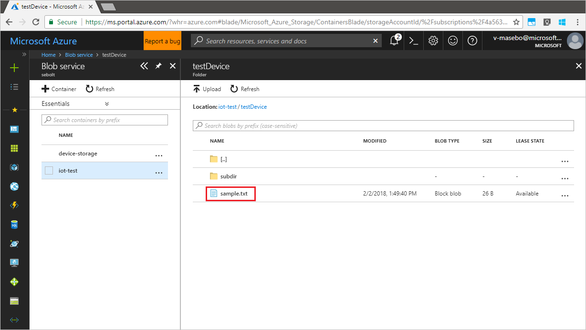

# Upload files from your device to the cloud with IoT Hub (Python)

[!INCLUDE [iot-hub-file-upload-language-selector](../../includes/iot-hub-file-upload-language-selector.md)]

This article shows how to use the [file upload capabilities of IoT Hub](iot-hub-devguide-file-upload.md) to upload a file to [Azure blob storage](../storage/index.yml). The tutorial shows you how to:

* Securely provide a storage container for uploading a file.

* Use the Python client to upload a file through your IoT hub.

The [Send telemetry from a device to an IoT hub](quickstart-send-telemetry-python.md) quickstart demonstrates the basic device-to-cloud messaging functionality of IoT Hub. However, in some scenarios you cannot easily map the data your devices send into the relatively small device-to-cloud messages that IoT Hub accepts. When you need to upland files from a device, you can still use the security and reliability of IoT Hub.

> [!NOTE]
> IoT Hub Python SDK currently only supports uploading character-based files such as **.txt** files.

At the end of this tutorial you run the Python console app:

* **FileUpload.py**, which uploads a file to storage using the Python Device SDK.

[!INCLUDE [iot-hub-include-python-sdk-note](../../includes/iot-hub-include-python-sdk-note.md)]

The following are the installation instructions for the prerequisites.

[!INCLUDE [iot-hub-include-python-installation-notes](../../includes/iot-hub-include-python-installation-notes.md)]

[!INCLUDE [iot-hub-associate-storage](../../includes/iot-hub-associate-storage.md)]

## Upload a file from a device app

In this section, you create the device app to upload a file to IoT hub.

1. At your command prompt, run the following command to install the **azure-iothub-device-client** package:

    ```cmd/sh
    pip install azure-iothub-device-client
    ```

2. Using a text editor, create a test file that you will upload to blob storage.

    > [!NOTE]
    > IoT Hub Python SDK currently only supports uploading character-based files such as **.txt** files.

3. Using a text editor, create a **FileUpload.py** file in your working folder.

4. Add the following `import` statements and variables at the start of the **FileUpload.py** file. 

    ```python
    import time
    import sys
    import iothub_client
    import os
    from iothub_client import IoTHubClient, IoTHubClientError, IoTHubTransportProvider, IoTHubClientResult, IoTHubError

    CONNECTION_STRING = "[Device Connection String]"
    PROTOCOL = IoTHubTransportProvider.HTTP

    PATHTOFILE = "[Full path to file]"
    FILENAME = "[File name for storage]"
    ```

5. In your file, replace `[Device Connection String]` with the connection string of your IoT hub device. Replace `[Full path to file]` with the path to the test file that you created, or any file on your device that you want to upload. Replace `[File name for storage]` with the name that you want to give to your file after it's uploaded to blob storage. 

6. Create a callback for the **upload_blob** function:

    ```python
    def blob_upload_conf_callback(result, user_context):
        if str(result) == 'OK':
            print ( "...file uploaded successfully." )
        else:
            print ( "...file upload callback returned: " + str(result) )
    ```

7. Add the following code to connect the client and upload the file. Also include the `main` routine:

    ```python
    def iothub_file_upload_sample_run():
        try:
            print ( "IoT Hub file upload sample, press Ctrl-C to exit" )

            client = IoTHubClient(CONNECTION_STRING, PROTOCOL)

            f = open(PATHTOFILE, "r")
            content = f.read()

            client.upload_blob_async(FILENAME, content, len(content), blob_upload_conf_callback, 0)

            print ( "" )
            print ( "File upload initiated..." )

            while True:
                time.sleep(30)

        except IoTHubError as iothub_error:
            print ( "Unexpected error %s from IoTHub" % iothub_error )
            return
        except KeyboardInterrupt:
            print ( "IoTHubClient sample stopped" )
        except:
            print ( "generic error" )

    if __name__ == '__main__':
        print ( "Simulating a file upload using the Azure IoT Hub Device SDK for Python" )
        print ( "    Protocol %s" % PROTOCOL )
        print ( "    Connection string=%s" % CONNECTION_STRING )

        iothub_file_upload_sample_run()
    ```

8. Save and close the **UploadFile.py** file.

## Run the application

Now you are ready to run the application.

1. At a command prompt in your working folder, run the following command:

    ```cmd/sh
    python FileUpload.py
    ```

2. The following screenshot shows the output from the **FileUpload** app:

    

3. You can use the portal to view the uploaded file in the storage container you configured:

    

## Next steps

In this tutorial, you learned how to use the file upload capabilities of IoT Hub to simplify file uploads from devices. You can continue to explore IoT hub features and scenarios with the following articles:

* [Create an IoT hub programmatically](iot-hub-rm-template-powershell.md)

* [Introduction to C SDK](iot-hub-device-sdk-c-intro.md)

* [Azure IoT SDKs](iot-hub-devguide-sdks.md)
