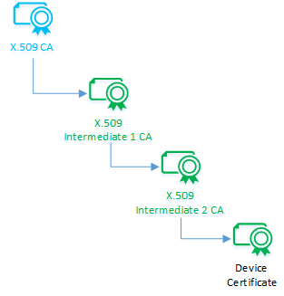

# Device Authentication using X.509 CA Certificates

This article describes how to use X.509 Certificate Authority (CA) certificates to authenticate devices connecting IoT Hub.  In this article you will learn:

* How to get an X.509 CA certificate
* How to register the X.509 CA certificate to IoT Hub
* How to sign devices using X.509 CA certificates
* How devices signed with X.509 CA are authenticated

[!INCLUDE [iot-hub-include-x509-ca-signed-support-note](../../includes/iot-hub-include-x509-ca-signed-support-note.md)]

## Overview

The X.509 CA feature enables device authentication to IoT Hub using a Certificate Authority (CA). It greatly simplifies initial device enrollment process, and supply chain logistics during device manufacturing. [Learn more in this scenario article about the value of using X.509 CA certificates](iot-hub-x509ca-concept.md) for device authentication.  We encourage you to read this scenario article before proceeding as it explains why the steps that follow exist.

## Prerequisite

Using the X.509 CA feature requires that you have an IoT Hub account.  [Learn how to create an IoT Hub instance](quickstart-send-telemetry-dotnet.md) if you don't already have one.

## How to get an X.509 CA certificate

The X.509 CA certificate is at the top of the chain of certificates for each of your devices.  You may purchase or create one depending on how you intend to use it.

For production environment, we recommend that you purchase an X.509 CA certificate from a public root certificate authority. Purchasing a CA certificate has the benefit of the root CA acting as a trusted third party to vouch for the legitimacy of your devices. Consider this option if you intend your devices to be part of an open IoT network where they are expected to interact with third-party products or services.

You may also create a self-signed X.509 CA for experimentation or for use in closed IoT networks.

Regardless of how you obtain your X.509 CA certificate, make sure to keep its corresponding private key secret and protected at all times.  This is necessary for trust building trust in the X.509 CA authentication.

Learn how to [create a self-signed CA certificate](https://github.com/Azure/azure-iot-sdk-c/blob/master/tools/CACertificates/CACertificateOverview.md), which you can use for experimentation throughout this feature description.

## Sign devices into the certificate chain of trust

The owner of an X.509 CA certificate can cryptographically sign an intermediate CA who can in turn sign another intermediate CA, and so on, until the last intermediate CA terminates this process by signing a device. The result is a cascaded chain of certificates known as a certificate chain of trust. In real life this plays out as delegation of trust towards signing devices. This delegation is important because it establishes a cryptographically variable chain of custody and avoids sharing of signing keys.

The device certificate (also called a leaf certificate) must have the *Subject Name* set to the **Device ID** (`CN=deviceId`) that was used when registering the IoT device in the Azure IoT Hub. This setting is required for authentication.

Learn here how to [create a certificate chain](https://github.com/Azure/azure-iot-sdk-c/blob/master/tools/CACertificates/CACertificateOverview.md) as done when signing devices.

## How to register the X.509 CA certificate to IoT Hub

Register your X.509 CA certificate to IoT Hub where it will be used to authenticate your devices during registration and connection.  Registering the X.509 CA certificate is a two-step process that comprises certificate file upload and proof of possession.

The upload process entails uploading a file that contains your certificate.  This file should never contain any private keys.

The proof of possession step involves a cryptographic challenge and response process between you and IoT Hub.  Given that digital certificate contents are public and therefore susceptible to eavesdropping, IoT Hub would like to ascertain that you really own the CA certificate.  It shall do so by generating a random challenge that you must sign with the CA certificate's corresponding private key.  If you kept the private key secret and protected as earlier advised, then only you will possess the knowledge to complete this step. Secrecy of private keys is the source of trust in this method.  After signing the challenge, complete this step by uploading a file containing the results.

Learn here how to [register your CA certificate](iot-hub-security-x509-get-started.md#register-x509-ca-certificates-to-your-iot-hub)

## How to create a device on IoT Hub

To preclude device impersonation, IoT Hub requires you to let it know what devices to expect.  You do this by creating a device entry in the IoT Hub's device registry.  This process is automated when using IoT Hub [Device Provisioning Service](https://azure.microsoft.com/blog/azure-iot-hub-device-provisioning-service-preview-automates-device-connection-configuration/). 

Learn here how to [manually create a device in IoT Hub](iot-hub-security-x509-get-started.md#create-an-x509-device-for-your-iot-hub).

Create an X.509 device for your IoT hub

## Authenticating devices signed with X.509 CA certificates

With X.509 CA certificate registered and devices signed into a certificate chain of trust, what remains is device authentication when the device connects, even for the first time.  When an X.509 CA signed device connects, it uploads its certificate chain for validation. The chain includes all intermediate CA and device certificates.  With this information, IoT Hub authenticates the device in a two-step process.  IoT Hub cryptographically validates the certificate chain for internal consistency, and then issues a proof-of-possession challenge to the device.  IoT Hub declares the device authentic on a successful proof-of-possession response from the device.  This declaration assumes that the device's private key is protected and that only the device can successfully respond to this challenge.  We recommend use of secure chips like Hardware Secure Modules (HSM) in devices to protect private keys.

A successful device connection to IoT Hub completes the authentication process and is also indicative of a proper setup.

Learn here how to [complete this device connection step](iot-hub-security-x509-get-started.md#authenticate-your-x509-device-with-the-x509-certificates).

## Next Steps

Learn about [the value of X.509 CA authentication](iot-hub-x509ca-concept.md) in IoT.

Get started with IoT Hub [Device Provisioning Service](../iot-dps/index.yml).