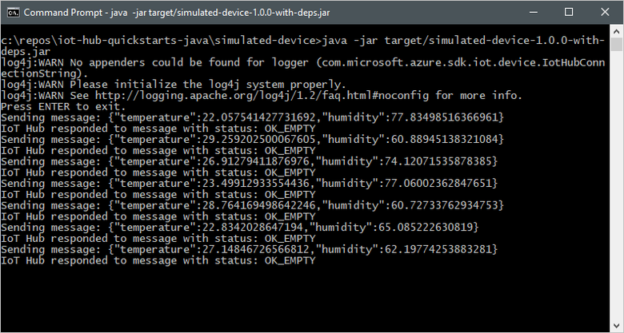
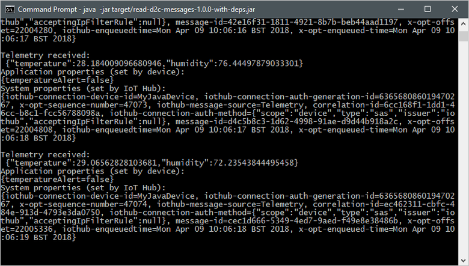

# Quickstart: Send telemetry to an Azure IoT hub and read it with a Java application

[!INCLUDE [iot-hub-quickstarts-1-selector](../../includes/iot-hub-quickstarts-1-selector.md)]

In this quickstart, you send telemetry to Azure IoT Hub and read it with a Java application. IoT Hub is an Azure service that enables you to ingest high volumes of telemetry from your IoT devices into the cloud for storage or processing. This quickstart uses two pre-written Java applications: one to send the telemetry and one to read the telemetry from the hub. Before you run these two applications, you create an IoT hub and register a device with the hub.

## Prerequisites

* An Azure account with an active subscription. [Create one for free](https://azure.microsoft.com/free/?ref=microsoft.com&utm_source=microsoft.com&utm_medium=docs&utm_campaign=visualstudio).

* Java SE Development Kit 8. In [Java long-term support for Azure and Azure Stack](https://docs.microsoft.com/java/azure/jdk/?view=azure-java-stable), under **Long-term support**, select **Java 8**.

* [Apache Maven 3](https://maven.apache.org/download.cgi).

* [A sample Java project](https://github.com/Azure-Samples/azure-iot-samples-java/archive/master.zip).

* Port 8883 open in your firewall. The device sample in this quickstart uses MQTT protocol, which communicates over port 8883. This port may be blocked in some corporate and educational network environments. For more information and ways to work around this issue, see [Connecting to IoT Hub (MQTT)](iot-hub-mqtt-support.md#connecting-to-iot-hub).

You can verify the current version of Java on your development machine using the following command:

```cmd/sh
java -version
```

You can verify the current version of Maven on your development machine using the following command:

```cmd/sh
mvn --version
```

[!INCLUDE [cloud-shell-try-it.md](../../includes/cloud-shell-try-it.md)]

### Add Azure IoT Extension

Run the following command to add the Microsoft Azure IoT Extension for Azure CLI to your Cloud Shell instance. The IoT Extension adds IoT Hub, IoT Edge, and IoT Device Provisioning Service (DPS) specific commands to Azure CLI.

```azurecli-interactive
az extension add --name azure-iot
```

[!INCLUDE [iot-hub-cli-version-info](../../includes/iot-hub-cli-version-info.md)]

## Create an IoT hub

[!INCLUDE [iot-hub-include-create-hub](../../includes/iot-hub-include-create-hub.md)]

## Register a device

A device must be registered with your IoT hub before it can connect. In this quickstart, you use the Azure Cloud Shell to register a simulated device.

1. Run the following command in Azure Cloud Shell to create the device identity.

   **YourIoTHubName**: Replace this placeholder below with the name you chose for your IoT hub.

   **MyJavaDevice**: This is the name of the device you're registering. It's recommended to use **MyJavaDevice** as shown. If you choose a different name for your device, you'll also need to use that name throughout this article, and update the device name in the sample applications before you run them.

    ```azurecli-interactive
    az iot hub device-identity create --hub-name {YourIoTHubName} --device-id MyJavaDevice
    ```

2. Run the following command in Azure Cloud Shell to get the _device connection string_ for the device you just registered:

    **YourIoTHubName**: Replace this placeholder below with the name you chose for your IoT hub.

    ```azurecli-interactive
    az iot hub device-identity show-connection-string --hub-name {YourIoTHubName} --device-id MyJavaDevice --output table
    ```

    Make a note of the device connection string, which looks like:

   `HostName={YourIoTHubName}.azure-devices.net;DeviceId=MyJavaDevice;SharedAccessKey={YourSharedAccessKey}`

    You'll use this value later in the quickstart.

3. You also need the _Event Hubs-compatible endpoint_, _Event Hubs-compatible path_, and _service primary key_ from your IoT hub to enable the back-end application to connect to your IoT hub and retrieve the messages. The following commands retrieve these values for your IoT hub:

     **YourIoTHubName**: Replace this placeholder below with the name you chose for your IoT hub.

    ```azurecli-interactive
    az iot hub show --query properties.eventHubEndpoints.events.endpoint --name {YourIoTHubName}

    az iot hub show --query properties.eventHubEndpoints.events.path --name {YourIoTHubName}

    az iot hub policy show --name service --query primaryKey --hub-name {YourIoTHubName}
    ```

    Make a note of these three values, which you'll use later in the quickstart.

## Send simulated telemetry

The simulated device application connects to a device-specific endpoint on your IoT hub and sends simulated temperature and humidity telemetry.

1. In a local terminal window, navigate to the root folder of the sample Java project. Then navigate to the **iot-hub\Quickstarts\simulated-device** folder.

2. Open the **src/main/java/com/microsoft/docs/iothub/samples/SimulatedDevice.java** file in a text editor of your choice.

    Replace the value of the `connString` variable with the device connection string you made a note of earlier. Then save your changes to **SimulatedDevice.java**.

3. In the local terminal window, run the following commands to install the required libraries and build the simulated device application:

    ```cmd/sh
    mvn clean package
    ```

4. In the local terminal window, run the following commands to run the simulated device application:

    ```cmd/sh
    java -jar target/simulated-device-1.0.0-with-deps.jar
    ```

    The following screenshot shows the output as the simulated device application sends telemetry to your IoT hub:

    

## Read the telemetry from your hub

The back-end application connects to the service-side **Events** endpoint on your IoT Hub. The application receives the device-to-cloud messages sent from your simulated device. An IoT Hub back-end application typically runs in the cloud to receive and process device-to-cloud messages.

1. In another local terminal window, navigate to the root folder of the sample Java project. Then navigate to the **iot-hub\Quickstarts\read-d2c-messages** folder.

2. Open the **src/main/java/com/microsoft/docs/iothub/samples/ReadDeviceToCloudMessages.java** file in a text editor of your choice. Update the following variables and save your changes to the file.

    | Variable | Value |
    | -------- | ----------- |
    | `eventHubsCompatibleEndpoint` | Replace the value of the variable with the Event Hubs-compatible endpoint you made a note of earlier. |
    | `eventHubsCompatiblePath`     | Replace the value of the variable with the Event Hubs-compatible path you made a note of earlier. |
    | `iotHubSasKey`                | Replace the value of the variable with the service primary key you made a note of earlier. |

3. In the local terminal window, run the following commands to install the required libraries and build the back-end application:

    ```cmd/sh
    mvn clean package
    ```

4. In the local terminal window, run the following commands to run the back-end application:

    ```cmd/sh
    java -jar target/read-d2c-messages-1.0.0-with-deps.jar
    ```

    The following screenshot shows the output as the back-end application receives telemetry sent by the simulated device to the hub:

    

## Clean up resources

[!INCLUDE [iot-hub-quickstarts-clean-up-resources](../../includes/iot-hub-quickstarts-clean-up-resources.md)]

## Next steps

In this quickstart, you set up an IoT hub, registered a device, sent simulated telemetry to the hub using a Java application, and read the telemetry from the hub using a simple back-end application.

To learn how to control your simulated device from a back-end application, continue to the next quickstart.

> [!div class="nextstepaction"]
> [Quickstart: Control a device connected to an IoT hub](quickstart-control-device-java.md)
