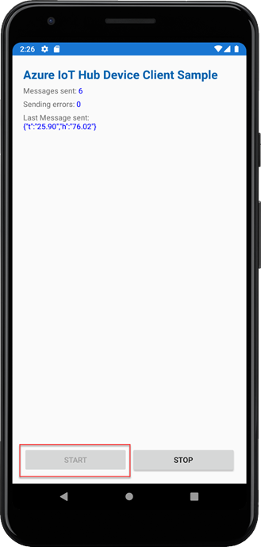

# Quickstart: Send telemetry from a device to an IoT hub (Xamarin.Forms)

[!INCLUDE [iot-hub-quickstarts-1-selector](../../includes/iot-hub-quickstarts-1-selector.md)]

IoT Hub is an Azure service that enables you to ingest high volumes of telemetry from your IoT devices into the cloud for storage or processing. In this article, you send telemetry from a simulated device application to IoT Hub. Then you can view the data from a back-end application.

This article uses a pre-written Xamarin.Forms application to send the telemetry and a CLI utility to read the telemetry from IoT Hub.

[!INCLUDE [cloud-shell-try-it.md](../../includes/cloud-shell-try-it.md)]

If you don't have an Azure subscription, create a [free account](https://azure.microsoft.com/free/?WT.mc_id=A261C142F) before you begin.


## Prerequisites

- Download the code sample from [Azure samples](https://github.com/Azure-Samples/azure-iot-samples-xamarin/archive/master.zip)

- The latest version of [Visual Studio 2019](https://visualstudio.microsoft.com/) or [Visual Studio for Mac](https://visualstudio.microsoft.com/) with Xamarin.Forms tooling installed. This quickstart was tested with Visual Studio 16.6.0.

- Make sure that port 8883 is open in your firewall. The device sample in this quickstart uses MQTT protocol, which communicates over port 8883. This port may be blocked in some corporate and educational network environments. For more information and ways to work around this issue, see [Connecting to IoT Hub (MQTT)](iot-hub-mqtt-support.md#connecting-to-iot-hub).

- Run the following command to add the Microsoft Azure IoT Extension for Azure CLI to your Cloud Shell instance. The IoT Extension adds IoT Hub, IoT Edge, and IoT Device Provisioning Service (DPS) specific commands to Azure CLI.

   ```azurecli-interactive
   az extension add --name azure-iot
   ```

   [!INCLUDE [iot-hub-cli-version-info](../../includes/iot-hub-cli-version-info.md)]

## Create an IoT hub

[!INCLUDE [iot-hub-include-create-hub](../../includes/iot-hub-include-create-hub.md)]

## Register a device

A device must be registered with your IoT hub before it can connect. In this quickstart, you use the Azure Cloud Shell to register a simulated device.

1. Run the following command in Azure Cloud Shell to create the device identity.

   **YourIoTHubName**: Replace this placeholder below with the name you chose for your IoT hub.

   **myXamarinDevice**: This is the name of the device you're registering. It's recommended to use **myXamarinDevice** as shown. If you choose a different name for your device, you'll also need to use that name throughout this article, and update the device name in the sample applications before you run them.

   ```azurecli-interactive
   az iot hub device-identity create --hub-name {YourIoTHubName} --device-id myXamarinDevice
   ```

1. Run the following command in Azure Cloud Shell to get the _device connection string_ for the device you just registered:

   **YourIoTHubName**: Replace this placeholder below with the name you chose for your IoT hub.

   ```azurecli-interactive
   az iot hub device-identity show-connection-string --hub-name {YourIoTHubName} --device-id myXamarinDevice --output table
   ```

   Make a note of the device connection string, which looks like:

   `HostName={YourIoTHubName}.azure-devices.net;DeviceId=myXamarinDevice;SharedAccessKey={YourSharedAccessKey}`

    You'll use this value later in the quickstart.

## Send simulated telemetry

The sample application runs on Windows - via an UWP app - an iOS device or simulator and on Android device or simulator, which connects to a device-specific endpoint on your IoT hub and sends simulated temperature and humidity telemetry. 

1. Open the sample workspace in Visual Studio or Visual Studio for Mac.
2. Expand the **SimulatedDevice** project.  
3. Open **IoTHubService.cs** for editing in Visual Studio. 
4. Search for the **_iotHubConnectionString** variable and update the value with the device connection string that you made a note of earlier.
5. Save your changes. 
6. Run the project in the device emulator or a real device with the **Build and run** button or the key shortcut **F5** on Windows or **command + r** on Mac. 

   

7. When the emulator opens, select **Start** in the sample app.

The following screenshot shows some example output as the application sends simulated telemetry to your IoT hub:
   

## Read the telemetry from your hub

The sample app that you ran on the XCode emulator shows data about messages sent from the device. You can also view the data through your IoT hub as it is received. The IoT Hub CLI extension can connect to the service-side **Events** endpoint on your IoT Hub. The extension receives the device-to-cloud messages sent from your simulated device. An IoT Hub back-end application typically runs in the cloud to receive and process device-to-cloud messages.

Run the following commands in Azure Cloud Shell, replacing `YourIoTHubName` with the name of your IoT hub:

```azurecli-interactive
az iot hub monitor-events --device-id myXamarinDevice --hub-name {YourIoTHubName}
```

The following screenshot shows the output as the extension receives telemetry sent by the simulated device to the hub:

The following screenshot shows the type of telemetry that you see in your local terminal window:


## Clean up resources

[!INCLUDE [iot-hub-quickstarts-clean-up-resources](../../includes/iot-hub-quickstarts-clean-up-resources.md)]

## Next steps

In this quickstart, you set up an IoT hub, registered a device, sent simulated telemetry to the hub from a Xamarin.Forms application, and read the telemetry from the hub. 

To learn how to control your simulated device from a back-end application, continue to the next quickstart.

> [!div class="nextstepaction"]
> [Quickstart: Control a device connected to an IoT hub](quickstart-control-device-node.md)
