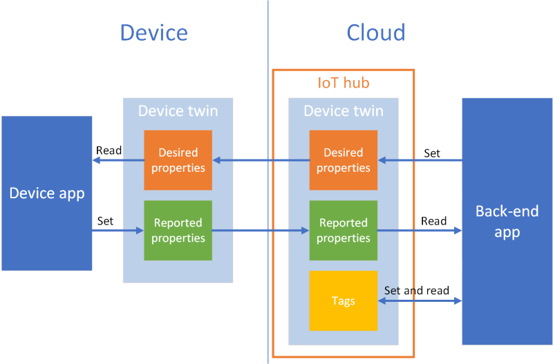
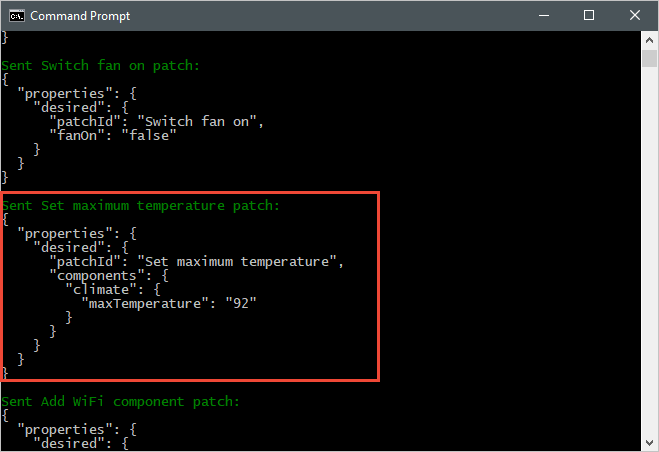
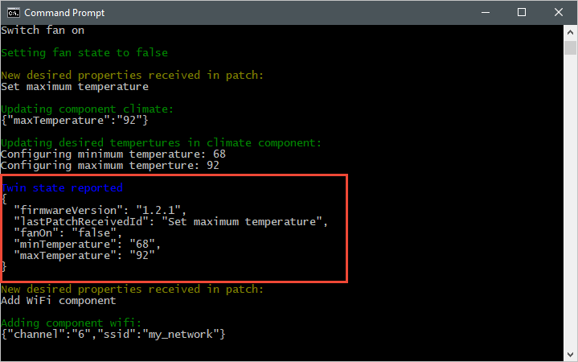
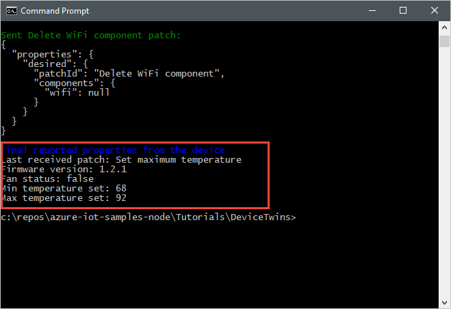

<!-- **TODO** Update publish config with repo paths before publishing! -->

# Tutorial: Configure your devices from a back-end service

As well as receiving telemetry from your devices, you may need to configure your devices from your back-end service. When you send a desired configuration to your devices, you may also want to receive status and compliance updates from those devices. For example, you might set a target operational temperature range for a device or collect firmware version information from your devices.

To synchronize state information between a device and an IoT hub, you use _device twins_. A [device twin](iot-hub-devguide-device-twins.md) is a JSON document, associated with a specific device, and stored by IoT Hub in the cloud where you can [query](iot-hub-devguide-query-language.md) them. A device twin contains _desired properties_, _reported properties_, and _tags_. A desired property is set by a back-end application and read by a device. A reported property is set by a device and read by a back-end application. A tag is set by a back-end application and is never sent to a device. You use tags to organize your devices. This tutorial shows you how to use desired and reported properties to synchronize state information:



In this tutorial, you perform the following tasks:

> [!div class="checklist"]
> * Create an IoT hub and add a test device to the identity registry.
> * Use desired properties to send state information to your simulated device.
> * Use reported properties to receive state information from your simulated device.

[!INCLUDE [cloud-shell-try-it.md](../../includes/cloud-shell-try-it.md)]

If you don’t have an Azure subscription, create a [free account](https://azure.microsoft.com/free/?WT.mc_id=A261C142F) before you begin.

## Prerequisites

The two sample applications you run in this quickstart are written using Node.js. You need Node.js v10.x.x or later on your development machine.

You can download Node.js for multiple platforms from [nodejs.org](https://nodejs.org).

You can verify the current version of Node.js on your development machine using the following command:

```cmd/sh
node --version
```

Download the sample Node.js project from https://github.com/Azure-Samples/azure-iot-samples-node/archive/master.zip and extract the ZIP archive.

## Set up Azure resources

To complete this tutorial, your Azure subscription must contain an IoT hub with a device added to the device identity registry. The entry in the device identity registry enables the simulated device you run in this tutorial to connect to your hub.

If you don't already have an IoT hub set up in your subscription, you can set one up with the following CLI script. This script uses the name **tutorial-iot-hub** for the IoT hub, you should replace this name with your own unique name when you run it. The script creates the resource group and hub in the **Central US** region, which you can change to a region closer to you. The script retrieves your IoT hub service connection string, which you use in the back-end sample to connect to your IoT hub:

```azurecli-interactive
hubname=tutorial-iot-hub
location=centralus

# Install the IoT extension if it's not already installed:
az extension add --name azure-cli-iot-ext

# Create a resource group:
az group create --name tutorial-iot-hub-rg --location $location

# Create your free-tier IoT Hub. You can only have one free IoT Hub per subscription:
az iot hub create --name $hubname --location $location --resource-group tutorial-iot-hub-rg --sku F1

# Make a note of the service connection string, you need it later:
az iot hub show-connection-string --name $hubname --policy-name service -o table

```

This tutorial uses a simulated device called **MyTwinDevice**. The following script adds this device to your identity registry and retrieves its connection string:

```azurecli-interactive
# Set the name of your IoT hub:
hubname=tutorial-iot-hub

# Create the device in the identity registry:
az iot hub device-identity create --device-id MyTwinDevice --hub-name $hubname --resource-group tutorial-iot-hub-rg

# Retrieve the device connection string, you need this later:
az iot hub device-identity show-connection-string --device-id MyTwinDevice --hub-name $hubname --resource-group tutorial-iot-hub-rg -o table

```

## Send state information

You use desired properties to send state information from a back-end application to a device. In this section, you see how to:

* Receive and process desired properties on a device.
* Send desired properties from a back-end application.

To view the simulated device sample code that receives desired properties, navigate to the **iot-hub/Tutorials/DeviceTwins** folder in the sample Node.js project you downloaded. Then open the SimulatedDevice.js file in a text editor.

The following sections describe the code that runs on the simulated device that responds to desired property changes sent from the back end application:

### Retrieve the device twin object

The following code connects to your IoT hub using a device connection string:

[!code-javascript[Create IoT Hub client](~/iot-samples-node/iot-hub/Tutorials/DeviceTwins/SimulatedDevice.js?name=createhubclient&highlight=2 "Create IoT Hub client")]

The following code gets a twin from the client object:

[!code-javascript[Get twin](~/iot-samples-node/iot-hub/Tutorials/DeviceTwins/SimulatedDevice.js?name=gettwin&highlight=2 "Get twin")]

### Sample desired properties

You can structure your desired properties in any way that's convenient to your application. This example uses one top-level property called **fanOn** and groups the remaining properties into separate **components**. The following JSON snippet shows the structure of the desired properties this tutorial uses:

[!code[Sample desired properties](~/iot-samples-node/iot-hub/Tutorials/DeviceTwins/desired.json "Sample desired properties")]

### Create handlers

You can create handlers for desired property updates that respond to updates at different levels in the JSON hierarchy. For example, this handler sees all desired property changes sent to the device from a back-end application. The **delta** variable contains the desired properties sent from the solution back end:

[!code-javascript[Handle all properties](~/iot-samples-node/iot-hub/Tutorials/DeviceTwins/SimulatedDevice.js?name=allproperties&highlight=2 "Handle all properties")]

The following handler only reacts to changes made to the **fanOn** desired property:

[!code-javascript[Handle fan property](~/iot-samples-node/iot-hub/Tutorials/DeviceTwins/SimulatedDevice.js?name=fanproperty&highlight=2 "Handle fan property")]

### Handlers for multiple properties

In the example desired properties JSON shown previously, the **climate** node under **components** contains two properties, **minTemperature** and **maxTemperature**.

A device's local **twin** object stores a complete set of desired and reported properties. The **delta** sent from the back end might update just a subset of desired properties. In the following code snippet, if the simulated device receives an update to just one of **minTemperature** and **maxTemperature**, it uses the value in the local twin for the other value to configure the device:

[!code-javascript[Handle climate component](~/iot-samples-node/iot-hub/Tutorials/DeviceTwins/SimulatedDevice.js?name=climatecomponent&highlight=2 "Handle climate component")]

The local **twin** object stores a complete set of desired and reported properties. The **delta** sent from the back end might update just a subset of desired properties.

### Handle insert, update, and delete operations

The desired properties sent from the back end don't indicate what operation is being performed on a particular desired property. Your code needs to infer the operation from the current set of desired properties stored locally and the changes sent from the hub.

The following snippet shows how the simulated device handles insert, update, and delete operations on the list of **components** in the desired properties. You can see how to use **null** values to indicate that a component should be deleted:

[!code-javascript[Handle components](~/iot-samples-node/iot-hub/Tutorials/DeviceTwins/SimulatedDevice.js?name=components&highlight=2,6,13 "Handle components")]

### Send desired properties to a device from the back end

You've seen how a device implements handlers for receiving desired property updates. This section shows you how to send desired property changes to a device from a back-end application.

To view the simulated device sample code that receives desired properties, navigate to the **iot-hub/Tutorials/DeviceTwins** folder in the sample Node.js project you downloaded. Then open the ServiceClient.js file in a text editor.

The following code snippet shows how to connect to the device identity registry and access the twin for a specific device:

[!code-javascript[Create registry and get twin](~/iot-samples-node/iot-hub/Tutorials/DeviceTwins/ServiceClient.js?name=getregistrytwin&highlight=2,6 "Create registry and get twin")]

The following snippet shows different desired property *patches* the back end application sends to the device:

[!code-javascript[Patches sent to device](~/iot-samples-node/iot-hub/Tutorials/DeviceTwins/ServiceClient.js?name=patches&highlight=2,12,26,41,56 "Patches sent to device")]

The following snippet shows how the back-end application sends a desired property update to a device:

[!code-javascript[Send desired properties](~/iot-samples-node/iot-hub/Tutorials/DeviceTwins/ServiceClient.js?name=senddesiredproperties&highlight=2 "Send desired properties")]

### Run the applications

In this section, you run two sample applications to observe as a back-end application sends desired property updates to a simulated device application.

To run the simulated device and back-end applications, you need the device and service connection strings. You made a note of the connection strings when you created the resources at the start of this tutorial.

To run the simulated device application, open a shell or command prompt window and navigate to the **iot-hub/Tutorials/DeviceTwins** folder in the Node.js project you downloaded. Then run the following commands:

```cmd/sh
npm install
node SimulatedDevice.js "{your device connection string}"
```

To run the back-end application, open another shell or command prompt window. Then navigate to the **iot-hub/Tutorials/DeviceTwins** folder in the Node.js project you downloaded. Then run the following commands:

```cmd/sh
npm install
node ServiceClient.js "{your service connection string}"
```

The following screenshot shows the output from the simulated device application and highlights how it handles an update to the **maxTemperature** desired property. You can see how both the top-level handler and the climate component handlers run:


The following screenshot shows the output from the back-end application and highlights how it sends an update to the **maxTemperature** desired property:



## Receive state information

Your back-end application receives state information from a device as reported properties. A device sets the reported properties, and sends them to your hub. A back-end application can read the current values of the reported properties from the device twin stored in your hub.

### Send reported properties from a device

You can send updates to reported property values as a patch. The following snippet shows a template for the patch the simulated device sends. The simulated device updates the fields in the patch before sending it to the hub:

[!code-javascript[Reported properties patches](~/iot-samples-node/iot-hub/Tutorials/DeviceTwins/SimulatedDevice.js?name=reportedpatch&highlight=2 "Reported properties patches")]

The simulated device uses the following function to send the patch that contains the reported properties to the hub:

[!code-javascript[Send reported properties](~/iot-samples-node/iot-hub/Tutorials/DeviceTwins/SimulatedDevice.js?name=sendreportedproperties&highlight=2 "Send reported properties")]

### Process reported properties

A back-end application accesses the current reported property values for a device through the device twin. The following snippet shows you how the back-end application reads the reported property values for the simulated device:

[!code-javascript[Display reported properties](~/iot-samples-node/iot-hub/Tutorials/DeviceTwins/ServiceClient.js?name=displayreportedproperties&highlight=2 "Display reported properties")]

### Run the applications

In this section, you run two sample applications to observe as a simulated device application sends reported property updates to a back-end application.

You run the same two sample applications that you ran to see how desired properties are sent to a device.

To run the simulated device and back-end applications, you need the device and service connection strings. You made a note of the connection strings when you created the resources at the start of this tutorial.

To run the simulated device application, open a shell or command prompt window and navigate to the **iot-hub/Tutorials/DeviceTwins** folder in the Node.js project you downloaded. Then run the following commands:

```cmd/sh
npm install
node SimulatedDevice.js "{your device connection string}"
```

To run the back-end application, open another shell or command prompt window. Then navigate to the **iot-hub/Tutorials/DeviceTwins** folder in the Node.js project you downloaded. Then run the following commands:

```cmd/sh
npm install
node ServiceClient.js "{your service connection string}"
```

The following screenshot shows the output from the simulated device application and highlights how it sends a reported property update to your hub:



The following screenshot shows the output from the back-end application and highlights how it receives and processes a reported property update from a device:



## Clean up resources

If you plan to complete the next tutorial, leave the resource group and IoT hub and reuse them later.

If you don't need the IoT hub any longer, delete it and the resource group in the portal. To do so, select the **tutorial-iot-hub-rg** resource group that contains your IoT hub and click **Delete**.

Alternatively, use the CLI:

```azurecli-interactive
# Delete your resource group and its contents
az group delete --name tutorial-iot-hub-rg
```

## Next steps

In this tutorial, you learned how to synchronize state information between your devices and your IoT hub. Advance to the next tutorial to learn how to use device twins to implement a firmware update process.

> [!div class="nextstepaction"]
> [Implement a device firmware update process](tutorial-firmware-update.md)
