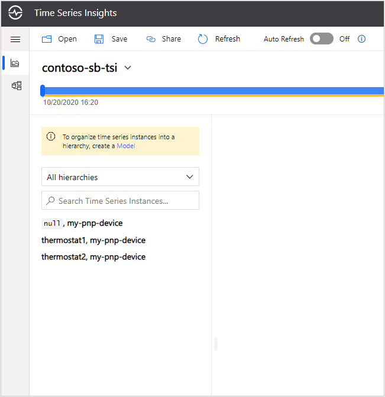
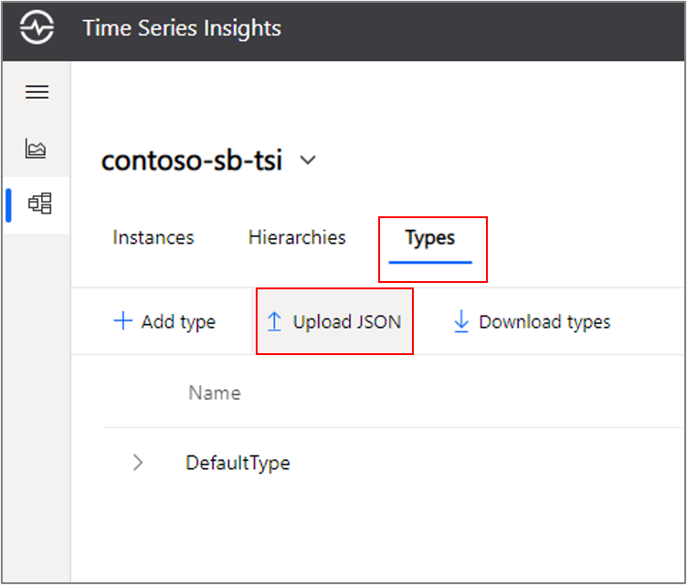
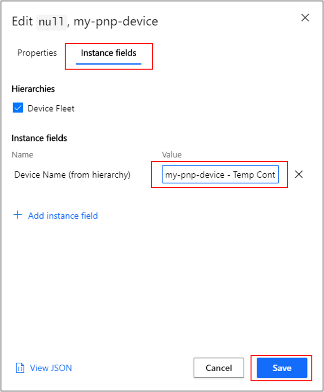

# Preview Tutorial: Create and Connect to Time Series Insights Gen2 to store, visualize, and analyze IoT Plug and Play device telemetry

In this tutorial, you learn how to create and correctly configure an [Azure Time Series Insights Gen2](https://docs.microsoft.com/azure/time-series-insights/overview-what-is-tsi) (TSI) environment to integrate with your IoT Plug and Play solution. Use TSI to collect, process, store, query, and visualize time series data at Internet of Things (IoT) scale.

First, you provision a TSI environment and connect your IoT hub as a streaming event source. Then you work through model synchronization to author your [Time Series Model](../time-series-insights/concepts-model-overview.md) based on the [Digital Twins Definition Language (DTDL)](https://github.com/Azure/opendigitaltwins-dtdl) sample model files you used for the temperature controller and thermostat devices.

> [!NOTE]
> This integration is in preview. How DTDL device models map to Time Series Model may change.

## Prerequisites

[!INCLUDE [iot-pnp-prerequisites](../../includes/iot-pnp-prerequisites.md)]

At this point, you have:

* An Azure IoT hub.
* A DPS instance linked to your IoT hub, with an individual device enrollment for your IoT Plug and Play device.
* A connection to your IoT hub from either a single or multi-component device, streaming simulated data.

To avoid the requirement to install the Azure CLI locally, you can use the Azure Cloud Shell to set up the cloud services.

[!INCLUDE [cloud-shell-try-it.md](../../includes/cloud-shell-try-it.md)]

## Prepare your event source

The IoT hub you created previously will be your TSI environment's [event source](https://docs.microsoft.com/azure/time-series-insights/concepts-streaming-ingestion-event-sources).

> [!IMPORTANT]
> Disable any existing IoT Hub routes. There is a known issue when you use an IoT hub as a TSI event source with [routing](../iot-hub/iot-hub-devguide-messages-d2c.md#routing-endpoints) configured. Temporarily disable any routing endpoints, and when your IoT hub is connected to TSI you can re-enable them.

Create a unique consumer group on your IoT hub for TSI to consume. Replace `my-pnp-hub` with the name of the IoT hub you used previously:

```azurecli-interactive
az iot hub consumer-group create --hub-name my-pnp-hub --name tsi-consumer-group
```

## Choose your Time Series ID

When you provision your TSI environment, you need to select a *Time Series ID*. It's important to select the appropriate Time Series ID, because this property is immutable and can't be changed after it's set. A Time Series ID is like a database partition key. The Time Series ID acts as the primary key for your Time Series Model. To learn more, see [Best practices for choosing a Time Series ID](../time-series-insights/how-to-select-tsid.md).

As an IoT Plug and Play user, specify a _composite key_ that consists of `iothub-connection-device-id` and `dt-subject` as your Time Series ID. IoT Hub adds these system properties that contain your IoT Plug and Play device ID, and your device component names, respectively.

Even if your IoT Plug and Play device models don't currently use components, you should include `dt-subject` as part of a composite key so that you can use them in the future. Because your Time Series ID is immutable, Microsoft recommends enabling this option in case you need it in the future.

> [!NOTE]
> The examples below are for the multi-component **TemperatureController** device, but the concepts are the same for the no-component **Thermostat** device.

## Provision your TSI environment

This section describes how to provision your Azure Time Series Insights Gen2 environment.

The following command:

* Creates an Azure storage account for your environment's [cold store](https://docs.microsoft.com/azure/time-series-insights/concepts-storage#cold-store), designed for long-term retention and analytics over historical data.
  * Replace `mytsicoldstore` with a unique name for your cold storage account.
* Creates an Azure Time Series Insights Gen2 environment, including warm storage with a retention period of seven days, and cold storage for infinite retention.
  * Replace `my-tsi-env` with a unique name for your TSI environment.
  * Replace `my-pnp-resourcegroup` with the name of the resource group you used during set-up.
  * `iothub-connection-device-id, dt-subject` is your Time Series ID property.

```azurecli-interactive
storage=mytsicoldstore
rg=my-pnp-resourcegroup
az storage account create -g $rg -n $storage --https-only
key=$(az storage account keys list -g $rg -n $storage --query [0].value --output tsv)
az timeseriesinsights environment longterm create --name my-tsi-env --resource-group $rg --time-series-id-properties iothub-connection-device-id, dt-subject --sku-name L1 --sku-capacity 1 --data-retention 7 --storage-account-name $storage --storage-management-key $key --location eastus2
```

Connect your IoT Hub event source. Replace `my-pnp-resourcegroup`, `my-pnp-hub`, and `my-tsi-env` with the values you chose. The following command references the consumer group for TSI that you created previously:

```azurecli-interactive
rg=my-pnp-resourcegroup
iothub=my-pnp-hub
env=my-tsi-env
es_resource_id=$(az iot hub create -g $rg -n $iothub --query id --output tsv)
shared_access_key=$(az iot hub policy list -g $rg --hub-name $iothub --query "[?keyName=='service'].primaryKey" --output tsv)
az timeseriesinsights event-source iothub create -g $rg --environment-name $env -n iot-hub-event-source --consumer-group-name tsi-consumer-group  --key-name iothubowner --shared-access-key $shared_access_key --event-source-resource-id $es_resource_id
```

Navigate to your resource group in the [Azure portal](https://portal.azure.com) and select your new Time Series Insights environment. Visit the *Time Series Insights Explorer URL* shown in the instance overview:


In the explorer, you see three instances:

* &lt;your pnp device ID&gt;, thermostat1
* &lt;your pnp device ID&gt;, thermostat2
* &lt;your pnp device ID&gt;, `null`

> [!NOTE]
> The third tag represents telemetry from the **TemperatureController** itself, such as the working set of device memory. Because this is a top level property, the value for the component name is null. In a later step, you update this to a more user-friendly name.



## Configure model translation

Next, you translate your DTDL device model to the asset model in Azure Time Series Insights (TSI). TSI's Time Series Model is a semantic modeling tool for data contextualization within TSI. Time Series Model has three core components:

* [Time Series Model instances](../time-series-insights/concepts-model-overview.md#time-series-model-instances). Instances are virtual representations of the time series themselves. Instances are uniquely identified by your Time Series ID.
* [Time Series Model hierarchies](../time-series-insights/concepts-model-overview.md#time-series-model-hierarchies). Hierarchies organize instances by specifying property names and their relationships.
* [Time Series Model types](../time-series-insights/concepts-model-overview.md#time-series-model-types). Types help you define [variables](../time-series-insights/concepts-variables.md) or formulas for computations. Types are associated with a specific instance.

### Define your types

You can begin ingesting data into Azure Time Series Insights Gen2 without having predefined a model. When telemetry arrives, TSI attempts to autoresolve time series instances based on your Time Series ID property value(s). All instances are assigned the *default type*. You need to manually create a new type to correctly categorize your instances. The following details show the simplest method to synchronize your device DTDL models with your Time Series Model types:

* Your digital twin model identifier becomes your type ID.
* The type name can be either the model name or the display name.
* The model description becomes the type's description.
* At least one type variable is created for each telemetry with a numeric schema.
  * Only numeric data types can be used for variables, but if a value is sent as another type that can be converted, `"0"` for example, you can use a [conversion](/rest/api/time-series-insights/reference-time-series-expression-syntax.md#conversion-functions) function such as `toDouble`.
* The variable name can be either the telemetry name or the display name.
* When you define the variable Time Series Expression, refer to the telemetry's name on the wire, and it's data type.

| DTDL JSON | Time Series Model type JSON | Example value |
|-----------|------------------|-------------|
| `@id` | `id` | `dtmi:com:example:TemperatureController;1` |
| `displayName`    | `name`   |   `Temperature Controller`  |
| `description`  |  `description`  |  `Device with two thermostats and remote reboot.` |  
|`contents` (array)| `variables` (object)  | View the example below


> [!NOTE]
> This example shows three variables, but each type can have up to 100. Different variables can reference the same telemetry value to perform different calculations as needed. For the full list of filters, aggregates, and scalar functions see [Time Series Insights Gen2 Time Series Expression syntax](/rest/api/time-series-insights/reference-time-series-expression-syntax.md).

Open a text editor and save the following JSON to your local drive:

```JSON
{
  "put": [
    {
      "id": "dtmi:com:example:TemperatureController;1",
      "name": "Temperature Controller",
      "description": "Device with two thermostats and remote reboot.",
      "variables": {
        "workingSet": {
          "kind": "numeric",
          "value": {
            "tsx": "coalesce($event.workingSet.Long, toLong($event.workingSet.Double))"
          }, 
          "aggregation": {
            "tsx": "avg($value)"
          }
        },
        "temperature": {
          "kind": "numeric",
          "value": {
            "tsx": "coalesce($event.temperature.Long, toLong($event.temperature.Double))"
          },
          "aggregation": {
            "tsx": "avg($value)"
          }
        },
        "eventCount": {
          "kind": "aggregate",
          "aggregation": {
            "tsx": "count()"
          }
        }
      }
    }
  ]
}
```

In your Time Series Insights Explorer, navigate to the **Model** tab by selecting the model icon on the left. Select **Types** and then select **Upload JSON**:



Select **Choose file**, select the JSON you saved previously, and select **Upload**

You see the newly defined **Temperature Controller** type.

### Create a hierarchy

Create a hierarchy to organize the tags under their **TemperatureController** parent. The following simple example has a single level, but IoT solutions commonly have many levels of nesting to contextualize tags within their physical and semantic position within an organization.

Select **Hierarchies** and select **Add hierarchy**. Enter *Device Fleet* as the name and create one level called *Device Name*. Then select **Save**.


### Assign your instances to the correct type

Next you change the type of your instances and place them in the hierarchy.

Select the **Instances** tab, find the instance that represents the device's working set, and select the **Edit** icon on the far right:


Select the **Type** dropdown and select **Temperature Controller**. Enter *defaultComponent, <your device name>* to update the name of the instance that represents all top-level tags associated with your device.


Before you select save, select the **Instance Fields** tab and check the **Device Fleet** box. Enter `<your device name> - Temp Controller` to group the telemetry together, and then select **Save**.



Repeat the previous steps to assign your thermostat tags the correct type and hierarchy.

## View your data

Navigate back to the charting pane and expand **Device Fleet > your device**. Select **thermostat1**, select the **Temperature** variable, and then select **Add** to chart the value. Do the same for **thermostat2** and the **defaultComponent** **workingSet** value.


## Next steps

* To learn more about the various charting options, including interval sizing and Y-axis controls, see [Azure Time Series Insights Explorer](../time-series-insights/concepts-ux-panels.md).

* For an in-depth overview of your environment's Time Series Model, see [Time Series Model in Azure Time Series Insights Gen2](../time-series-insights/concepts-model-overview.md) article.

* To dive into the query APIs and the Time Series Expression syntax, see [Azure Time Series Insights Gen2 Query APIs](/rest/api/time-series-insights/reference-query-apis.md).
