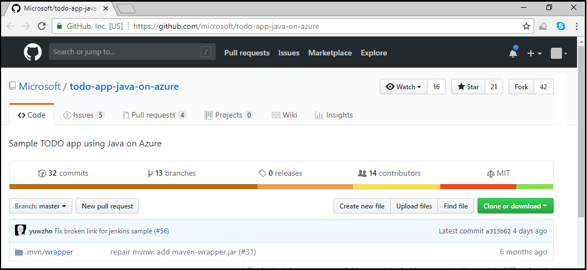
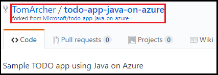
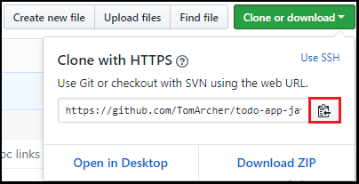
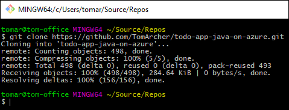
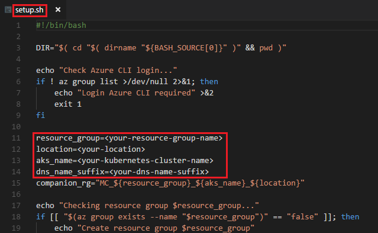

# Deploy to Azure Kubernetes Service (AKS) by using Jenkins and the blue/green deployment pattern

Azure Kubernetes Service (AKS) manages your hosted Kubernetes environment, making it quick and easy to deploy and manage containerized applications. You don't need expertise in container orchestration. AKS also eliminates the burden of ongoing operations and maintenance, by provisioning, upgrading, and scaling resources on demand. You don't need to take your applications offline. For more information about AKS, see the [AKS documentation](/azure/aks/).

Blue/green deployment is an Azure DevOps Continuous Delivery pattern that relies on keeping an existing (blue) version live, while a new (green) one is deployed. Typically, this pattern employs load balancing to direct increasing amounts of traffic to the green deployment. If monitoring discovers an incident, traffic can be rerouted to the blue deployment, which is still running. For more information about Continuous Delivery, see [What is Continuous Delivery](/azure/devops/what-is-continuous-delivery).

In this tutorial, you learn how to perform the following tasks:

> [!div class="checklist"]
> * Learn about the blue/green deployment pattern
> * Create a managed Kubernetes cluster
> * Run a sample script to configure a Kubernetes cluster
> * Manually configure a Kubernetes cluster
> * Create and run a Jenkins job

## Prerequisites
- [GitHub account](https://github.com) : You need a GitHub account to clone the sample repo.
- [Azure CLI 2.0](https://docs.microsoft.com/cli/azure/install-azure-cli?view=azure-cli-latest) : You use the Azure CLI 2.0 to create the Kubernetes cluster.
- [Chocolatey](https://chocolatey.org): A package manager you use to install kubectl.
- [kubectl](https://kubernetes.io/docs/tasks/tools/install-kubectl/): A command-line interface you use for running commands against Kubernetes clusters.
- [jq](https://stedolan.github.io/jq/download/): A lightweight, command-line JSON processor.

## Clone the sample app from GitHub

On the Microsoft repo in GitHub, you can find a sample app that illustrates how to deploy to AKS by using Jenkins and the blue/green pattern. In this section, you create a fork of that repo in your GitHub, and clone the app to your local system.

1. Browse to the GitHub repo for the [todo-app-java-on-azure](https://github.com/microsoft/todo-app-java-on-azure.git) sample app.

    

1. Fork the repo by selecting **Fork** in the upper right of the page, and follow the instructions to fork the repo in your GitHub account.

    

1. After you fork the repo, you see that the account name changes to your account name, and a note indicates from where the repo was forked (Microsoft).

    

1. Select **Clone or download**.

    

1. In the **Clone with HTTPS** window, select the **copy** icon.

    

1. Open a terminal or Git Bash window.

1. Change directories to the desired location where you want to store the local copy (clone) of the repo.

1. Using the `git clone` command, clone the URL you copied previously.

    

1. Press the Enter key to start the clone process.

    

1. Change directories to the newly created directory that contains the clone of the app source.

## Create and configure a managed Kubernetes cluster

In this section, you perform the following steps:

- Use the Azure CLI 2.0 to create a managed Kubernetes cluster.
- Learn how to set up a cluster, either by using the setup script or manually.
- Create an instance of the Azure Container Registry service.

### Use the Azure CLI 2.0 to create a managed Kubernetes cluster
In order to create a managed Kubernetes cluster with the [Azure CLI 2.0](https://docs.microsoft.com/cli/azure/install-azure-cli?view=azure-cli-latest), ensure that you are using the Azure CLI version 2.0.25 or later.

1. Sign in to your Azure account. After you enter the following command, you  receive instructions that explain how to complete the sign-in. 
    
    ```bash
    az login
    ```

1. When you run the `az login` command in the previous step, a list of all your Azure subscriptions appears (along with their subscription IDs). In this step, you set the default Azure subscription. Replace the &lt;your-subscription-id> placeholder with the desired Azure subscription ID. 

    ```bash
    az account set -s <your-subscription-id>
    ```

1. Create a resource group. Replace the &lt;your-resource-group-name> placeholder with the name of your new resource group, and replace the &lt;your-location> placeholder with the location. The command `az account list-locations` displays all Azure locations. During the AKS preview, not all locations are available. If you enter a location that is not valid at this time, the error message lists the available locations.

    ```bash
    az group create -n <your-resource-group-name> -l <your-location>
    ```

1. Create the Kubernetes cluster. Replace the &lt;your-resource-group-name> with the name of the resource group created in the previous step, and replace the &lt;your-kubernetes-cluster-name> with the name of your new cluster. (This process can take several minutes to complete.)

    ```bash
    az aks create -g <your-resource-group-name> -n <your-kubernetes-cluster-name> --generate-ssh-keys --node-count 2
    ```

### Set up the Kubernetes cluster

You can set up a blue/green deployment in AKS manually, or with a setup script provided in the sample cloned earlier. In this section, you see how to do both.

#### Set up the Kubernetes cluster via the sample setup script
1. Edit the **deploy/aks/setup/setup.sh** file, replacing the following placeholders with the appropriate values for your environment: 

   - **&lt;your-resource-group-name>**
   - **&lt;your-kubernetes-cluster-name>**
   - **&lt;your-location>**
   - **&lt;your-dns-name-suffix>**

     

1. Run the setup script.

    ```bash
    sh setup.sh
    ```

#### Set up a Kubernetes cluster manually 
1. Download the Kubernetes configuration to your profile folder.

    ```bash
    az aks get-credentials -g <your-resource-group-name> -n <your-kubernetes-cluster-name> --admin
    ```

1. Change the directory to the **deploy/aks/setup** directory. 

1. Run the following **kubectl** commands to set up the services for the public endpoint, and the two test endpoints.

    ```bash
    kubectl apply -f  service-green.yml
    kubectl apply -f  test-endpoint-blue.yml
    kubectl apply -f  test-endpoint-green.yml
    ```

1. Update the DNS name for the public and test endpoints. When you create a Kubernetes cluster, you also create an [additional resource group](https://github.com/Azure/AKS/issues/3), with the naming pattern of **MC_&lt;your-resource-group-name>_&lt;your-kubernetes-cluster-name>_&lt;your-location>**.

    Locate the public IPs in the resource group.

    

    For each of the services, find the external IP address by running the following command:
    
    ```bash
    kubectl get service todoapp-service
    ```
    
    Update the DNS name for the corresponding IP address with the following command:

    ```bash
    az network public-ip update --dns-name aks-todoapp --ids /subscriptions/<your-subscription-id>/resourceGroups/MC_<resourcegroup>_<aks>_<location>/providers/Microsoft.Network/publicIPAddresses/kubernetes-<ip-address>
    ```

    Repeat the call for `todoapp-test-blue` and `todoapp-test-green`:

    ```bash
    az network public-ip update --dns-name todoapp-blue --ids /subscriptions/<your-subscription-id>/resourceGroups/MC_<resourcegroup>_<aks>_<location>/providers/Microsoft.Network/publicIPAddresses/kubernetes-<ip-address>

    az network public-ip update --dns-name todoapp-green --ids /subscriptions/<your-subscription-id>/resourceGroups/MC_<resourcegroup>_<aks>_<location>/providers/Microsoft.Network/publicIPAddresses/kubernetes-<ip-address>
    ```

    The DNS name needs to be unique in your subscription. To ensure the uniqueness, you can use `<your-dns-name-suffix>`.

### Create an instance of Container Registry

1. Run the `az acr create` command to create an instance of Container Registry. In the next section, you can then use `login server` as the Docker registry URL.

    ```bash
    az acr create -n <your-registry-name> -g <your-resource-group-name>
    ```

1. Run the `az acr credential` command to show your Container Registry credentials. Note the Docker registry username and password, as you need them in the next section.

    ```bash
    az acr credential show -n <your-registry-name>
    ```

## Prepare the Jenkins server

In this section, you see how to prepare the Jenkins server to run a build, which is fine for testing. However, you should use an [Azure VM agent](https://plugins.jenkins.io/azure-vm-agents) or [Azure Container agent](https://plugins.jenkins.io/azure-container-agents) to spin up an agent in Azure to run your builds. For more information, see the Jenkins article on the [security implications of building on master](https://wiki.jenkins.io/display/JENKINS/Security+implication+of+building+on+master).

1. Deploy a [Jenkins Master on Azure](https://aka.ms/jenkins-on-azure).

1. Connect to the server via SSH, and install the build tools on the server where you run your build.
   
   ```bash
   sudo apt-get install git maven 
   ```
   
1. [Install Docker](https://docs.docker.com/install/linux/docker-ce/ubuntu/#install-docker-ce). Ensure that the user `jenkins` has permission to run the `docker` commands.

1. [Install kubectl](https://kubernetes.io/docs/tasks/tools/install-kubectl/).

1. [Download jq](https://stedolan.github.io/jq/download/).

1. Install jq with the following command:

   ```bash
   sudo apt-get install jq
   ```
   
1. Install the plugins in Jenkins by performing the following steps within the Jenkins dashboard:

    1. Select **Manage Jenkins > Manage Plugins > Available**.
    1. Search for and install the Azure Container Service plug-in.

1. Add credentials to manage resources in Azure. If you don’t already have the plug-in, install the **Azure Credential** plug-in.

1. Add your Azure Service Principal credential as the type **Microsoft Azure Service Principal**.

1. Add your Azure Docker registry username and password (as obtained in the section, "Create an instance of Container Registry") as the type **Username with password**.

## Edit the Jenkinsfile

1. In your own repo, go to `/deploy/aks/`, and open `Jenkinsfile`.

2. Update the file as follows:

    ```groovy
    def servicePrincipalId = '<your-service-principal>'
    def resourceGroup = '<your-resource-group-name>'
    def aks = '<your-kubernetes-cluster-name>'

    def cosmosResourceGroup = '<your-cosmodb-resource-group>'
    def cosmosDbName = '<your-cosmodb-name>'
    def dbName = '<your-dbname>'

    def dockerRegistry = '<your-acr-name>.azurecr.io'
    ```
    
    Update the Container Registry credential ID:
    
    ```groovy
    def dockerCredentialId = '<your-acr-credential-id>'
    ```

## Create the job
1. Add a new job in type **Pipeline**.

1. Select **Pipeline** > **Definition** > **Pipeline script from SCM**.

1. Enter the SCM repo URL with your &lt;your-forked-repo>.

1. Enter the script path as `deploy/aks/Jenkinsfile`.

## Run the job

1. Verify that you can run your project successfully in your local environment. Here's how: [Run project on local machine](https://github.com/Microsoft/todo-app-java-on-azure/blob/master/README.md#run-it).

1. Run the Jenkins job. The first time you run the job, Jenkins deploys the todo app to the blue environment, which is the default inactive environment. 

1. To verify that the job ran, go to these URLs:
    - Public end point: `http://aks-todoapp<your-dns-name-suffix>.<your-location>.cloudapp.azure.com`
    - Blue end point - `http://aks-todoapp-blue<your-dns-name-suffix>.<your-location>.cloudapp.azure.com`
    - Green end point - `http://aks-todoapp-green<your-dns-name-suffix>.<your-location>.cloudapp.azure.com`

The public and the blue test end points have the same update, while the green end point shows the default tomcat image. 

If you run the build more than once, it cycles through blue and green deployments. In other words, if the current environment is blue, the job deploys and tests to the green environment. Then, if tests are good, the job updates the application public endpoint to route traffic to the green environment.

## Additional information

For more on zero-downtime deployment, see this [quickstart template](https://github.com/Azure/azure-quickstart-templates/tree/master/301-jenkins-aks-zero-downtime-deployment). 

## Clean up resources

When you no longer need the resources you created in this tutorial, you can delete them.

```bash
az group delete -y --no-wait -n <your-resource-group-name>
```

## Troubleshooting

If you encounter any bugs with the Jenkins plugins, file an issue in the [Jenkins JIRA](https://issues.jenkins-ci.org/) for the specific component.

## Next steps

In this tutorial, you learned how to deploy to AKS by using Jenkins and the blue/green deployment pattern. To learn more about the Azure Jenkins provider, see the Jenkins on Azure site.

> [!div class="nextstepaction"]
> [Jenkins on Azure](/azure/jenkins/)