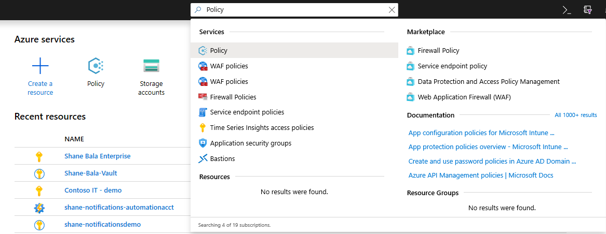
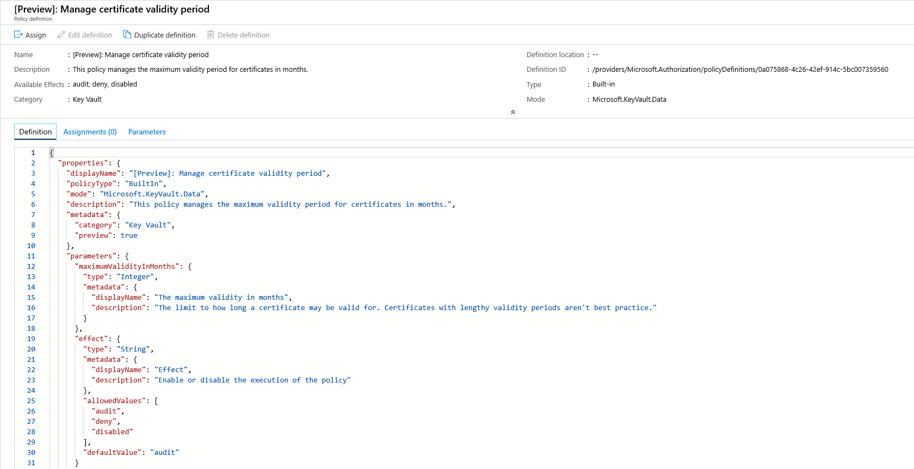
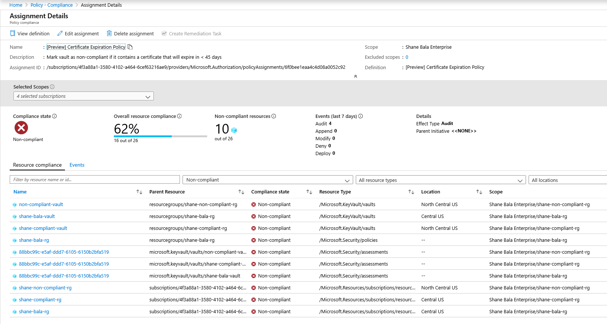

# Integrate Azure Key Vault with Azure Policy

[Azure Policy](../../governance/policy/index.yml) is a governance tool that gives users the ability to audit and manage their Azure environment at scale. Azure Policy provides the ability to place guardrails on Azure resources to ensure they are compliant with assigned policy rules. It allows users to perform audit, real-time enforcement, and remediation of their Azure environment. The results of audits performed by policy will be available to users in a compliance dashboard where they will be able to see a drilldown of which resources and components are compliant and which are not.  For more information, see the [Overview of the Azure Policy service](../../governance/policy/overview.md).

Example Usage Scenarios:

- You want to improve the security posture of your company by implementing requirements around minimum key sizes and maximum validity periods of certificates in your company's key vaults but you don't know which teams will be compliant and which are not. 
- You currently don't have a solution to perform an audit across your organization, or you are conducting manual audits of your environment by asking individual teams within your organization to report their compliance. You are looking for a way to automate this task, perform audits in real time, and guarantee the accuracy of the audit.
- You want to enforce your company security policies and stop individuals from creating self-signed certificates, but you don't have an automated way to block their creation. 
- You want to relax some requirements for your test teams, but you want to maintain tight controls over your production environment. You need a simple automated way to separate enforcement of your resources. 
- You want to be sure that you can roll-back enforcement of new policies in the event of a live-site issue. You need a one-click solution to turn off enforcement of the policy. 
- You are relying on a 3rd party solution for auditing your environment and you want to use an internal Microsoft offering. 

## Types of policy effects and guidance

**Audit**: When the effect of a policy is set to audit, the policy will not cause any breaking changes to your environment. It will only alert you to components such as certificates that do not comply with the policy definitions within a specified scope, by marking these components as non-compliant in the policy compliance dashboard. Audit is default if no policy effect is selected. 

**Deny**: When the effect of a policy is set to deny, the policy will block the creation of new components such as certificates as well as block new versions of existing components that do not comply with the policy definition. Existing non-compliant resources within a key vault are not affected. The 'audit' capabilities will continue to operate.

## Available "Built-In" Policy Definitions

Key Vault has created a set of policies, which you can assign for common scenarios to manage certificates. These policies are 'Built-In', which means they don't require you to write any custom JSON to enable them and they are available in the Azure portal for you to assign. You can still customize certain parameters to fit your organization's needs. 

The eight preview policies are as follows.

### Manage certificate validity period (preview)

This policy allows you to manage the maximum validity period of your certificates stored in key vault. It is a good security practice to limit the maximum validity period of your certificates. If a private key of your certificate were to become compromised without detection, using short lived certificates minimizes the time frame for ongoing damage and reduces the value of the certificate to an attacker. 

### Manage allowed certificate key types (preview)
This policy allows you to restrict the type of certificates that can be in your key vault. You can use this policy to make sure that your certificate private keys are RSA, ECC, or are HSM backed. You can choose from the following list which certificate types are allowed.
- RSA
- RSA - HSM
- ECC 
- ECC - HSM 

### Manage certificate lifetime action triggers (preview)

This policy allows you to manage the lifetime action specified for certificates that are either within a certain number of days of their expiration or have reached a certain percentage of their usable life. 

### Manage certificates issued by an integrated CA (preview)

If you use a Key Vault integrated certificate authority (Digicert or GlobalSign) and you want users to use one or either of these providers, you can use this policy to audit or enforce your selection. This policy can also be used to audit or deny the creation of self-signed certificates in key vault. 

### Manage certificates issued by an integrated CA (preview)

If you use an internal certificate authority or a certificate authority not integrated with key vault and you want users to use a certificate authority from a list you provide, you can use this policy to create an allowed list of certificate authorities by issuer name. This policy can also be used to audit or deny the creation of self-signed certificates in key vault. 

### Manage allowed curve names for elliptic curve cryptography certificates (preview)
If you use elliptic curve cryptography or ECC certificates, you can customize an allowed list of curve names from the list below. The default option allows all the following curve names. 
- P-256
- P-256K
- P-384
- P-521

### Manage minimum key size for RSA certificates (preview)
If you use RSA certificates, you can choose a minimum key size that your certificates must have. You may select one option from the list below. 
- 2048 bit
- 3072 bit
- 4096 bit

### Manage certificates that are within a specified number of days of expiration (preview)
Your service can experience an outage if a certificate that is not being adequately monitored is not rotated prior to its expiration. This policy is critical to making sure that your certificates stored in key vault are being monitored. It is recommended that you apply this policy multiple times with different expiration thresholds, for example, at 180, 90, 60, and 30-day thresholds. This policy can be used to monitor and triage certificate expiration in your organization. 

## Example Scenario

You manage a key vault used by multiple teams that contains 100 certificates, and you want to make sure that none of the certificates in the key vault are valid for longer than 2 years.

1. You assign the [Manage certificate validity period](#manage-certificate-validity-period-preview) policy, specify that the maximum validity period of a certificate is 24 months, and set the effect of the policy to "audit". 
1. You view the [compliance report on the Azure portal](#view-compliance-results), and discover that 20 certificates are non-compliant and valid for > 2 years, and the remaining certificates are compliant. 
1. You contact the owners of these certificates and communicate the new security requirement that certificates cannot be valid for longer than 2 years. Some teams respond and 15 of the certificates were renewed with a maximum validity period of 2 years or less. Other teams do not respond, and you still have 5 non-compliant certificates in your key vault.
1. You change the effect of the policy you assigned to "deny". The 5 non-compliant certificates are not revoked, and they continue to function. However, they cannot be renewed with a validity period that is greater than 2 years. 

## Enabling and managing a Key Vault policy through the Azure portal

### Select a Policy Definition

1. Log in to the Azure portal. 
1. Search "Policy" in the Search Bar and Select **Policy**.

    

1. In the Policy window, select **Definitions**.

    

1. In the Category Filter, Unselect **Select All** and select **Key Vault**. 

    

1. Now you should be able to see all the policies available for Public Preview, for Azure Key Vault. Make sure you have read and understood the policy guidance section above and select a policy you want to assign to a scope.  

    

### Assign a Policy to a Scope 

1. Select a policy you wish to apply, in this example, the **Manage Certificate Validity Period** policy is shown. Click the assign button in the top-left corner.

    
  
1. Select the subscription where you want the policy to be applied. You can choose to restrict the scope to only a single resource group within a subscription. If you want to apply the policy to the entire subscription and exclude some resource groups, you can also configure an exclusion list. Set the policy enforcement selector to **Enabled** if you want the effect of the policy (audit or deny) to occur or **Disabled** to turn the effect (audit or deny) off. 

    

1. Click on the parameters tab at the top of the screen in order to specify the maximum validity period in months that you want. Select **audit** or **deny** for the effect of the policy following the guidance in the sections above. Then select the review + create button. 

    

### View Compliance Results

1. Go back to the Policy blade and select the compliance tab. Click on the policy assignment you wish to view compliance results for.

    

1. From this page you can filter results by compliant or non-compliant vaults. Here you can see a list of non-compliant key vaults within the scope of the policy assignment. A vault is considered non-compliant if any of the components (certificates) in the vault are non-compliant. You can select an individual vault to view the individual non-compliant components (certificates). 

    

1. View the name of the components within a vault that are non-compliant

    

1. If you need to check whether users are being denied the ability to create resources within key vault, you can click on the **Component Events (preview)** tab to view a summary of denied certificate operations with the requestor and timestamps of requests. 

    

## Feature Limitations

Assigning a policy with a "deny" effect may take up to 30 mins (average case) and 1 hour (worst case) to start denying the creation of non-compliant resources. 
The policy evaluation of existing components in a vault may take up to 1 hour (average case) and 2 hours (worst case) before compliance results are viewable in the portal UI. 
If the compliance results show up as "Not Started" it may be due to the following reasons:
- The policy valuation has not completed yet. Initial evaluation latency can take up to 2 hours in the worst-case scenario. 
- There are no key vaults in the scope of the policy assignment.
- There are no key vaults with certificates within the scope of the policy assignment. 

## Next Steps

- Learn more about the [Azure Policy service](../../governance/policy/overview.md)
- See Key Vault samples: [Key Vault built-in policy definitions](../../governance/policy/samples/built-in-policies.md#key-vault)