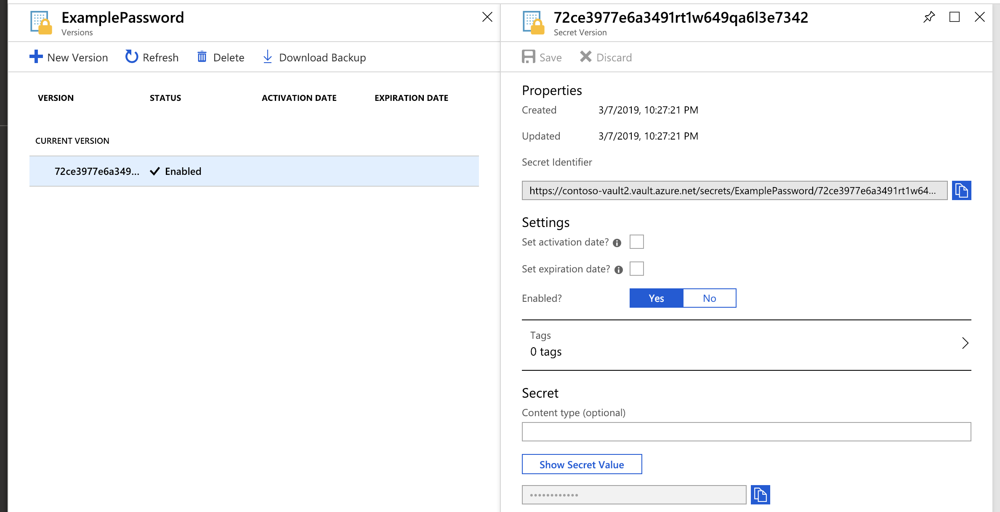

# Quickstart: Set and retrieve a secret from Azure Key Vault using the Azure portal

Azure Key Vault is a cloud service that provides a secure store for secrets. You can securely store keys, passwords, certificates, and other secrets. Azure key vaults may be created and managed through the Azure portal. In this quickstart, you create a key vault, then use it to store a secret. For more information on Key Vault, review the [Overview](../general/overview.md).

If you don't have an Azure subscription, create a [free account](https://azure.microsoft.com/free/?WT.mc_id=A261C142F) before you begin.

## Sign in to Azure

Sign in to the Azure portal at https://portal.azure.com.

## Create a vault

1. From the Azure portal menu, or from the **Home** page, select **Create a resource**.
2. In the Search box, enter **Key Vault**.
3. From the results list, choose **Key Vault**.
4. On the Key Vault section, choose **Create**.
5. On the **Create key vault** section provide the following information:
    - **Name**: A unique name is required. For this quickstart, we use **Contoso-vault2**. 
    - **Subscription**: Choose a subscription.
    - Under **Resource Group**, choose **Create new** and enter a resource group name.
    - In the **Location** pull-down menu, choose a location.
    - Leave the other options to their defaults.
6. After providing the information above, select **Create**.

Take note of the two properties listed below:

* **Vault Name**: In the example, this is **Contoso-Vault2**. You will use this name for other steps.
* **Vault URI**: In the example, this is https://contoso-vault2.vault.azure.net/. Applications that use your vault through its REST API must use this URI.

At this point, your Azure account is the only one authorized to perform operations on this new vault.

## Add a secret to Key Vault

To add a secret to the vault, you just need to take a couple of additional steps. In this case, we add a password that could be used by an application. The password is called **ExamplePassword** and we store the value of **hVFkk965BuUv** in it.

1. On the Key Vault properties pages, select **Secrets**.
2. Click on **Generate/Import**.
3. On the **Create a secret** screen choose the following values:
    - **Upload options**: Manual.
    - **Name**: ExamplePassword.
    - **Value**: hVFkk965BuUv
    - Leave the other values to their defaults. Click **Create**.

Once that you receive the message that the secret has been successfully created, you may click on it on the list. 

## Retrieve a secret from Key Vault

If you click on the current version, you can see the value you specified in the previous step.

By clicking "Show Secret Value" button in the right pane, you can see the hidden value. 

## Clean up resources

Other Key Vault quickstarts and tutorials build upon this quickstart. If you plan to continue on to work with subsequent quickstarts and tutorials, you may wish to leave these resources in place.
When no longer needed, delete the resource group, which deletes the Key Vault and related resources. To delete the resource group through the portal:

1. Enter the name of your resource group in the Search box at the top of the portal. When you see the resource group used in this quickstart in the search results, select it.
2. Select **Delete resource group**.
3. In the **TYPE THE RESOURCE GROUP NAME:** box type in the name of the resource group and select **Delete**.

## Next steps

In this quickstart, you created a Key Vault and stored a secret in it. To learn more about Key Vault and how to integrate it with your applications, continue on to the articles below.

- Read an [Overview of Azure Key Vault](../general/overview.md)
- See the [Azure Key Vault developer's guide](../general/developers-guide.md)
- Review [Azure Key Vault best practices](../general/best-practices.md)
