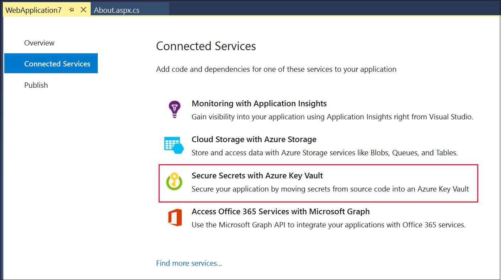
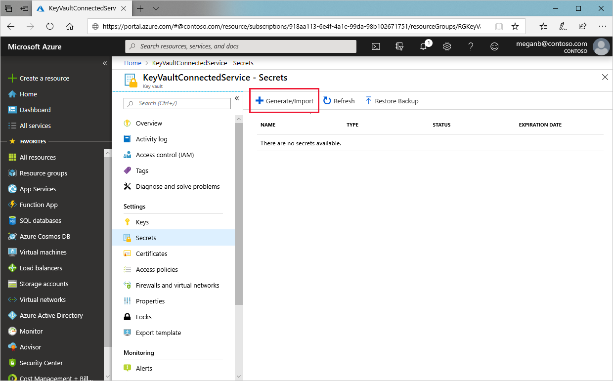
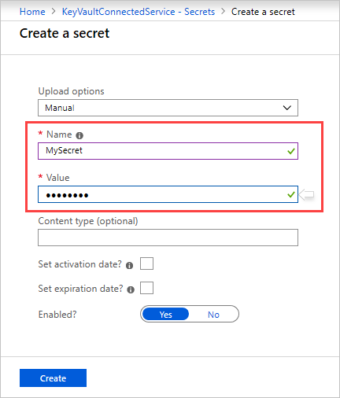

# Add Key Vault to your web application by using Visual Studio Connected Services

In this tutorial, you will learn how to easily add everything you need to start using Azure Key Vault to manage your secrets for web projects in Visual Studio, whether you are using ASP.NET Core or any type of ASP.NET project. By using the Connected Services feature in Visual Studio, you can have Visual Studio automatically add all the NuGet packages and configuration settings you need to connect to Key Vault in Azure.

For details on the changes that Connected Services makes in your project to enable Key Vault, see [Key Vault Connected Service - What happened to my ASP.NET 4.7.1 project](#how-your-aspnet-framework-project-is-modified) or [Key Vault Connected Service - What happened to my ASP.NET Core project](#how-your-aspnet-core-project-is-modified).

## Prerequisites

- **An Azure subscription**. If you don't have a subscription, sign up for a [free account](https://azure.microsoft.com/pricing/free-trial/).
- **Visual Studio 2019 version 16.3 Preview 1** or later, or **Visual Studio 2017 version 15.7** with the **Web Development** workload installed. [Download it now](https://aka.ms/vsdownload?utm_source=mscom&utm_campaign=msdocs).
- For ASP.NET (not Core) with Visual Studio 2017, you need the .NET Framework 4.7.1 or later Development Tools, which are not installed by default. To install them, launch the Visual Studio Installer, choose **Modify**, and then choose **Individual Components**, then on the right-hand side, expand **ASP.NET and web development**, and choose **.NET Framework 4.7.1 Development Tools**.
- An ASP.NET 4.7.1 or later, or ASP.NET Core 2.0 web project open.

## Add Key Vault support to your project

Before you begin, make sure that you're signed into Visual Studio. Sign in with the same account that you use for your Azure subscription. Then open an ASP.NET 4.7.1 or later, or ASP.NET Core 2.0 web project, and do the follow steps:

1. In **Solution Explorer**, choose **Add** > **Connected Service**.
   The Connected Service page appears with services you can add to your project.
1. In the menu of available services, choose **Secure Secrets With Azure Key Vault**.

   

1. Select the subscription you want to use, and then choose a new or existing Key Vault. If you choose the new Key Vault, an **Edit** link appears. Select it to configure your new Key Vault.

   

1. In **Edit Azure Key Vault**, enter the name you want to use for the Key Vault.

1. Select an existing **Resource Group**, or choose to create a new one with an automatically generated unique name.  If you want to create a new group with a different name, you can use the [Azure portal](https://portal.azure.com), and then close the page and restart to reload the list of resource groups.
1. Choose the **Location** in which to create the Key Vault. If your web application is hosted in Azure, choose the region that hosts the web application for optimum performance.
1. Choose a **Pricing tier**. For details, see [Key Vault Pricing](https://azure.microsoft.com/pricing/details/key-vault/).
1. Choose **OK** to accept the configuration choices.
1. After you select an existing Key Vault or have configured a new Key Vault, in the **Azure Key Vault** tab of Visual Studio, select **Add** to add the Connected Service.
1. Select the **Manage secrets stored in this Key Vault** link to open the **Secrets** page for your Key Vault. If you closed the page or the project, you can navigate to it in the [Azure portal](https://portal.azure.com) by choosing **All Services** and, under **Security**, choosing **Key Vault**, then choose your Key Vault.
1. In the Key Vault section for the key vault you created, choose **Secrets**, then **Generate/Import**.

   

1. Enter a secret, such as *MySecret* and give it any string value as a test, then select the **Create** button.

   

1. (optional) Enter another secret, but this time put it into a category by naming it *Secrets--MySecret*. This syntax specifies a category "Secrets" that contains a secret "MySecret".

Now, you can access your secrets in code. The next steps are different depending on whether you are using ASP.NET 4.7.1 or ASP.NET Core.

## Access your secrets in code

1. In Solution Explorer, right-click on your project, and select **Manage NuGet Packages**. In the **Browse** tab, locate and install these two NuGet packages:
   [Microsoft.Azure.Services.AppAuthentication](https://www.nuget.org/packages/Microsoft.Azure.Services.AppAuthentication) and [Microsoft.Azure.KeyVault](https://www.nuget.org/packages/Microsoft.Azure.KeyVault).

1. Select the `Program.cs` tab and replace the Program class with the following code:

   ```csharp
    public class Program
    {
        public static void Main(string[] args)
        {
            BuildWebHost(args).Run();
        }

        public static IWebHost BuildWebHost(string[] args) =>
           WebHost.CreateDefaultBuilder(args)
               .ConfigureAppConfiguration((ctx, builder) =>
               {
                   var keyVaultEndpoint = GetKeyVaultEndpoint();
                   if (!string.IsNullOrEmpty(keyVaultEndpoint))
                   {
                       var azureServiceTokenProvider = new AzureServiceTokenProvider();
                       var keyVaultClient = new KeyVaultClient(
                           new KeyVaultClient.AuthenticationCallback(
                               azureServiceTokenProvider.KeyVaultTokenCallback));
                       builder.AddAzureKeyVault(
                           keyVaultEndpoint, keyVaultClient, new DefaultKeyVaultSecretManager());
                   }
               }
            ).UseStartup<Startup>()
             .Build();

        private static string GetKeyVaultEndpoint() => "https://<YourKeyVaultName>.vault.azure.net";
    }
   ```

1. Next open `About.cshtml.cs` file and write the following code:
   1. Include a reference to `Microsoft.Extensions.Configuration` by this using statement:

       ```csharp
       using Microsoft.Extensions.Configuration
       ```

   1. Add this constructor:

       ```csharp
       public AboutModel(IConfiguration configuration)
       {
           _configuration = configuration;
       }
       ```

   1. Update the `OnGet` method. Update the placeholder value shown here with the secret name you created in the above commands.

       ```csharp
       public void OnGet()
       {
           //Message = "Your application description page.";
           Message = "My key val = " + _configuration["<YourSecretNameThatWasCreatedAbove>"];
       }
       ```

Run the app locally by browsing to the About page. You should see your secret value retrieved.

## Clean up resources

When no longer needed, delete the resource group. This deletes the Key Vault and related resources. To delete the resource group through the portal:

1. Enter the name of your resource group in the Search box at the top of the portal. When you see the resource group used in this quickstart in the search results, select it.
2. Select **Delete resource group**.
3. In the **TYPE THE RESOURCE GROUP NAME:** box, enter in the name of the resource group and select **Delete**.

## How your ASP.NET Core project is modified

This section identifies the exact changes made to an ASP.NET project when adding the Key Vault connected service using Visual Studio.

### Added references for ASP.NET Core

Affects the project file .NET references and NuGet package references.

| Type | Reference |
| --- | --- |
| NuGet | Microsoft.AspNetCore.AzureKeyVault.HostingStartup |

### Added files for ASP.NET Core

- `ConnectedService.json` added, which records some information about the Connected Service provider, version, and a link the documentation.

### Project file changes for ASP.NET Core

- Added the Connected Services ItemGroup and `ConnectedServices.json` file.

### launchsettings.json changes for ASP.NET Core

- Added the following environment variable entries to both the IIS Express profile and the profile that matches your web project name:

    ```json
      "environmentVariables": {
        "ASPNETCORE_HOSTINGSTARTUP__KEYVAULT__CONFIGURATIONENABLED": "true",
        "ASPNETCORE_HOSTINGSTARTUP__KEYVAULT__CONFIGURATIONVAULT": "<your keyvault URL>"
      }
    ```

### Changes on Azure for ASP.NET Core

- Created a resource group (or used an existing one).
- Created a Key Vault in the specified resource group.

## How your ASP.NET Framework project is modified

This section identifies the exact changes made to an ASP.NET project when adding the Key Vault connected service using Visual Studio.

### Added references for ASP.NET Framework

Affects the project file .NET references and `packages.config` (NuGet references).

| Type | Reference |
| --- | --- |
| .NET; NuGet | Microsoft.Azure.KeyVault |
| .NET; NuGet | Microsoft.Azure.KeyVault.WebKey |
| .NET; NuGet | Microsoft.Rest.ClientRuntime |
| .NET; NuGet | Microsoft.Rest.ClientRuntime.Azure |

### Added files for ASP.NET Framework

- `ConnectedService.json` added, which records some information about the Connected Service provider, version, and a link to the documentation.

### Project file changes for ASP.NET Framework

- Added the Connected Services ItemGroup and ConnectedServices.json file.
- References to the .NET assemblies described in the [Added references](#added-references-for-aspnet-framework) section.

### web.config or app.config changes

- Added the following configuration entries:

    ```xml
    <configSections>
      <section
           name="configBuilders"
           type="System.Configuration.ConfigurationBuildersSection, System.Configuration, Version=4.0.0.0, Culture=neutral, PublicKeyToken=b03f5f7f11d50a3a"
           restartOnExternalChanges="false"
           requirePermission="false" />
    </configSections>
    <configBuilders>
      <builders>
        <add
             name="AzureKeyVault"
             vaultName="vaultname"
             type="Microsoft.Configuration.ConfigurationBuilders.AzureKeyVaultConfigBuilder, Microsoft.Configuration.ConfigurationBuilders.Azure, Version=1.0.0.0, Culture=neutral"
             vaultUri="https://vaultname.vault.azure.net" />
      </builders>
    </configBuilders>
    ```

### Changes on Azure for ASP.NET Framework

- Created a resource group (or used an existing one).
- Created a Key Vault in the specified resource group.

## Next steps

Learn more about Key Vault development by reading the [Key Vault Developer's Guide](key-vault-developers-guide.md).
