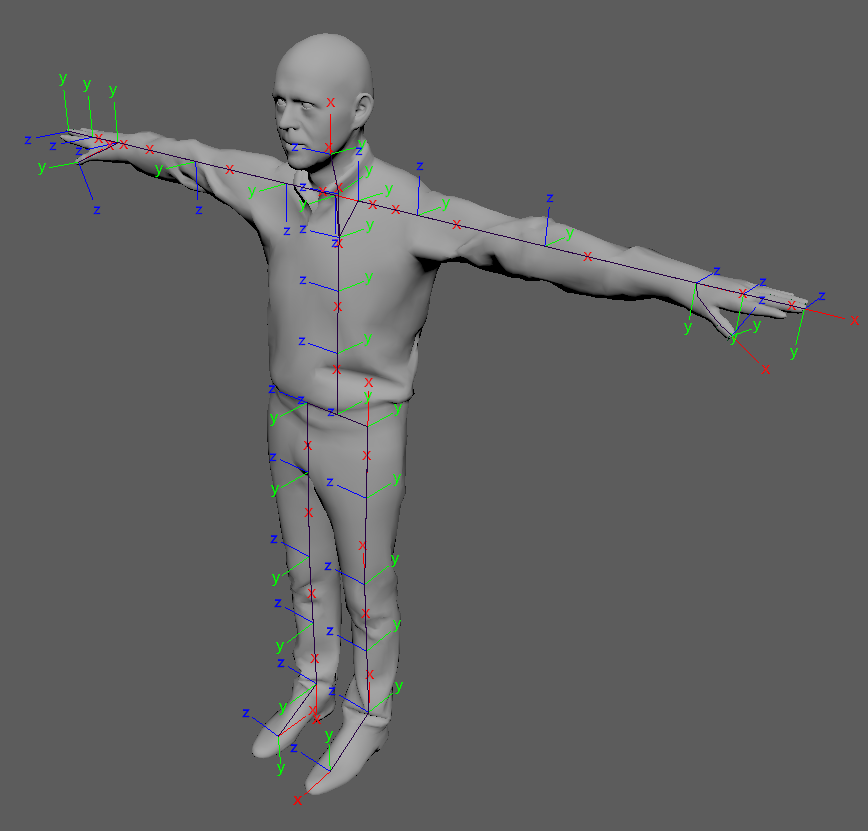

# Azure Kinect body tracking joints

Azure Kinect body tracking can track multiple human bodies at the same time. Each body includes an ID for temporal correlation between frames and the kinematic skeleton. The number of bodies detected in each frame can be acquired using `k4abt_frame_get_num_bodies()`.

## Joints

Joint position and orientation are estimates relative to the global depth sensor frame of reference. The position is specified in millimeters. The orientation is expressed as a normalized quaternion.

## Joint coordinates

The position and orientation of each joint form its own joint coordinate system. All joint coordinate systems are absolute coordinate systems relative to the depth camera 3D coordinate system.

## Joint hierarchy

A skeleton includes 32 joints with the joint hierarchy flowing from the center of the body to the extremities. Each connection (bone) links the parent joint with a child joint. The figure illustrates the joint locations and connection relative to the human body.

The following table enumerates the standard joint connections.

|Index |Joint name     | Parent joint   |
|------|---------------|----------------|
| 0    |PELVIS         | -              |
| 1    |SPINE_NAVAL    | PELVIS         |
| 2    |SPINE_CHEST    | SPINE_NAVAL    |
| 3    |NECK           | SPINE_CHEST    |
| 4    |CLAVICLE_LEFT  | SPINE_CHEST    |
| 5    |SHOULDER_LEFT  | CLAVICLE_LEFT  |
| 6    |ELBOW_LEFT     | SHOULDER_LEFT  |
| 7    |WRIST_LEFT     | ELBOW_LEFT     |
| 8    |HAND_LEFT      | WRIST_LEFT     |
| 9    |HANDTIP_LEFT   | HAND_LEFT      |
| 10   |THUMB_LEFT     | WRIST_LEFT     |
| 11   |CLAVICLE_RIGHT | SPINE_CHEST    |
| 12   |SHOULDER_RIGHT | CLAVICLE_RIGHT |
| 13   |ELBOW_RIGHT    | SHOULDER_RIGHT |
| 14   |WRIST_RIGHT    | ELBOW_RIGHT    |
| 15   |HAND_RIGHT     | WRIST_RIGHT    |
| 16   |HANDTIP_RIGHT  | HAND_RIGHT     |
| 17   |THUMB_RIGHT    | WRIST_RIGHT    |
| 18   |HIP_LEFT       | PELVIS         |
| 19   |KNEE_LEFT      | HIP_LEFT       |
| 20   |ANKLE_LEFT     | KNEE_LEFT      |
| 21   |FOOT_LEFT      | ANKLE_LEFT     |
| 22   |HIP_RIGHT      | PELVIS         |
| 23   |KNEE_RIGHT     | HIP_RIGHT      |
| 24   |ANKLE_RIGHT    | KNEE_RIGHT     |
| 25   |FOOT_RIGHT     | ANKLE_RIGHT    |
| 26   |HEAD           | NECK           |
| 27   |NOSE           | HEAD           |
| 28   |EYE_LEFT       | HEAD           |
| 29   |EAR_LEFT       | HEAD           |
| 30   |EYE_RIGHT      | HEAD           |
| 31   |EAR_RIGHT      | HEAD           |

## Next steps

[Body tracking index map](body-index-map.md)
