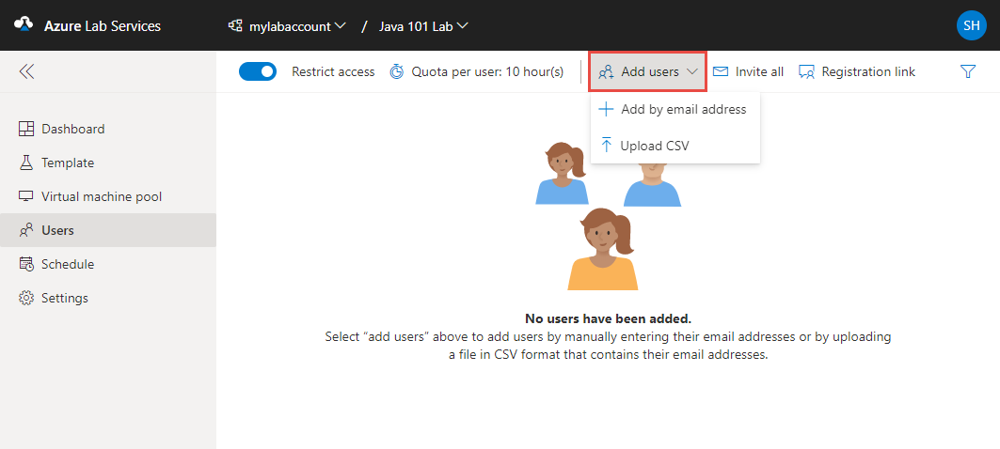
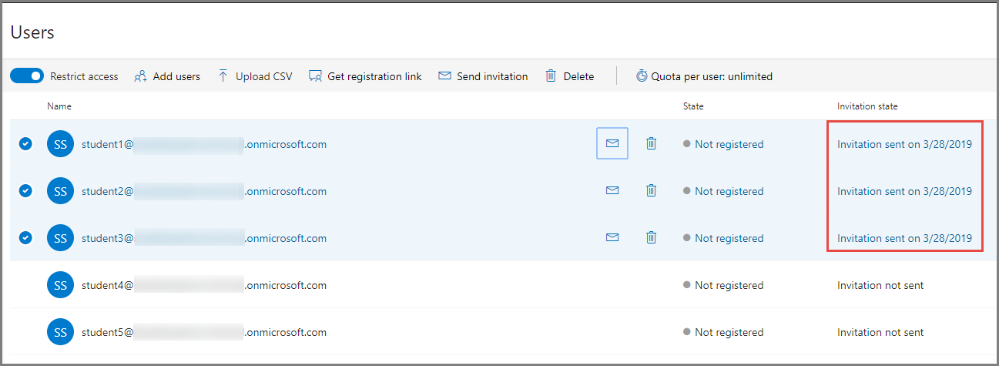
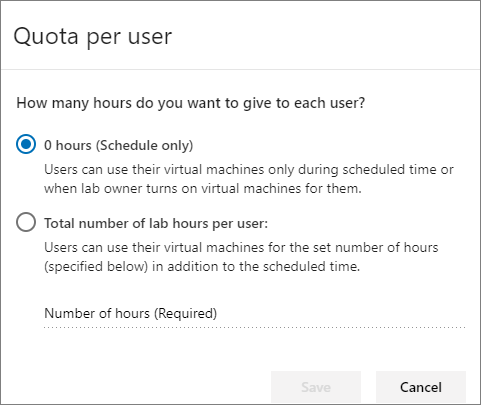
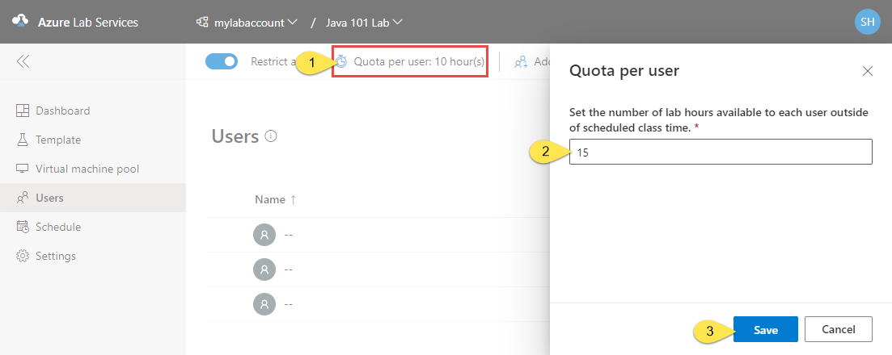
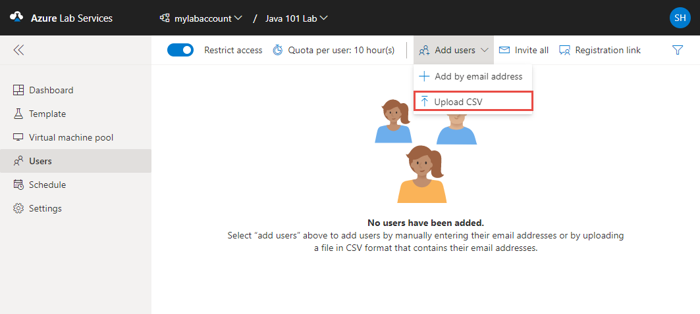

# Configure usage settings and policies
This article describes how to add users to the lab, get them registered with the lab, control the number of hours they can use the VM, and more. 

## Add users to the lab
If you have the **Restrict access** enabled, add users (email addresses) to the list.

1. Select **Users** on the left menu.
2. Select **Add users** on the toolbar. 

    
1. On the **Add users** page, enter email addresses of users in separate lines or in a single line separated by semicolons. 

    
4. Select **Save**. You see the email addresses of users and their statuses (registered or not) in the list. 

    

## Share registration link with students
To send the registration link to students, use one of the following methods. The first method shows you how to send emails to students with the registration link and an optional message. The second method shows you how to get the registration link that you can share with others any way you want. 

If the **Restrict access** is enabled for the lab, only users in the list of users can use the registration link to register to the lab. This option is enabled by default. 

### Send email to users
Azure Lab Services allows teachers to email lab invitations to all or selected students without having to use another email client. Teachers can hover on individual student in the list to see the email icon for each student or select one or more students, and use **Send invitation** on the toolbar. This feature sends an email with a registration link and a message (if any) added by the teacher. After the invitation is sent, the invitation state changes to **Invitation sent** so that teachers can keep track of which students have already received the registration link and the date it was sent.

1. Switch to the **Users** view if you are not on the page already. 
2. Select specific or all users in the list. To select specific users, select check boxes in the first column of the list. To select all users, select the check box in front of the title of the first column (**Name**) or select all check boxes for all users in the list. You can see the status of the **invitation state** in this list.  In the following image, the invitation state for all students is set to **Invitation not sent**. 

    
1. Select the **email icon (envelope)** in one of the rows (or) select **Send invitation** on the toolbar. You can also hover the mouse over a student name in the list to see the email icon. 

    
4. On the **Send registration link by email** page, follow these steps: 
    1. Type an **optional message** that you want to send to the students. The email automatically includes the registration link. 
    2. On the **Send registration link by email** page, select **Send**. You see the status of invitation changing to **Sending invitation** and then to **Invitation sent**. 
        
        

## Get registration link
1. Switch to the **Users** view by selecting **Users** on the left menu. 
2. Select **Get registration link** tile.

    
1. In the **User registration** dialog box, select the **Copy** button. The link is copied to the clipboard. Paste it in an email editor, and send an email to the student. 

    
2. On the **User registration** dialog box, select **Close**. 
4. Share the **registration link** with a student so that the student can register for the class. 

## View users registered with the lab

Select **Users** on the left menu to see the list of users registered with the lab. 

## Set quotas per user
You can set quotas per user by using the following steps: 

1. Select **Users** on the left menu.
2. Select **Quota per user:** on the toolbar. 
3. On the **Quota per user** page, specify the number of hours you want to give to each user (student): 
    1. **0 hours (schedule only)**. Users can use their VMs only during the scheduled time or when you as the lab owner turns on VMs for them.

        
    1. **Total number of lab hours per user**. Users can use their VMs for the set number of hours (specified for this field) **in addition to the scheduled time**. If you select this option, enter the **number of hours** in the text box. 

        
    4. Select **Save**. 
5. You see the changed values on the toolbar now: **Quota per user: &lt;number of hours&gt;**. 

    

> [!IMPORTANT]
> Before sending the registration link to the students, teachers must either set the schedule for the class if they pick 0 quota hours or specify the quota hours for the lab.
>
> The [scheduled running time of VMs](how-to-create-schedules.md) does not count against the quota allotted to a user. The quota is for the time outside of schedule hours that a student spends on VMs. 

### Add users by uploading a CSV file
You can also add users by uploading a CSV file with email addresses of users.

1. Create a CSV file with email addresses of users in one column.

    
2. On the **Users** page of the lab, select **Upload CSV** on the toolbar.

    
3. Select the CSV file with user email addresses. When you select **Open** after selecting the CSV file, you see the following **Add users** window. The email address list is filled with email addresses from the CSV file. 

    
4. Select **Save** in the **Add users** window. 
5. Confirm that you see users in the list of users. 

    

## Manage user VMs
Once students register with Azure Lab Services using the registration link you provided to them, you see the VMs assigned to students on the **Virtual machines** tab. 

You can do the following tasks on a student VM: 

- Stop a VM if the VM is running. 
- Start a VM if the VM is stopped. 
- Connect to the VM. 
- Delete the VM. 
- View the number of hours that users used the virtual machine. 

## Update number of virtual machines in lab
To update the number of virtual machines in the lab, take the following steps in the **Virtual Machines** page:

1. Select **Virtual machines** on the left menu. 
2. Select **Lab capacity: &lt;number&gt; machine(s)** on the toolbar. 
3. Enter the **number** of virtual machines.
4. Select **Save**.

    

## Next steps
See the following articles:

- [As an admin, create and manage lab accounts](how-to-manage-lab-accounts.md)
- [As a lab owner, create and manage labs](how-to-manage-classroom-labs.md)
- [As a lab owner, set up and publish templates](how-to-create-manage-template.md)
- [As a lab user, access classroom labs](how-to-use-classroom-lab.md)
