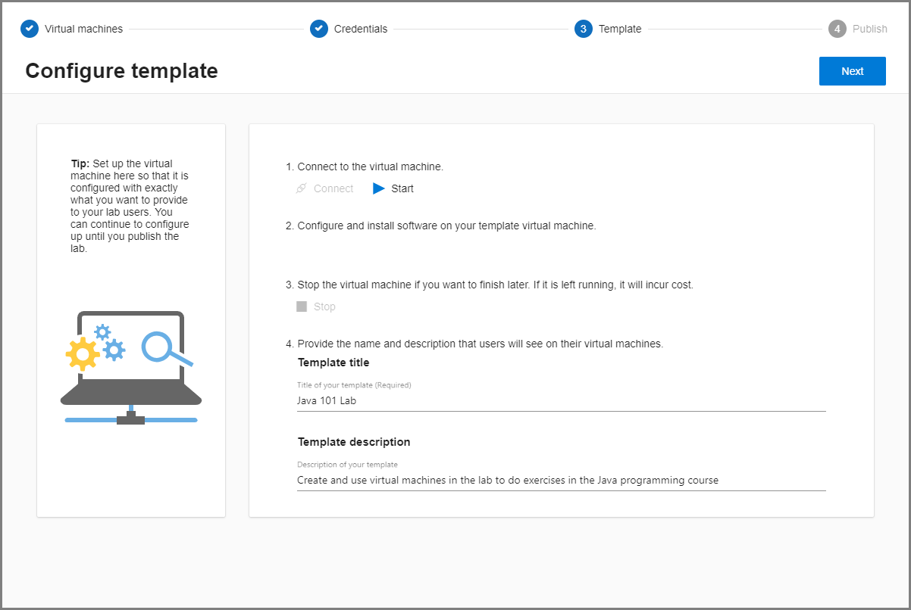
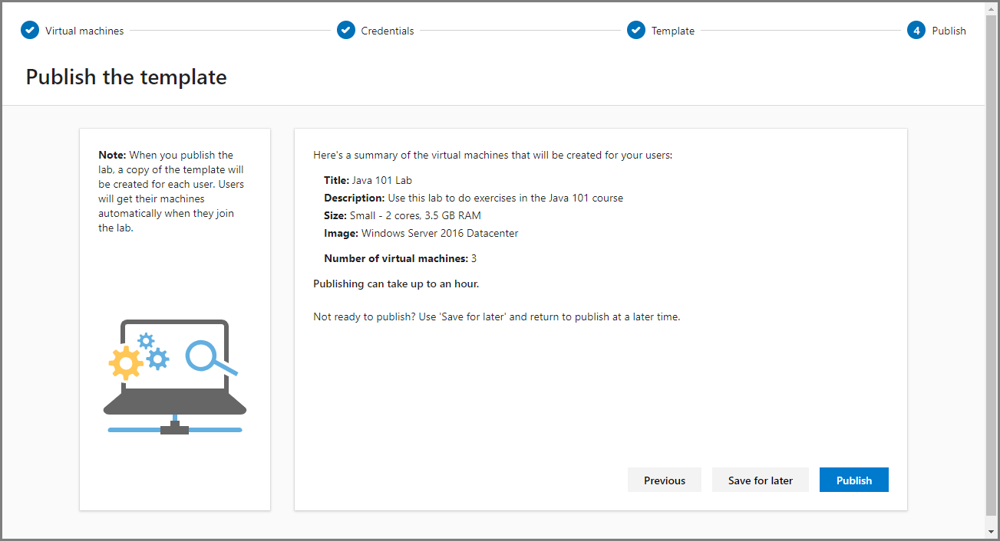
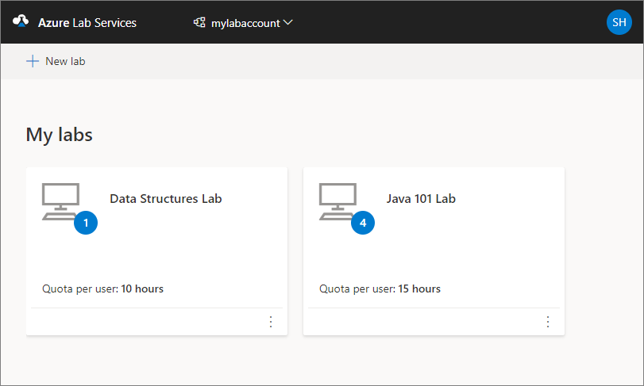
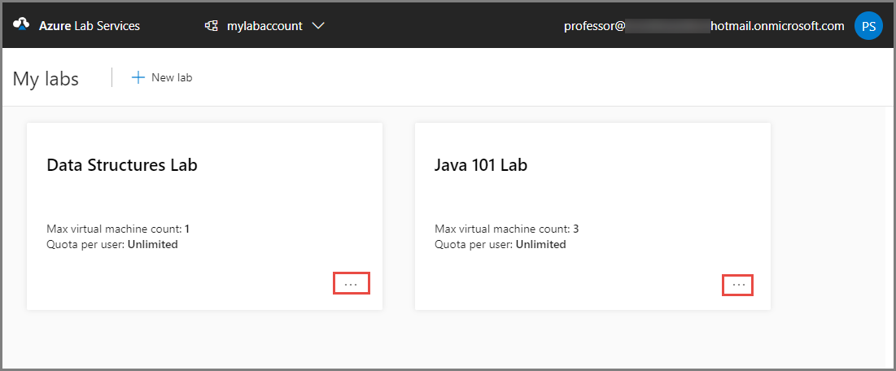
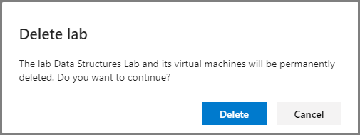

# Manage classroom labs in Azure Lab Services 
This article describes how to create and delete a classroom lab. It also shows you how to view all the classroom labs in a lab account. 

## Prerequisites
To set up a classroom lab in a lab account, you must be a member of the **Lab Creator** role in the lab account. The account you used to create a lab account is automatically added to this role. A lab owner can add other users to the Lab Creator role by using steps in the following article: [Add a user to the Lab Creator role](tutorial-setup-lab-account.md#add-a-user-to-the-lab-creator-role).

## Create a classroom lab

1. Navigate to [Azure Lab Services website](https://labs.azure.com). Note that Internet Explorer 11 is not supported yet. 
2. Select **Sign in**. Select or enter a **user ID** that is a member of the **Lab Creator** role in the lab account, and enter password. Azure Lab Services supports organizational accounts and Microsoft accounts. 
3. In the **New Lab** window, do the following actions: 
    1. Specify a **name** for your lab. 
    2. Specify the maximum **number of virtual machines** in the lab. You can increase or decrease the number of virtual machines in the lab later. 
    6. Select **Save**.

        
4. On the **Select virtual machine specifications** page, do the following steps:
    1. Select a **size** for virtual machines (VMs) created in the lab. Currently, **small**, **medium**, **large**, and **GPU** sizes are allowed.
    2. Select the **region** in which you want the VMs to be created. 
    3. Select the **VM image** to be used to create VMs in the lab. If you select a Linux image, you see an option to enable remote desktop connection for it. For details, see [Enable remote desktop connection for Linux](how-to-enable-remote-desktop-linux.md).
    4. Select **Next**.

            
5. On the **Set credentials** page, specify default credentials for all VMs in the lab. 
    1. Specify the **name of the user** for all VMs in the lab.
    2. Specify the **password** for the user. 

        > [!IMPORTANT]
        > Make a note of user name and password. They won't be shown again.
    3. Select **Create**. 

        
6. On the **Configure template** page, you see the status of lab creation process. The creation of the template in the lab takes up to 20 minutes. A template in a lab is a base virtual machine image from which all users’ virtual machines are created. Set up the template virtual machine so that it is configured with exactly what you want to provide to the lab users.  

    
7. After the configuration of the template is complete, you see the following page: 

    
8. The following steps are optional steps in this tutorial: 
    1. Start the template VM by selecting **Start**.
    2. Connect to the template VM by selecting **Connect**. If it's a Linux template VM, you choose whether you want to connect using SSH or RDP (if RDP is enabled).
    3. Install and configure software on your template VM. 
    4. **Stop** the VM.  
    5. Enter a **description** for the template

        
9. Select **Next** on the template page. 
10. On **Publish the template** page, do the following actions. 
    1. To publish the template immediately, select the checkbox for *I understand I can't modify the template after publishing. This process can only be done once and can take up to an hour*, and select **Publish**.  Publish the template to make instances of the template VM available to your lab users.

        > [!WARNING]
        > Once you publish, you can't unpublish. 
    2. To publish later, select **Save for later**. You can publish the template VM after the wizard completes. For details on how to configure and publish after the wizard completes, see For details on how to configure and publish after the wizard completes, see Publish the template section in the [How to manage classroom labs](how-to-manage-classroom-labs.md) article.

        
11. You see the **progress of publishing** the template. This process can take up to an hour. 

    
12. You see the following page when the template is published successfully. Select **Done**.

    
1. You see the **dashboard** for the lab. 
    
    
4. Switch to the **Virtual machines** page, and confirm that you see virtual machines that are in **Unassigned** state. These VMs are not assigned to students yet. They should be in **Stopped** state. You can start a student VM, connect to the VM, stop the VM, and delete the VM on this page. You can start them in this page or let your students start the VMs. 

    

## View all classroom labs
1. Navigate to [Azure Lab Services portal](https://labs.azure.com).
2. Select **Sign in**. Select or enter a **user ID** that is a member of the **Lab Creator** role in the lab account, and enter password. Azure Lab Services supports organizational accounts and Microsoft accounts. 
3. Confirm that you see all the labs in the selected lab account. 

    
3. Use the drop-down list at the top to select a different lab account. You see labs in the selected lab account. 

## Delete a classroom lab
1. On the tile for the lab, select three dots (...) in the corner. 

    
2. Select **Delete**. 

    
3. On the **Delete lab** dialog box, select **Delete**. 

    

## Switch to another classroom lab
To switch to another classroom lab from the current, select the drop-down list of labs in the lab account at the top.

## Next steps
See the following articles:

- [As a lab owner, set up and publish templates](how-to-create-manage-template.md)
- [As a lab owner, configure and control usage of a lab](how-to-configure-student-usage.md)
- [As a lab user, access classroom labs](how-to-use-classroom-lab.md)

