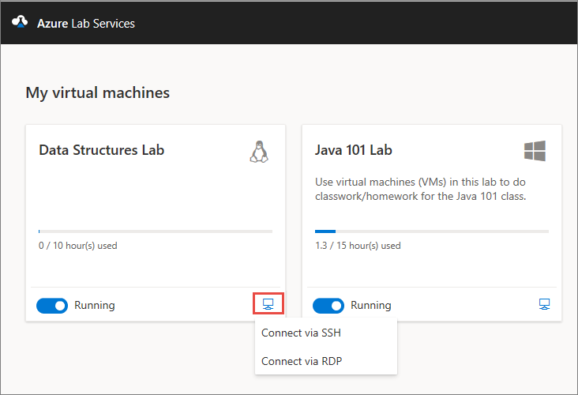
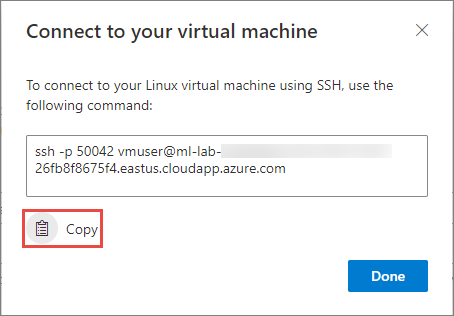

# Use remote desktop for Linux virtual machines in a classroom lab of Azure Lab Services
This article shows you how students can connect to a Linux virtual machine (VM) in a lab by using RDP/SSH. 

An instructor needs to enable the remote desktop connection feature before students can connect to classroom lab's VM. For instructions on how an instructor can enable the remote desktop connection feature, see [Enable remote desktop for Linux virtual machines](how-to-enable-remote-desktop-linux.md).

> [!IMPORTANT] 
> Enabling **remote desktop connection** only opens the **RDP** port on Linux machines. An instructor can connect to the Linux machine using SSH for the first time, and install RDP and GUI packages so that you can connect to the Linux machine using RDP later. 

## Connect to the student VM
Students can RDP in to their Linux VMs after the lab owner (teacher/professor) **publishes** the template VM with RDP and GUI packages installed on the machine. Here are the steps: 

1. When a student signs in to the Labs portal directly (`https://labs.azure.com`) or by using a registration link (`https://labs.azure.com/register/<registrationCode>`), a tile for each lab the student has access to is displayed. 
2. On the tile, select **Start** if the VM is stopped. 
3. Select **Connect**. You see two options to connect to the VM: **SSH** and **Remote Desktop**.

    

## Connect using SSH or RDP
If you select the **SSH** option, you see the following **Connect to your virtual machine** dialog box:  

Select the **Copy** button next to the text box to copy it to the clipboard. Save the SSH connection string. Use this connection string from an SSH terminal (like [Putty](https://www.putty.org/)) to connect to the virtual machine.

If you select the **RDP** option, an RDP file is downloaded on to your machine. Save it and open it to connect to the machine. 

## Next steps
To learn how to enable the remote desktop connection feature for Linux VMs in a classroom lab, see [Enable remote desktop for Linux virtual machines](how-to-enable-remote-desktop-linux.md). 

