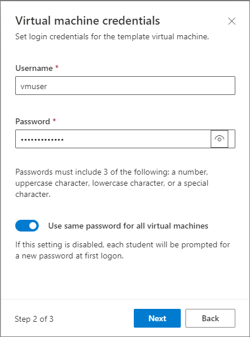
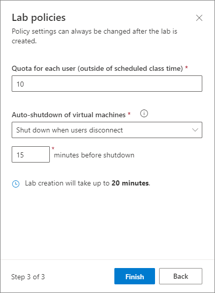
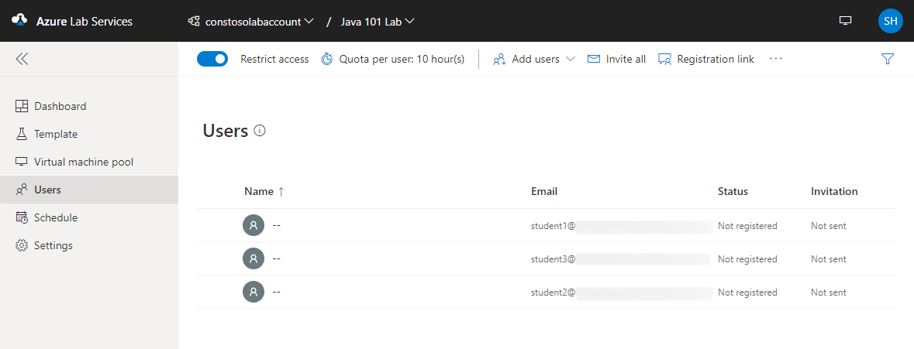

# Tutorial: Set up a classroom lab 
In this tutorial, you set up a classroom lab with virtual machines that are used by students in the classroom.  

In this tutorial, you do the following actions:

> [!div class="checklist"]
> * Create a classroom lab
> * Add users to the lab
> * Set schedule for the lab
> * Send invitation email to students

## Prerequisites
To set up a classroom lab in a lab account, you must be a member of one of these roles in the lab account: Owner, Lab Creator, or Contributor. The account you used to create a lab account is automatically added to the owner role.

A lab owner can add other users to the **Lab Creator** role. For example, a lab owner adds professors to the Lab Creator role. Then, the professors create labs with VMs for their classes. Students use the registration link that they receive from professors to register to the lab. Once they are registered, they can use VMs in the labs to do the class work and home work. For detailed steps for adding users to the Lab Creator role, see [Add a user to the Lab Creator role](tutorial-setup-lab-account.md#add-a-user-to-the-lab-creator-role).

## Create a classroom lab

1. Navigate to [Azure Lab Services website](https://labs.azure.com). Note that Internet Explorer 11 is not supported yet. 
2. Select **Sign in** and enter your credentials. Azure Lab Services supports organizational accounts and Microsoft accounts. 
3. Select **New lab**. 
    
    
4. In the **New Lab** window, do the following actions: 
    1. Specify a **name** for your lab, and select **Next**.  

        

        If you select a Linux image, you see an option to enable remote desktop connection for it. For details, see [Enable remote desktop connection for Linux](how-to-enable-remote-desktop-linux.md).
    2. On the **Virtual machine credentials** page, specify default credentials for all VMs in the lab. Specify the **name** and the **password** for the user, and then select **Next**.  

        

        > [!IMPORTANT]
        > Make a note of user name and password. They won't be shown again.
    3. On the **Lab policies** page, enter the number of hours allotted for each user (**quota for each user**) outside the scheduled time for the lab, and then select **Finish**. 

        
5. You should see the following screen that shows the status of the template VM creation. The creation of the template in the lab takes up to 20 minutes. 

    
8. On the **Template** page, do the following steps: These steps are **optional** for the tutorial.

    2. Connect to the template VM by selecting **Connect**. If it's a Linux template VM, you choose whether you want to connect using SSH or RDP (if RDP is enabled).
    1. Select **Reset password** to reset the password for the VM. 
    1. Install and configure software on your template VM. 
    1. **Stop** the VM.  
    1. Enter a **description** for the template
10. On **Template** page, select **Publish** on the toolbar. 

    

    > [!WARNING]
    > Once you publish, you can't unpublish. 
8. On the **Publish template** page, enter the number of virtual machines you want to create in the lab, and then select **Publish**. 

    
11. You see the **status of publishing** the template on page. This process can take up to an hour. 

    
4. Switch to the **Virtual machines pool** page by selecting Virtual machines on the left menu or by selecting Virtual machines tile. Confirm that you see virtual machines that are in **Unassigned** state. These VMs are not assigned to students yet. They should be in **Stopped** state. You can start a student VM, connect to the VM, stop the VM, and delete the VM on this page. You can start them in this page or let your students start the VMs. 

    

    You do the following tasks on this page (don't do these steps for the tutorial. These steps are for your information only.): 
    
    1. To change the lab capacity (number of VMs in the lab), select **Lab capacity** on the toolbar.
    2. To start all the VMs at once, select **Start all** on the toolbar. 
    3. To start a specific VM, select the down arrow in the **Status**, and then select **Start**. You can also start a VM by selecting a VM in the first column, and then by selecting **Start** on the toolbar.

## Add users to the lab

1. Select **Users** on the left menu. By default, the **Restrict access** option is enabled. When this setting is on, a user can't register with the lab even if the user has the registration link unless the user is in the list of users. Only users in the list can register with the lab by using the registration link you send. In this procedure, you add users to the list. Alternatively, you can turn off **Restrict access**, which allows users to register with the lab as long as they have the registration link. 
2. Select **Add users** on the toolbar, and then select **Add by email addresses**. 

    
1. On the **Add users** page, enter email addresses of users in separate lines or in a single line separated by semicolons. 

    
4. Select **Save**. You see the email addresses of users and their statuses (registered or not) in the list. 

    

## Set a schedule for the lab
Create a scheduled event for the lab so that VMs in the lab are automatically started/stopped at specific times. The user quota you specified earlier is the additional time assigned to each user outside this scheduled time. 

1. Switch to the **Schedules** page, and select **Add scheduled event** on the toolbar. 

    
2. Confirm that **Standard** is selected the **Event type**. You select **Start only** to specify only the start time for the VMs. You select **Stop only** to specify only the stop time for the VMs. 
7. In the **Repeat** section, select the current schedule. 

    
5. On the **Repeat** dialog box, do the following steps:
    1. Confirm that **every week** is set for the **Repeat** field. 
    3. Specify the **start date**.
    4. Specify the **start time** at which you want the VMs to be started.
    5. Specify the **stop time** on which the VMs are to be shut down. 
    6. Specify the **time zone** for the start and stop times you specified. 
    2. Select the days on which you want the schedule to take effect. In the following example, Monday-Thursday is selected. 
    8. Select **Save**. 

        

3. Now, on the **Add scheduled event** page, for **Notes (optional)**, enter any description or notes for the schedule. 
4. On the **Add scheduled event** page, select **Save**. 

    

## Send invitation emails to students

1. Switch to the **Users** view if you are not on the page already, and select **Invite all** on the toolbar. 

    

1. On the **Send invitation by email** page, enter an optional message, and then select **Send**. The email automatically includes the registration link. You can get this registration link by selecting **... (ellipsis)** on the toolbar, and **Registration link**. 

    
4. You see the status of **invitation** in the **Users** list. The status should change to **Sending** and then to **Sent on &lt;date&gt;**. 

## Next steps
In this tutorial, you created a classroom lab, and configured the lab. To learn how a student can access a VM in the lab using the registration link, advance to the next tutorial:

> [!div class="nextstepaction"]
> [Connect to a VM in the classroom lab](tutorial-connect-virtual-machine-classroom-lab.md)

