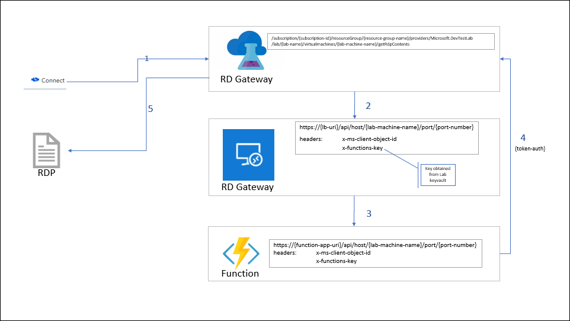
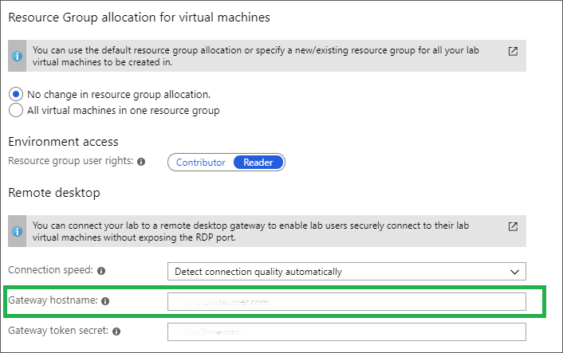
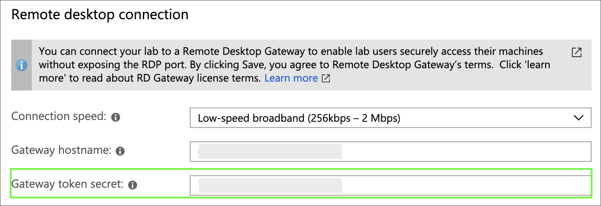

# Configure your lab in Azure DevTest Labs to use a remote desktop gateway
In Azure DevTest Labs, you can configure a remote desktop gateway for your lab to ensure secure access to the lab virtual machines (VMs) without having to expose the RDP port. The lab provides a central place for your lab users to view and connect to all virtual machines they have access to. The **Connect** button on the **Virtual Machine** page creates a machine-specific RDP file that you can open to connect to the machine. You can further customize and secure the RDP connection by connecting your lab to a remote desktop gateway. 

This approach is more secure because the lab user authenticates directly to the gateway machine or can use company credentials on a domain-joined gateway machine to connect to their machines. The lab also supports using token authentication to the gateway machine that allows users to connect to their lab virtual machines without having the RDP port exposed to the internet. This article walks through an example on how to set up a lab that uses token authentication to connect to lab machines.

## Architecture of the solution



1. The [Get RDP file contents](/rest/api/dtl/virtualmachines/getrdpfilecontents) action is called when you select the **Connect** button.1. 
1. The Get RDP file contents action invokes `https://{gateway-hostname}/api/host/{lab-machine-name}/port/{port-number}` to request an authentication token.
    1. `{gateway-hostname}` is the gateway hostname specified on the **Lab Settings** page for your lab in the Azure portal. 
    1. `{lab-machine-name}` is the name of the machine that you're trying to connect.
    1. `{port-number}` is the port on which the connection needs to be made. Usually this port is 3389. If the lab VM is using the [shared IP](devtest-lab-shared-ip.md) feature in DevTest Labs, the port will be different.
1. The remote desktop gateway defers the call from `https://{gateway-hostname}/api/host/{lab-machine-name}/port/{port-number}` to an Azure function to generate the authentication token. The DevTest Labs service automatically includes the function key in the request header. The function key is to be saved in the lab’s key vault. The name for that secret to be shown as **Gateway token secret** on the **Lab Settings** page for the lab.
1. The Azure function is expected to return a token for certificate-based token authentication against the gateway machine.  
1. The Get RDP file contents action then returns the complete RDP file, including the authentication information.
1. You open the RDP file using your preferred RDP connection program. Remember that not all RDP connection programs support token authentication. The authentication token does have an expiration date, set by the function app. Make the connection to the lab VM before the token expires.
1. Once the remote desktop gateway machine authenticates the token in the RDP file, the connection is forwarded to your lab machine.

### Solution requirements
To work with the DevTest Labs token authentication feature, there are a few configuration requirements for the gateway machines, domain name services (DNS), and functions.

### Requirements for remote desktop gateway machines
- SSL certificate must be installed  on the gateway machine to handle HTTPS traffic. The certificate must match the fully qualified domain name (FQDN) of the load balancer for the gateway farm or the FQDN of the machine itself if there's only one machine. Wild-card SSL certificates don't work.  
- A signing certificate installed on gateway machine(s). Create a signing certificate by using [Create-SigningCertificate.ps1](https://github.com/Azure/azure-devtestlab/blob/master/samples/DevTestLabs/GatewaySample/tools/Create-SigningCertificate.ps1) script.
- Install the [Pluggable Authentication](https://code.msdn.microsoft.com/windowsdesktop/Remote-Desktop-Gateway-517d6273) module that supports token authentication for the remote desktop gateway. One example of such a module is `RDGatewayFedAuth.msi` that comes with [System Center Virtual Machine Manager (VMM) images](/system-center/vmm/install-console?view=sc-vmm-1807). For more information about System Center, see [System Center documentation](https://docs.microsoft.com/system-center/) and [pricing details](https://www.microsoft.com/cloud-platform/system-center-pricing).  
- The gateway server can handle requests made to `https://{gateway-hostname}/api/host/{lab-machine-name}/port/{port-number}`.

    The gateway-hostname is the FQDN of the load balancer of the gateway farm or the FQDN of machine itself if there's only one machine. The `{lab-machine-name}` is the name of the lab machine that you're trying to connect, and the `{port-number}` is port on which the connection will be made.  By default, this port is 3389.  However, if the virtual machine is using the [shared IP](devtest-lab-shared-ip.md) feature in DevTest Labs, the port will be different.
- The [Application Routing Request](/iis/extensions/planning-for-arr/using-the-application-request-routing-module) module for Internet Information Server (IIS) can be used to redirect `https://{gateway-hostname}/api/host/{lab-machine-name}/port/{port-number}` requests to the azure function, which handles the request to get a token for authentication.


## Requirements for Azure function
Azure function handles request with format of `https://{function-app-uri}/app/host/{lab-machine-name}/port/{port-number}` and returns the authentication token based on the same signing certificate installed on the gateway machines. The `{function-app-uri}` is the uri used to access the function. The function key is automatically be passed in the header of the request. For a sample function, see [https://github.com/Azure/azure-devtestlab/blob/master/samples/DevTestLabs/GatewaySample/src/RDGatewayAPI/Functions/CreateToken.cs](https://github.com/Azure/azure-devtestlab/blob/master/samples/DevTestLabs/GatewaySample/src/RDGatewayAPI/Functions/CreateToken.cs). 


## Requirements for network

- DNS for the FQDN associated with the SSL certificate installed on the gateway machines must direct traffic to the gateway machine or the load balancer of the gateway machine farm.
- If the lab machine uses private IPs, there must be a network path from the gateway machine to the lab machine, either through sharing the same virtual network or using peered virtual networks.

## Configure the lab to use token authentication 
This section shows how to configure a lab to use a remote desktop gateway machine that supports token authentication. This section doesn't cover how to set up a remote desktop gateway farm itself. For that information, See the [Sample to create a remote desktop gateway](#sample-to-create-a-remote-desktop-gateway) section at the end of this article. 

Before you update the lab settings, store the key needed to successfully execute the function to return an authentication token in the lab’s key vault. You can get the function key value in the **Manage** page for the function in the Azure portal. For more information on how to save a secret in a key vault, see [Add a secret to Key Vault](../key-vault/quick-create-portal.md#add-a-secret-to-key-vault). Save the name of the secret for later use.

To find the ID of the lab’s key vault, run the following Azure CLI command: 

```azurecli
az resource show --name {lab-name} --resource-type 'Microsoft.DevTestLab/labs' --resource-group {lab-resource-group-name} --query properties.vaultName
```

Configure the lab to use the token authentication by using these steps:

1. Sign in to the [Azure portal](https://portal.azure.com).
1. Select **All Services**, and then select **DevTest Labs** from the list.
1. From the list of labs, select your **lab**.
1. On the lab's page, select **Configuration and policies**.
1. On the left menu, in the **Settings** section, select **Lab settings**.
1. In the **Remote desktop** section, enter the fully qualified domain name (FQDN) or IP address of the remote desktop services gateway machine or farm for the **Gateway hostname** field. This value must match the FQDN of the SSL certificate used on gateway machines.

    
1. In the **Remote desktop** section, for **Gateway token** secret, enter the name of the secret created earlier. This value isn't the function key itself, but the name of the secret in the lab’s key vault that holds the function key.

    
1. **Save** Changes.

    > [!NOTE] 
    > By clicking **Save**, you agree to [Remote Desktop Gateway’s license terms](https://www.microsoft.com/licensing/product-licensing/products). For more information about remote gateway, see [Welcome to Remote Desktop Services](https://aka.ms/rds) and [Deploy your remote desktop environment](/windows-server/remote/remote-desktop-services/rds-deploy-infrastructure).


If configuring the lab via automation is preferred, see [Set-DevTestLabGateway.ps1](https://github.com/Azure/azure-devtestlab/blob/master/samples/DevTestLabs/GatewaySample/tools/Set-DevTestLabGateway.ps1) for a sample PowerShell script to set **gateway hostname** and **gateway token secret** settings. The [Azure DevTest Labs GitHub repository](https://github.com/Azure/azure-devtestlab) also provides an Azure Resource Manager template that creates or updates a lab with the **gateway hostname** and **gateway token secret** settings.

## Configure network security group
To further secure the lab, a network security group (NSG) can be added to the virtual network used by the lab virtual machines. For instructions how to set up an NSG, see [Create, change, or delete a network security group](../virtual-network/manage-network-security-group.md).

Here is an example NSG that only allows traffic that first goes through the gateway to reach lab machines. The source in this rule is the IP address of the single gateway machine, or the IP address of the load balancer in front of the gateway machines.


## Sample to create a remote desktop gateway

> [!NOTE] 
> By using the sample templates, you agree to [Remote Desktop Gateway’s license terms](https://www.microsoft.com/licensing/product-licensing/products). For more information about remote gateway, see [Welcome to Remote Desktop Services](https://aka.ms/rds) and [Deploy your remote desktop environment](/windows-server/remote/remote-desktop-services/rds-deploy-infrastructure).

The [Azure DevTest Labs GitHub repository](https://github.com/Azure/azure-devtestlab) provides a few samples to help setup the resources needed to use token authentication and remote desktop gateway with DevTest Labs. These samples include Azure Resource Manager templates for gateway machines, lab settings, and function app.

Follow these steps to set up a sample solution for the remote desktop gateway farm.

1. Create a signing certificate.  Run [Create-SigningCertificate.ps1](https://github.com/Azure/azure-devtestlab/blob/master/samples/DevTestLabs/GatewaySample/tools/Create-SigningCertificate.ps1). Save the thumbprint, password, and Base64 encoding of the created certificate.
2. Get an SSL certificate. FQDN associated with the SSL certificate must be for the domain you control. Save the thumbprint, password, and Base64 encoding for this certificate. To get thumbprint using PowerShell, use the following commands.

    ```powershell
    $cer = New-Object System.Security.Cryptography.X509Certificates.X509Certificate;
    $cer.Import(‘path-to-certificate’);
    $hash = $cer.GetCertHashString()
    ```

	To get the Base64 encoding using PowerShell, use the following command.

    ```powershell
    [System.Convert]::ToBase64String([System.IO.File]::ReadAllBytes(‘path-to-certificate’))
    ```
3. Download files from [https://github.com/Azure/azure-devtestlab/tree/master/samples/DevTestLabs/GatewaySample/arm/gateway](https://github.com/Azure/azure-devtestlab/tree/master/samples/DevTestLabs/GatewaySample/arm/gateway).

    The template requires access to a few other Resource Manager templates and related resources at the same base URI. Copy all the files from [https://github.com/Azure/azure-devtestlab/blob/master/samples/DevTestLabs/GatewaySample/arm/gateway](https://github.com/Azure/azure-devtestlab/blob/master/samples/DevTestLabs/GatewaySample/arm/gateway) and RDGatewayFedAuth.msi to a blob container in a storage account.  
4. Deploy **azuredeploy.json** from [https://github.com/Azure/azure-devtestlab/tree/master/samples/DevTestLabs/GatewaySample/arm/gateway](https://github.com/Azure/azure-devtestlab/tree/master/samples/DevTestLabs/GatewaySample/arm/gateway). The template takes the following parameters:
    - adminUsername – Required.  Administrator user name for the gateway machines.
    - adminPassword – Required. Password for the administrator account for the gateway machines.
    - instanceCount – Number of gateway machines to create.  
    - alwaysOn – Indicates whether to keep the created Azure Functions app in a warm state or not. Keeping the Azure Functions app will avoid delays when users first try to connect to their lab VM, but it does have cost implications.  
    - tokenLifetime – The length of time the created token will be valid. Format is HH:MM:SS.
    - sslCertificate – The Base64 encoding of the SSL certificate for the gateway machine.
    - sslCertificatePassword – The password of the SSL certificate for the gateway machine.
    - sslCertificateThumbprint - The certificate thumbprint for identification in the local certificate store of the SSL certificate.
    - signCertificate – The Base64 encoding for signing certificate for the gateway machine.
    - signCertificatePassword – The password for signing certificate for the gateway machine.
    - signCertificateThumbprint - The certificate thumbprint for identification in the local certificate store of the signing certificate.
    - _artifactsLocation – URI location where all supporting resources can be found. This value must be a fully qualified UIR, not a relative path.
    - _artifactsLocationSasToken – The Shared Access Signature (SAS) token used to access supporting resources, if the location is an Azure storage account.

    The template can be deployed using the Azure CLI by using the following command:

    ```azurecli
    az group deployment create --resource-group {resource-group} --template-file azuredeploy.json --parameters @azuredeploy.parameters.json -–parameters _artifactsLocation="{storage-account-endpoint}/{container-name}" -–parameters _artifactsLocationSasToken = "?{sas-token}"
    ```

    Here are the descriptions of the parameters:

    - The {storage-account-endpoint} can be obtained by running `az storage account show --name {storage-acct-name} --query primaryEndpoints.blob`.  The {storage-acct-name} is the name of the storage account that holds files that you uploaded.  
    - The {container-name} is the name of the container in the {storage-acct-name} that holds files that you uploaded.  
    - The {sas-token} can be obtained by running `az storage container generate-sas --name {container-name} --account-name {storage-acct-name} --https-only –permissions drlw –expiry {utc-expiration-date}`. 
        - The {storage-acct-name} is the name of the storage account that holds files that you uploaded.  
        - The {container-name} is the name of the container in the {storage-acct-name} that holds files that you uploaded.  
        - The {utc-expiration-date} is the date, in UTC, at which the SAS token will expire and the SAS token can no longer be used to access the storage account.

    Record the values for gatewayFQDN and gatewayIP from the template deployment output. You'll also need to save the value of the function key for the newly created function, which can be found in the [Function app settings](../azure-functions/functions-how-to-use-azure-function-app-settings.md) tab.
5. Configure DNS so that FQDN of SSL cert directs to IP address of gatewayIP from previous step.

    After the Remote Desktop Gateway farm is created and appropriate DNS updates are made, it's ready to be used by a lab in DevTest Labs. The **gateway hostname** and **gateway token secret** settings must be configured to use the gateway machine(s) you deployed. 

    > [!NOTE]
    > If the lab machine uses private IPs, there must be a network path from the gateway machine to the lab machine, either through sharing the same virtual network or using a peered virtual network.

    Once both gateway and lab are configured, the connection file created when the lab user clicks on the **Connect** will automatically include information necessary to connect using token authentication.     

## Next steps
See the following article to learn more about Remote Desktop Services: [Remote Desktop Services documentation](/windows-server/remote/remote-desktop-services/Welcome-to-rds)


