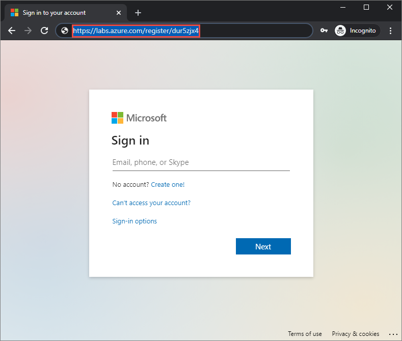
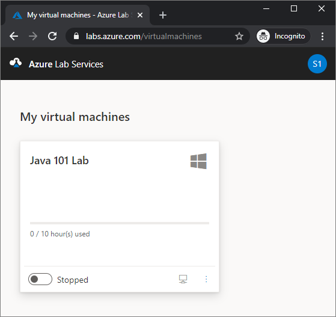

# Tutorial: Access a classroom lab in Azure Lab Services
In this tutorial, you, as a student, connect to a virtual machine (VM) in a classroom lab. 

In this tutorial, you do the following actions:

> [!div class="checklist"]
> * Register to the lab
> * Start the VM
> * Connect to the VM

## Register to the lab

1. Navigate to the **registration URL** that you received from the educator. You don't need to use the registration URL after you complete the registration. Instead, use the URL: [https://labs.azure.com](https://labs.azure.com). Internet Explorer 11 isn't supported yet. 

    
1. Sign in to the service using your school account to complete the registration. 

    > [!NOTE]
    > A Microsoft account is required for using Azure Lab Services. If you are trying to use your non-Microsoft account such as Yahoo or Google accounts to sign in to the portal, follow instructions to create a Microsoft account that will be linked to your non-Microsoft account. Then, follow the steps to complete the registration process. 
1. Once registered, confirm that you see the virtual machine for the lab you have access to. 

    
1. Wait until the virtual machine is ready. On the VM tile, notice the following fields:
    1. At the top of the tile, you see the **name of the lab**.
    1. To its right, you see the icon representing the **operating system (OS)** of the VM. In this example, it's Windows OS. 
    1. The progress bar on the tile shows the number of hours used against the number of [quota hours](how-to-configure-student-usage.md#set-quotas-for-users) assigned to you. This time is the additional time allotted to you in addition to the scheduled time for the lab. 
    1. You see icons/buttons at the bottom of the tile to start/stop the VM, and connect to the VM. 
    1. To the right of the buttons, you see the status of the VM. Confirm that you see the status of the VM is **Stopped**. 

        

## Start the VM
1. **Start** the VM by selecting the first button as shown in the following image. This process takes some time.  

    
4. Confirm that the status of the VM is set to **Running**. 

    

    Notice that the icon of the first button changed to represent a **stop** operation. You can select this button to stop the VM. 

## Connect to the VM

1. Select the second button as shown in the following image to **connect** to the lab's VM. 

    
2. Do one of the following steps: 
    1. For **Windows** virtual machines, save the **RDP** file to the hard disk. Open the RDP file to connect to the virtual machine. Use the **user name** and **password** you get from your educator to sign in to the machine. 
    3. For **Linux** virtual machines, you can use **SSH** or **RDP** (if it's enabled) to connect to them. For more information, see [Enable remote desktop connection for Linux machines](how-to-enable-remote-desktop-linux.md). 

## Next steps
In this tutorial, you accessed a classroom lab using the registration link you get from your educator.

As a lab owner, you want to view who has registered with your lab and track the usage of VMs. Advance to the next tutorial to learn how to track the usage of the lab:

> [!div class="nextstepaction"]
> [Track usage of a lab](tutorial-track-usage.md) 
