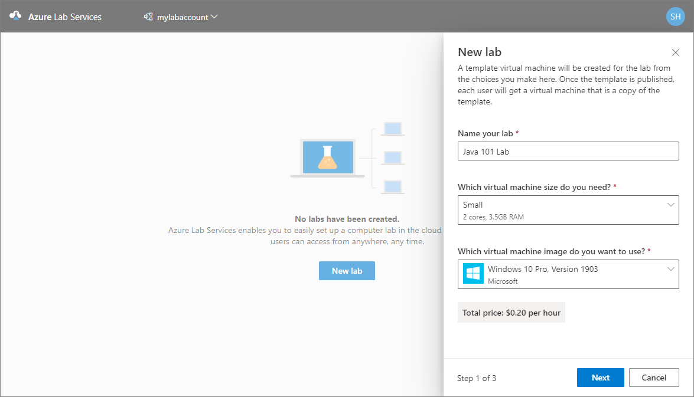
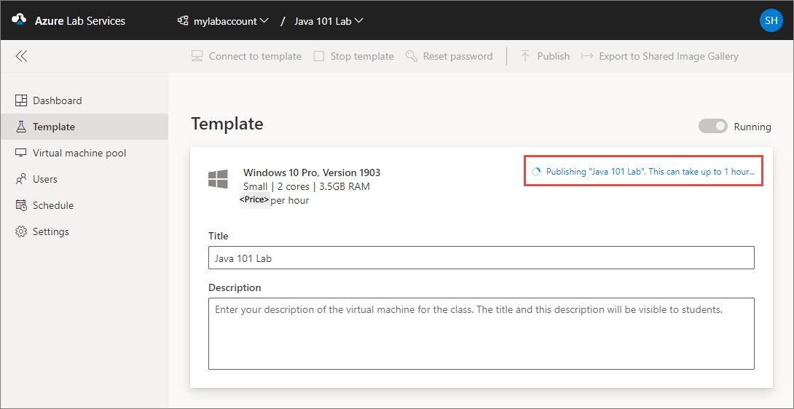
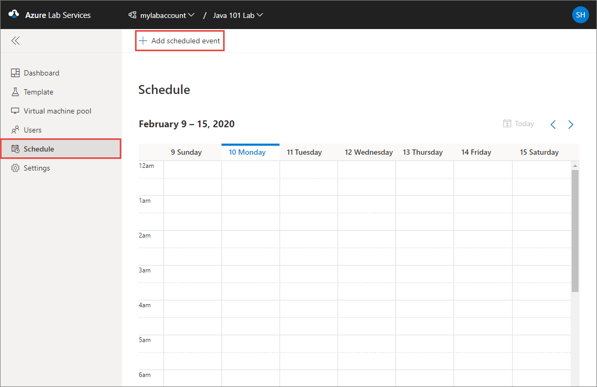
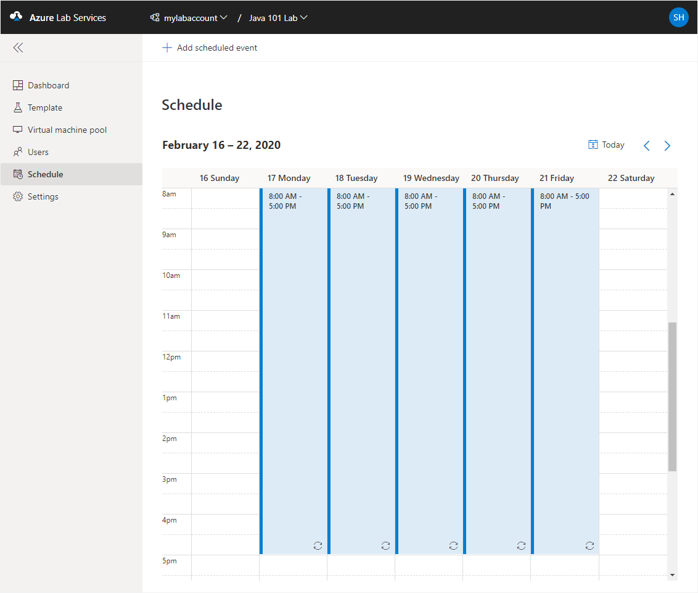

# Tutorial: Set up a classroom lab 
In this tutorial, you set up a classroom lab with virtual machines that are used by students in the classroom.  

In this tutorial, you do the following actions:

> [!div class="checklist"]
> * Create a classroom lab
> * Add users to the lab
> * Set schedule for the lab
> * Send invitation email to students

## Prerequisites
In this tutorial, you set up a lab with virtual machines for your class. To set up a classroom lab in a lab account, you must be a member of one of these roles in the lab account: Owner, Lab Creator, or Contributor. The account you used to create a lab account is automatically added to the owner role. So, you can use the user account that you used to create a lab account to create a classroom lab. 

Here is the typical workflow when using Azure Lab Services:

1. A lab account creator adds other users to the **Lab Creator** role. For example, the lab account creator/admin adds educators to the **Lab Creator** role so that they can create labs for their classes. 
2. Then, the educators create labs with VMs for their classes and send registration links to students in the class. 
3. Students use the registration link that they receive from educators to register to the lab. Once they are registered, they can use VMs in the labs to do the class work and home work. 

## Create a classroom lab
In this step, you create a lab for your class in Azure. 

1. Navigate to [Azure Lab Services website](https://labs.azure.com). Note that Internet Explorer 11 is not supported yet. 
2. Select **Sign in** and enter your credentials. Azure Lab Services supports organizational accounts and Microsoft accounts. 
3. Select **New lab**. 
    
    
4. In the **New Lab** window, do the following actions: 
    1. Specify a **name** for your lab, and select **Next**.  

        
    2. On the **Virtual machine credentials** page, specify default credentials for all VMs in the lab. Specify the **name** and the **password** for the user, and then select **Next**.  

        

        > [!IMPORTANT]
        > Make a note of user name and password. They won't be shown again.
    3. On the **Lab policies** page, select **Finish**. 

        
5. You should see the following screen that shows the status of the template VM creation. This operation takes up to 20 minutes. 

    
8. On the **Template** page, do the following steps: These steps are **optional** for the tutorial.

    1. Connect to the template VM by selecting **Connect**. If it's a Linux template VM, you choose whether you want to connect using SSH or RDP (if RDP is enabled).
    3. Install and configure software required for your class on the template VM. 
    4. **Stop** the template VM.  

    > [!NOTE]
    > Template VMs incur **cost** when running, so ensure that the template VM is shutdown when you don’t need it to be running. 

## Publish the template VM
In this step, you publish the template VM. When you publish the template VM, Azure Lab Services creates VMs in the lab by using the template. All virtual machines have the same configuration as the template.

1. On the **Template** page, select **Publish** on the toolbar. 

    

    > [!WARNING]
    > Once you publish, you can't unpublish. 
2. On the **Publish template** page, enter the number of virtual machines you want to create in the lab, and then select **Publish**. 

    
3. You see the **status of publishing** the template on page. This process can take up to an hour. 

    
4. Wait until the publishing is complete and then switch to the **Virtual machines pool** page by selecting **Virtual machines** on the left menu or by selecting **Virtual machines** tile. Confirm that you see virtual machines that are in **Unassigned** state. These VMs are not assigned to students yet. They should be in **Stopped** state. You can start a student VM, connect to the VM, stop the VM, and delete the VM on this page. You can start them in this page or let your students start the VMs. 

       

    > [!NOTE]
    > When an educator turns on a student VM, quota for the student isn't affected. Quota for a user specifies the number of lab hours available to the user outside of the scheduled class time. For more information on quotas, see [Set quotas for users](how-to-configure-student-usage.md?#set-quotas-for-users).

## Set a schedule for the lab
Create a scheduled event for the lab so that VMs in the lab are automatically started/stopped at specific times. The user quota (default: 10 hours) you specified earlier is the additional time assigned to each user outside this scheduled time. 

1. Switch to the **Schedules** page, and select **Add scheduled event** on the toolbar. 

    
2. On the **Add scheduled event** page, do the following steps:
    1. Confirm that **Standard** is selected the **Event type**.  
    2. Select the **start date** for the class. 
    4. Select the **start time** at which you want the VMs to be started.
    5. Select the **stop time** at which the VMs are to be shut down. 
    6. Select the **time zone** for the start and stop times you specified. 
3. On the same **Add scheduled event** page, select the current schedule in the **Repeat** section.  

    
5. On the **Repeat** dialog box, do the following steps:
    1. Confirm that **every week** is set for the **Repeat** field. 
    2. Select the days on which you want the schedule to take effect. In the following example, Monday-Friday is selected. 
    3. Select an **end date** for the schedule.
    8. Select **Save**. 

        

3. Now, on the **Add scheduled event** page, for **Notes (optional)**, enter any description or notes for the schedule. 
4. On the **Add scheduled event** page, select **Save**. 

    
5. Navigate to the start date in the calendar to verify that the schedule is set.
    
    

    For more information about creating and managing schedules for a class, see [Create and manage schedule for labs](how-to-create-schedules.md).

## Add users to the lab

When you add users, by default, the **Restrict access** option is turned on and, unless they're in the list of users, students can't register with the lab even if they have a registration link. Only listed users can register with the lab by using the registration link you send. You can turn off **Restrict access**, which allows students to register with the lab as long as they have the registration link. 

### Add users from an Azure AD group

You can sync a lab user list to an existing Azure Active Directory (Azure AD) group so that you do not have to manually add or delete users. 

An Azure AD group can be created within your organization's Azure Active Directory to manage access to organizational resources and cloud-based apps. To learn more, see [Azure AD groups](https://docs.microsoft.com/azure/active-directory/fundamentals/active-directory-manage-groups). If your organization uses Microsoft Office 365 or Azure services, your organization will already have admins who manage your Azure Active Directory. 

> [!IMPORTANT]
> Make sure the user list is empty. If there are existing users inside a lab that you added manually or through importing a CSV file, the option to sync the lab to an existing group will not appear. 

1. In the left pane, select **Users**. 
1. Click **Sync from group**. 

    :::image type="content" source="./media/how-to-configure-student-usage/add-users-sync-group.png" alt-text="Add users by syncing from an Azure AD group":::
    
1. You will be prompted to pick an existing Azure AD group to sync your lab to. 
    
    If you don't see an Azure AD group in the list, could be because of the following reasons:

    -	If you are a guest user for an Azure Active Directory (usually if you're outside the organization that owns the Azure AD), and you are not able to to search for groups inside the Azure AD. In this case, you won’t be able to add an Azure AD group to the lab in this case. 
    -	Azure AD groups created through Teams do not show up in this list. You can add the Azure Lab Services app inside Teams to create and manage labs directly from within it. See more information about [managing a lab’s user list from within Teams](how-to-manage-user-lists-within-teams.md). 
1. Once you picked the Azure AD group to sync your lab to, click **Add**.
1. Once a lab is synced, it will pull everyone inside the Azure AD group into the lab as users, and you will see the user list updated. Only the people in this Azure AD group will have access to your lab. The user list will refresh every 24 hours to match the latest membership of the Azure AD group. You can also click on the Sync button in the Users tab to manually sync to the latest changes in the Azure AD group.
1. Invite the users to your lab by clicking on the **Invite All** button, which will send an email to all users with the registration link to the lab. 

### Add users manually from email(s) or CSV file

In this section, you add students manually (by email address or by uploading a CSV file). 

#### Add users by email address

1. In the left pane, select **Users**. 
1. Click **Add users manually**. 

    :::image type="content" source="./media/how-to-configure-student-usage/add-users-manually.png" alt-text="Add users manually":::
1. Select **Add by email address** (default), enter the students' email addresses on separate lines or on a single line separated by semicolons. 

    :::image type="content" source="./media/how-to-configure-student-usage/add-users-email-addresses.png" alt-text="Add users' email addresses":::
1. Select **Save**. 

    The list displays the email addresses and statuses of the current users, whether they're registered with the lab or not. 

    :::image type="content" source="./media/how-to-configure-student-usage/list-of-added-users.png" alt-text="Users list":::

    > [!NOTE]
    > After the students are registered with the lab, the list displays their names. The name that's shown in the list is constructed by using the first and last names of the students in Azure Active Directory. 

#### Add users by uploading a CSV file

You can also add users by uploading a CSV file that contains their email addresses. 

A CSV text file is used to store comma-separated (CSV) tabular data (numbers and text). Instead of storing information in columns fields (such as in spreadsheets), a CSV file stores information separated by commas. Each line in a CSV file will have the same number of comma-separated "fields." You can use Excel to easily create and edit CSV files.

1. In Microsoft Excel, create a CSV file that lists students' email addresses in one column.

    :::image type="content" source="./media/how-to-configure-student-usage/csv-file-with-users.png" alt-text="List of users in a CSV file":::
1. At the top of the **Users** pane, select **Add users**, and then select **Upload CSV**.
1. Select the CSV file that contains the students' email addresses, and then select **Open**.

    The **Add users** window displays the email address list from the CSV file. 
1. Select **Save**. 
1. In the **Users** pane, view the list of added students. 

    :::image type="content" source="./media/how-to-configure-student-usage/list-of-added-users.png" alt-text="List of added users in the Users pane"::: 

## Send invitation emails to users

1. Switch to the **Users** view if you are not on the page already, and select **Invite all** on the toolbar. 

    
1. On the **Send invitation by email** page, enter an optional message, and then select **Send**. The email automatically includes the registration link. You can get this registration link by selecting **... (ellipsis)** on the toolbar, and **Registration link**. 

    
4. You see the status of **invitation** in the **Users** list. The status should change to **Sending** and then to **Sent on &lt;date&gt;**. 

For more information about adding students to a class and managing their usage of the lab, see [How to configure student usage](how-to-configure-student-usage.md).

## Next steps
In this tutorial, you created a lab for your class in Azure. To learn how a student can access a VM in the lab using the registration link, advance to the next tutorial:

> [!div class="nextstepaction"]
> [Connect to a VM in the classroom lab](tutorial-connect-virtual-machine-classroom-lab.md)

