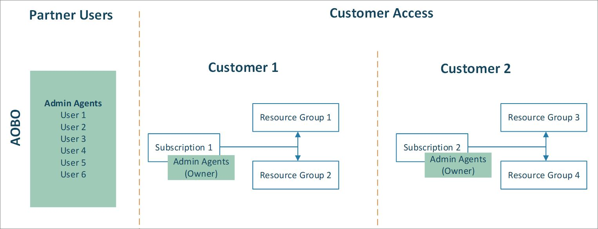

# Azure Lighthouse and the Cloud Solution Provider program

If you're a [CSP (Cloud Solution Provider)](/partner-center/csp-overview) partner, you can already access the Azure subscriptions created for your customers through the CSP program by using the [Administer On Behalf Of (AOBO)](https://channel9.msdn.com/Series/cspdev/Module-11-Admin-On-Behalf-Of-AOBO) functionality. This access allows you to directly support, configure, and manage your customers' subscriptions.

With [Azure Lighthouse](../overview.md), you can use Azure delegated resource management along with AOBO. This helps improve security and reduces unnecessary access by enabling more granular permissions for your users. It also allows for greater efficiency and scalability, as your users can work across multiple customer subscriptions using a single login in your tenant.

> [!TIP]
> To help safeguard customer resources, be sure to review and follow our [recommended security practices](recommended-security-practices.md) along with the [partner security requirements](/partner-center/partner-security-requirements).

## Administer on Behalf of (AOBO)

With AOBO, any user with the [Admin Agent](/partner-center/permissions-overview#manage-commercial-transactions-in-partner-center-azure-ad-and-csp-roles) role in your tenant will have AOBO access to Azure subscriptions that you create through the CSP program. Any users who need access to any customers' subscriptions must be a member of this group. AOBO doesn’t allow the flexibility to create distinct groups that work with different customers, or to enable different roles for groups or users.

## Azure delegated resource management

Using Azure Lighthouse, you can assign different groups to different customers or roles, as shown in the following diagram. Because users will have the appropriate level of access through Azure delegated resource management, you can reduce the number of users who have the Admin Agent role (and thus have full AOBO access). This helps improve security by limiting unnecessary access to your customers' resources. It also gives you more flexibility to manage multiple customers at scale.

Onboarding a subscription that you created through the CSP program follows the steps described in [Onboard a subscription to Azure Lighthouse](../how-to/onboard-customer.md). Any user who has the Admin Agent role in your tenant can perform this onboarding.

> [!TIP]
> [Managed Service offers](managed-services-offers.md) with private plans are not supported with subscriptions established through a reseller of the Cloud Solution Provider (CSP) program. You can onboard these subscriptions to Azure Lighthouse by [using Azure Resource Manager templates](../how-to/onboard-customer.md).

> [!NOTE]
> The [**My customers** page in the Azure portal](../how-to/view-manage-customers.md) now includes a **Cloud Solution Provider (Preview)** section, which displays billing info and resources for CSP customers who have [signed the Microsoft Customer Agreement (MCA)](/partner-center/confirm-customer-agreement) and are [under the Azure plan](/partner-center/azure-plan-get-started). For more info, see [Get started with your Microsoft Partner Agreement billing account](../../cost-management-billing/understand/mpa-overview.md).
>
> CSP customers may appear in this section whether or not they have also been onboarded to Azure Lighthouse. If they have, they'll also appear in the **Customers** section, as described in [View and manage customers and delegated resources](../how-to/view-manage-customers.md). Similarly, a CSP customer does not have to appear in the **Cloud Solution Provider (Preview)** section of **My customers** in order for you to onboard them to Azure Lighthouse.

## Next steps

- Learn about [cross-tenant management experiences](cross-tenant-management-experience.md).
- Learn how to [onboard a subscription to Azure Lighthouse](../how-to/onboard-customer.md).
- Learn about the [Cloud Solution Provider program](/partner-center/csp-overview).
