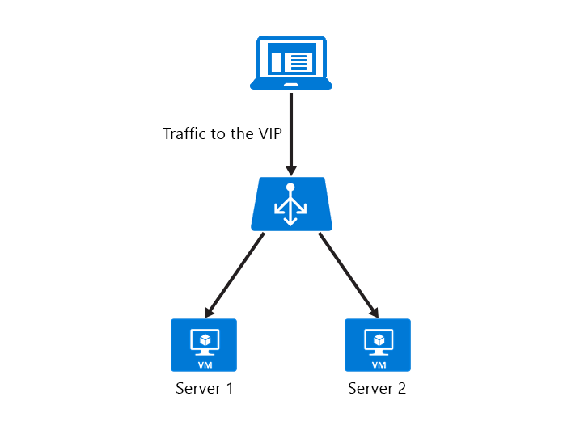

# Configure TCP idle timeout settings for Azure Load Balancer

[!INCLUDE [load-balancer-basic-sku-include.md](../../includes/load-balancer-basic-sku-include.md)]

In its default configuration, Azure Load Balancer has an idle timeout setting of 4 minutes. If a period of inactivity is longer than the timeout value, there's no guarantee that the TCP or HTTP session is maintained between the client and your cloud service.

When the connection is closed, your client application may receive the following error message: "The underlying connection was closed: A connection that was expected to be kept alive was closed by the server."

A common practice is to use a TCP keep-alive. This practice keeps the connection active for a longer period. For more information, see these [.NET examples](https://msdn.microsoft.com/library/system.net.servicepoint.settcpkeepalive.aspx). With keep-alive enabled, packets are sent during periods of inactivity on the connection. These keep-alive packets ensure that the idle timeout value is never reached and the connection is maintained for a long period.

This setting works for inbound connections only. To avoid losing the connection, you must configure the TCP keep-alive with an interval less than the idle timeout setting or increase the idle timeout value. To support such scenarios, we've added support for a configurable idle timeout. You can now set it for a duration of 4 to 30 minutes.

TCP keep-alive works well for scenarios where battery life is not a constraint. It is not recommended for mobile applications. Using a TCP keep-alive in a mobile application can drain the device battery faster.



The following sections describe how to change idle timeout settings in virtual machines and cloud services.

## Configure the TCP timeout for your instance-level public IP to 15 minutes

```powershell
Set-AzurePublicIP -PublicIPName webip -VM MyVM -IdleTimeoutInMinutes 15
```

`IdleTimeoutInMinutes` is optional. If it is not set, the default timeout is 4 minutes. The acceptable timeout range is 4 to 30 minutes.

## Set the idle timeout when creating an Azure endpoint on a virtual machine

To change the timeout setting for an endpoint, use the following:

```powershell
Get-AzureVM -ServiceName "mySvc" -Name "MyVM1" | Add-AzureEndpoint -Name "HttpIn" -Protocol "tcp" -PublicPort 80 -LocalPort 8080 -IdleTimeoutInMinutes 15| Update-AzureVM
```

To retrieve your idle timeout configuration, use the following command:

    PS C:\> Get-AzureVM -ServiceName "MyService" -Name "MyVM" | Get-AzureEndpoint
    VERBOSE: 6:43:50 PM - Completed Operation: Get Deployment
    LBSetName : MyLoadBalancedSet
    LocalPort : 80
    Name : HTTP
    Port : 80
    Protocol : tcp
    Vip : 65.52.xxx.xxx
    ProbePath :
    ProbePort : 80
    ProbeProtocol : tcp
    ProbeIntervalInSeconds : 15
    ProbeTimeoutInSeconds : 31
    EnableDirectServerReturn : False
    Acl : {}
    InternalLoadBalancerName :
    IdleTimeoutInMinutes : 15

## Set the TCP timeout on a load-balanced endpoint set

If endpoints are part of a load-balanced endpoint set, the TCP timeout must be set on the load-balanced endpoint set. For example:

```powershell
Set-AzureLoadBalancedEndpoint -ServiceName "MyService" -LBSetName "LBSet1" -Protocol tcp -LocalPort 80 -ProbeProtocolTCP -ProbePort 8080 -IdleTimeoutInMinutes 15
```

## Change timeout settings for cloud services

You can use the Azure SDK to update your cloud service. You make endpoint settings for cloud services in the .csdef file. Updating the TCP timeout for deployment of a cloud service requires a deployment upgrade. An exception is if the TCP timeout is specified only for a public IP. Public IP settings are in the .cscfg file, and you can update them through deployment update and upgrade.

The .csdef changes for endpoint settings are:

```xml
<WorkerRole name="worker-role-name" vmsize="worker-role-size" enableNativeCodeExecution="[true|false]">
    <Endpoints>
    <InputEndpoint name="input-endpoint-name" protocol="[http|https|tcp|udp]" localPort="local-port-number" port="port-number" certificate="certificate-name" loadBalancerProbe="load-balancer-probe-name" idleTimeoutInMinutes="tcp-timeout" />
    </Endpoints>
</WorkerRole>
```

The .cscfg changes for the timeout setting on public IPs are:

```xml
<NetworkConfiguration>
    <VirtualNetworkSite name="VNet"/>
    <AddressAssignments>
    <InstanceAddress roleName="VMRolePersisted">
    <PublicIPs>
        <PublicIP name="public-ip-name" idleTimeoutInMinutes="timeout-in-minutes"/>
    </PublicIPs>
    </InstanceAddress>
    </AddressAssignments>
</NetworkConfiguration>
```

## REST API example

You can configure the TCP idle timeout by using the service management API. Make sure that the `x-ms-version` header is set to version `2014-06-01` or later. Update the configuration of the specified load-balanced input endpoints on all virtual machines in a deployment.

### Request

    POST https://management.core.windows.net/<subscription-id>/services/hostedservices/<cloudservice-name>/deployments/<deployment-name>

### Response

```xml
<LoadBalancedEndpointList xmlns="http://schemas.microsoft.com/windowsazure" xmlns:i="https://www.w3.org/2001/XMLSchema-instance">
    <InputEndpoint>
    <LoadBalancedEndpointSetName>endpoint-set-name</LoadBalancedEndpointSetName>
    <LocalPort>local-port-number</LocalPort>
    <Port>external-port-number</Port>
    <LoadBalancerProbe>
        <Path>path-of-probe</Path>
        <Port>port-assigned-to-probe</Port>
        <Protocol>probe-protocol</Protocol>
        <IntervalInSeconds>interval-of-probe</IntervalInSeconds>
        <TimeoutInSeconds>timeout-for-probe</TimeoutInSeconds>
    </LoadBalancerProbe>
    <LoadBalancerName>name-of-internal-loadbalancer</LoadBalancerName>
    <Protocol>endpoint-protocol</Protocol>
    <IdleTimeoutInMinutes>15</IdleTimeoutInMinutes>
    <EnableDirectServerReturn>enable-direct-server-return</EnableDirectServerReturn>
    <EndpointACL>
        <Rules>
        <Rule>
            <Order>priority-of-the-rule</Order>
            <Action>permit-rule</Action>
            <RemoteSubnet>subnet-of-the-rule</RemoteSubnet>
            <Description>description-of-the-rule</Description>
        </Rule>
        </Rules>
    </EndpointACL>
    </InputEndpoint>
</LoadBalancedEndpointList>
```

## Next steps

[Internal load balancer overview](load-balancer-internal-overview.md)

[Get started configuring an Internet-facing load balancer](load-balancer-get-started-internet-arm-ps.md)

[Configure a load balancer distribution mode](load-balancer-distribution-mode.md)
