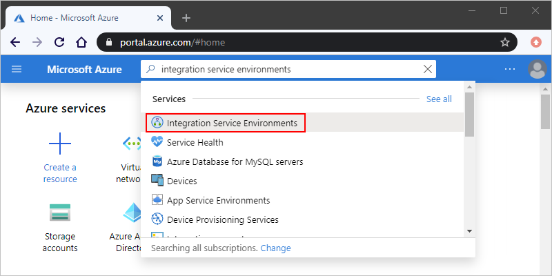
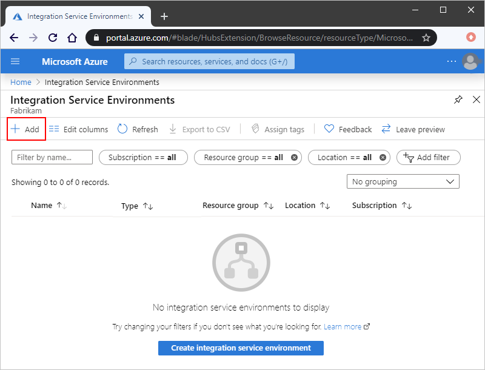
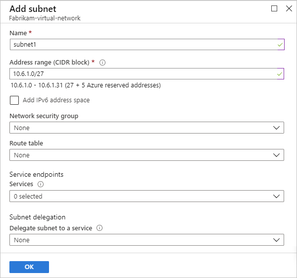
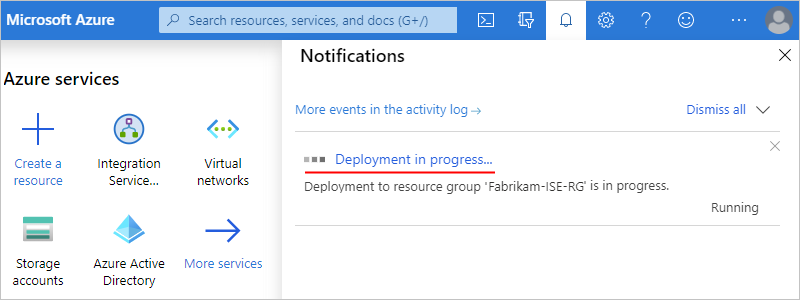
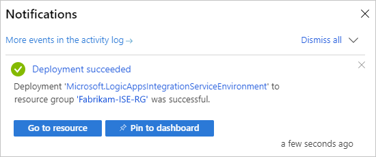

# Connect to Azure virtual networks from Azure Logic Apps by using an integration service environment (ISE)

For scenarios where your logic apps and integration accounts need access to an [Azure virtual network](../virtual-network/virtual-networks-overview.md), create an [*integration service environment* (ISE)](../logic-apps/connect-virtual-network-vnet-isolated-environment-overview.md). An ISE is a dedicated environment that uses dedicated storage and other resources that are kept separate from the "global" multi-tenant Logic Apps service. This separation also reduces any impact that other Azure tenants might have on your apps' performance. An ISE also provides you with your own static IP addresses. These IP addresses are separate from the static IP addresses that are shared by the logic apps in the public, multi-tenant service.

When you create an ISE, Azure *injects* that ISE into your Azure virtual network, which then deploys the Logic Apps service into your virtual network. When you create a logic app or integration account, select your ISE as their location. Your logic app or integration account can then directly access resources, such as virtual machines (VMs), servers, systems, and services, in your virtual network.

> [!IMPORTANT]
> For logic apps and integration accounts to work together in an ISE, both must use the *same ISE* as their location.

An ISE has increased limits on run duration, storage retention, throughput, HTTP request and response timeouts, message sizes, and custom connector requests. For more information, see [Limits and configuration for Azure Logic Apps](../logic-apps/logic-apps-limits-and-config.md). To learn more about ISEs, see [Access to Azure Virtual Network resources from Azure Logic Apps](../logic-apps/connect-virtual-network-vnet-isolated-environment-overview.md).

This article shows you how to complete these tasks by using the Azure portal:

* Enable access for your ISE.
* Create your ISE.
* Add extra capacity to your ISE.

You can also create an ISE by using the [sample Azure Resource Manager quickstart template](https://github.com/Azure/azure-quickstart-templates/tree/master/201-integration-service-environment) or by using the Logic Apps REST API, including setting up customer-managed keys:

* [Create an integration service environment (ISE) by using the Logic Apps REST API](../logic-apps/create-integration-service-environment-rest-api.md)
* [Set up customer-managed keys to encrypt data at rest for ISEs](../logic-apps/customer-managed-keys-integration-service-environment.md)

## Prerequisites

* An Azure account and subscription. If you don't have an Azure subscription, [sign up for a free Azure account](https://azure.microsoft.com/free/).

  > [!IMPORTANT]
  > Logic apps, built-in triggers, built-in actions, and connectors that run in your ISE use a pricing plan 
  > different from the consumption-based pricing plan. To learn how pricing and billing work for ISEs, see the 
  > [Logic Apps pricing model](../logic-apps/logic-apps-pricing.md#fixed-pricing). 
  > For pricing rates, see [Logic Apps pricing](../logic-apps/logic-apps-pricing.md).

* An [Azure virtual network](../virtual-network/virtual-networks-overview.md). Your virtual network needs to have four *empty* subnets, which are required for creating and deploying resources in your ISE and are used by these internal and hidden components:

  * Logic Apps Compute
  * Internal App Service Environment (connectors)
  * Internal API Management (connectors)
  * Internal Redis for caching and performance
  
  You can create the subnets in advance, or you can wait until you create your ISE so that you can create subnets at the same time. However, before you create your subnets, review the [subnet requirements](#create-subnet).

  > [!IMPORTANT]
  >
  > Don't use the following IP address spaces for your virtual network or subnets because they aren't resolvable by Azure Logic Apps:

  > 
  > * 0.0.0.0/8
  > * 100.64.0.0/10
  > * 127.0.0.0/8
  > * 168.63.129.16/32
  > * 169.254.169.254/32

  * Make sure that your virtual network [enables access for your ISE](#enable-access) so that your ISE can work correctly and stay accessible.

  * If you use or want to use [ExpressRoute](../expressroute/expressroute-introduction.md) along with [forced tunneling](../firewall/forced-tunneling.md), you must [create a route table](../virtual-network/manage-route-table.md) with the following specific route, and link the route table to each subnet that's used by your ISE:

    **Name**: <*route-name*> 
    **Address prefix**: 0.0.0.0/0 
    **Next hop**: Internet
    
    This specific route table is required so that Logic Apps components can communicate with other dependent Azure Services, such as Azure Storage and Azure SQL DB. For more information about this route, see [0.0.0.0/0 address prefix](../virtual-network/virtual-networks-udr-overview.md#default-route). If you don't use forced tunneling with ExpressRoute, you don't need this specific route table.
    
    ExpressRoute lets you extend your on-premises networks into Microsoft cloud and connect to Microsoft cloud services over a private connection that's facilitated by the connectivity provider. Specifically, ExpressRoute is a virtual private network that routes traffic over a private network, rather than through the public internet. Your logic apps can connect to on-premises resources that are in the same virtual network when they connect through ExpressRoute or a virtual private network.
   
  * If you use a [network virtual appliance (NVA)](../virtual-network/virtual-networks-udr-overview.md#user-defined), make sure that you don't enable TLS/SSL termination or change the outbound TLS/SSL traffic. Also, make sure that you don't enable inspection for traffic that originates from your ISE's subnet. For more information, see [Virtual network traffic routing](../virtual-network/virtual-networks-udr-overview.md).

  * If you want to use custom DNS servers for your Azure virtual network, [set up those servers by following these steps](../virtual-network/virtual-networks-name-resolution-for-vms-and-role-instances.md) before you deploy your ISE to your virtual network. For more information about managing DNS server settings, see [Create, change, or delete a virtual network](../virtual-network/manage-virtual-network.md#change-dns-servers).

    > [!NOTE]
    > If you change your DNS server or DNS server settings, you must restart your ISE so that the ISE can pick up those changes. For more information, see [Restart your ISE](../logic-apps/ise-manage-integration-service-environment.md#restart-ISE).

## Enable access for ISE

When you use an ISE with an Azure virtual network, a common setup problem is having one or more blocked ports. The connectors that you use for creating connections between your ISE and destination systems might also have their own port requirements. For example, if you communicate with an FTP system by using the FTP connector, the port that you use on your FTP system needs to be available, for example, port 21 for sending commands.

To make sure that your ISE is accessible and that the logic apps in that ISE can communicate across each subnet in your virtual network, [open the ports described in this table for each subnet](#network-ports-for-ise). If any required ports are unavailable, your ISE won't work correctly.

* If you have multiple ISE instances that need access to other endpoints that have IP restrictions, deploy an [Azure Firewall](../firewall/overview.md) or a [network virtual appliance](../virtual-network/virtual-networks-overview.md#filter-network-traffic) into your virtual network and route outbound traffic through that firewall or network virtual appliance. You can then [set up a single, outbound, public, static, and predictable IP address](connect-virtual-network-vnet-set-up-single-ip-address.md) that all the ISE instances in your virtual network can use to communicate with destination systems. That way, you don't have to set up additional firewall openings at those destination systems for each ISE.

   > [!NOTE]
   > You can use this approach for a single ISE when your scenario requires limiting the 
   > number of IP addresses that need access. Consider whether the additional costs for 
   > the firewall or virtual network appliance make sense for your scenario. Learn more about 
   > [Azure Firewall pricing](https://azure.microsoft.com/pricing/details/azure-firewall/).

* If you created a new Azure virtual network and subnets without any constraints, you don't need to set up [network security groups (NSGs)](../virtual-network/network-security-groups-overview.md#network-security-groups) in your virtual network to control traffic across subnets.

* For an existing virtual network, you can *optionally* set up [network security groups (NSGs)](../virtual-network/network-security-groups-overview.md#network-security-groups) to [filter network traffic across subnets](../virtual-network/tutorial-filter-network-traffic.md). If you want to go this route, or if you're already using NSGs, make sure that you [open the ports described in this table](#network-ports-for-ise) for those NSGs.

  When you set up [NSG security rules](../virtual-network/network-security-groups-overview.md#security-rules), you need to use *both* the **TCP** and **UDP** protocols, or you can select **Any** instead so you don't have to create separate rules for each protocol. NSG security rules describe the ports that you must open for the IP addresses that need access to those ports. Make sure that any firewalls, routers, or other items that exist between these endpoints also keep those ports accessible to those IP addresses.

* If you set up forced tunneling through your firewall to redirect Internet-bound traffic, review the [additional forced tunneling requirements](#forced-tunneling).

### Network ports used by your ISE

This table describes the ports that your ISE requires to be accessible and the purpose for those ports. To help reduce complexity when you set up security rules, the table uses [service tags](../virtual-network/service-tags-overview.md) that represent groups of IP address prefixes for a specific Azure service. Where noted, *internal ISE* and *external ISE* refer to the [access endpoint that's selected during ISE creation](connect-virtual-network-vnet-isolated-environment.md#create-environment). For more information, see [Endpoint access](../logic-apps/connect-virtual-network-vnet-isolated-environment-overview.md#endpoint-access).

> [!IMPORTANT]
> For all rules, make sure that you set source ports to `*` because source ports are ephemeral.

#### Inbound security rules

| Purpose | Source service tag or IP addresses | Source ports | Destination service tag or IP addresses | Destination ports | Notes |
|---------|------------------------------------|--------------|-----------------------------------------|-------------------|-------|
| Intersubnet communication within virtual network | Address space for the virtual network with ISE subnets | * | Address space for the virtual network with ISE subnets | * | Required for traffic to flow *between* the subnets in your virtual network. 

**Important**: For traffic to flow between the *components* in each subnet, make sure that you open all the ports within each subnet. |
| Both: 
Communication to your logic app 

Runs history for logic app| Internal ISE:  **VirtualNetwork** 

External ISE: **Internet** or see **Notes** | * | **VirtualNetwork** | 443 | Rather than use the **Internet** service tag, you can specify the source IP address for these items: 

- The computer or service that calls any request triggers or webhooks in your logic app 
- The computer or service from where you want to access logic app runs history 

**Important**: Closing or blocking this port prevents calls to logic apps that have request triggers or webhooks. You're also prevented from accessing inputs and outputs for each step in runs history. However, you're not prevented from accessing logic app runs history.|
| Logic Apps designer - dynamic properties | **LogicAppsManagement** | * | **VirtualNetwork** | 454 | Requests come from the Logic Apps access endpoint's [inbound IP addresses](../logic-apps/logic-apps-limits-and-config.md#inbound) for that region. |
| Connector deployment | **AzureConnectors** | * | **VirtualNetwork** | 454 | Required to deploy and update connectors. Closing or blocking this port causes ISE deployments to fail and prevents connector updates and fixes. |
| Network health check | **LogicApps** | * | **VirtualNetwork** | 454 | Requests come from the Logic Apps access endpoint's [inbound IP addresses](../logic-apps/logic-apps-limits-and-config.md#inbound) and [outbound IP addresses](../logic-apps/logic-apps-limits-and-config.md#outbound) for that region. |
| App Service Management dependency | **AppServiceManagement** | * | **VirtualNetwork** | 454, 455 ||
| Communication from Azure Traffic Manager | **AzureTrafficManager** | * | **VirtualNetwork** | Internal ISE: 454 

External ISE: 443 ||
| Both: 
Connector policy deployment 
API Management - management endpoint | **APIManagement** | * | **VirtualNetwork** | 3443 | For connector policy deployment, port access is required to deploy and update connectors. Closing or blocking this port causes ISE deployments to fail and prevents connector updates and fixes. |
| Access Azure Cache for Redis Instances between Role Instances | **VirtualNetwork** | * | **VirtualNetwork** | 6379 - 6383, plus see **Notes**| For ISE to work with Azure Cache for Redis, you must open these [outbound and inbound ports described by the Azure Cache for Redis FAQ](../azure-cache-for-redis/cache-how-to-premium-vnet.md#outbound-port-requirements). |
|||||||

#### Outbound security rules

| Purpose | Source service tag or IP addresses | Source ports | Destination service tag or IP addresses | Destination ports | Notes |
|---------|------------------------------------|--------------|-----------------------------------------|-------------------|-------|
| Intersubnet communication within virtual network | Address space for the virtual network with ISE subnets | * | Address space for the virtual network with ISE subnets | * | Required for traffic to flow *between* the subnets in your virtual network. 

**Important**: For traffic to flow between the *components* in each subnet, make sure that you open all the ports within each subnet. |
| Communication from your logic app | **VirtualNetwork** | * | Varies based on destination | 80, 443 | Destination varies based on the endpoints for the external service with which your logic app needs to communicate. |
| Azure Active Directory | **VirtualNetwork** | * | **AzureActiveDirectory** | 80, 443 ||
| Azure Storage dependency | **VirtualNetwork** | * | **Storage** | 80, 443, 445 ||
| Connection management | **VirtualNetwork** | * | **AppService** | 443 ||
| Publish diagnostic logs & metrics | **VirtualNetwork** | * | **AzureMonitor** | 443 ||
| Azure SQL dependency | **VirtualNetwork** | * | **SQL** | 1433 ||
| Azure Resource Health | **VirtualNetwork** | * | **AzureMonitor** | 1886 | Required for publishing health status to Resource Health. |
| Dependency from Log to Event Hub policy and monitoring agent | **VirtualNetwork** | * | **EventHub** | 5672 ||
| Access Azure Cache for Redis Instances between Role Instances | **VirtualNetwork** | * | **VirtualNetwork** | 6379 - 6383, plus see **Notes**| For ISE to work with Azure Cache for Redis, you must open these [outbound and inbound ports described by the Azure Cache for Redis FAQ](../azure-cache-for-redis/cache-how-to-premium-vnet.md#outbound-port-requirements). |
| DNS name resolution | **VirtualNetwork** | * | IP addresses for any custom Domain Name System (DNS) servers on your virtual network | 53 | Required only when you use custom DNS servers on your virtual network |
|||||||

In addition, you need to add outbound rules for [App Service Environment (ASE)](../app-service/environment/intro.md):

* If you use Azure Firewall, you need to set up your firewall with the App Service Environment (ASE) [fully qualified domain name (FQDN) tag](../firewall/fqdn-tags.md#current-fqdn-tags), which permits outbound access to ASE platform traffic.

* If you use a firewall appliance other than Azure Firewall, you need to set up your firewall with *all* the rules listed in the [firewall integration dependencies](../app-service/environment/firewall-integration.md#dependencies) that are required for App Service Environment.

#### Forced tunneling requirements

If you set up or use [forced tunneling](../firewall/forced-tunneling.md) through your firewall, you have to permit additional external dependencies for your ISE. Forced tunneling lets you redirect Internet-bound traffic to a designated next hop, such as your virtual private network (VPN) or to a virtual appliance, rather than to the Internet so that you can inspect and audit outbound network traffic.

Usually, all ISE outbound dependency traffic travels through the virtual IP address (VIP) that is provisioned with your ISE. However, if you change the traffic routing either to or from your ISE, you need to permit the following outbound dependencies on your firewall by setting their next hop to `Internet`. If you use Azure Firewall, follow the [instructions to set up your firewall with your App Service Environment](../app-service/environment/firewall-integration.md#configuring-azure-firewall-with-your-ase).

If you don't permit access for these dependencies, your ISE deployment fails and your deployed ISE stops working:

* [App Service Environment management addresses](../app-service/environment/management-addresses.md)

* [Azure API Management addresses](../api-management/api-management-using-with-vnet.md#control-plane-ips)

* [Azure Traffic Manager management addresses](https://azuretrafficmanagerdata.blob.core.windows.net/probes/azure/probe-ip-ranges.json)

* [Logic Apps inbound and outbound addresses for the ISE region](../logic-apps/logic-apps-limits-and-config.md#firewall-configuration-ip-addresses-and-service-tags)

* [Azure IP addresses for connectors in the ISE region, which are in this download file](https://www.microsoft.com/download/details.aspx?id=56519)

* You need to enable service endpoints for Azure SQL, Storage, Service Bus, and Event Hub because you can't send traffic through a firewall to these services.

## Create your ISE

1. In the [Azure portal](https://portal.azure.com), in the main Azure search box, enter `integration service environments` as your filter, and select **Integration Service Environments**.

   

1. On the **Integration Service Environments** pane, select **Add**.

   

1. Provide these details for your environment, and then select **Review + create**, for example:

   

   | Property | Required | Value | Description |
   |----------|----------|-------|-------------|
   | **Subscription** | Yes | <*Azure-subscription-name*> | The Azure subscription to use for your environment |
   | **Resource group** | Yes | <*Azure-resource-group-name*> | A new or existing Azure resource group where you want to create your environment |
   | **Integration service environment name** | Yes | <*environment-name*> | Your ISE name, which can contain only letters, numbers, hyphens (`-`), underscores (`_`), and periods (`.`). |
   | **Location** | Yes | <*Azure-datacenter-region*> | The Azure datacenter region where to deploy your environment |
   | **SKU** | Yes | **Premium** or **Developer (No SLA)** | The ISE SKU to create and use. For differences between these SKUs, see [ISE SKUs](../logic-apps/connect-virtual-network-vnet-isolated-environment-overview.md#ise-level). 

**Important**: This option is available only at ISE creation and can't be changed later. |
   | **Additional capacity** | Premium:  Yes 

Developer:  Not applicable | Premium:  0 to 10 

Developer:  Not applicable | The number of additional processing units to use for this ISE resource. To add capacity after creation, see [Add ISE capacity](../logic-apps/ise-manage-integration-service-environment.md#add-capacity). |
   | **Access endpoint** | Yes | **Internal** or **External** | The type of access endpoints to use for your ISE. These endpoints determine whether request or webhook triggers on logic apps in your ISE can receive calls from outside your virtual network. 

For example, if you want to use the following webhook-based triggers, make sure that you select **External**: 

- Azure DevOps  - Azure Event Grid  - Common Data Service  - Office 365  - SAP (ISE version) 

Your selection also affects the way that you can view and access inputs and outputs in your logic app runs history. For more information, see [ISE endpoint access](../logic-apps/connect-virtual-network-vnet-isolated-environment-overview.md#endpoint-access). 

**Important**: You can select the access endpoint only during ISE creation and can't change this option later. |
   | **Virtual network** | Yes | <*Azure-virtual-network-name*> | The Azure virtual network where you want to inject your environment so logic apps in that environment can access your virtual network. If you don't have a network, [create an Azure virtual network first](../virtual-network/quick-create-portal.md). 

**Important**: You can *only* perform this injection when you create your ISE. |
   | **Subnets** | Yes | <*subnet-resource-list*> | An ISE requires four *empty* subnets, which are required for creating and deploying resources in your ISE and are used by internal Logic Apps components, such as connectors and caching for performance. 
**Important**: Make sure that you [review the subnet requirements before continuing with these steps to create your subnets](#create-subnet). |
   |||||

   

   **Create subnets**

   Your ISE requires four *empty* subnets, which are needed to create and deploy resources in your ISE and are used by internal Logic Apps components, such as connectors and caching for performance. You *can't* change these subnet addresses after you create your environment. If you create and deploy your ISE through the Azure portal, make sure that you don't delegate these subnets to any Azure services. However, if you create and deploy your ISE through the REST API, Azure PowerShell, or an Azure Resource Manager template, you need to [delegate](../virtual-network/manage-subnet-delegation.md) one empty subnet to `Microsoft.integrationServiceEnvironment`. For more information, see [Add a subnet delegation](../virtual-network/manage-subnet-delegation.md).

   Each subnet needs to meet these requirements:

   * Uses a name that starts with either an alphabetic character or an underscore (no numbers), and doesn't use these characters: `<`, `>`, `%`, `&`, `\\`, `?`, `/`.

   * Uses the [Classless Inter-Domain Routing (CIDR) format](https://en.wikipedia.org/wiki/Classless_Inter-Domain_Routing) and a Class B address space.
   
     > [!IMPORTANT]
     >
     > Don't use the following IP address spaces for your virtual network or subnets because they aren't resolvable by Azure Logic Apps:

     > 
     > * 0.0.0.0/8
     > * 100.64.0.0/10
     > * 127.0.0.0/8
     > * 168.63.129.16/32
     > * 169.254.169.254/32

   * Uses a `/27` in the address space because each subnet requires 32 addresses. For example, `10.0.0.0/27` has 32 addresses because 2(32-27) is 25 or 32. More addresses won't provide additional benefits. To learn more about calculating addresses, see [IPv4 CIDR blocks](https://en.wikipedia.org/wiki/Classless_Inter-Domain_Routing#IPv4_CIDR_blocks).

   * If you use [ExpressRoute](../expressroute/expressroute-introduction.md), you have to [create a route table](../virtual-network/manage-route-table.md) that has the following route and link that table with each subnet that's used by your ISE:

     **Name**: <*route-name*> 
     **Address prefix**: 0.0.0.0/0 
     **Next hop**: Internet

   1. Under the **Subnets** list, select **Manage subnet configuration**.

      

   1. On the **Subnets** pane, select **Subnet**.

      

   1. On the **Add subnet** pane, provide this information.

      * **Name**: The name for your subnet
      * **Address range (CIDR block)**: Your subnet's range in your virtual network and in CIDR format

      

   1. When you're done, select **OK**.

   1. Repeat these steps for three more subnets.

      > [!NOTE]
      > If the subnets you try to create aren't valid, the Azure portal shows a message, 
      > but doesn't block your progress.

   For more information about creating subnets, see [Add a virtual network subnet](../virtual-network/virtual-network-manage-subnet.md).

1. After Azure successfully validates your ISE information, select **Create**, for example:

   

   Azure starts deploying your environment, which usually takes within two hours to finish. Occasionally, deployment might take up to four hours. To check deployment status, on your Azure toolbar, select the notifications icon, which opens the notifications pane.

   

   If deployment finishes successfully, Azure shows this notification:

   

   Otherwise, follow the Azure portal instructions for troubleshooting deployment.

   > [!NOTE]
   > If deployment fails or you delete your ISE, Azure might take up to an hour, 
   > or possibly longer in rare cases, before releasing your subnets. So, you might 
   > have to wait before you can reuse those subnets in another ISE.
   >
   > If you delete your virtual network, Azure generally takes up to two hours 
   > before releasing up your subnets, but this operation might take longer. 
   > When deleting virtual networks, make sure that no resources are still connected. 
   > See [Delete virtual network](../virtual-network/manage-virtual-network.md#delete-a-virtual-network).

1. To view your environment, select **Go to resource** if Azure doesn't automatically go to your environment after deployment finishes.

1. For an ISE that has *external* endpoint access, you need to create a network security group, if you don't have one already, and add an inbound security rule to allow traffic from managed connector outbound IP addresses. To set up this rule, follow these steps:

   1. On your ISE menu, under **Settings**, select **Properties**.

   1. Under **Connector outgoing IP addresses**, copy the public IP address ranges, which also appear in this article, [Limits and configuration - Outbound IP addresses](../logic-apps/logic-apps-limits-and-config.md#outbound).

   1. Create a network security group, if you don't have one already.
   
   1. Based on the following information, add an inbound security rule for the public outbound IP addresses that you copied. For more information, see [Tutorial: Filter network traffic with a network security group using the Azure portal](../virtual-network/tutorial-filter-network-traffic.md#create-a-network-security-group).

      | Purpose | Source service tag or IP addresses | Source ports | Destination service tag or IP addresses | Destination ports | Notes |
      |---------|------------------------------------|--------------|-----------------------------------------|-------------------|-------|
      | Permit traffic from connector outbound IP addresses | <*connector-public-outbound-IP-addresses*> | * | Address space for the virtual network with ISE subnets | * | |
      |||||||

1. To check the network health for your ISE, see [Manage your integration service environment](../logic-apps/ise-manage-integration-service-environment.md#check-network-health).

   > [!CAUTION]
   > If your ISE's network becomes unhealthy, the internal App Service Environment (ASE) that's used by your ISE can also become unhealthy. 
   > If the ASE is unhealthy for more than seven days, the ASE is suspended. To resolve this state, check your virtual network setup. 
   > Resolve any problems that you find, and then restart your ISE. Otherwise, after 90 days, the suspended ASE is deleted, and your 
   > ISE becomes unusable. So, make sure that you keep your ISE healthy to permit the necessary traffic.
   > 
   > For more information, see these topics:
   >
   > * [Azure App Service diagnostics overview](../app-service/overview-diagnostics.md)
   > * [Message logging for Azure App Service Environment](../app-service/environment/using-an-ase.md#logging)

1. To start creating logic apps and other artifacts in your ISE, see [Add resources to integration service environments](../logic-apps/add-artifacts-integration-service-environment-ise.md).

   > [!IMPORTANT]
   > After you create your ISE, managed ISE connectors become available for you to use, but they don't automatically appear 
   > in the connector picker on the Logic App Designer. Before you can use these ISE connectors, you have to manually 
   > [add and deploy these connectors to your ISE](../logic-apps/add-artifacts-integration-service-environment-ise.md#add-ise-connectors-environment) 
   > so that they appear in the Logic App Designer.

## Next steps

* [Add resources to integration service environments](../logic-apps/add-artifacts-integration-service-environment-ise.md)
* [Manage integration service environments](../logic-apps/ise-manage-integration-service-environment.md#check-network-health)
* Learn more about [Azure Virtual Network](../virtual-network/virtual-networks-overview.md)
* Learn about [virtual network integration for Azure services](../virtual-network/virtual-network-for-azure-services.md)
