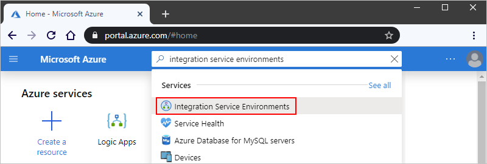
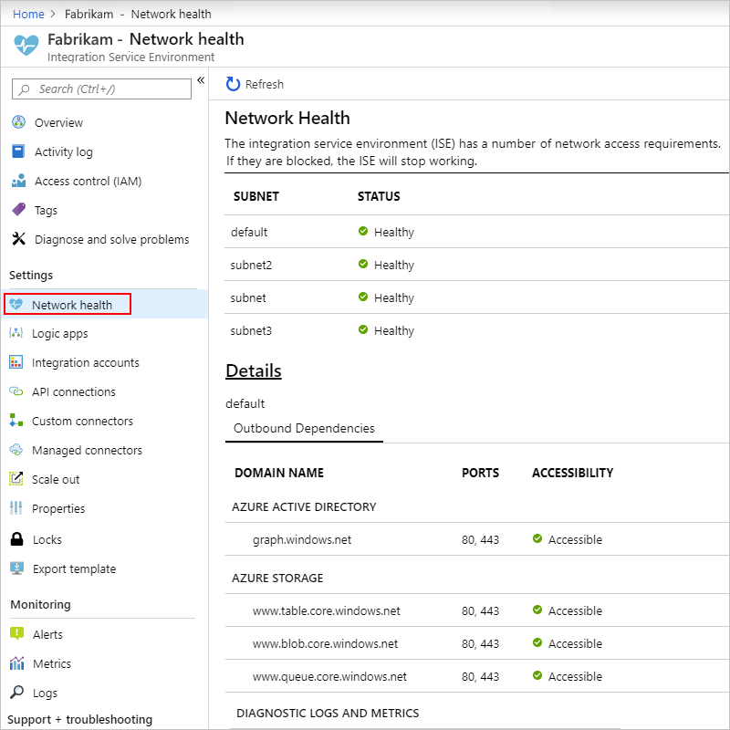
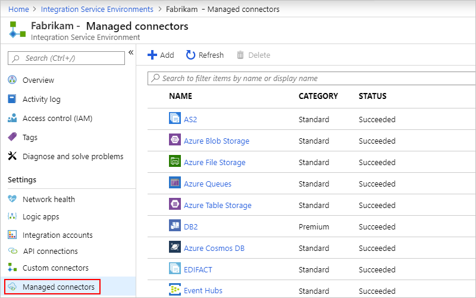
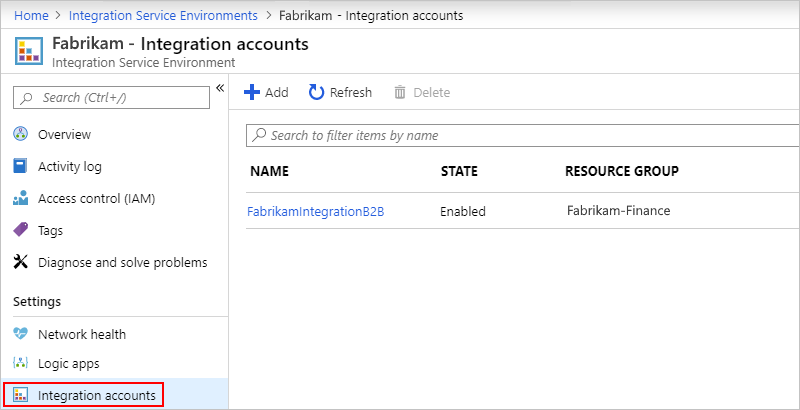

# Manage your integration service environment (ISE) in Azure Logic Apps

To check the network health for your [integration service environment (ISE)](../logic-apps/connect-virtual-network-vnet-isolated-environment-overview.md) and manage the logic apps, connections, integration accounts, and connectors that exist in your ISE, follow the steps in this topic. To add these artifacts to your ISE, see [Add artifacts to your integration service environment](../logic-apps/add-artifacts-integration-service-environment-ise.md).

## View your ISE

1. Sign in to the [Azure portal](https://portal.azure.com).

1. In the portal's search box, enter "integration service environments", and then select **Integration Service Environments**.

   

1. From the results list, select your integration service environment.

   

1. Continue to the next sections to find logic apps, connections, connectors, or integration accounts in your ISE.

## Check network health

On your ISE menu, under **Settings**, select **Network health**. This pane shows the health status for your subnets and outbound dependencies on other services.

## Manage your logic apps

You can view and manage the logic apps that are in your ISE.

1. On your ISE menu, under **Settings**, select **Logic apps**.

   

1. To remove logic apps that you no longer need in your ISE, select those logic apps, and then select **Delete**. To confirm that you want to delete, select **Yes**.

## Manage API connections

You can view and manage the connections that were created by the logic apps running in your ISE.

1. On your ISE menu, under **Settings**, select **API connections**.

   

1. To remove connections that you no longer need in your ISE, select those connections, and then select **Delete**. To confirm that you want to delete, select **Yes**.

## Manage ISE connectors

You can view and manage the API connectors that are deployed to your ISE.

1. On your ISE menu, under **Settings**, select **Managed connectors**.

   

1. To remove connectors that you don't want available in your ISE, select those connectors, and then select **Delete**. To confirm that you want to delete, select **Yes**.

## Manage custom connectors

You can view and manage the custom connectors that you deployed to your ISE.

1. On your ISE menu, under **Settings**, select **Custom connectors**.

   

1. To remove custom connectors that you no longer need in your ISE, select those connectors, and then select **Delete**. To confirm that you want to delete, select **Yes**.

## Manage integration accounts

1. On your ISE menu, under **Settings**, select **Integration accounts**.

   

1. To remove integration accounts from your ISE when no longer needed, select those integration accounts, and then select **Delete**.

## Next steps

* Learn how to [connect to Azure virtual networks from isolated logic apps](../logic-apps/connect-virtual-network-vnet-isolated-environment.md)
