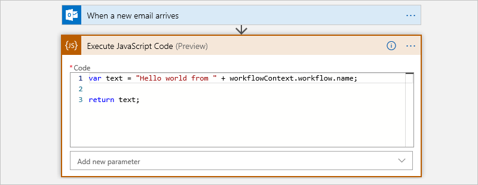
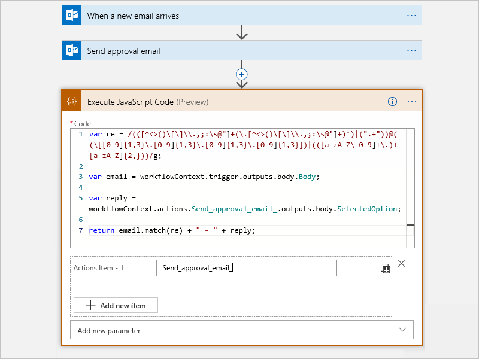

# Add and run code snippets by using inline code in Azure Logic Apps

When you want to run a piece of code inside your logic app, 
you can add the built-in **Inline Code** action as a step in 
your logic app's workflow. This action works best when you want 
to run code that fits this scenario:

* Runs in JavaScript. More languages coming soon.
* Finishes running in five seconds or fewer.
* Handles data up to 50 MB in size.
* Uses Node.js version 8.11.1. For more information, see 
[Standard built-in objects](https://developer.mozilla.org/docs/Web/JavaScript/Reference/Global_Objects). 

  > [!NOTE]
  > The require() function isn't supported by the **Inline Code** action for running JavaScript.

This action runs the code snippet and returns the output from 
that snippet as a token named **Result**, which you can use in 
subsequent actions in your logic app. For other scenarios 
where you want to create a function for your code, try 
[creating and calling an Azure function](../logic-apps/logic-apps-azure-functions.md) 
in your logic app.

In this article, the example logic app triggers when 
a new email arrives in an Office 365 Outlook account. 
The code snippet extracts and returns any email addresses 
that appear in the email body.


## Prerequisites

* An Azure subscription. If you don't have an Azure subscription, 
[sign up for a free Azure account](https://azure.microsoft.com/free/).

* The logic app where you want to add your code snippet, 
including a trigger. If you don't have a logic app, see 
[Quickstart: Create your first logic app](../logic-apps/quickstart-create-first-logic-app-workflow.md).

   The example logic app in this topic uses this Office 365 
   Outlook trigger: **When a new email arrives**

* An [integration account](../logic-apps/logic-apps-enterprise-integration-create-integration-account.md) 
that's linked to your logic app

## Add inline code

1. If you haven't already, in the [Azure portal](https://portal.azure.com), 
open your logic app in the Logic App Designer.

1. In the designer, add the **Inline Code** action at the 
location that you want in your logic app's workflow.

   * To add the action at the end of your workflow, choose **New step**.

   * To add the action between existing steps, move your mouse pointer over 
   the arrow that connects those steps. Choose the plus sign (**+**), 
   and select **Add an action**.

   This example adds the **Inline Code** action 
   under the Office 365 Outlook trigger.

   

1. Under **Choose an action**, in the search box, 
enter "inline code" as your filter. From the actions list, 
select this action: **Execute JavaScript Code**

   

   The action appears in the designer and contains 
   some default example code, including a return statement.

   

1. In the **Code** box, delete the sample code, and enter the 
code that you want to run. Write code that you'd put inside 
a method, but without defining the method signature. 

   When you type a recognized keyword, the autocomplete list appears 
   so that you can select from available keywords, for example:

   

   This example code snippet first creates a variable that 
   stores a *regular expression*, which specifies a pattern 
   to match in input text. The code then creates a variable 
   that stores the email body data from the trigger.

   

   To make the results from the trigger and previous actions 
   easier to reference, the dynamic content list appears 
   while your cursor is inside the **Code** box. For this 
   example, the list shows available results from the trigger, 
   including the **Body** token, which you can now select.

   After you select the **Body** token, the inline code 
   action resolves the token to a `workflowContext` object 
   that references the email's `Body` property value:

   

   In the **Code** box, your snippet can use the read-only 
   `workflowContext` object as input. This object has 
   subproperties that give your code access to the results 
   from the trigger and previous actions in your workflow.
   For more information, see this section later in this topic: 
   [Reference trigger and action results in your code](#workflowcontext).

   > [!NOTE]
   >
   > If your code snippet references action names that use the 
   > dot (.) operator, you must add those action names to the 
   > [**Actions** parameter](#add-parameters). Those references 
   > must also enclose the action names with square brackets ([]) 
   > and quotation marks, for example:
   >
   > `// Correct`</br> 
   > `workflowContext.actions["my.action.name"].body`</br>
   >
   > `// Incorrect`</br>
   > `workflowContext.actions.my.action.name.body`

   The inline code action doesn't require a `return` statement, 
   but the results from a `return` statement are available for 
   reference in later actions through the **Result** token. 
   For example, the code snippet returns the result by calling 
   the `match()` function, which finds matches in the email body 
   against the regular expression. The **Compose** action uses 
   the **Result** token to reference the results from the inline 
   code action and creates a single result.

   

1. When you're done, save your logic app.

<a name="workflowcontext"></a>

### Reference trigger and action results in your code

The `workflowContext` object has this structure, which includes 
the `actions`, `trigger`, and `workflow` subproperties:

```json
{
   "workflowContext": {
      "actions": {
         "<action-name-1>": @actions('<action-name-1>'),
         "<action-name-2>": @actions('<action-name-2>')
      },
      "trigger": {
         @trigger()
      },
      "workflow": {
         @workflow()
      }
   }
}
```

This table contains more information about these subproperties:

| Property | Type | Description |
|----------|------|-------|
| `actions` | Object collection | Result objects from actions that run before your code snippet runs. Each object has a *key-value* pair where the key is the name of an action, and the value is equivalent to calling the [actions() function](../logic-apps/workflow-definition-language-functions-reference.md#actions) with `@actions('<action-name>')`. The action's name uses the same action name that's used in the underlying workflow definition, which replaces spaces (" ") in the action name with underscores (_). This object provides access to action property values from the current workflow instance run. |
| `trigger` | Object | Result object from the trigger and equivalent to calling the [trigger() function](../logic-apps/workflow-definition-language-functions-reference.md#trigger). This object provides access to trigger property values from the current workflow instance run. |
| `workflow` | Object | The workflow object and equivalent to calling the [workflow() function](../logic-apps/workflow-definition-language-functions-reference.md#workflow). This object provides access to workflow property values, such as the workflow name, run ID, and so on, from the current workflow instance run. |
|||

In this topic's example, the `workflowContext` object has 
these properties that your code can access:

```json
{
   "workflowContext": {
      "trigger": {
         "name": "When_a_new_email_arrives",
         "inputs": {
            "host": {
               "connection": {
                  "name": "/subscriptions/<Azure-subscription-ID>/resourceGroups/<Azure-resource-group-name>/providers/Microsoft.Web/connections/office365"
               }
            },
            "method": "get",
            "path": "/Mail/OnNewEmail",
            "queries": {
               "includeAttachments": "False"
            }
         },
         "outputs": {
            "headers": {
               "Pragma": "no-cache",
               "Content-Type": "application/json; charset=utf-8",
               "Expires": "-1",
               "Content-Length": "962095"
            },
            "body": {
               "Id": "AAMkADY0NGZhNjdhLTRmZTQtNGFhOC1iYjFlLTk0MjZlZjczMWRhNgBGAAAAAABmZwxUQtCGTqSPpjjMQeD",
               "DateTimeReceived": "2019-03-28T19:42:16+00:00",
               "HasAttachment": false,
               "Subject": "Hello World",
               "BodyPreview": "Hello World",
               "Importance": 1,
               "ConversationId": "AAQkADY0NGZhNjdhLTRmZTQtNGFhOC1iYjFlLTk0MjZlZjczMWRhNgAQ",
               "IsRead": false,
               "IsHtml": true,
               "Body": "Hello World",
               "From": "<sender>@<domain>.com",
               "To": "<recipient-2>@<domain>.com;<recipient-2>@<domain>.com",
               "Cc": null,
               "Bcc": null,
               "Attachments": []
            }
         },
         "startTime": "2019-05-03T14:30:45.971564Z",
         "endTime": "2019-05-03T14:30:50.1746874Z",
         "scheduledTime": "2019-05-03T14:30:45.8778117Z",
         "trackingId": "1cd5ffbd-f989-4df5-a96a-6e9ce31d03c5",
         "clientTrackingId": "08586447130394969981639729333CU06",
         "originHistoryName": "08586447130394969981639729333CU06",
         "code": "OK",
         "status": "Succeeded"
      },
      "workflow": {
         "id": "/subscriptions/<Azure-subscription-ID>/resourceGroups/<Azure-resource-group-name>/providers/Microsoft.Logic/workflows/<logic-app-workflow-name>",
         "name": "<logic-app-workflow-name>",
         "type": "Microsoft.Logic/workflows",
         "location": "<Azure-region>",
         "run": {
            "id": "/subscriptions/<Azure-subscription-ID>/resourceGroups/<Azure-resource-group-name>/providers/Microsoft.Logic/workflows/<logic-app-workflow-name>/runs/08586453954668694173655267965CU00",
            "name": "08586453954668694173655267965CU00",
            "type": "Microsoft.Logic/workflows/runs"
         }
      }
   }
}
```

<a name="add-parameters"></a>

## Add parameters

In some cases, you might have to explicitly require that the 
**Inline Code** action includes results from the trigger or 
specific actions that your code references as dependencies by 
adding the **Trigger** or **Actions** parameters. This option 
is useful for scenarios where the referenced results aren't 
found at run time.

> [!TIP]
> If you plan to reuse your code, add references to 
> properties by using the **Code** box so that your code 
> includes the resolved token references, rather than 
> adding the trigger or actions as explicit dependencies.

For example, suppose you have code that references the **SelectedOption** 
result from the **Send approval email** action for the Office 365 Outlook 
connector. At create time, the Logic Apps engine analyzes your code to 
determine whether you've referenced any trigger or action results and 
includes those results automatically. At run time, should you get an 
error that the referenced trigger or action result isn't available in 
the specified `workflowContext` object, you can add that trigger or 
action as an explicit dependency. In this example, you add the 
**Actions** parameter and specify that the **Inline Code** action 
explicitly include the result from the **Send approval email** action.

To add these parameters, open the **Add new parameter** list, 
and select the parameters you want:

   

   | Parameter | Description |
   |-----------|-------------|
   | **Actions** | Include results from previous actions. See [Include action results](#action-results). |
   | **Trigger** | Include results from the trigger. See [Include trigger results](#trigger-results). |
   |||

<a name="trigger-results"></a>

### Include trigger results

If you select **Triggers**, you're prompted whether to include trigger results.

* From the **Trigger** list, select **Yes**.

<a name="action-results"></a>

### Include action results

If you select **Actions**, you're prompted for the actions that you want to add. 
However, before you start adding actions, you need the version of the action name 
that appears in the logic app's underlying workflow definition.

* This capability doesn't support variables, loops, and iteration indexes.

* Names in your logic app's workflow definition use an underscore (_), not a space.

* For action names that use the dot operator (.), include those operators, for example:

  `My.Action.Name`

1. On the designer toolbar, choose **Code view**, 
and search inside the `actions` attribute for the action name.

   For example, `Send_approval_email_` is the JSON 
   name for the **Send approval email** action.

   

1. To return to designer view, on the code view toolbar, 
choose **Designer**.

1. To add the first action, in the **Actions Item - 1** box, 
enter the action's JSON name.

   

1. To add another action, choose **Add new item**.

## Reference

For more information about the **Execute JavaScript Code** action's structure and syntax in your logic app's underlying workflow 
definition using the Workflow Definition Language, see this action's 
[reference section](../logic-apps/logic-apps-workflow-actions-triggers.md#run-javascript-code).

## Next steps

Learn more about [Connectors for Azure Logic Apps](../connectors/apis-list.md)
