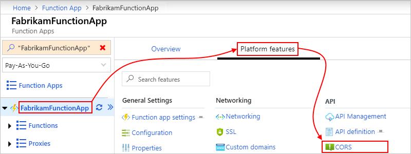
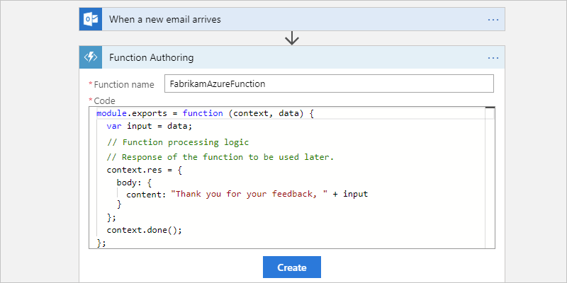
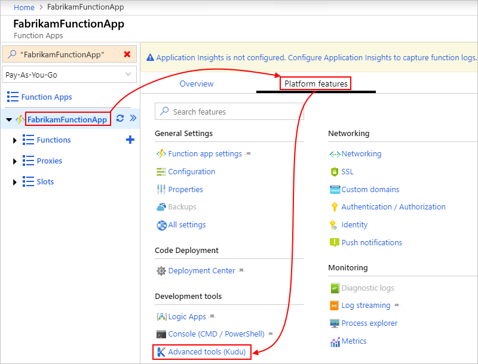
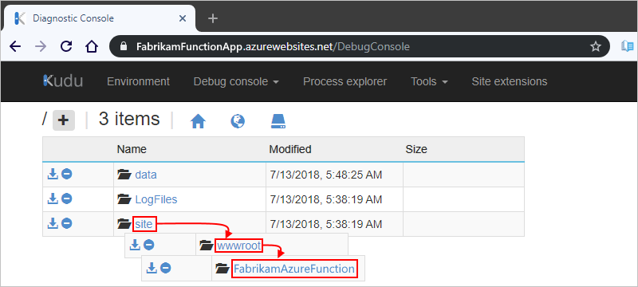
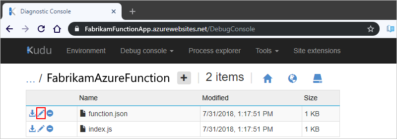
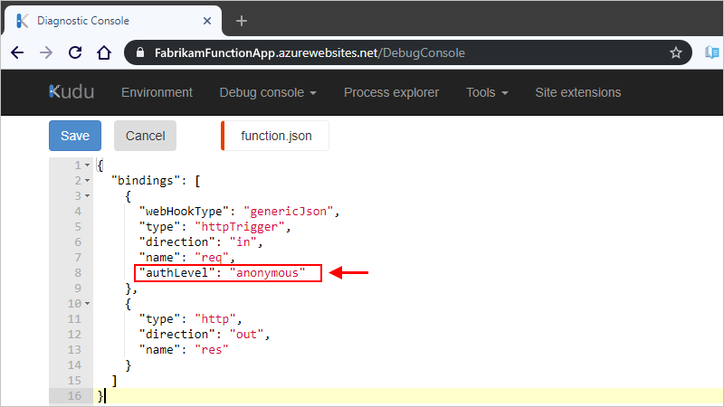
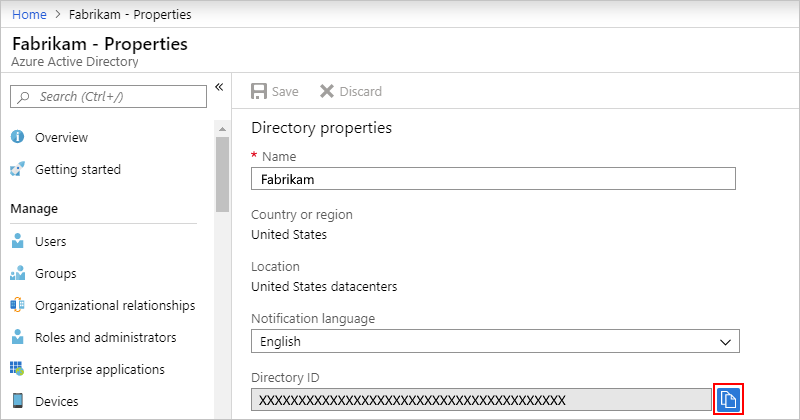
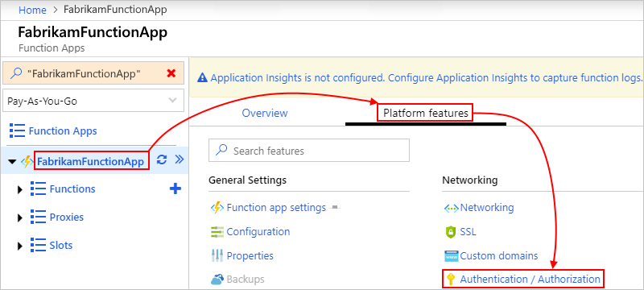
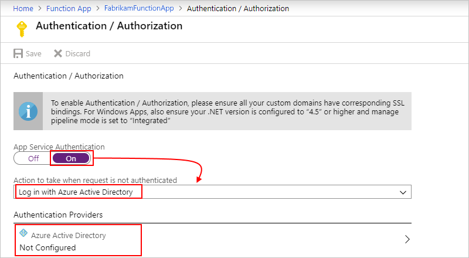
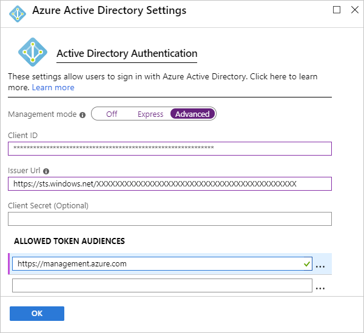

# Call Azure functions from Azure Logic Apps

When you want to run code that performs a specific job in your logic apps, you can create your own function by using [Azure Functions](../azure-functions/functions-overview.md). This service helps you create Node.js, C#, and F# functions so you don't have to build a complete app or infrastructure to run code. You can also [call logic apps from inside Azure functions](#call-logic-app). Azure Functions provides serverless computing in the cloud and is useful for performing tasks such as these examples:

* Extend your logic app's behavior with functions in Node.js or C#.
* Perform calculations in your logic app workflow.
* Apply advanced formatting or compute fields in your logic apps.

To run code snippets without creating Azure functions, learn how to [add and run inline code](../logic-apps/logic-apps-add-run-inline-code.md).

> [!NOTE]
> Integration between Logic Apps and Azure Functions currently doesn't work with Slots enabled.

## Prerequisites

* An Azure subscription. If you don't have an Azure subscription, [sign up for a free Azure account](https://azure.microsoft.com/free/).

* An Azure function app, which is a container for Azure functions, along with your Azure function. If you don't have a function app, [create your function app first](../azure-functions/functions-create-first-azure-function.md). You can then create your function either outside your logic app in the Azure portal, or [from inside your logic app](#create-function-designer) in the Logic App Designer.

* When working with logic apps, the same requirements apply to function apps and functions whether they are existing or new:

  * Your function app and logic app must use the same Azure subscription.

  * New function apps must use either the .NET or JavaScript as the runtime stack. When you add a new function to existing function apps, you can select either C# or JavaScript.

  * Your function uses the **HTTP trigger** template.

    The HTTP trigger template can accept content that has `application/json` type from your logic app. When you add an Azure function to your logic app, the Logic App Designer shows custom functions that are created from this template within your Azure subscription.

  * Your function doesn't use custom routes unless you've defined an [OpenAPI definition](../azure-functions/functions-openapi-definition.md) (formerly known as a [Swagger file](https://swagger.io/)).

  * If you have an OpenAPI definition for your function, the Logic Apps Designer gives you a richer experience when your work with function parameters. Before your logic app can find and access functions that have OpenAPI definitions, [set up your function app by following these steps](#function-swagger).

* The logic app where you want to add the function, including a [trigger](../logic-apps/logic-apps-overview.md#logic-app-concepts) as the first step in your logic app

  Before you can add actions that run functions, your logic app must start with a trigger. If you're new to logic apps, review [What is Azure Logic Apps](../logic-apps/logic-apps-overview.md) and [Quickstart: Create your first logic app](../logic-apps/quickstart-create-first-logic-app-workflow.md).

<a name="function-swagger"></a>

## Find functions that have OpenAPI descriptions

For a richer experience when you work with function parameters in the Logic Apps Designer, [generate an OpenAPI definition](../azure-functions/functions-openapi-definition.md), formerly known as a [Swagger file](https://swagger.io/), for your function. To set up your function app so your logic app can find and use functions that have Swagger descriptions, follow these steps:

1. Make sure that your function app is actively running.

1. In your function app, set up [Cross-Origin Resource Sharing (CORS)](https://en.wikipedia.org/wiki/Cross-origin_resource_sharing) so that all origins are permitted by following these steps:

   1. From the **Function Apps** list, select your function app. In the right-hand pane, select **Platform features** > **CORS**.

      

   1. Under **CORS**, add the asterisk (**`*`**) wildcard character, but remove all the other origins in the list, and select **Save**.

      

## Access property values inside HTTP requests

Webhook functions can accept HTTP requests as inputs and pass those requests to other functions. For example, although Logic Apps has [functions that convert DateTime values](../logic-apps/workflow-definition-language-functions-reference.md), this basic sample JavaScript function shows how you can access a property inside a request object that's passed to the function and perform operations on that property value. To access properties inside objects, this example uses the [dot (.) operator](https://developer.mozilla.org/docs/Web/JavaScript/Reference/Operators/Property_accessors):

```javascript
function convertToDateString(request, response){
   var data = request.body;
   response = {
      body: data.date.ToDateString();
   }
}
```

Here's what happens inside this function:

1. The function creates a `data` variable and assigns the `body` object inside the `request` object to that variable. The function uses the dot (.) operator to reference the `body` object inside the `request` object:

   ```javascript
   var data = request.body;
   ```

1. The function can now access the `date` property through the `data` variable, and convert that property value from DateTime type to DateString type by calling the `ToDateString()` function. The function also returns the result through the `body` property in the function's response:

   ```javascript
   body: data.date.ToDateString();
   ```

Now that you've created your Azure function, follow the steps for how to [add functions to logic apps](#add-function-logic-app).

<a name="create-function-designer"></a>

## Create functions inside logic apps

You can create Azure functions directly from your logic app's workflow by using the built-in Azure Functions action in the Logic App Designer, but you can use this method only for Azure functions written in JavaScript. For other languages, you can create Azure functions through the Azure Functions experience in the Azure portal. For more information, see [Create your first function in the Azure portal](../azure-functions/functions-create-first-azure-function.md).

However, before you can create any Azure function, you must already have an Azure function app, which is a container for your functions. If you don't have a function app, create that function app first. See [Create your first function in the Azure portal](../azure-functions/functions-create-first-azure-function.md).

1. In the [Azure portal](https://portal.azure.com), open your logic app in the Logic App Designer.

1. To create and add your function, follow the step that applies to your scenario:

   * Under the last step in your logic app's workflow, select **New step**.

   * Between existing steps in your logic app's workflow, move your mouse over the arrow, select the plus (+) sign, and then select **Add an action**.

1. In the search box, enter "azure functions" as your filter. From the actions list, select the **Choose an Azure function** action, for example:

   

1. From the function apps list, select your function app. After the actions list opens, select this action: **Create New Function**

   

1. In the function definition editor, define your function:

   1. In the **Function name** box, provide a name for your function.

   1. In the **Code** box, add your code to the function template, including the response and payload that you want returned to your logic app after your function finishes running. When you're done, select **Create**.

   For example:

   

   In the template's code, the *`context` object* refers to the message that your logic app sends through the **Request Body** field in a later step. To access the `context` object's properties from inside your function, use this syntax:

   `context.body.<property-name>`

   For example, to reference the `content` property inside the `context` object, use this syntax:

   `context.body.content`

   The template code also includes an `input` variable, which stores the value from the `data` parameter so your function can perform operations on that value. Inside JavaScript functions, the `data` variable is also a shortcut for `context.body`.

   > [!NOTE]
   > The `body` property here applies to the `context` object and 
   > isn't the same as the **Body** token from an action's output, 
   > which you might also pass to your function.

1. In the **Request Body** box, provide your function's input, which must be formatted as a JavaScript Object Notation (JSON) object.

   This input is the *context object* or message that your logic app sends to your function. When you click in the **Request Body** field, the dynamic content list appears so you can select tokens for outputs from previous steps. This example specifies that the context payload contains a property named `content` that has the **From** token's value from the email trigger.

   

   Here, the context object isn't cast as a string, so the object's content gets added directly to the JSON payload. However, when the context object isn't a JSON token that passes a string, a JSON object, or a JSON array, you get an error. So, if this example used the **Received Time** token instead, you can cast the context object as a string by adding double-quotation marks.

   

1. To specify other details such as the method to use, request headers, or query parameters, or authentication, open the **Add new parameter** list, and select the options that you want. For authentication, your options differ based on your selected function. See [Enable authentication for Azure functions](#enable-authentication-functions).

<a name="add-function-logic-app"></a>

## Add existing functions to logic apps

To call existing Azure functions from your logic apps, you can add Azure functions like any other action in the Logic App Designer.

1. In the [Azure portal](https://portal.azure.com), open your logic app in the Logic App Designer.

1. Under the step where you want to add the function, select **New step**.

1. Under **Choose an action**, in the search box, enter "azure functions" as your filter. From the actions list, select the **Choose an Azure function** action.

   

1. From the function apps list, select your function app. After the functions list appears, select your function.

   

   For functions that have API definitions (Swagger descriptions) and are [set up so your logic app can find and access those functions](#function-swagger), you can select **Swagger actions**.

   

1. In the **Request Body** box, provide your function's input, which must be formatted as a JavaScript Object Notation (JSON) object.

   This input is the *context object* or message that your logic app sends to your function. When you click in the **Request Body** field, the dynamic content list appears so that you can select tokens for outputs from previous steps. This example specifies that the context payload contains a property named `content` that has the **From** token's value from the email trigger.

   

   Here, the context object isn't cast as a string, so the object's content gets added directly to the JSON payload. However, when the context object isn't a JSON token that passes a string, a JSON object, or a JSON array, you get an error. So, if this example used the **Received Time** token instead, you can cast the context object as a string by adding double-quotation marks:

   

1. To specify other details such as the method to use, request headers, query parameters, or authentication, open the **Add new parameter** list, and select the options that you want. For authentication, your options differ based on your selected function. See [Enable authentication in Azure functions](#enable-authentication-functions).

<a name="call-logic-app"></a>

## Call logic apps from Azure functions

When you want to trigger a logic app from inside an Azure function, the logic app must start with a trigger that provides a callable endpoint. For example, you can start the logic app with the **HTTP**, **Request**, **Azure Queues**, or **Event Grid** trigger. Inside your function, send an HTTP POST request to the trigger's URL, and include the payload you want that logic app to process. For more information, see [Call, trigger, or nest logic apps](../logic-apps/logic-apps-http-endpoint.md).

<a name="enable-authentication-functions"></a>

## Enable authentication for Azure functions

To easily authenticate access to other resources that are protected by Azure Active Directory (Azure AD) without having to sign in and provide credentials or secrets, your logic app can use a [managed identity](../active-directory/managed-identities-azure-resources/overview.md) (formerly known as Managed Service Identity or MSI). Azure manages this identity for you and helps secure your credentials because you don't have to provide or rotate secrets. Learn more about [Azure services that support managed identities for Azure AD authentication](../active-directory/managed-identities-azure-resources/services-support-managed-identities.md#azure-services-that-support-azure-ad-authentication).

If you set up your logic app to use the system-assigned identity or a manually-created user-assigned identity, the Azure functions in your logic app can also use that same identity for authentication. For more information about authentication support for Azure functions in logic apps, see [Add authentication to outbound calls](../logic-apps/logic-apps-securing-a-logic-app.md#add-authentication-outbound).

To set up and use the managed identity with your function, follow these steps:

1. Enable the managed identity on your logic app, and set up that identity's access to the target resource. See [Authenticate access to Azure resources by using managed identities in Azure Logic Apps](../logic-apps/create-managed-service-identity.md).

1. Enable authentication in your Azure function and function app by following these steps:

   * [Set up anonymous authentication in your function](#set-authentication-function-app)
   * [Set up Azure AD authentication in your function app](#set-azure-ad-authentication)

<a name="set-authentication-function-app"></a>

### Set up anonymous authentication in your function

To use your logic app's managed identity in your Azure function, you have set your function's authentication level to anonymous. Otherwise, your logic app throws a "BadRequest" error.

1. In the [Azure portal](https://portal.azure.com), find and select your function app. These steps use "FabrikamFunctionApp" as the example function app.

1. On the function app pane, select **Platform features**. Under **Development tools**, select **Advanced tools (Kudu)**.

   

1. On the Kudu website's title bar, from the **Debug Console** menu, select **CMD**.

   

1. After the next page appears, from the folder list, select **site** > **wwwroot** > *your-function*. These steps use "FabrikamAzureFunction" as the example function.

   

1. Open the `function.json` file for editing.

   

1. In the `bindings` object, check whether the `authLevel` property exists. If the property exists, set the property value to `anonymous`. Otherwise, add that property and set the value.

   

1. When you're done, save your settings, and then continue to the next section.

<a name="set-azure-ad-authentication"></a>

### Set up Azure AD authentication for your function app

Before you start this task, find and put these values aside for later use:

* The object ID that's generated for the system-assigned identity that represents your logic app

  * To generate this object ID, [enable your logic app's system-assigned identity](../logic-apps/create-managed-service-identity.md#azure-portal-system-logic-app).

  * Otherwise, to find this object ID, open your logic app in the Logic App Designer. On your logic app menu, under **Settings**, select **Identity** > **System assigned**.

* The directory ID for your tenant in Azure Active Directory (Azure AD)

  To get your tenant's directory ID, you can run the [`Get-AzureAccount`](https://docs.microsoft.com/powershell/module/servicemanagement/azure/get-azureaccount) Powershell command. Or, in the Azure portal, follow these steps:

  1. In the [Azure portal](https://portal.azure.com), find and select your function app.

  1. Find and select your Azure AD tenant. These steps use "Fabrikam" as the example tenant.

  1. On the tenant's menu, under **Manage**, select **Properties**.

  1. Copy your tenant's directory ID, for example, and save that ID for later use.

     

* The resource ID for the target resource that you want to access

  * To find these resource IDs, review the [Azure services that support Azure AD](../active-directory/managed-identities-azure-resources/services-support-managed-identities.md#azure-services-that-support-azure-ad-authentication).

  > [!IMPORTANT]
  > This resource ID must exactly match the value that Azure AD expects, 
  > including any required trailing slashes.

  This resource ID is also the same value that you later use in the **Audience** property when you [set up your function action to use the system-assigned identity](../logic-apps/create-managed-service-identity.md#authenticate-access-with-identity).

Now you're ready to set up Azure AD authentication for your function app.

1. In the [Azure portal](https://portal.azure.com), find and select your function app.

1. On the function app pane, select **Platform features**. Under **Networking**, select **Authentication / Authorization**.

   

1. Change the **App Service Authentication** setting to **On**. From the **Action to take when request is not authenticated** list, select **Log in with Azure Active Directory**. Under **Authentication Providers**, select **Azure Active Directory**.

   

1. On the **Azure Active Directory Settings** pane, follow these steps:

   1. Set **Management mode** to **Advanced**.

   1. In the **Client ID** property, enter the object ID for your logic app's system-assigned identity.

   1. In the **Issuer Url** property, enter the `https://sts.windows.net/` URL, and append your Azure AD tenant's directory ID.

      `https://sts.windows.net/<Azure-AD-tenant-directory-ID>`

   1. In the **Allowed Token Audiences** property, enter the resource ID for the target resource that you want to access.

      This resource ID is the same value that you later use in the **Audience** property when you [set up your function action to use the system-assigned identity](../logic-apps/create-managed-service-identity.md#authenticate-access-with-identity).

   At this point, your version looks similar to this example:

   

1. When you're done, select **OK**.

1. Return to the Logic App Designer and follow the [steps to authenticate access with the managed identity](../logic-apps/create-managed-service-identity.md#authenticate-access-with-identity).

## Next steps

* Learn about [Logic Apps connectors](../connectors/apis-list.md)
