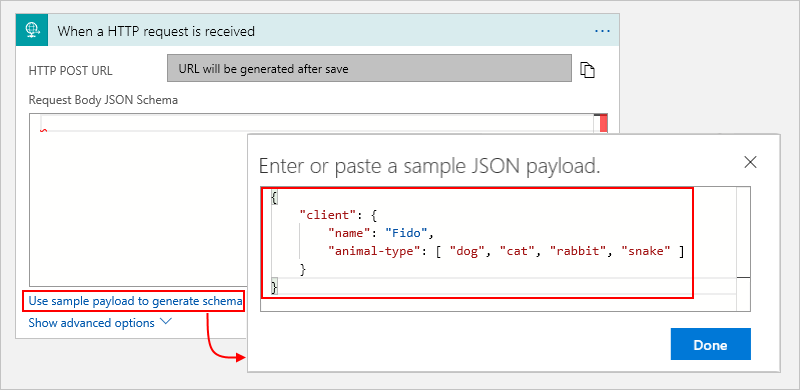
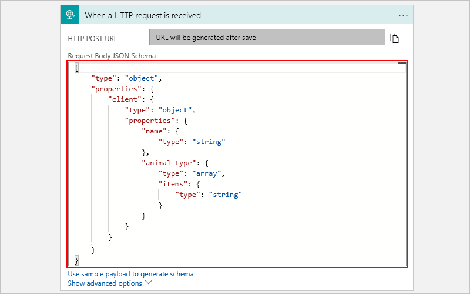
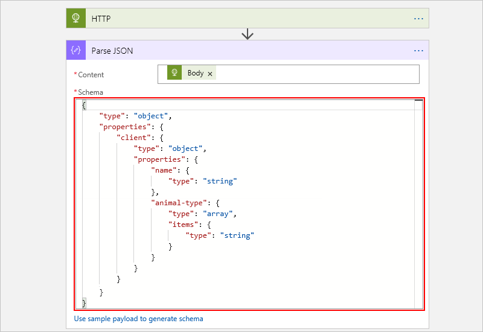

# Handle content types in Azure Logic Apps

Various content types can flow through a logic app, 
for example, JSON, XML, flat files, and binary data. 
While Logic Apps supports all content types, some have native 
support and don't require casting or conversion in your logic apps. 
Other types might require casting or conversion as necessary. 
This article describes how Logic Apps handles content types and 
how you can correctly cast or convert these types when necessary.

To determine the appropriate way for handling content types, 
Logic Apps relies on the `Content-Type` header value in HTTP calls, 
for example:

* [application/json](#application-json) (native type)
* [text/plain](#text-plain) (native type)
* [application/xml and application/octet-stream](#application-xml-octet-stream)
* [Other content types](#other-content-types)

<a name="application-json"></a>

## application/json

Logic Apps stores and handles any request with the *application/json* 
content type as a JavaScript Notation (JSON) object. 
By default, you can parse JSON content without any casting. 
To parse a request that has a header with the "application/json" content type, 
you can use an expression. This example returns the value `dog` from the 
`animal-type` array without casting: 
 
`@body('myAction')['animal-type'][0]` 
  
  ```json
  {
    "client": {
       "name": "Fido",
       "animal-type": [ "dog", "cat", "rabbit", "snake" ]
    }
  }
  ```

If you're working with JSON data that doesn't specify a header, 
you can manually cast that data to JSON by using the 
[json() function](../logic-apps/workflow-definition-language-functions-reference.md#json), 
for example: 
  
`@json(triggerBody())['animal-type']`

### Create tokens for JSON properties

Logic Apps provides the capability for you to generate user-friendly 
tokens that represent the properties in JSON content so you can 
reference and use those properties more easily in your logic app's workflow.

* **Request trigger**

  When you use this trigger in the Logic App Designer, you can provide 
  a JSON schema that describes the payload you expect to receive. 
  The designer parses JSON content by using this schema and generates 
  user-friendly tokens that represent the properties in your JSON content. 
  You can then easily reference and use those properties throughout your 
  logic app's workflow. 
  
  If you don't have a schema, you can generate the schema. 
  
  1. In the Request trigger, select **Use sample payload to generate schema**.  
  
  2. Under **Enter or paste a sample JSON payload**, provide a sample payload 
  and then choose **Done**. For example: 

     

     The generated schema now appears in your trigger.

     

     Here is the underlying definition for your Request trigger in the code view editor:

     ```json
     "triggers": { 
        "manual": {
           "type": "Request",
           "kind": "Http",
           "inputs": { 
              "schema": {
                 "type": "object",
                 "properties": {
                    "client": {
                       "type": "object",
                       "properties": {
                          "animal-type": {
                             "type": "array",
                             "items": {
                                "type": "string"
                             },
                          },
                          "name": {
                             "type": "string"
                          }
                       }
                    }
                 }
              }
           }
        }
     }
     ```

  3. In your request, make sure you include a `Content-Type` header 
  and set the header's value to `application/json`.

* **Parse JSON action**

  When you use this action in the Logic App Designer, 
  you can parse JSON output and generate user-friendly 
  tokens that represent the properties in your JSON content. 
  You can then easily reference and use those properties 
  throughout your logic app's workflow. Similar to 
  the Request trigger, you can provide or generate a 
  JSON schema that describes the JSON content you want to parse. 
  That way, you can more easily consume data from Azure Service Bus, 
  Azure Cosmos DB, and so on.

  

<a name="text-plain"></a>

## text/plain

When your logic app receives HTTP messages that 
have the `Content-Type` header set to `text/plain`, 
your logic app stores those messages in raw form. 
If you include these messages in subsequent actions without casting, 
requests go out with the `Content-Type` header set to `text/plain`. 

For example, when you're working with a flat file, 
you might get an HTTP request with the `Content-Type` 
header set to `text/plain` content type:

`Date,Name,Address`</br>
`Oct-1,Frank,123 Ave`

If you then send this request on in a later action as the body for another request, 
for example, `@body('flatfile')`, that second request also has a `Content-Type` 
header that's set to `text/plain`. If you're working with data that is plain text 
but didn't specify a header, you can manually cast that data to text by using the 
[string() function](../logic-apps/workflow-definition-language-functions-reference.md#string) 
such as this expression: 

`@string(triggerBody())`

<a name="application-xml-octet-stream"></a>

## application/xml and application/octet-stream

Logic Apps always preserves the `Content-Type` in a received HTTP request or response. 
So if your logic app receives content with `Content-Type` set to `application/octet-stream`, 
and you include that content in a later action without casting, 
the outgoing request also has `Content-Type` set to `application/octet-stream`. 
That way, Logic Apps can guarantee that data doesn't get lost while moving through the workflow. 
However, the action state, or inputs and outputs, is stored in a JSON object 
while the state moves through the workflow. 

## Converter functions

To preserve some data types, Logic Apps converts content to a binary 
base64-encoded string with appropriate metadata that preserves both 
the `$content` payload and the `$content-type`, which are automatically converted. 

This list describes how Logic Apps converts content when you use these 
[functions](../logic-apps/workflow-definition-language-functions-reference.md):

* `json()`: Casts data to `application/json`
* `xml()`: Casts data to `application/xml`
* `binary()`: Casts data to `application/octet-stream`
* `string()`: Casts data to `text/plain`
* `base64()`: Converts content to a base64-encoded string
* `base64toString()`: Converts a base64-encoded string to `text/plain`
* `base64toBinary()`: Converts a base64-encoded string to `application/octet-stream`
* `dataUri()`: Converts a string to a data URI
* `dataUriToBinary()`: Converts a data URI to a binary string
* `dataUriToString()`: Converts a data URI to a string

For example, if you receive an HTTP request 
where `Content-Type` set to `application/xml`, 
such as this content:

```html
<?xml version="1.0" encoding="UTF-8" ?>
<CustomerName>Frank</CustomerName>
```

You can cast this content by using the `@xml(triggerBody())` 
expression with the `xml()` and `triggerBody()` functions 
and then use this content later. Or, you can use the 
`@xpath(xml(triggerBody()), '/CustomerName')` expression 
with the `xpath()` and `xml()` functions. 

## Other content types

Logic Apps works with and supports other content types, 
but might require that you manually get the message 
body by decoding the `$content` variable.

For example, suppose your logic app gets triggered by a request 
with the `application/x-www-url-formencoded` content type. 
To preserve all the data, the `$content` variable in the 
request body has a payload that's encoded as a base64 string:

`CustomerName=Frank&Address=123+Avenue`

Because the request isn't plain text or JSON, 
the request is stored in the action as follows:

```json
"body": {
   "$content-type": "application/x-www-url-formencoded",
   "$content": "AAB1241BACDFA=="
}
```

Logic Apps provides native functions for handling form data, for example: 

* [triggerFormDataValue()](../logic-apps/workflow-definition-language-functions-reference.md#triggerFormDataValue)
* [triggerFormDataMultiValues()](../logic-apps/workflow-definition-language-functions-reference.md#triggerFormDataMultiValues)
* [formDataValue()](../logic-apps/workflow-definition-language-functions-reference.md#formDataValue) 
* [formDataMultiValues()](../logic-apps/workflow-definition-language-functions-reference.md#formDataMultiValues)

Or, you can manually access the data by using an expression such as this example:

`@string(body('formdataAction'))` 

If you wanted the outgoing request to have the same 
`application/x-www-url-formencoded` content type header, 
you can add the request to the action's body without 
any casting by using an expression such as `@body('formdataAction')`. 
However, this method only works when the body is the only 
parameter in the `body` input. If you try to use the 
`@body('formdataAction')` expression in an `application/json` request, 
you get a runtime error because the body is sent encoded.
