# Run actions based on group status by using scopes in Azure Logic Apps

To run actions only after another group of actions succeed or fail, 
group those actions inside a *scope*. This structure is useful when 
you want to organize actions as a logical group, 
evaluate that group's status, and perform actions 
that are based on the scope's status. 
After all the actions in a scope finish running, 
the scope also gets its own status. For example, 
you can use scopes when you want to implement 
[exception and error handling](../logic-apps/logic-apps-exception-handling.md#scopes). 

To check a scope's status, you can use the same criteria 
that you use to determine a logic apps' run status, 
such as "Succeeded", "Failed", "Cancelled", and so on. 
By default, when all the scope's actions succeed, 
the scope's status is marked "Succeeded." 
But when any action in the scope fails or is canceled, 
the scope's status is marked "Failed." 
For limits on scopes, see 
[Limits and config](../logic-apps/logic-apps-limits-and-config.md). 

For example, here is a high-level logic app that uses a scope to 
run specific actions and a condition to check the scope's status. 
If any actions in the scope fail or end unexpectedly, 
the scope is marked "Failed" or "Aborted" respectively, 
and the logic app sends a "Scope failed" message. 
If all the scoped actions succeed, the logic app sends a "Scope succeeded" message.

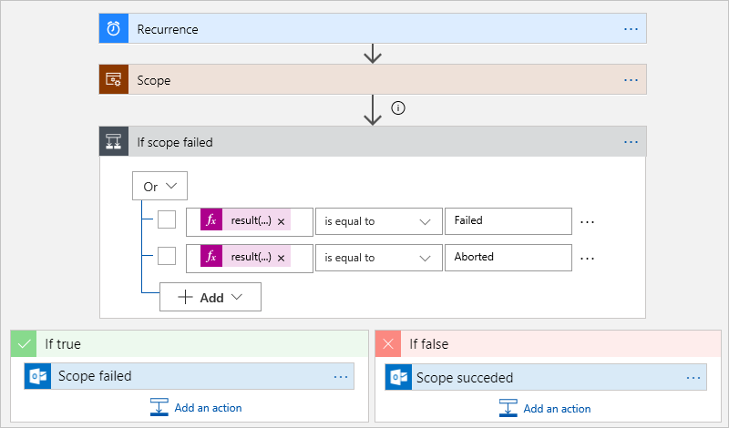

## Prerequisites

To follow the example in this article, you need these items:

* An Azure subscription. If you don't have a subscription, 
[sign up for a free Azure account](https://azure.microsoft.com/free/). 

* An email account from any email provider supported by Logic Apps. 
This example uses Outlook.com. If you use a different provider, 
the general flow stays the same, but your UI appears different.

* A Bing Maps key. To get this key, see 
<a href="https://msdn.microsoft.com/library/ff428642.aspx" target="_blank">Get a Bing Maps key</a>.

* Basic knowledge about [how to create logic apps](../logic-apps/quickstart-create-first-logic-app-workflow.md)

## Create sample logic app

First, create this sample logic app so that you can add a scope later:

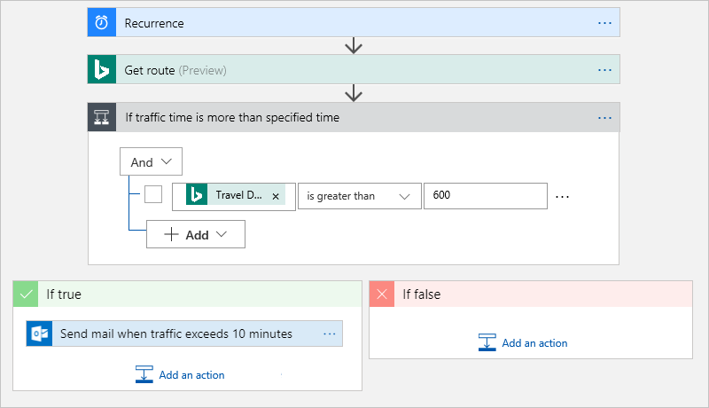

* A **Schedule - Recurrence** trigger that checks the 
Bing Maps service at an interval that you specify
* A **Bing Maps - Get route** action that checks the 
travel time between two locations
* A conditional statement that checks whether the 
travel time exceeds your specified travel time
* An action that sends you email that current 
travel time exceeds your specified time

You can save your logic app at any time, 
so save your work often.

1. Sign in to the <a href="https://portal.azure.com" target="_blank">Azure portal</a>, 
   if you haven't already. Create a blank logic app.

1. Add the **Schedule - Recurrence** trigger with these settings: 
   **Interval** = "1" and **Frequency** = "Minute"

   

   > [!TIP]
   > To visually simplify your view and hide each action's details in the designer, 
   > collapse each action's shape as you progress through these steps.

1. Add the **Bing Maps - Get route** action. 

   1. If you don't already have a Bing Maps connection, 
   you're asked to create a connection.

      | Setting | Value | Description |
      | ------- | ----- | ----------- |
      | **Connection Name** | BingMapsConnection | Provide a name for your connection. | 
      | **API Key** | <*your-Bing-Maps-key*> | Enter the Bing Maps key that you previously received. | 
      ||||  

   1. Set up your **Get route** action as shown the table below this image:

      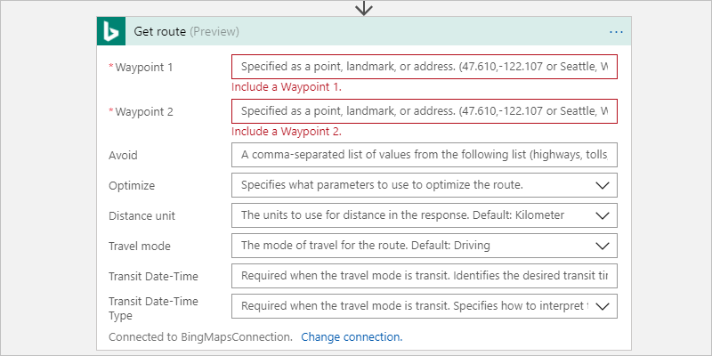 

      For more information about these parameters, see [Calculate a route](https://msdn.microsoft.com/library/ff701717.aspx).

      | Setting | Value | Description |
      | ------- | ----- | ----------- |
      | **Waypoint 1** | <*start*> | Enter your route's origin. | 
      | **Waypoint 2** | <*end*> | Enter your route's destination. | 
      | **Avoid** | None | Enter items to avoid on your route, such as highways, tolls, and so on. For possible values, see [Calculate a route](https://msdn.microsoft.com/library/ff701717.aspx). | 
      | **Optimize** | timeWithTraffic | Select a parameter to optimize your route, such as distance, time with current traffic information, and so on. This example uses this value: "timeWithTraffic" | 
      | **Distance unit** | <*your-preference*> | Enter the unit of distance to calculate your route. This example uses this value: "Mile" | 
      | **Travel mode** | Driving | Enter the mode of travel for your route. This example uses this value "Driving" | 
      | **Transit Date-Time** | None | Applies to transit mode only. | 
      | **Transit Date-Type Type** | None | Applies to transit mode only. | 
      ||||  

1. [Add a condition](../logic-apps/logic-apps-control-flow-conditional-statement.md) 
   that checks whether the current travel time with traffic exceeds a specified time. 
   For this example, follow these steps:

   1. Rename the condition with this description: 
   **If traffic time is more than specified time**

   1. In the leftmost column, click inside the **Choose a value** 
   box so the dynamic content list appears. From that list, 
   select the **Travel Duration Traffic** field, which is in seconds. 

      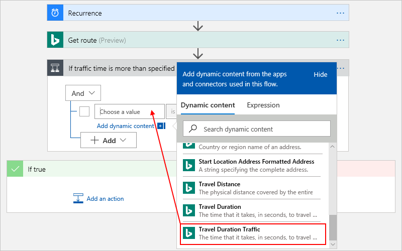

   1. In the middle box, select this operator: **is greater than**

   1. In the rightmost column, enter this comparison value, 
   which is in seconds and equivalent to 10 minutes: **600**

      When you're done, your condition looks like this example:

      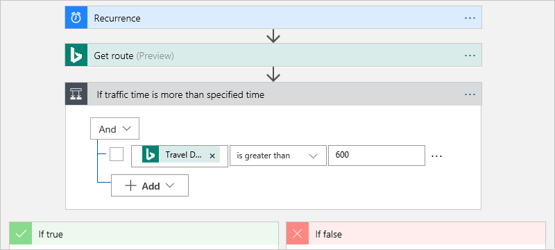

1. In the **If true** branch, add a "send email" action for your email provider. 
   Set up this action by following the steps under this image:

   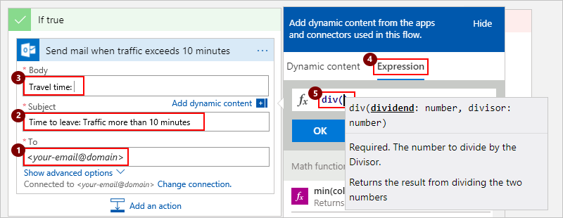

   1. In the **To** field, enter your email address for testing purposes.

   1. In the **Subject** field, enter this text:

      ```Time to leave: Traffic more than 10 minutes```

   1. In the **Body** field, enter this text with a trailing space: 

      ```Travel time:```

      While your cursor appears in the **Body** field, 
      the dynamic content list stays open so that you can 
      select any parameters that are available at this point.

   1. In the dynamic content list, choose **Expression**.

   1. Find and select the **div()** function. 
      Put your cursor in inside the function's parentheses.

   1. While your cursor is inside the function's parentheses, 
      choose **Dynamic content** so that the dynamic content list appears. 
   
   1. From the **Get route** section, 
      select the **Traffic Duration Traffic** field.

      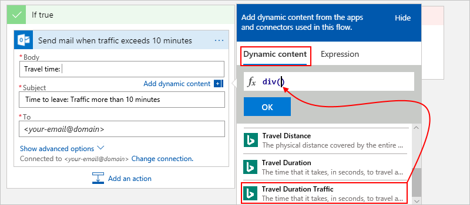

   1. After the field resolves to JSON format, 
      add a **comma** (```,```) followed by the number ```60``` 
      so that you convert the value in **Traffic Duration Traffic** 
      from seconds to minutes. 
   
      ```
      div(body('Get_route')?['travelDurationTraffic'],60)
      ```

      Your expression now looks like this example:

      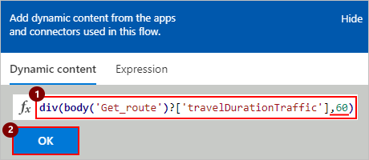  

   1. When you're done, choose **OK**.

   <!-- markdownlint-disable MD038 -->
   1. After the expression resolves, 
       add this text with a leading space: ``` minutes```
  
       Your **Body** field now looks like this example:

       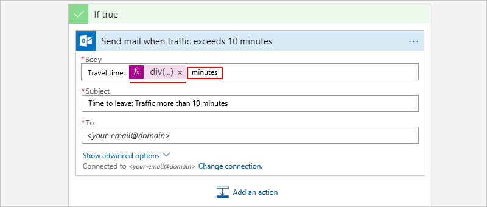
   <!-- markdownlint-enable MD038 -->

1. Save your logic app.

Next, add a scope so that you can group 
specific actions and evaluate their status.

## Add a scope

1. If you haven't already, open your logic app in Logic App Designer. 

1. Add a scope at the workflow location that you want. For example, 
to add a scope between existing steps in the logic app workflow, 
follow these steps: 

   1. Move your pointer over the arrow where you want to add the scope. 
   Choose the **plus sign** (**+**) > **Add an action**.

      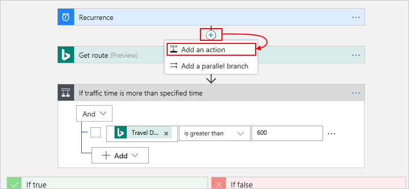

   1. In the search box, enter "scope" as your filter. 
   Select the **Scope** action.

## Add steps to scope

1. Now add the steps or drag existing steps that 
you want to run inside the scope. For this example, 
drag these actions into the scope:
      
   * **Get route**
   * **If traffic time is more than specified time**, 
   which includes both the **true** and **false** branches

   Your logic app now looks like this example:

   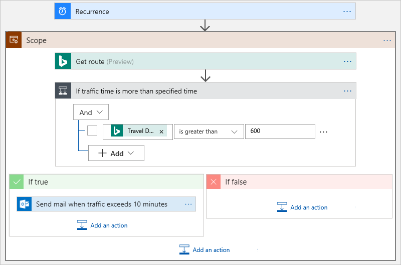

1. Under the scope, add a condition that checks the scope's status. 
Rename the condition with this description: **If scope failed**

   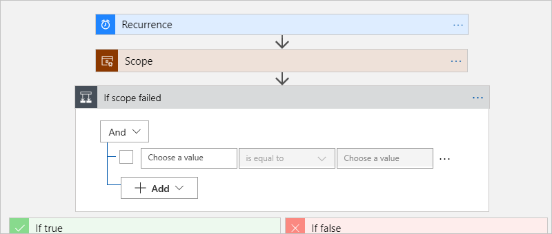
  
1. In the condition, add these expressions that check whether 
the scope's status is equal to "Failed" or "Aborted". 

   1. To add another row, choose **Add**. 

   1. In each row, click inside the left box so the dynamic content list appears. 
   From the dynamic content list, choose **Expression**. In the edit box,
   enter this expression, and then choose **OK**: 
   
      `result('Scope')[0]['status']`

      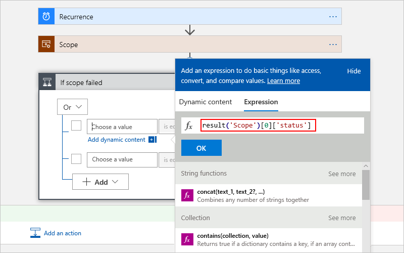

   1. For both rows, select **is equal to** as the operator. 
   
   1. For the comparison values, in the first row, enter `Failed`. 
   In the second row, enter `Aborted`. 

      When you're done, your condition looks like this example:

      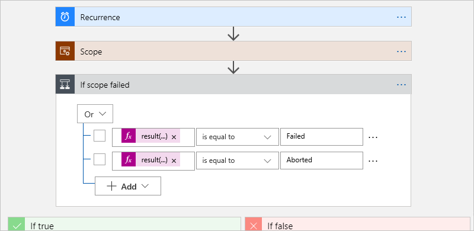

      Now, set the condition's `runAfter` property so the condition checks the 
      scope status and runs the matching action that you define in later steps.

   1. On the **If scope failed** condition, choose the **ellipsis** (...) button, 
   and then choose **Configure run after**.

      

   1. Select all these scope statuses: **is successful**, 
   **has failed**, **is skipped**, and **has timed out**

      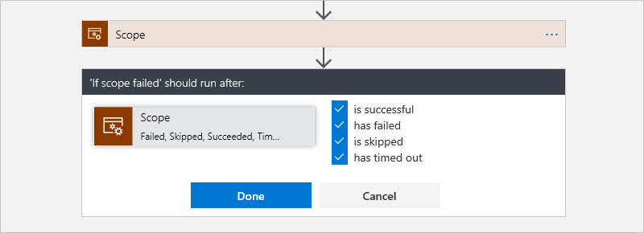

   1. When you're finished, choose **Done**. 
   The condition now shows an "information" icon.

1. In the **If true** and **If false** branches, 
add the actions that you want to perform based on 
each scope status, for example, send an email or message.

   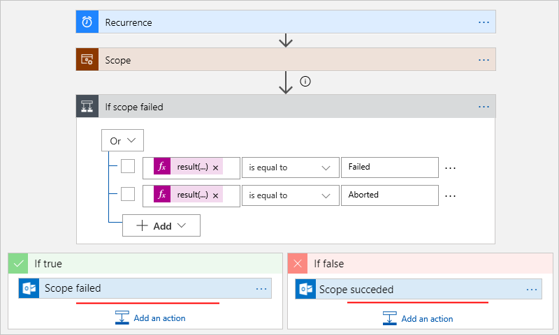

1. Save your logic app.

Your finished logic app now looks like this example:

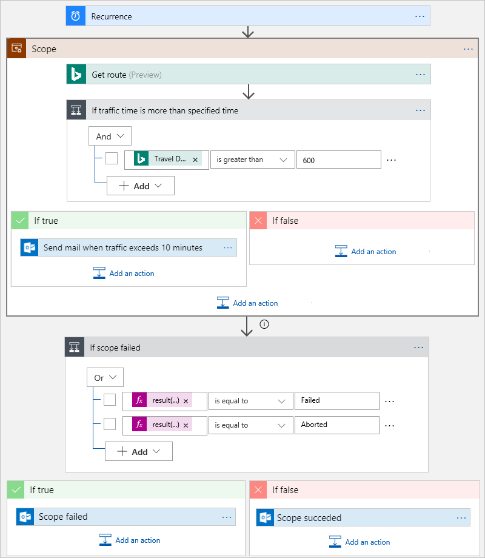

## Test your work

On the designer toolbar, choose **Run**. If all the scoped actions succeed, 
you get a "Scope succeeded" message. If any scoped actions don't succeed, 
you get a "Scope failed" message. 

<a name="scopes-json"></a>

## JSON definition

If you're working in code view, you can define a scope structure 
in your logic app's JSON definition instead. For example, 
here is the JSON definition for trigger and actions in the previous logic app:

``` json
"triggers": {
  "Recurrence": {
    "type": "Recurrence",
    "recurrence": {
       "frequency": "Minute",
       "interval": 1
    }
  }
}
```

```json
"actions": {
  "If_scope_failed": {
    "type": "If",
    "actions": {
      "Scope_failed": {
        "type": "ApiConnection",
        "inputs": {
          "body": {
            "Body": "Scope failed. Scope status: @{result('Scope')[0]['status']}",
            "Subject": "Scope failed",
            "To": "<your-email@domain.com>"
          },
          "host": {
            "connection": {
              "name": "@parameters('$connections')['outlook']['connectionId']"
            }
          },
          "method": "post",
          "path": "/Mail"
        },
        "runAfter": {}
      }
    },
    "else": {
      "actions": {
        "Scope_succeded": {
          "type": "ApiConnection",
          "inputs": {
            "body": {
              "Body": "Scope succeeded. Scope status: @{result('Scope')[0]['status']}",
              "Subject": "Scope succeeded",
              "To": "<your-email@domain.com>"
            },
            "host": {
              "connection": {
               "name": "@parameters('$connections')['outlook']['connectionId']"
              }
            },
            "method": "post",
            "path": "/Mail"
          },
          "runAfter": {}
        }
      }
    },
    "expression": {
      "or": [ 
         {
            "equals": [ 
              "@result('Scope')[0]['status']", 
              "Failed"
            ]
         },
         {
            "equals": [
               "@result('Scope')[0]['status']", 
               "Aborted"
            ]
         } 
      ]
    },
    "runAfter": {
      "Scope": [
        "Failed",
        "Skipped",
        "Succeeded",
        "TimedOut"
      ]
    }
  },
  "Scope": {
    "type": "Scope",
    "actions": {
      "Get_route": {
        "type": "ApiConnection",
        "inputs": {
          "host": {
            "connection": {
              "name": "@parameters('$connections')['bingmaps']['connectionId']"
            }
          },
          "method": "get",
          "path": "/REST/V1/Routes/Driving",
          "queries": {
            "distanceUnit": "Mile",
            "optimize": "timeWithTraffic",
            "travelMode": "Driving",
            "wp.0": "<start>",
            "wp.1": "<end>"
          }
        },
        "runAfter": {}
      },
      "If_traffic_time_is_more_than_specified_time": {
        "type": "If",
        "actions": {
          "Send_mail_when_traffic_exceeds_10_minutes": {
            "type": "ApiConnection",
            "inputs": {
              "body": {
                 "Body": "Travel time:@{div(body('Get_route')?['travelDurationTraffic'],60)} minutes",
                 "Subject": "Time to leave: Traffic more than 10 minutes",
                 "To": "<your-email@domain.com>"
              },
              "host": {
                "connection": {
                   "name": "@parameters('$connections')['outlook']['connectionId']"
                }
              },
              "method": "post",
              "path": "/Mail"
            },
            "runAfter": {}
          }
        },
        "expression": {
          "and" : [
            {
               "greater": [ 
                  "@body('Get_route')?['travelDurationTraffic']", 
                  600
               ]
            }
          ]
        },
        "runAfter": {
          "Get_route": [
            "Succeeded"
          ]
        }
      }
    },
    "runAfter": {}
  }
},
```

## Get support

* For questions, visit the 
[Azure Logic Apps forum](https://social.msdn.microsoft.com/Forums/en-US/home?forum=azurelogicapps).
* To submit or vote on features and suggestions, 
visit the [Azure Logic Apps user feedback site](https://aka.ms/logicapps-wish).

## Next steps

* [Run steps based on a condition (conditional statements)](../logic-apps/logic-apps-control-flow-conditional-statement.md)
* [Run steps based on different values (switch statements)](../logic-apps/logic-apps-control-flow-switch-statement.md)
* [Run and repeat steps (loops)](../logic-apps/logic-apps-control-flow-loops.md)
* [Run or merge parallel steps (branches)](../logic-apps/logic-apps-control-flow-branches.md)
