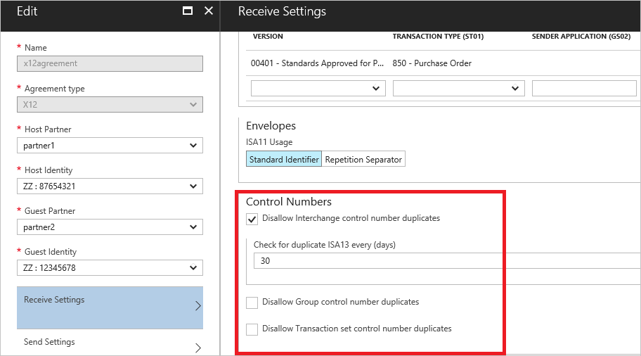
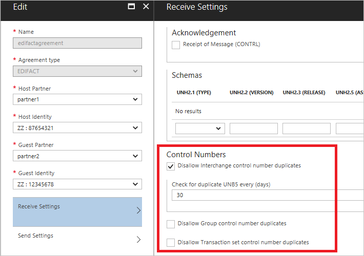
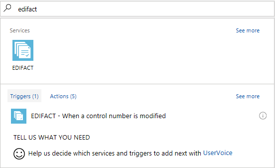
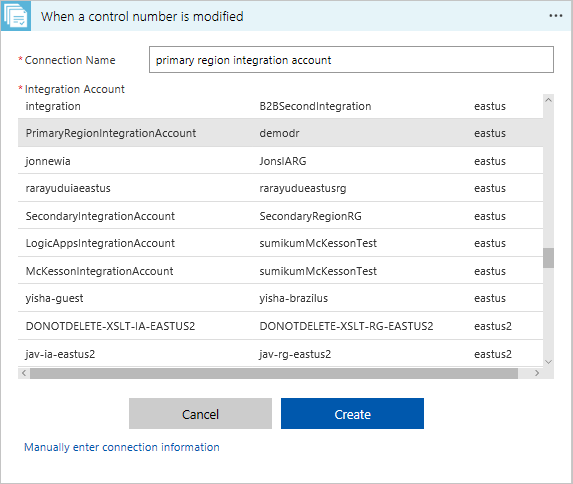
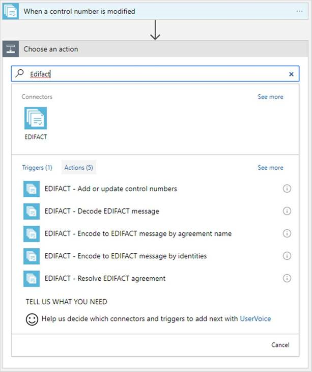
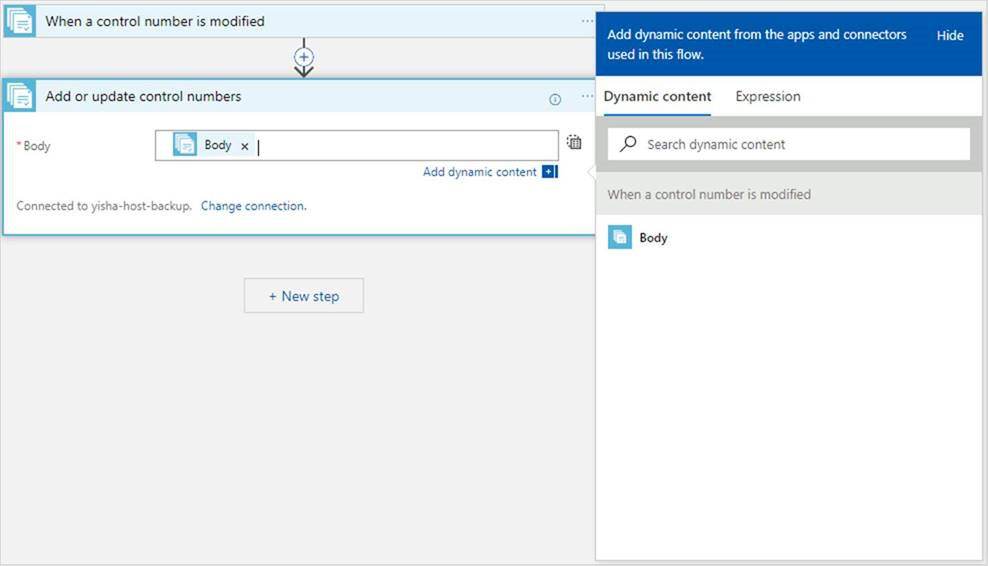
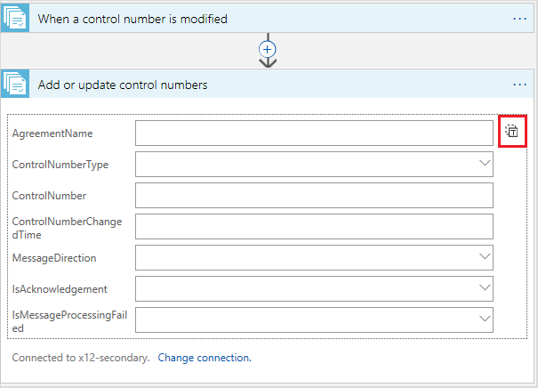

# Set up cross-region disaster recovery for integration accounts in Azure Logic Apps

B2B workloads involve money transactions like orders and invoices. 
During a disaster event, it's critical for a business to quickly 
recover to meet the business-level SLAs agreed upon with their partners. 
This article demonstrates how to build a business continuity plan for B2B workloads. 

* Disaster Recovery readiness 
* Fail over to secondary region during a disaster event 
* Fall back to primary region after a disaster event

## Disaster Recovery readiness  

1. Identify a secondary region and create an [integration account](../logic-apps/logic-apps-enterprise-integration-create-integration-account.md) in the secondary region.

2. Add partners, schemas, and agreements for the required message 
flows where the run status needs to be replicated 
to secondary region integration account.

   > [!TIP]
   > Make sure there's consistency in the integration 
   > account artifact's naming convention across regions. 

3. To pull the run status from the primary region, 
create a logic app in the secondary region. 

   This logic app should have a *trigger* and an *action*. 
   The trigger should connect to primary region integration account, 
   and the action should connect to secondary region integration account. 
   Based on the time interval, the trigger polls the primary region run 
   status table and pulls the new records, if any. The action updates them 
   to secondary region integration account. 
   This helps to get incremental runtime status from primary region to secondary region.

4. Business continuity in Logic Apps integration account 
is designed to support based on B2B protocols - X12, AS2, and EDIFACT. 
To find detailed steps, select the respective links.

5. The recommendation is to deploy all primary region resources in a secondary region too. 

   Primary region resources include Azure SQL Database or Azure Cosmos DB, 
   Azure Service Bus and Azure Event Hubs used for messaging, 
   Azure API Management, and the Azure Logic Apps feature in Azure App Service.   

6. Establish a connection from a primary region to a secondary region. 
To pull the run status from a primary region, 
create a logic app in a secondary region. 

   The logic app should have a trigger and an action. 
   The trigger should connect to a primary region integration account. 
   The action should connect to a secondary region integration account. 
   Based on the time interval, the trigger polls the primary region 
   run status table and pulls the new records, if any. 
   The action updates them to a secondary region integration account. 
   This process helps to get incremental runtime status from the primary region to the secondary region.

Business continuity in a Logic Apps integration account 
provides support based on the B2B protocols X12, AS2, and EDIFACT. 
For detailed steps on using X12 and AS2, see 
[X12](../logic-apps/logic-apps-enterprise-integration-b2b-business-continuity.md#x12) and 
[AS2](../logic-apps/logic-apps-enterprise-integration-b2b-business-continuity.md#as2) in this article.

## Fail over to a secondary region during a disaster event

During a disaster event, when the primary region is not 
available for business continuity, direct traffic to the secondary region. 
A secondary region helps a business to recover functions quickly 
to meet the RPO/RTO agreed upon by their partners. 
It also minimizes efforts to fail over from one region to another region. 

There is an expected latency while copying control 
numbers from a primary region to a secondary region. 
To avoid sending duplicate generated control numbers 
to partners during a disaster event, 
the recommendation is to increment the control numbers 
in the secondary region agreements by using 
[PowerShell cmdlets](/powershell/module/azurerm.logicapp/set-azurermintegrationaccountgeneratedicn?view=azurermps-6.13.0).

## Fall back to a primary region post-disaster event

To fall back to a primary region when it is available, follow these steps:

1. Stop accepting messages from partners in the secondary region.  

2. Increment the generated control numbers for all the 
primary region agreements by using 
[PowerShell cmdlets](/powershell/module/azurerm.logicapp/set-azurermintegrationaccountgeneratedicn?view=azurermps-6.13.0).  

3. Direct traffic from the secondary region to the primary region.

4. Check that the logic app created in the secondary 
region for pulling run status from the primary region is enabled.

## X12 

Business continuity for EDI X12 documents is based on control numbers:

> [!TIP]
> You can also use the [X12 quick start template](https://azure.microsoft.com/resources/templates/201-logic-app-b2b-disaster-recovery-replication/) 
> to create logic apps. Creating primary and secondary 
> integration accounts are prerequisites to use the template. 
> The template helps to create two logic apps, 
> one for received control numbers and another for generated control numbers. 
> Respective triggers and actions are created in the logic apps, 
> connecting the trigger to the primary integration account 
> and the action to the secondary integration account.

**Prerequisites**

To enable disaster recovery for inbound messages, 
select the duplicate check settings in the X12 agreement's Receive Settings.

  

1. Create a [logic app](../logic-apps/quickstart-create-first-logic-app-workflow.md) in a secondary region.    

2. Search on **X12**, and select **X12 - When a control number is modified**.   

   

   The trigger prompts you to establish a connection to an integration account. 
   The trigger should be connected to a primary region integration account.

3. Enter a connection name, select your *primary region integration account* from the list, and choose **Create**.   

   

4. The **DateTime to start control number sync** setting is optional. 
The **Frequency** can be set to **Day**, **Hour**, **Minute**, or **Second** with an interval.   

   

5. Select **New step** > **Add an action**.

   

6. Search on **X12**, and select **X12 - Add or update control numbers**.   

   

7. To connect an action to a secondary region integration account, 
select **Change connection** > **Add new connection** 
for a list of the available integration accounts. 
Enter a connection name, select your 
*secondary region integration account* from the list, 
and choose **Create**. 

   

8. Switch to raw inputs by clicking on the icon in upper right corner.

   

9. Select Body from the dynamic content picker, 
and save the logic app.

   

   Based on the time interval, the trigger polls the primary region 
   received control number table and pulls the new records. 
   The action updates the records in the secondary region integration account. 
   If there are no updates, the trigger status appears as **Skipped**.   

   

Based on the time interval, the incremental runtime status 
replicates from a primary region to a secondary region. 
During a disaster event, when the primary region is not available, 
direct traffic to the secondary region for business continuity. 

## EDIFACT 

Business continuity for EDI EDIFACT documents is based on control numbers.

**Prerequisites**

To enable disaster recovery for inbound messages, 
select the duplicate check settings in your EDIFACT agreement's Receive Settings.

  

1. Create a [logic app](../logic-apps/quickstart-create-first-logic-app-workflow.md) in a secondary region.    

2. Search on **EDIFACT**, and select **EDIFACT - When a control number is modified**.

   

   The trigger prompts you to establish a connection to an integration account. 
   The trigger should be connected to a primary region integration account. 

3. Enter a connection name, select your *primary region integration account* 
   from the list, and choose **Create**.    

   

4. The **DateTime to start control number sync** setting is optional. The **Frequency** can be set to **Day**, **Hour**, **Minute**, or **Second** with an interval.    

   

6. Select **New step** > **Add an action**.    

   

7. Search on **EDIFACT**, and select **EDIFACT - Add or update control numbers**.   

   

8. To connect an action to a secondary region integration account, 
   select **Change connection** > **Add new connection** for a 
   list of the available integration accounts. Enter a connection name, 
   select your *secondary region integration account* from the list, 
   and choose **Create**.

   

9. Switch to raw inputs by clicking on the icon in upper right corner.

   

10. Select Body from the dynamic content picker, 
   and save the logic app.   

   

   Based on the time interval, the trigger polls the 
   primary region received control number table and pulls the new records.
   The action updates the records to the secondary region integration account. 
   If there are no updates, the trigger status appears as **Skipped**.

   

Based on the time interval, the incremental runtime status 
replicates from a primary region to a secondary region. 
During a disaster event, when the primary region is not available, 
direct traffic to the secondary region for business continuity. 

## AS2 

Business continuity for documents that use the AS2 protocol 
is based on the message ID and the MIC value.

> [!TIP]
> You can also use the [AS2 quick start template](https://github.com/Azure/azure-quickstart-templates/pull/3302) 
> to create logic apps. Creating primary and secondary integration 
> accounts are prerequisites to use the template. 
> The template helps create a logic app that has a trigger and an action. 
> The logic app creates a connection from a trigger to a primary 
> integration account and an action to a secondary integration account.

1. Create a [logic app](../logic-apps/quickstart-create-first-logic-app-workflow.md) 
in the secondary region.  

2. Search on **AS2**, and select **AS2 - When a MIC value is created**.   

   

   A trigger prompts you to establish a connection to an integration account. 
   The trigger should be connected to a primary region integration account. 
   
3. Enter a connection name, select your *primary region integration account* 
from the list, and choose **Create**.

   

4. The **DateTime to start MIC value sync** setting is optional. 
The **Frequency** can be set to **Day**, **Hour**, **Minute**, 
or **Second** with an interval.   

   

5. Select **New step** > **Add an action**.  

   

6. Search on **AS2**, and select **AS2 - Add or update MIC contents**.  

   

7. To connect an action to a secondary integration account, 
select **Change connection** > **Add new connection** for 
a list of the available integration accounts. Enter a connection name, 
select your *secondary region integration account* from the list, 
and choose **Create**.

   

8. Switch to raw inputs by clicking on the icon in upper right corner.

   

9. Select Body from the dynamic content picker, and save the logic app.   

   

   Based on the time interval, the trigger polls the primary region 
   table and pulls the new records. The action updates them to the 
   secondary region integration account. 
   If there are no updates, the trigger status appears as **Skipped**.  

   

Based on the time interval, the incremental runtime status 
replicates from the primary region to the secondary region. 
During a disaster event, when the primary region is not available, 
direct traffic to the secondary region for business continuity. 

## Next steps

[Monitor B2B messages with Azure Monitor logs](../logic-apps/monitor-b2b-messages-log-analytics.md)
