# Receive and send B2B messages by using Azure Logic Apps and Enterprise Integration Pack

When you have an integration account that defines trading partners and agreements, you can create an automated business to business (B2B) workflow that exchanges messages between trading partners by using [Azure Logic Apps](../logic-apps/logic-apps-overview.md) with the [Enterprise Integration Pack](../logic-apps/logic-apps-enterprise-integration-overview.md). Azure Logic Apps works with connectors that support AS2, X12, EDIFACT, and RosettaNet industry-standard protocols. You can also combine these connectors with other [connectors available in Logic Apps](../connectors/apis-list.md), for example, Salesforce and Office 365 Outlook.

This article shows how to create a logic app that receives an HTTP request by using a Request trigger, decodes the message content by using the AS2 and X12 actions, and then returns a response by using the Response action.

## Prerequisites

* An Azure subscription. If you don't have a subscription yet, [sign up for a free Azure account](https://azure.microsoft.com/free/).

* A blank logic app so that you can create the B2B workflow by using the [Request](../connectors/connectors-native-reqres.md) trigger that's followed by these actions:

  * [AS2 Decode](../logic-apps/logic-apps-enterprise-integration-as2.md)

  * [Condition](../logic-apps/logic-apps-control-flow-conditional-statement.md), which sends a [Response](../connectors/connectors-native-reqres.md) based on whether the AS2 Decode action succeeds or fails

  * [Decode X12 message](../logic-apps/logic-apps-enterprise-integration-x12.md) 

  If you're new to logic apps, review [What is Azure Logic Apps?](../logic-apps/logic-apps-overview.md) and [Quickstart: Create your first logic app](../logic-apps/quickstart-create-first-logic-app-workflow.md).

* An [integration account](../logic-apps/logic-apps-enterprise-integration-accounts.md) that's associated with your Azure subscription and linked to your logic app. Both your logic app and integration account must exist in the same location or Azure region.

* At least two [trading partners](../logic-apps/logic-apps-enterprise-integration-partners.md) that you've already defined in your integration account along with [AS2 and X12 agreements](logic-apps-enterprise-integration-agreements.md) for those partners.

## Add Request trigger

This example uses the Logic App Designer in the Azure portal, but you can follow similar steps for the Logic App Designer in Visual Studio.

1. In the [Azure portal](https://portal.azure.com), open your blank logic app in the Logic App Designer.

1. In the search box, enter `when a http request`, and select **When an HTTP request is received** to use as the trigger.

   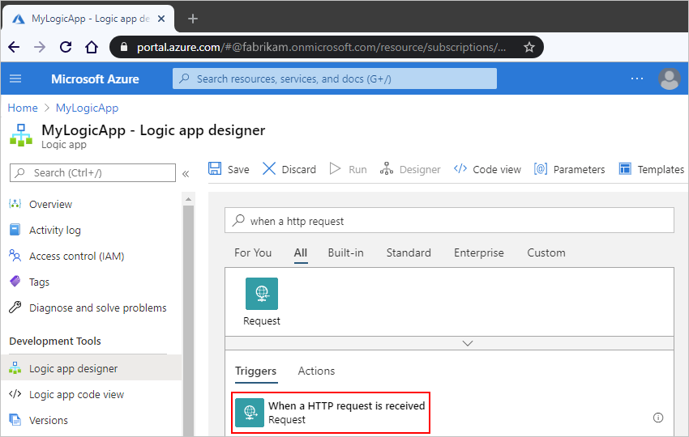

1. Leave the **Request body JSON Schema** box empty because the X12 message is a flat file.

   

1. When you're done, on the designer toolbar, select **Save**.

   This step generates the **HTTP POST URL** to use for sending the request that triggers the logic app. To copy this URL, select the copy icon next to the URL.

   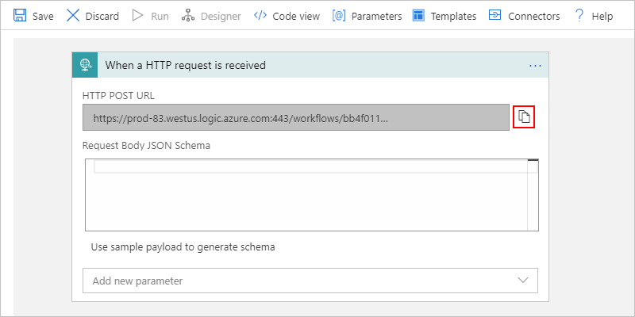

## Add AS2 decode action

Now add the B2B actions that you want to use. This example uses AS2 and X12 actions.

1. Under the trigger, select **New step**. To hide the trigger details, click on the trigger's title bar.

   

1. Under **Choose an action**, in the search box, enter `as2 decode`, and select **AS2 Decode (v2)**.

   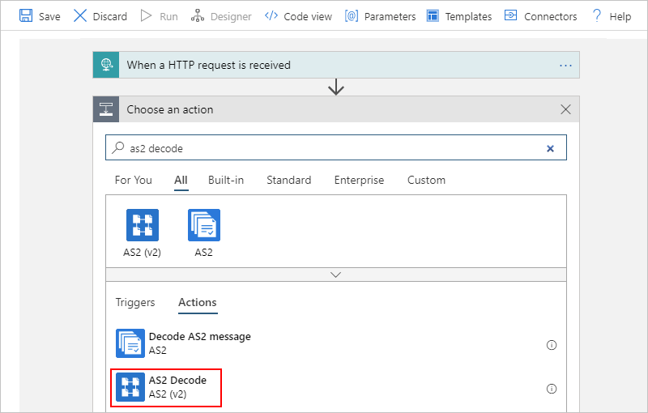

1. For the **Message to decode** property, enter the input that you want the AS2 action to decode, which is the `body` content that's received by the HTTP request trigger. You have multiple ways to specify this content as input, either from the dynamic content list or as an expression:

   * To select from a list that shows the available trigger outputs, click inside the **Message to decode** box. After the dynamic content list appears, under **When a HTTP request is received**, select **Body** property value, for example:

     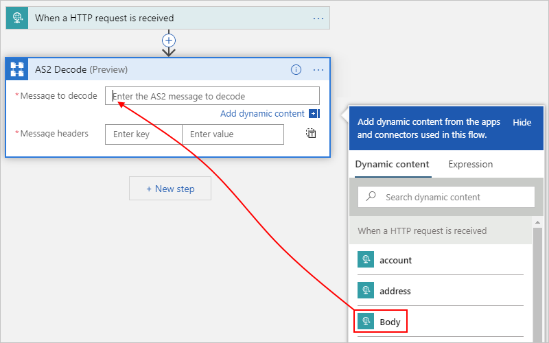

   * To enter an expression that references the trigger's `body` output, click inside the **Message to decode** box. After the dynamic content list appears, select **Expression**. In the expression editor, enter the expression here, and select **OK**:

     `triggerOutputs()['body']`

     Or, in the **Message to decode** box, directly enter this expression:

     `@triggerBody()`

     The expression resolves to the **Body** token.

     

1. For the **Message headers** property, enter any headers required for the AS2 action, which are described by the `headers` content that's received by the HTTP request trigger.

   To enter an expression that references the trigger's `headers` output, click inside the **Message headers** box. After the dynamic content list appears, select **Expression**. In the expression editor, enter the expression here, and select **OK**:

   `triggerOutputs()['Headers']`

   To get this expression to resolve as this token, switch between the designer and code view, for example:

   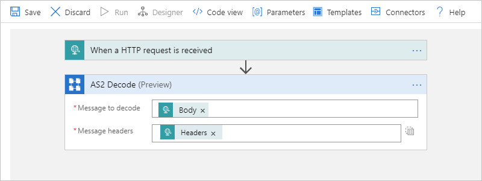

## Add Response action for message receipt notification

To notify the trading partner that the message was received, you can return a response that contains an AS2 Message Disposition Notification (MDN) by using the **Response** action. By adding this action immediately after the **AS2 Decode** action, should that action fail, the logic app doesn't continue processing.

1. Under the **AS2 Decode** action, select **New step**.

1. Under **Choose an action**, under the search box, select **Built-in**. In the search box, enter `condition`. From the **Actions** list, select **Condition**.

   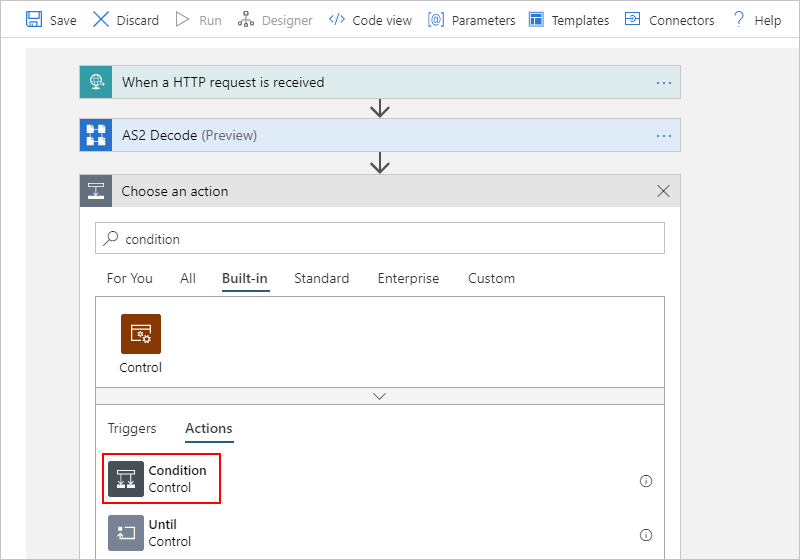

   Now the condition shape appears, including the paths for whether the condition is met or not.

   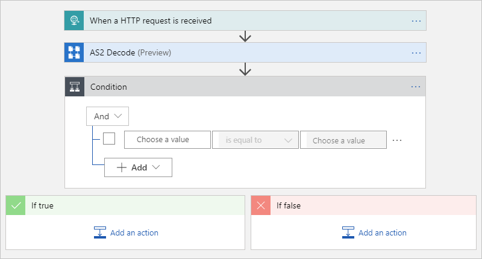

1. Now specify the condition to evaluate. In the **Choose a value** box, enter this expression:

   `@body('AS2_Decode')?['AS2Message']?['MdnExpected']`

   In the middle box, make sure the comparison operation is set to `is equal to`. In the right-side box, enter the value `Expected`. To get the expression to resolve as this token, switch between the designer and code view.

   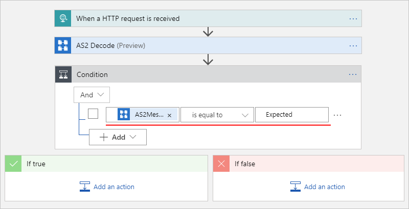

1. Now specify the responses to return whether the **AS2 Decode** action succeeds or not.

   1. For the case when the **AS2 Decode** action succeeds, in the **If true** shape, select **Add an action**. Under **Choose an action**, in the search box, enter `response`, and select **Response**.

      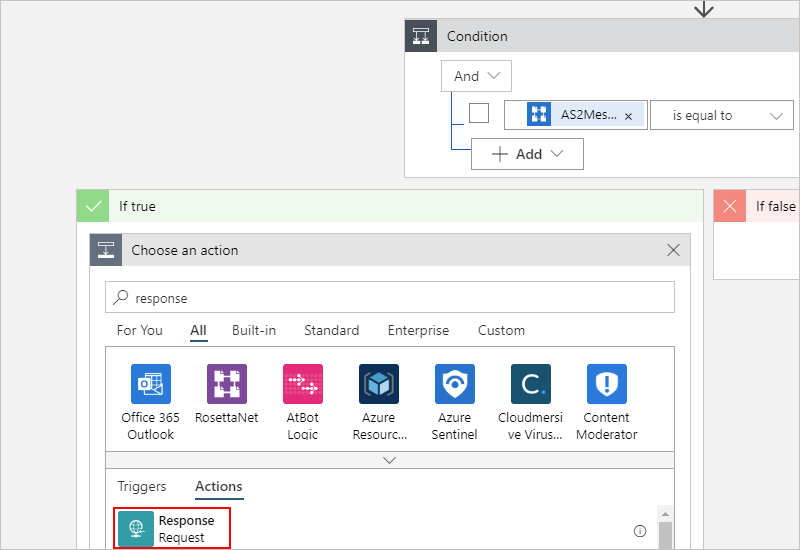

   1. To access the AS2 MDN from the **AS2 Decode** action's output, specify these expressions:

      * In the **Response** action's **Headers** property, enter this expression:

        `@body('AS2_Decode')?['OutgoingMdn']?['OutboundHeaders']`

      * In the **Response** action's **Body** property, enter this expression:

        `@body('AS2_Decode')?['OutgoingMdn']?['Content']`

   1. To get the expressions to resolve as tokens, switch between the designer and code view:

      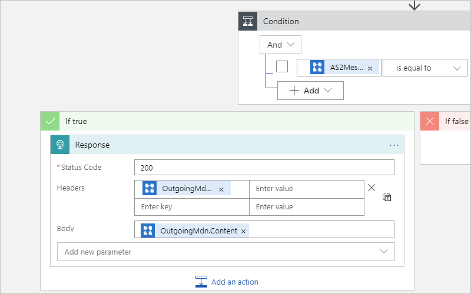

   1. For the case when the **AS2 Decode** action fails, in the **If false** shape, select **Add an action**. Under **Choose an action**, in the search box, enter `response`, and select **Response**. Set up the **Response** action to return the status and error that you want.

1. Save your logic app.

## Add Decode X12 message action

1. Now add the **Decode X12 message** action. Under the **Response** action, select **Add an action**.

1. Under **Choose an action**, in the search box, enter `x12 decode`, and select **Decode X12 message**.

   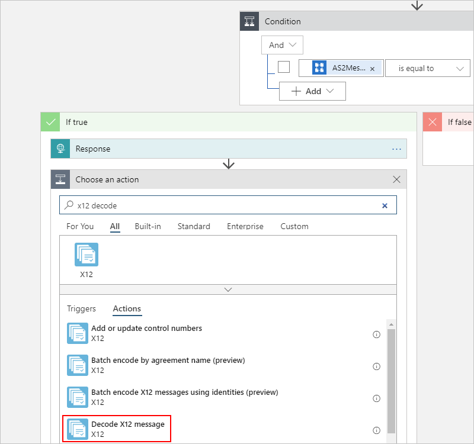

1. If the X12 action prompts you for connection information, provide the name for the connection, select the integration account you want to use, and then select **Create**.

   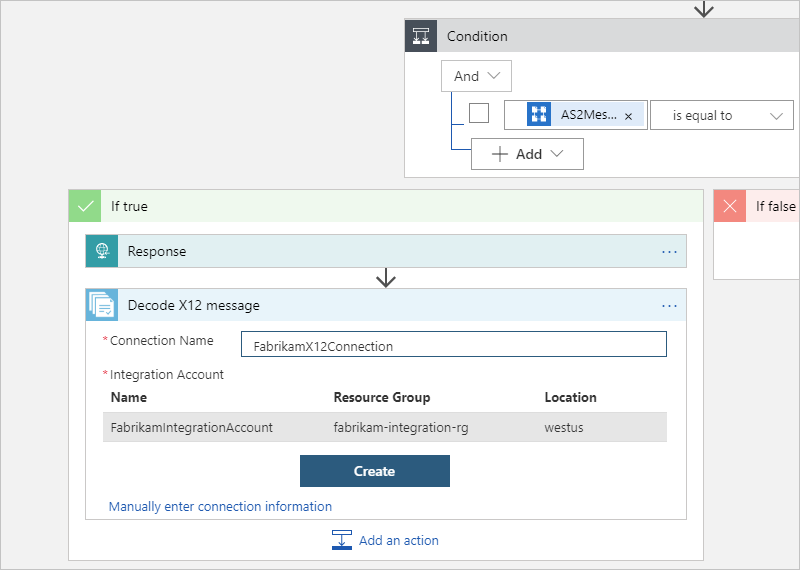

1. Now specify the input for the X12 action. This example uses the output from the AS2 action, which is the message content but note that this content is in JSON object format and is base64 encoded. So, you have to convert this content to a string.

   In the **X12 Flat file message to decode** box, enter this expression to convert the AS2 output:

   `@base64ToString(body('AS2_Decode')?['AS2Message']?['Content'])`

    To get the expression to resolve as this token, switch between the designer and code view.

    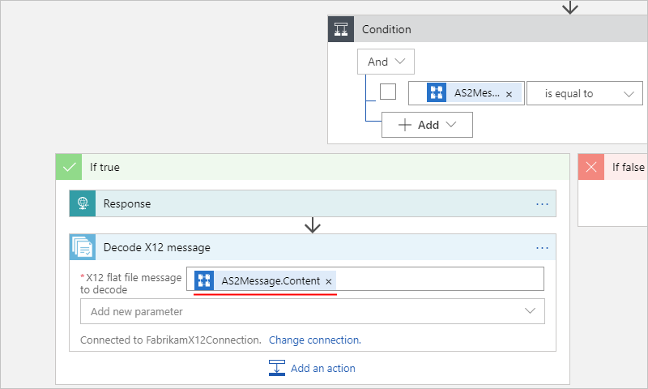

1. Save your logic app.

   If you need additional steps for this logic app, for example, to decode the message content and output that content in JSON object format, continue building your logic app.

You're now done setting up your B2B logic app. In a real world app, you might want to store the decoded X12 data in a line-of-business (LOB) app or data store. For example, see these articles:

* [Connect to SAP systems from Azure Logic Apps](../logic-apps/logic-apps-using-sap-connector.md)
* [Monitor, create, and manage SFTP files by using SSH and Azure Logic Apps](../connectors/connectors-sftp-ssh.md)

To connect your own LOB apps and use these APIs in your logic app, you can add more actions or [write custom APIs](../logic-apps/logic-apps-create-api-app.md).

## Next steps

* [Receive and respond to incoming HTTPS calls](../connectors/connectors-native-reqres.md)
* [Exchange AS2 messages for B2B enterprise integration](../logic-apps/logic-apps-enterprise-integration-as2.md)
* [Exchange X12 messages for B2B enterprise integration](../logic-apps/logic-apps-enterprise-integration-x12.md)
* Learn more about the [Enterprise Integration Pack](../logic-apps/logic-apps-enterprise-integration-overview.md)