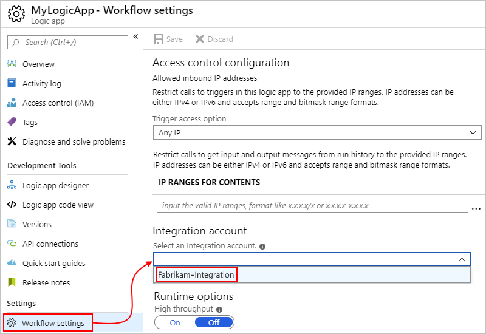
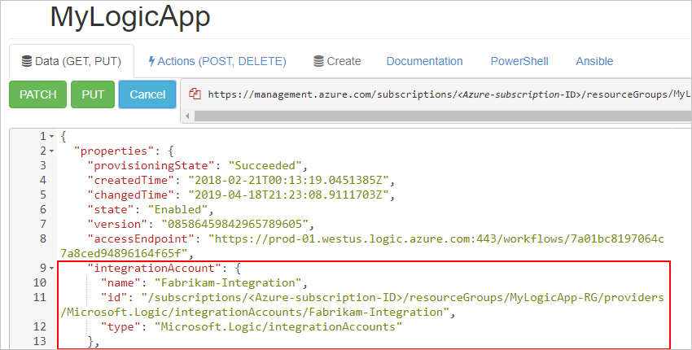
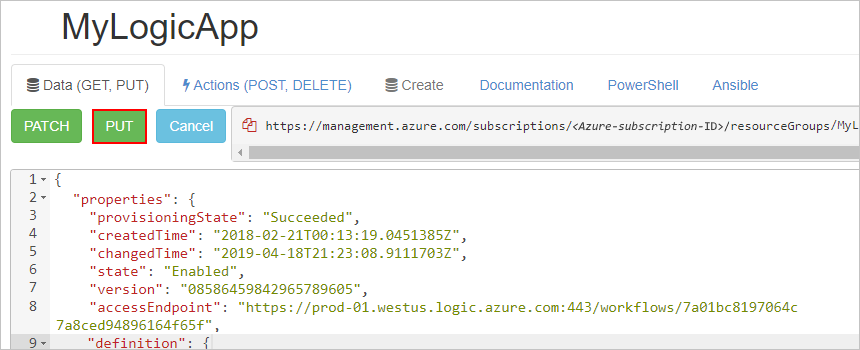
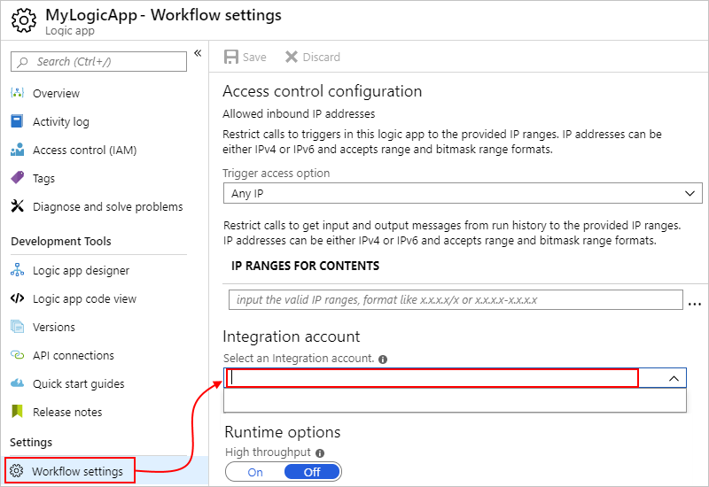

# Create and manage integration accounts for B2B enterprise integrations in Azure Logic Apps

Before you can build [enterprise integration and B2B solutions](../logic-apps/logic-apps-enterprise-integration-overview.md) by using [Azure Logic Apps](../logic-apps/logic-apps-overview.md), you need to create an integration account, which is a separate Azure resource that provides a secure, scalable, and manageable container for the integration artifacts that you define and use with your logic app workflows.

For example, you can create, store, and manage B2B artifacts, such as trading partners, agreements, maps, schemas, certificates, and batch configurations. Also, before your logic app can work with these artifacts and use the Logic Apps B2B connectors, you must [link your integration account](#link-account) to your logic app. Both your integration account and logic app must exist in the *same* location or region.

> [!TIP]
> To create an integration account inside an [integration service environment](../logic-apps/connect-virtual-network-vnet-isolated-environment-overview.md), see [Create integration accounts in an ISE](../logic-apps/add-artifacts-integration-service-environment-ise.md#create-integration-account-environment).

This topic shows you how to perform these tasks:

* Create your integration account.
* Link your integration account to a logic app.
* Change the pricing tier for your integration account.
* Unlink your integration account from a logic app.
* Move your integration account to another Azure resource group or subscription.
* Delete your integration account.

## Prerequisites

* An Azure subscription. If you don't have an Azure subscription, [sign up for a free Azure account](https://azure.microsoft.com/free/).

## Create integration account

For this task, you can use either the Azure portal by following the steps in this section, [Azure PowerShell](https://docs.microsoft.com//powershell/module/azurerm.logicapp/New-AzureRmIntegrationAccount), or [Azure CLI](https://docs.microsoft.com/cli/azure/resource?view=azure-cli-latest#az-resource-create).

1. Sign in to the [Azure portal](https://portal.azure.com) with your Azure account credentials.

1. On the main Azure menu, select **Create a resource**. In the search box, enter "integration account" as your filter, and select **Integration Account**.

   

1. Under **Integration Account**, select **Create**.

   

1. Provide this information about your integration account:

   

   | Property | Required | Value | Description |
   |----------|----------|-------|-------------|
   | **Name** | Yes | <*integration-account-name*> | Your integration account's name, which can contain only letters, numbers, hyphens (`-`), underscores (`_`), parentheses (`(`, `)`), and periods (`.`). This example uses "Fabrikam-Integration". |
   | **Subscription** | Yes | <*Azure-subscription-name*> | The name for your Azure subscription |
   | **Resource group** | Yes | <*Azure-resource-group-name*> | The name for the [Azure resource group](../azure-resource-manager/resource-group-overview.md) to use for organizing related resources. For this example, create a new resource group with the name "FabrikamIntegration-RG". |
   | **Pricing Tier** | Yes | <*pricing-level*> | The pricing tier for the integration account, which you can change later. For this example, select **Free**. For more information, see these topics: <p>- [Logic Apps pricing model](../logic-apps/logic-apps-pricing.md#integration-accounts) <p>- [Logic Apps limits and configuration](../logic-apps/logic-apps-limits-and-config.md#integration-account-limits) <p>- [Logic Apps pricing](https://azure.microsoft.com/pricing/details/logic-apps/) |
   | **Location** | Yes | <*Azure-region*> | The region where to store your integration account metadata. Either select the same location as your logic app, or create your logic apps in the same location as your integration account. For this example, use "West US". <p>**Note**: To create an integration account inside an [integration service environment (ISE)](../logic-apps/connect-virtual-network-vnet-isolated-environment-overview.md), select that ISE as the location. For more information, see [Create integration accounts in an ISE](../logic-apps/add-artifacts-integration-service-environment-ise.md#create-integration-account-environment). |
   | **Log Analytics** | No | Off, On | Keep the **Off** setting for this example. |
   |||||

1. When you're finished, select **Create**.

   After deployment completes, Azure opens your integration account.

   

1. Before your logic app can use your integration account, follow the next steps to link your integration account and logic app together.

<a name="link-account"></a>

## Link to logic app

To give your logic apps access to an integration account that contains your B2B artifacts, you must first link your integration account to your logic app. Both logic app and integration account must exist in the same region. To complete this task, you can use the Azure portal. If you use Visual Studio and your logic app is in an [Azure Resource Group project](../azure-resource-manager/vs-azure-tools-resource-groups-deployment-projects-create-deploy.md), you can [link your logic app to an integration account by using Visual Studio](../logic-apps/manage-logic-apps-with-visual-studio.md#link-integration-account).

1. In the Azure portal, find and open your logic app.

1. In the [Azure portal](https://portal.azure.com), open an existing logic app or create a new logic app.

1. On your logic app's menu, under **Settings**, select **Workflow settings**. Under **Integration account**, open the **Select an Integration account** list. Select the integration account to link to your logic app.

   

1. To finish linking, select **Save**.

   

   After your integration account is successfully linked, Azure shows a confirmation message.

   

Now your logic app can use the artifacts in your integration account plus the B2B connectors, such as XML validation and flat file encoding or decoding.  

<a name="change-pricing-tier"></a>

## Change pricing tier

To increase the [limits](../logic-apps/logic-apps-limits-and-config.md#integration-account-limits) for an integration account, you can [upgrade to a higher pricing tier](#upgrade-pricing-tier), if available. For example, you can upgrade from the Free tier to the Basic tier or Standard tier. You can also [downgrade to a lower tier](#downgrade-pricing-tier), if available. For more information pricing information, see these topics:

* [Logic Apps pricing](https://azure.microsoft.com/pricing/details/logic-apps/)
* [Logic Apps pricing model](../logic-apps/logic-apps-pricing.md#integration-accounts)

<a name="upgrade-pricing-tier"></a>

### Upgrade pricing tier

To make this change, you can use either the Azure portal by following the steps in this section or the [Azure CLI](#upgrade-tier-azure-cli).

#### Azure portal

1. Sign in to the [Azure portal](https://portal.azure.com) with your Azure account credentials.

1. In the main Azure search box, enter "integration accounts" as your filter, and select **Integration accounts**.

   

   Azure shows all the integration accounts in your Azure subscriptions.

1. Under **Integration accounts**, select the integration account that you want to move. On your integration account menu, select **Overview**.

   

1. On the Overview pane, select **Upgrade pricing tier**, which lists any available higher tiers. When you select a tier, the change immediately takes effect.

<a name="upgrade-tier-azure-cli"></a>

#### Azure CLI

1. If you haven't done so already, [install the Azure CLI prerequisites](https://docs.microsoft.com/cli/azure/get-started-with-azure-cli?view=azure-cli-latest).

1. In the Azure portal, open the Azure [**Cloud Shell**](https://docs.microsoft.com/azure/cloud-shell/overview?view=azure-cli-latest) environment.

   

1. At the command prompt, enter the [**az resource** command](https://docs.microsoft.com/cli/azure/resource?view=azure-cli-latest#az-resource-update), and set `skuName` to the higher tier that you want.

   ```Azure CLI
   az resource update --resource-group {ResourceGroupName} --resource-type Microsoft.Logic/integrationAccounts --name {IntegrationAccountName} --subscription {AzureSubscriptionID} --set sku.name={SkuName}
   ```
  
   For example, if you have the Basic tier, you can set `skuName` to `Standard`:

   ```Azure CLI
   az resource update --resource-group FabrikamIntegration-RG --resource-type Microsoft.Logic/integrationAccounts --name Fabrikam-Integration --subscription XXXXXXXXXXXXXXXXX --set sku.name=Standard
   ```

<a name="downgrade-pricing-tier"></a>

### Downgrade pricing tier

To make this change, use the [Azure CLI](https://docs.microsoft.com/cli/azure/get-started-with-azure-cli?view=azure-cli-latest).

1. If you haven't done so already, [install the Azure CLI prerequisites](https://docs.microsoft.com/cli/azure/get-started-with-azure-cli?view=azure-cli-latest).

1. In the Azure portal, open the Azure [**Cloud Shell**](https://docs.microsoft.com/azure/cloud-shell/overview?view=azure-cli-latest) environment.

   

1. At the command prompt, enter the [**az resource** command](https://docs.microsoft.com/cli/azure/resource?view=azure-cli-latest#az-resource-update) and set `skuName` to the lower tier that you want.

   ```Azure CLI
   az resource update --resource-group <resourceGroupName> --resource-type Microsoft.Logic/integrationAccounts --name <integrationAccountName> --subscription <AzureSubscriptionID> --set sku.name=<skuName>
   ```
  
   For example, if you have the Standard tier, you can set `skuName` to `Basic`:

   ```Azure CLI
   az resource update --resource-group FabrikamIntegration-RG --resource-type Microsoft.Logic/integrationAccounts --name Fabrikam-Integration --subscription XXXXXXXXXXXXXXXXX --set sku.name=Basic
   ```

## Unlink from logic app

If you want to link your logic app to another integration account, or no longer use an integration account with your logic app, delete the link by using Azure Resource Explorer.

1. Open your browser window, and go to [Azure Resource Explorer (https://resources.azure.com)](https://resources.azure.com). Sign in with the same Azure account credentials.

   

1. In the search box, enter your logic app's name so that you can find and select your logic app.

   

1. On the explorer title bar, select **Read/Write**.

   

1. On the **Data** tab, select **Edit**.

   

1. In the editor, find the `integrationAccount` object, and delete that property, which has this format:

   ```json
   {
      // <other-attributes>
      "integrationAccount": {
         "name": "<integration-account-name>",
         "id": "<integration-account-resource-ID>",
         "type": "Microsoft.Logic/integrationAccounts"  
   },
   ```

   For example:

   

1. On the **Data** tab, select **Put** to save your changes.

   

1. In the Azure portal, find and select your logic app. Under your app's **Workflow settings**, check that the **Integration account** property now appears empty.

   

## Move integration account

You can move your integration account to another Azure resource group or Azure subscription. When you move resources, Azure creates new resource IDs, so make sure that you use the new IDs instead and update any scripts or tools associated with the moved resources. If you want to change the subscription, you must also specify an existing or new resource group.

For this task, you can use either the Azure portal by following the steps in this section or the [Azure CLI](https://docs.microsoft.com/cli/azure/resource?view=azure-cli-latest#az-resource-move).

1. Sign in to the [Azure portal](https://portal.azure.com) with your Azure account credentials.

1. In the main Azure search box, enter "integration accounts" as your filter, and select **Integration accounts**.

   

   Azure shows all the integration accounts in your Azure subscriptions.

1. Under **Integration accounts**, select the integration account that you want to move. On your integration account menu, select **Overview**.

   

1. Next to either **Resource group** or **Subscription name**, select **change**.

   

1. Select any related resources that you also want to move.

1. Based on your selection, follow these steps to change the resource group or subscription:

   * Resource group: From the **Resource group** list, select the destination resource group. Or, to create a different resource group, select **Create a new resource group**.

   * Subscription: From the **Subscription** list, select the destination subscription. From the **Resource group** list, select the destination resource group. Or, to create a different resource group, select **Create a new resource group**.

1. To acknowledge your understanding that any scripts or tools associated with the moved resources won't work until you update them with the new resource IDs, select the confirmation box, and then select **OK**.

1. After you finish, make sure that you update any and all scripts with the new resource IDs for your moved resources.  

## Delete integration account

For this task, you can use either the Azure portal by following the steps in this section, [Azure CLI](https://docs.microsoft.com/cli/azure/resource?view=azure-cli-latest#az-resource-delete), or [Azure PowerShell](https://docs.microsoft.com/powershell/module/azurerm.logicapp/Remove-AzureRmIntegrationAccount).

1. Sign in to the [Azure portal](https://portal.azure.com) with your Azure account credentials.

1. In the main Azure search box, enter "integration accounts" as your filter, and select **Integration accounts**.

   

   Azure shows all the integration accounts in your Azure subscriptions.

1. Under **Integration accounts**, select the integration account that you want to delete. On your integration account menu, select **Overview**.

   

1. On the Overview pane, select **Delete**.

   

1. To confirm that you want to delete your integration account, select **Yes**.

   

## Next steps

* [Create trading partners in your integration account](../logic-apps/logic-apps-enterprise-integration-partners.md)
* [Create agreements between partners in your integration account](../logic-apps/logic-apps-enterprise-integration-agreements.md)
