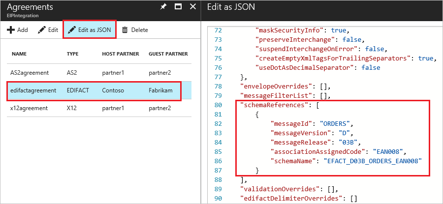
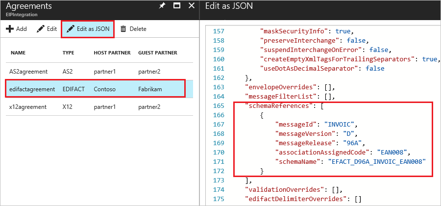

# Handle EDIFACT documents with UNH2.5 segments in Azure Logic Apps

If a UNH2.5 segment exists in an EDIFACT document, the segment is used for schema lookup. For example, in this sample EDIFACT message, the UNH field is `EAN008`:

`UNH+SSDD1+ORDERS:D:03B:UN:EAN008`

To handle this message, follow these steps described below:

1. Update the schema.

1. Check the agreement settings.

## Update the schema

To process the message, you need to deploy a schema that has the UNH2.5 root node name. For example, the schema root name for the sample UNH field is `EFACT_D03B_ORDERS_EAN008`. For each `D03B_ORDERS` that has a different UNH2.5 segment, you have to deploy an individual schema.

## Add schema to EDIFACT agreement

### EDIFACT Decode

To decode the incoming message, set up the schema in the EDIFACT agreement's receive settings:

1. In the [Azure portal](https://portal.azure.com), open your integration account.

1. Add the schema to your integration account.

1. Configure the schema in the EDIFACT agreement's receive settings.

1. Select the EDIFACT agreement, and select **Edit as JSON**. Add the UNH2.5 value to the Receive Agreement's `schemaReferences` section:

   

### EDIFACT Encode

To encode the incoming message, configure the schema in the EDIFACT agreement send settings

1. In the [Azure portal](https://portal.azure.com), open your integration account.

1. Add the schema to your integration account.

1. Configure the schema in the EDIFACT agreement's send settings.

1. Select the EDIFACT agreement, and select **Edit as JSON**. Add the UNH2.5 value to the Send Agreement's `schemaReferences` section:

   

## Next steps

* Learn more about [integration account agreements](../logic-apps/logic-apps-enterprise-integration-agreements.md)
