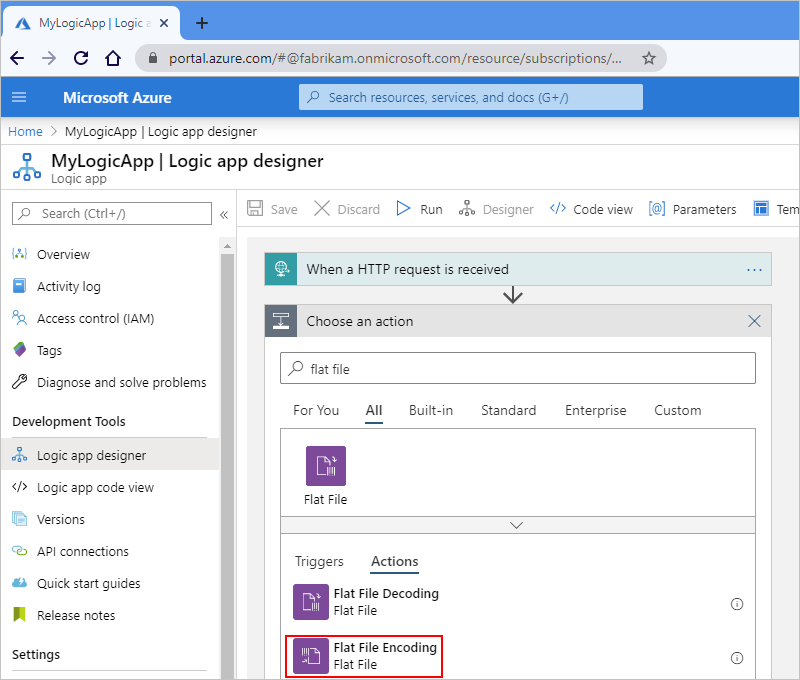
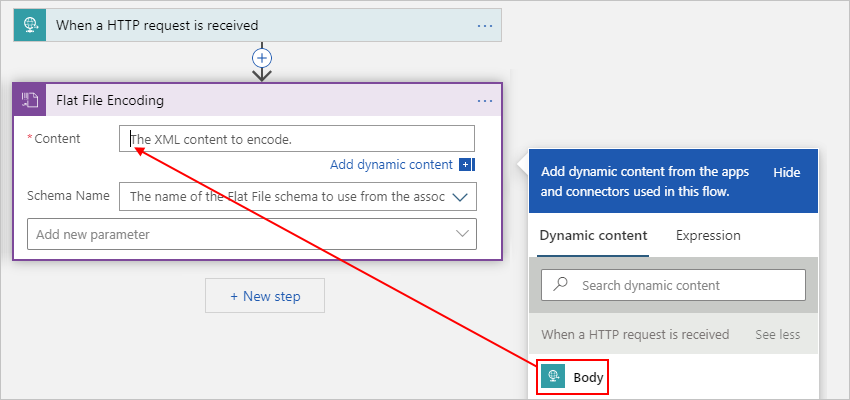
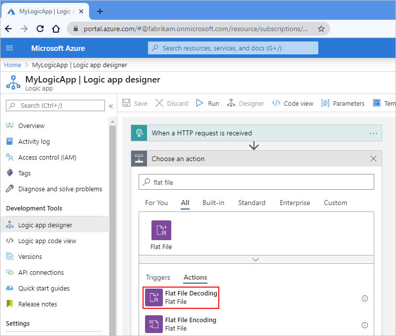
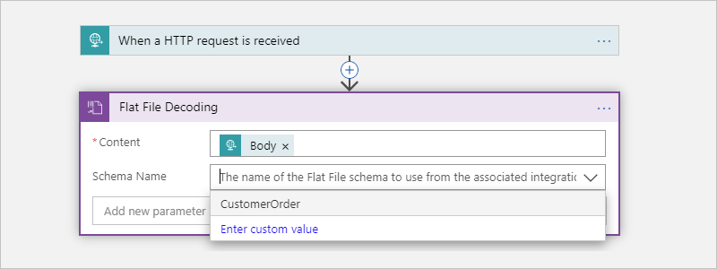

# Encode and decode flat files in Azure Logic Apps by using the Enterprise Integration Pack

Before you send XML content to a business partner in a business-to-business (B2B) scenario, you might want to encode that content first. By building a logic app, you can encode and decode flat files by using the **Flat File** connector. Your logic app can get this XML content from various sources, such as the Request trigger, another app, or other [connectors supported by Azure Logic Apps](../connectors/apis-list.md). For more information, see [What is Azure Logic Apps](logic-apps-overview.md)?

## Prerequisites

* An Azure subscription. If you don't have a subscription, [sign up for a free Azure account](https://azure.microsoft.com/free/).

* The logic app where you want to use the **Flat File** connector and a trigger that starts your logic app's workflow. The **Flat File** connector provides only actions, not triggers. You can use either the trigger or another action to feed the XML content into your logic app for encoding or decoding. If you're new to logic apps, review [Quickstart: Create your first logic app](../logic-apps/quickstart-create-first-logic-app-workflow.md).

* An [integration account](../logic-apps/logic-apps-enterprise-integration-create-integration-account.md) that's associated with your Azure subscription and [linked to the logic app](./logic-apps-enterprise-integration-create-integration-account.md#link-account) where you plan to use the **Flat File** connector. Both your logic app and integration account must exist in the same location or Azure region.

* A flat file [schema](logic-apps-enterprise-integration-schemas.md) that you've uploaded to your integration account for encoding or decoding the XML content

* At least two [trading partners](logic-apps-enterprise-integration-partners.md) that you've already defined in your integration account

## Add flat file encode action

1. In the [Azure portal](https://portal.azure.com), open your logic app in the Logic App Designer.

1. Under the trigger or action in your logic app, select **New step** > **Add an action**. This example uses the Request trigger, which is named **When a HTTP request is received**, and handles inbound requests from outside the logic app.

   > [!TIP]
   > Providing a JSON schema is optional. If you have a sample payload from the inbound request, 
   > select **Use sample payload to generate schema**, enter the sample payload, and select **Done**. 
   > The schema appears in the **Request Body JSON Schema** box.

1. Under **Choose an action**, enter `flat file`. From the actions list, select this action: **Flat File Encoding**

   

1. Click inside the **Content** box so that the dynamic content list appears. From the list, in the **When a HTTP request is received** section, select the **Body** property, which contains the request body output from the trigger and the content to encode.

   

   > [!TIP]
   > If you don't see the **Body** property in the dynamic content list, 
   > select **See more** next to the **When a HTTP request is received** section label.
   > You can also directly enter the content to decode in the **Content** box.

1. From the **Schema Name** list, select the schema that's in your linked integration account to use for encoding, for example:

   

   > [!NOTE]
   > If no schema appears in the list, your integration account doesn't contain any schema files to use for encoding. 
   > Upload the schema that you want to use to your integration account.

1. Save your logic app. To test your connector, make a request to the HTTPS endpoint, which appears in the Request trigger's **HTTP POST URL** property, and include the XML content that you want to encode in the request body.

You're now done with setting up your flat file encoding action. In a real world app, you might want to store the encoded data in a line-of-business (LOB) app, such as Salesforce. Or, you can send the encoded data to a trading partner. To send the output from the encoding action to Salesforce or to your trading partner, use the other [connectors available in Azure Logic Apps](../connectors/apis-list.md).

## Add flat file decode action

1. In the [Azure portal](https://portal.azure.com), open your logic app in the Logic App Designer.

1. Under the trigger or action in your logic app, select **New step** > **Add an action**. This example uses the Request trigger, which is named **When a HTTP request is received**, and handles inbound requests from outside the logic app.

   > [!TIP]
   > Providing a JSON schema is optional. If you have a sample payload from the inbound request, 
   > select **Use sample payload to generate schema**, enter the sample payload, and select **Done**. 
   > The schema appears in the **Request Body JSON Schema** box.

1. Under **Choose an action**, enter `flat file`. From the actions list, select this action: **Flat File Decoding**

   

1. Click inside the **Content** box so that the dynamic content list appears. From the list, in the **When a HTTP request is received** section, select the **Body** property, which contains the request body output from the trigger and the content to decode.

   

   > [!TIP]
   > If you don't see the **Body** property in the dynamic content list, 
   > select **See more** next to the **When a HTTP request is received** section label. 
   > You can also directly enter the content to decode in the **Content** box.

1. From the **Schema Name** list, select the schema that's in your linked integration account to use for decoding, for example:

   

   > [!NOTE]
   > If no schema appears in the list, your integration account doesn't contain any schema files to use for decoding. 
   > Upload the schema that you want to use to your integration account.

1. Save your logic app. To test your connector, make a request to the HTTPS endpoint, which appears in the Request trigger's **HTTP POST URL** property, and include the XML content that you want to decode in the request body.

You're now done with setting up your flat file decoding action. In a real world app, you might want to store the decoded data in a line-of-business (LOB) app, such as Salesforce. Or, you can send the decoded data to a trading partner. To send the output from the decoding action to Salesforce or to your trading partner, use the other [connectors available in Azure Logic Apps](../connectors/apis-list.md).

## Next steps

* Learn more about the [Enterprise Integration Pack](logic-apps-enterprise-integration-overview.md)
