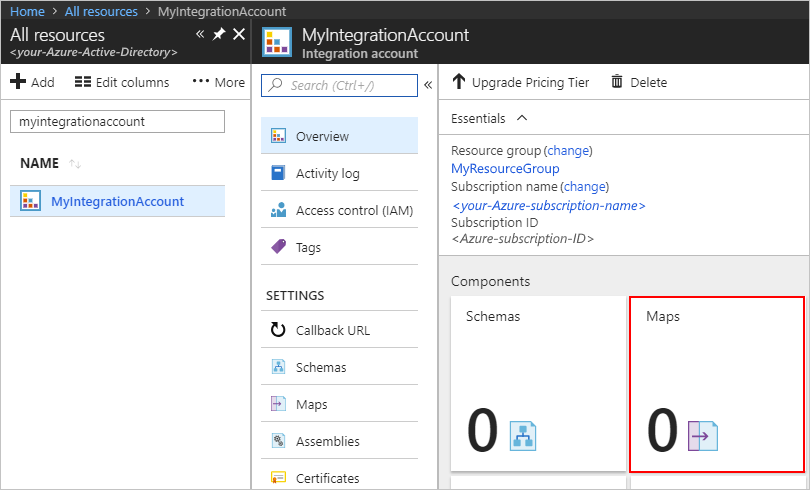
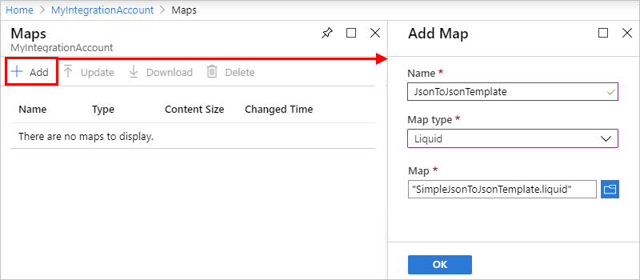
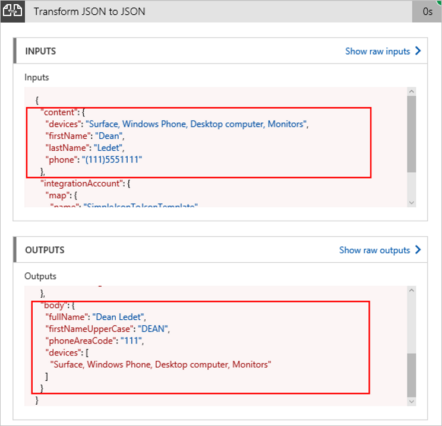
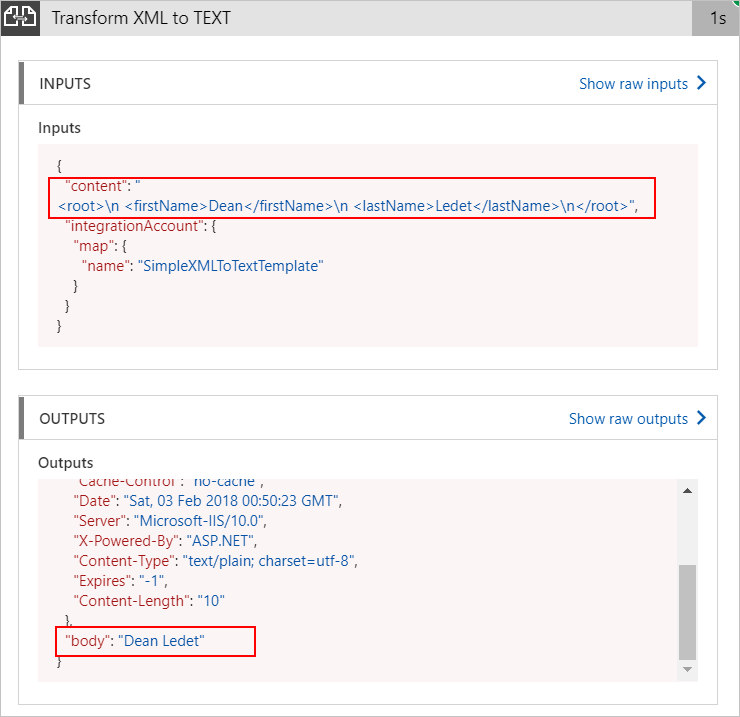

# Perform advanced JSON transformations with Liquid templates in Azure Logic Apps

You can perform basic JSON transformations in your logic apps with 
native data operation actions such as **Compose** or **Parse JSON**. 
To perform advanced JSON transformations, you can create templates 
or maps with [Liquid](https://shopify.github.io/liquid/), which is 
an open-source template language for flexible web apps. A Liquid template 
defines how to transform JSON output and supports more complex JSON 
transformations, such as iterations, control flows, variables, and so on. 

Before you can perform a Liquid transformation in your logic app, 
you must first define the JSON to JSON mapping with a Liquid template 
and store that map in your integration account. This article shows 
you how to create and use this Liquid template or map. 

## Prerequisites

* An Azure subscription. If you don't have a subscription, you can 
[start with a free Azure account](https://azure.microsoft.com/free/). 
Or, [sign up for a Pay-As-You-Go subscription](https://azure.microsoft.com/pricing/purchase-options/).

* Basic knowledge about [how to create logic apps](../logic-apps/quickstart-create-first-logic-app-workflow.md)

* A basic [integration account](../logic-apps/logic-apps-enterprise-integration-create-integration-account.md)

* Basic knowledge about [Liquid template language.](https://shopify.github.io/liquid/)

## Create Liquid template or map for your integration account

1. For this example, create the sample Liquid template described 
in this step. In your Liquid template, you can use 
[Liquid filters](https://shopify.github.io/liquid/basics/introduction/#filters), 
which use [DotLiquid](https://dotliquidmarkup.org/) and C# naming conventions. 

   > [!NOTE]
   > Make sure the filter names use *sentence casing* in your template. 
   > Otherwise, the filters won't work.

   ```json
   
   
   {
      "fullName": "{{content.firstName | Append: ' ' | Append: content.lastName}}",
      "firstNameUpperCase": "{{content.firstName | Upcase}}",
      "phoneAreaCode": "{{content.phone | Slice: 1, 3}}",
      "devices" : [
         
            
            "{{device}}"
            
            "{{device}}",
            
        
        ]
   }
   ```

2. Sign in to the [Azure portal](https://portal.azure.com). 
On the main Azure menu, select **All resources**. 
In the search box, find and select your integration account.

   

3.  Under **Components**, select **Maps**.

    

4. Choose **Add** and provide these details for your map:

   | Property | Value | Description | 
   |----------|-------|-------------|
   | **Name** | JsonToJsonTemplate | The name for your map, which is "JsonToJsonTemplate" in this example | 
   | **Map type** | **liquid** | The type for your map. For JSON to JSON transformation, you must select **liquid**. | 
   | **Map** | "SimpleJsonToJsonTemplate.liquid" | An existing Liquid template or map file to use for transformation, which is "SimpleJsonToJsonTemplate.liquid" in this example. To find this file, you can use the file picker. |
   ||| 

   
    
## Add the Liquid action for JSON transformation

1. In the Azure portal, follow these steps to 
   [create a blank logic app](../logic-apps/quickstart-create-first-logic-app-workflow.md).

2. In the Logic App Designer, add the 
   [Request trigger](../connectors/connectors-native-reqres.md#add-request) 
   to your logic app.

3. Under the trigger, choose **New step**. 
   In the search box, enter "liquid" as your filter, 
   and select this action: **Transform JSON to JSON - Liquid**

   

4. Click inside the **Content** box so that the dynamic content list appears, 
   and select the **Body** token.
  
   
 
5. From the **Map** list, select your Liquid template, 
   which is "JsonToJsonTemplate" in this example.

   

   If the maps list is empty, most likely your logic app is not linked to your integration account. 
   To link your logic app to the integration account that has the Liquid template or map, 
   follow these steps:

   1. On your logic app menu, select **Workflow settings**.

   2. From the **Select an Integration account** list, 
      select your integration account, and choose **Save**.

      

## Test your logic app

Post JSON input to your logic app from [Postman](https://www.getpostman.com/postman) or a similar tool. 
The transformed JSON output from your logic app looks like this example:
  


## More Liquid action examples
Liquid is not limited to only JSON transformations. Here are other available transformation actions that use Liquid.

* Transform JSON to text
  
  Here is the Liquid template used for this example:
   
   ``` json
   {{content.firstName | Append: ' ' | Append: content.lastName}}
   ```
   Here are sample inputs and outputs:
  
   

* Transform XML to JSON
  
  Here is the Liquid template used for this example:
   
   ``` json
   [
        {{item}}
    ]
   ```
   Here are sample inputs and outputs:

   

* Transform XML to text
  
  Here is the Liquid template used for this example:

   ``` json
   {{content.firstName | Append: ' ' | Append: content.lastName}}
   ```

   Here are sample inputs and outputs:

   

## Next steps

* [Learn more about the Enterprise Integration Pack](../logic-apps/logic-apps-enterprise-integration-overview.md "Learn about Enterprise Integration Pack")  
* [Learn more about maps](../logic-apps/logic-apps-enterprise-integration-maps.md "Learn about enterprise integration maps")  

