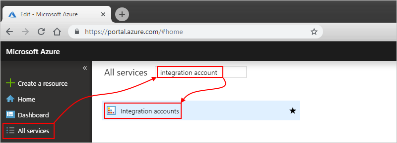
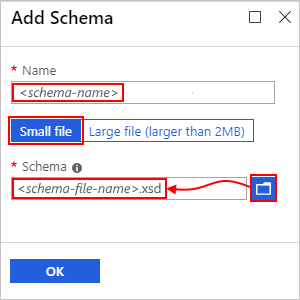

# Validate XML with schemas in Azure Logic Apps with Enterprise Integration Pack

To check that documents use valid XML and have the expected data 
in the predefined format for enterprise integration scenarios 
in Azure Logic Apps, your logic app can use schemas. 
A schema can also validate messages that logic apps exchange
in business-to-business (B2B) scenarios.

For limits related to integration accounts and artifacts such as schemas, 
see [Limits and configuration information for Azure Logic Apps](../logic-apps/logic-apps-limits-and-config.md#integration-account-limits).

## Prerequisites

* An Azure subscription. If you don't have a subscription, 
<a href="https://azure.microsoft.com/free/" target="_blank">sign up for a free Azure account</a>.

* An [integration account](../logic-apps/logic-apps-enterprise-integration-create-integration-account.md) 
where you store your schemas and other artifacts for enterprise 
integration and business-to-business (B2B) solutions. 

  If your schema is [2 MB or smaller](#smaller-schema), 
  you can add your schema to your integration account 
  directly from the Azure portal. However, if your 
  schema is bigger than 2 MB but no bigger than the 
  [schema size limit](../logic-apps/logic-apps-limits-and-config.md#artifact-capacity-limits), 
  you can upload your schema to an Azure storage account. 
  To add that schema to your integration account, you can 
  then link to your storage account from your integration account. 
  For this task, here are the items you need: 

  * [Azure storage account](../storage/common/storage-account-overview.md) 
  where you create a blob container for your schema. Learn how to 
  [create a storage account](../storage/common/storage-quickstart-create-account.md). 

  * Blob container for storing your schema. Learn how to 
  [create a blob container](../storage/blobs/storage-quickstart-blobs-portal.md). 
  You need your container's content URI later when you 
  add the schema to your integration account.

  * [Azure Storage Explorer](../vs-azure-tools-storage-manage-with-storage-explorer.md), 
  which you can use for managing storage accounts and blob containers. 
  To use Storage Explorer, choose either option here:
  
    * In the Azure portal, find and select your storage account. 
    From your storage account menu, select **Storage Explorer**.

    * For the desktop version, [download and install Azure Storage Explorer](https://www.storageexplorer.com/). 
    Then, connect Storage Explorer to your storage account 
    by following the steps in [Get started with Storage Explorer](../vs-azure-tools-storage-manage-with-storage-explorer.md). 
    To learn more, see [Quickstart: Create a blob in object storage with Azure Storage Explorer](../storage/blobs/storage-quickstart-blobs-storage-explorer.md).

You don't need a logic app when creating and adding schemas. 
However, to use a schema, your logic app needs linking to 
an integration account where you store that schema. Learn 
[how to link logic apps to integration accounts](../logic-apps/logic-apps-enterprise-integration-create-integration-account.md#link-account). 
If you don't have a logic app yet, learn [how to create logic apps](../logic-apps/quickstart-create-first-logic-app-workflow.md).

## Add schemas

1. Sign in to the <a href="https://portal.azure.com" target="_blank">Azure portal</a> 
with your Azure account credentials.

1. To find and open your integration account, 
on the main Azure menu, select **All services**. 
In the search box, enter "integration account". 
Select **Integration accounts**.

   

1. Select the integration account where you 
want to add your schema, for example:

   

1. On your integration account's **Overview** page, 
under **Components**, select the **Schemas** tile.

   

1. After the **Schemas** page opens, choose **Add**.

   

Based on your schema (.xsd) file's size, follow the 
steps for uploading a schema that's either 
[up to 2 MB](#smaller-schema) or 
[more than 2 MB, up to 8 MB](#larger-schema).

### Add schemas up to 2 MB

1. Under **Add Schema**, enter a name for your schema. 
   Keep **Small file** selected. Next to the **Schema** box, 
   choose the folder icon. Find and select the schema you're uploading, 
   for example:

   

1. When you're ready, choose **OK**.

   After your schema finishes uploading, 
   the schema appears in the **Schemas** list.

### Add schemas more than 2 MB

To add larger schemas, you can upload your schema to 
an Azure blob container in your Azure storage account. 
Your steps for adding schemas differ based whether your 
blob container has public read access. So first, check 
whether or not your blob container has public read 
access by following these steps: 
[Set public access level for blob container](../vs-azure-tools-storage-explorer-blobs.md#set-the-public-access-level-for-a-blob-container)

#### Check container access level

1. Open Azure Storage Explorer. In the Explorer window, 
   expand your Azure subscription if not already expanded.

1. Expand **Storage Accounts** > {*your-storage-account*} > 
   **Blob Containers**. Select your blob container.

1. From your blob container's shortcut menu, 
   select **Set Public Access Level**.

   * If your blob container has at least public access, choose **Cancel**, 
   and follow these steps later on this page: 
   [Upload to containers with public access](#public-access)

     

   * If your blob container doesn't have public access, choose **Cancel**, 
   and follow these steps later on this page: 
   [Upload to containers without public access](#public-access)

     

#### Upload to containers with public access

1. Upload the schema to your storage account. 
   In the right-hand window, choose **Upload**.

1. After you finish uploading, select your 
   uploaded schema. On the toolbar, choose **Copy URL** 
   so that you copy the schema's URL.

1. Return to the Azure portal where the 
   **Add Schema** pane is open. 
   Enter a name for your assembly. 
   Choose **Large file (larger than 2 MB)**. 

   The **Content URI** box now appears, 
   rather than the **Schema** box.

1. In the **Content URI** box, paste your schema's URL. 
   Finish adding your schema.

After your schema finishes uploading, 
the schema appears in the **Schemas** list. 
On your integration account's **Overview** page, 
under **Components**, the **Schemas** tile now 
shows the number of uploaded schemas.

#### Upload to containers without public access

1. Upload the schema to your storage account. 
   In the right-hand window, choose **Upload**.

1. After you finish uploading, generate a 
   shared access signature (SAS) for your schema. 
   From your schema's shortcut menu, 
   select **Get Shared Access Signature**.

1. In the **Shared Access Signature** pane, select 
   **Generate container-level shared access signature URI** > **Create**. 
   After the SAS URL gets generated, next to the **URL** box, choose **Copy**.

1. Return to the Azure portal where the 
   **Add Schema** pane is open. Choose **Large file**.

   The **Content URI** box now appears, 
   rather than the **Schema** box.

1. In the **Content URI** box, paste the SAS URI 
   you previously generated. Finish adding your schema.

After your schema finishes uploading, 
the schema appears in the **Schemas** list. 
On your integration account's **Overview** page, 
under **Components**, the **Schemas** tile now 
shows the number of uploaded schemas.

## Edit schemas

To update an existing schema, you have to upload a new 
schema file that has the changes you want. However, 
you can first download the existing schema for editing.

1. In the <a href="https://portal.azure.com" target="_blank">Azure portal</a>, 
find and open your integration account, if not already open.

1. On the main Azure menu, select **All services**. 
   In the search box, enter "integration account". 
   Select **Integration accounts**.

1. Select the integration account where you 
   want to update your schema.

1. On your integration account's **Overview** page, 
   under **Components**, select the **Schemas** tile.

1. After the **Schemas** page opens, select your schema. 
   To download and edit the schema first, choose **Download**, 
   and save the schema.

1. When you're ready to upload the updated schema, on the **Schemas** page, 
   select the schema you want to update, and choose **Update**.

1. Find and select the updated schema you want to upload. 
   After your schema file finishes uploading, 
   the updated schema appears in the **Schemas** list.

## Delete schemas

1. In the <a href="https://portal.azure.com" target="_blank">Azure portal</a>, 
find and open your integration account, if not already open.

1. On the main Azure menu, select **All services**. 
   In the search box, enter "integration account". 
   Select **Integration accounts**.

1. Select the integration account where you 
   want to delete your schema.

1. On your integration account's **Overview** page, 
   under **Components**, select the **Schemas** tile.

1. After the **Schemas** page opens, select your schema, and choose **Delete**.

1. To confirm that you want to delete the schema, choose **Yes**.

## Next steps

* [Learn more about the Enterprise Integration Pack](logic-apps-enterprise-integration-overview.md)
* [Learn more about maps](../logic-apps/logic-apps-enterprise-integration-maps.md)
* [Learn more about transforms](../logic-apps/logic-apps-enterprise-integration-transform.md)
