# Quickstart: Create and manage logic app workflow definitions with Visual Studio Code

With [Azure Logic Apps](../logic-apps/logic-apps-overview.md) and Visual Studio Code, you can create and manage logic apps that help you automate tasks, workflows, and processes for integrating apps, data, systems, and services across organizations and enterprises. This quickstart shows how you can create and edit the underlying workflow definitions, which use JavaScript Object Notation (JSON), for logic apps through a code-based experience. You can also work on existing logic apps that are already deployed to Azure.

Although you can perform these same tasks in the [Azure portal](https://portal.azure.com) and in Visual Studio, you can get started faster in Visual Studio Code when you're already familiar with logic app definitions and want to work directly in code. For example, you can disable, enable, delete, and refresh already created logic apps. Also, you can work on logic apps and integration accounts from any development platform where Visual Studio Code runs, such as Linux, Windows, and Mac.

For this article, you can create the same logic app from this [quickstart](../logic-apps/quickstart-create-first-logic-app-workflow.md), which focuses more on the basic concepts. In Visual Studio Code, the logic app looks like this example:

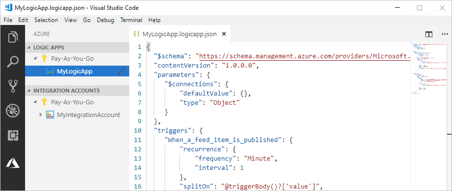

Before you start, make sure you have these items:

* If you don't have an Azure subscription, [sign up for a free Azure account](https://azure.microsoft.com/free/).

* Basic knowledge about [logic app workflow definitions](../logic-apps/logic-apps-workflow-definition-language.md) and their structure as described with JSON

  If you're new to Logic Apps, try this [quickstart](../logic-apps/quickstart-create-first-logic-app-workflow.md), which creates your first logic apps in the Azure portal and focuses more on the basic concepts.

* Access to the web for signing in to Azure and your Azure subscription

* Download and install these tools, if you don't have them already:

  * [Visual Studio Code version 1.25.1 or later](https://code.visualstudio.com/), which is free

  * Visual Studio Code extension for Azure Logic Apps

    You can download and install this extension from the [Visual Studio Marketplace](https://marketplace.visualstudio.com/items?itemName=ms-azuretools.vscode-logicapps) or directly from inside Visual Studio Code. Make sure that you reload Visual Studio Code after installing.

    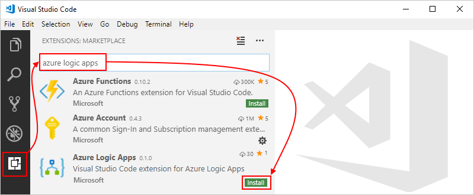

    To check that the extension installed correctly, select the Azure icon that appears in your Visual Studio Code toolbar.

    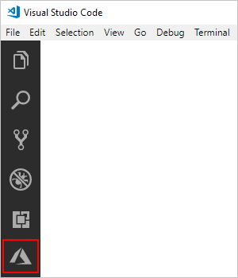

    For more information, see [Extension Marketplace](https://code.visualstudio.com/docs/editor/extension-gallery). To contribute to this extension's open-source version, visit the [Azure Logic Apps extension for Visual Studio Code on GitHub](https://github.com/Microsoft/vscode-azurelogicapps).

<a name="sign-in-azure"></a>

## Sign in to Azure

1. Open Visual Studio Code. On the Visual Studio Code toolbar, select the Azure icon.

   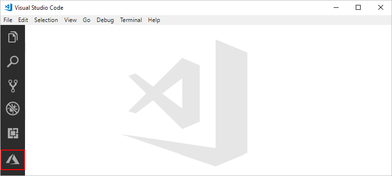

1. In the Azure window, under **Logic Apps**, select **Sign in to Azure**.

   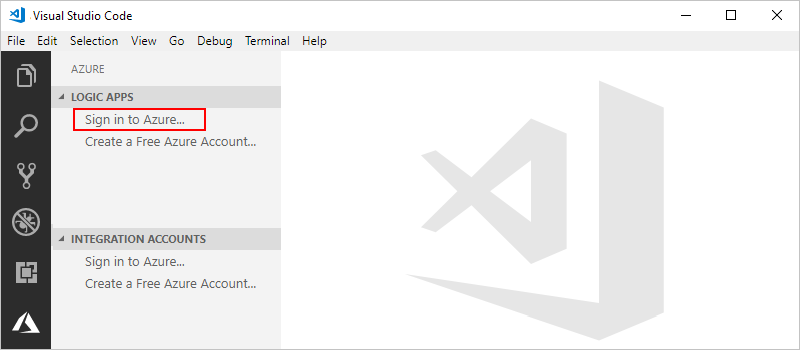

   You're now prompted to sign in by using the provided authentication code.

1. Copy the authentication code, and then select **Copy & Open**, which opens a new browser window.

   

1. Enter your authentication code. When prompted, select **Continue**.

   

1. Select your Azure account. After you sign in, you can close your browser, and return to Visual Studio Code.

   In the Azure window, the Logic Apps pane and Integration Accounts pane now show the Azure subscriptions in your account.

   

   If you don't see the subscriptions that you expect, next to **Logic Apps** label, select the **Select Subscriptions** (filter icon). Find and select the subscriptions that you want.

1. To view any existing logic apps or integration accounts in your Azure subscription, expand your subscription.

   

<a name="create-logic-app"></a>

## Create logic app

1. If you haven't signed in to your Azure subscription from inside Visual Studio Code, follow the steps in this article to [sign in now](#sign-in-azure).

1. From your subscription's context menu, select **Create**.

   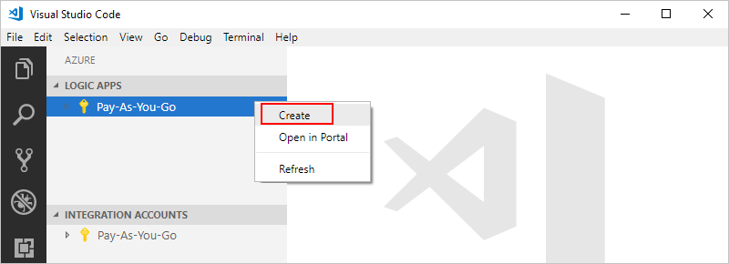

1. From the list that shows Azure resource groups in your subscription, select an existing resource group or **Create a new resource group**.

   This example creates a new resource group:

   

1. Provide a name for your Azure resource group, and then press ENTER.

   

1. Select the datacenter location for where to save your logic app's metadata.

   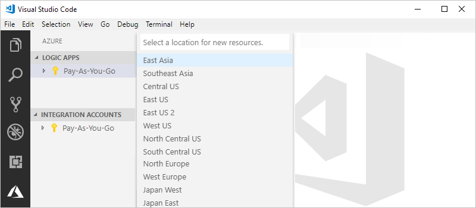

1. Provide a name for your logic app, and then press ENTER.

   

   Your new logic app now appears in the Azure window, under your Azure subscription. Now you can start creating your logic app's workflow definition.

1. From your logic app's shortcut menu, select **Open in Editor**.

   

   Visual Studio Code opens a logic app workflow definition template (.logicapp.json file) so that you can start creating your logic app's workflow.

   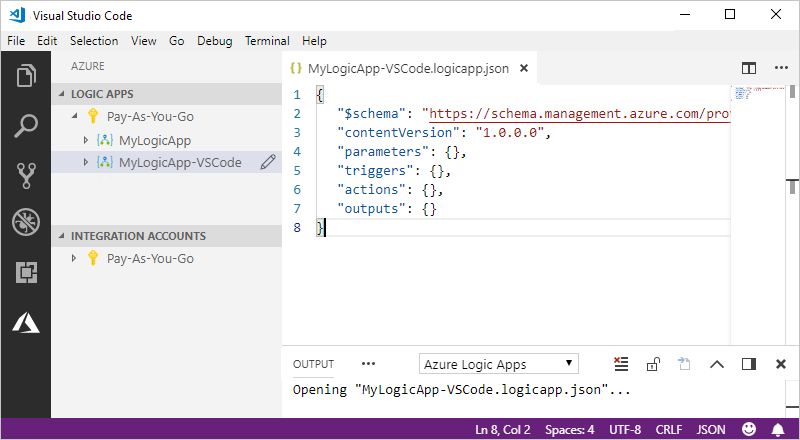

1. In the logic app workflow definition template file, start building your logic app's workflow definition.
For technical reference, see the [Workflow Definition Language schema for Azure Logic Apps](../logic-apps/logic-apps-workflow-definition-language.md).

   Here is an example logic definition. Usually, JSON elements appear alphabetically in each section. However, this sample shows these elements roughly in the order that the logic app's steps appear in the designer.

   ```json
   {
      "$schema": "https://schema.management.azure.com/providers/Microsoft.Logic/schemas/2016-06-01/workflowdefinition.json#",
      "contentVersion": "1.0.0.0",
      "parameters": {
         "$connections": {
            "defaultValue": {},
            "type": "Object"
         }
      },
      "triggers": {
         "When_a_feed_item_is_published": {
            "recurrence": {
               "frequency": "Minute",
               "interval": 1
            },
            "splitOn": "@triggerBody()?['value']",
            "type": "ApiConnection",
            "inputs": {
               "host": {
                  "connection": {
                     "name": "@parameters('$connections')['rss']['connectionId']"
                  }
               },
               "method": "get",
               "path": "/OnNewFeed",
               "queries": {
                  "feedUrl": "http://feeds.reuters.com/reuters/topNews"
               }
            }
         }
      },
      "actions": {
         "Send_an_email": {
            "runAfter": {},
            "type": "ApiConnection",
            "inputs": {
               "body": {
                  "Body": "Title: @{triggerBody()?['title']}\n\nDate published: @{triggerBody()?['publishDate']}\n\nLink: @{triggerBody()?['primaryLink']}",
                  "Subject": "New RSS item: @{triggerBody()?['title']}",
                  "To": "Sophie.Owen@contoso.com"
               },
               "host": {
                  "connection": {
                     "name": "@parameters('$connections')['outlook']['connectionId']"
                  }
               },
               "method": "post",
               "path": "/Mail"
            }
         }
      },
      "outputs": {}
   }
   ```

1. When you're done, save your logic app definition file. When Visual Studio Code prompts you to confirm uploading your logic app definition to your Azure subscription, select **Upload**.

   

   After Visual Studio Code publishes your logic app to Azure, you can find your app now live and running in the Azure portal.

   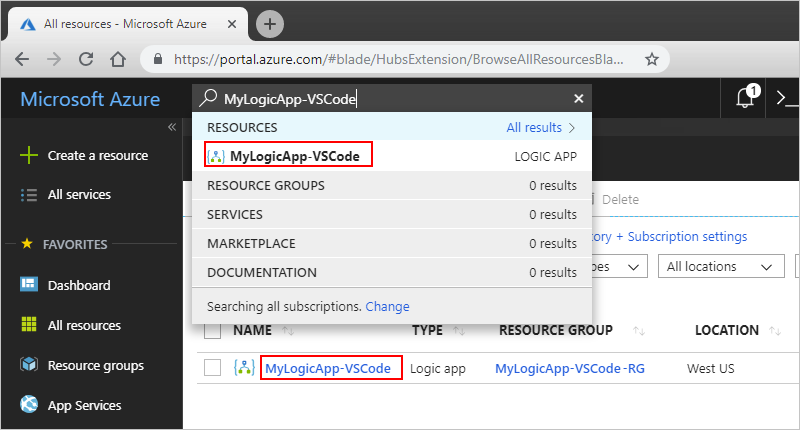

<a name="edit-logic-app"></a>

## Edit logic app

To work on a logic app that's published in Azure, you can open that logic app's definition by using Visual Studio Code.

1. If you haven't signed in to your Azure subscription from inside Visual Studio Code, follow the steps in this article to [sign in now](#sign-in-azure).

1. In the Azure window, under **Logic Apps**, expand your Azure subscription, and select the logic app you want.

1. From your logic app's menu, select **Open in Editor**. Or, next to your logic app's name, select the edit icon.

   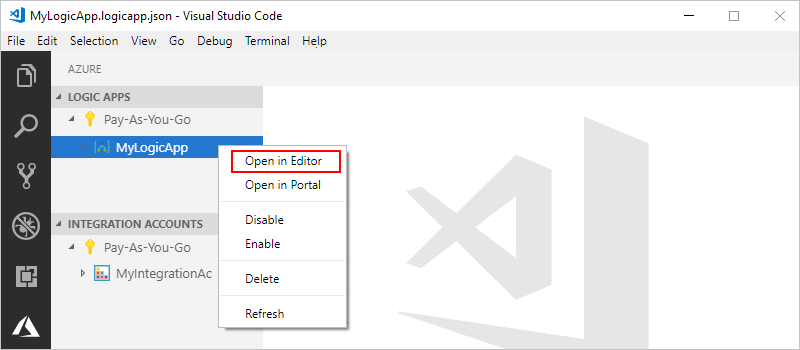

   Visual Studio Code opens the .logicapp.json file for your logic app's workflow definition.

   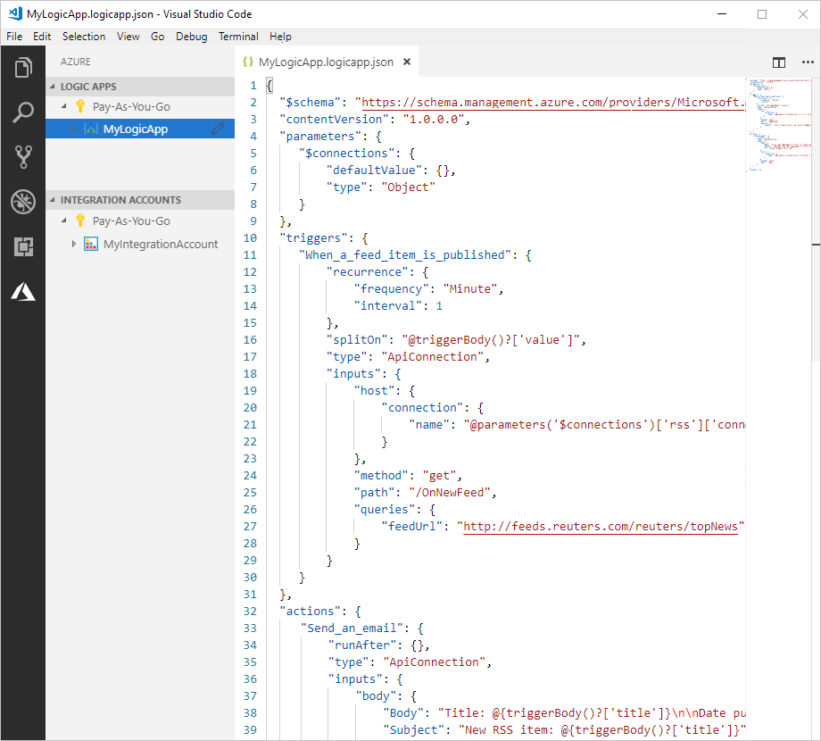

1. Make your changes in your logic app's definition.

1. When you're done, save your changes.

1. When Visual Studio Code prompts you to update your logic app definition in your Azure subscription, select **Upload**.

   

## Next steps

> [!div class="nextstepaction"]
> * [Create logic apps with Visual Studio](../logic-apps/quickstart-create-logic-apps-with-visual-studio.md)