# Tutorial: Create automated approval-based workflows by using Azure Logic Apps

This tutorial shows how to build an example [logic app](../logic-apps/logic-apps-overview.md) that automates an approval-based workflow. Specifically, this example logic app processes subscription requests for a mailing list that's managed by the [MailChimp](https://mailchimp.com/) service. This logic app includes various steps, which start by monitoring an email account for requests, sends these requests for approval, checks whether or not the request gets approval, adds approved members to the mailing list, and confirms whether or not new members get added to the list.

In this tutorial, you learn how to:

> [!div class="checklist"]
>
> * Create a blank logic app.
> * Add a trigger that monitors emails for subscription requests.
> * Add an action that sends emails for approving or rejecting these requests.
> * Add a condition that checks the approval response.
> * Add an action that adds approved members to the mailing list.
> * Add a condition that checks whether these members successfully joined the list.
> * Add an action that sends emails confirming whether these members successfully joined the list.

When you're done, your logic app looks like this workflow at a high level:

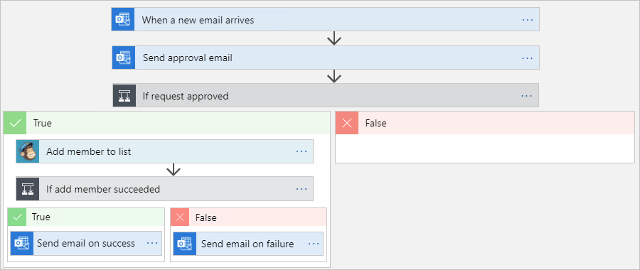

## Prerequisites

* An Azure account and subscription. If you don't have a subscription, [sign up for a free Azure account](https://azure.microsoft.com/free/?WT.mc_id=A261C142F).

* A MailChimp account where you previously created a list named "test-members-ML" where your logic app can add email addresses for approved members. If you don't have an account, [sign up for a free account](https://login.mailchimp.com/signup/), and then learn [how to create a MailChimp list](https://us17.admin.mailchimp.com/lists/#).

* An email account from an email provider that's supported by Logic Apps, such as Office 365 Outlook, Outlook.com, or Gmail. For other providers, [review the connectors list here](/connectors/). This quickstart uses Office 365 Outlook with a work or school account. If you use a different email account, the general steps stay the same, but your UI might slightly differ.

* An email account in Office 365 Outlook or Outlook.com, which supports approval workflows. This tutorial uses Office 365 Outlook. If you use a different email account, the general steps stay the same, but your UI might appear slightly different.

## Create your logic app

1. Sign in to the [Azure portal](https://portal.azure.com) with your Azure account credentials. On the Azure home page, select **Create a resource**.

1. On the Azure Marketplace menu, select **Integration** > **Logic App**.

   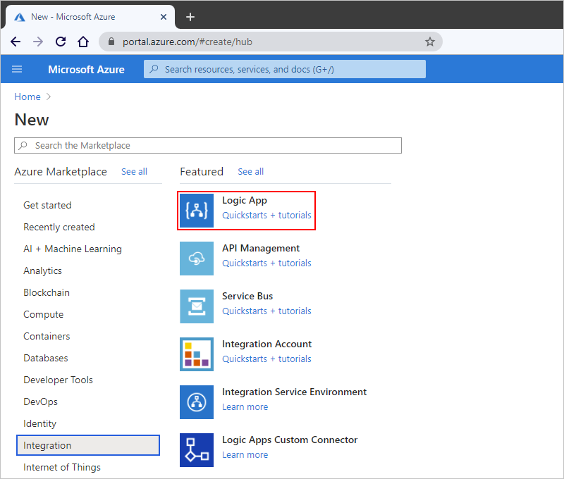

1. On the **Logic App** pane, provide the information described here about the logic app that you want to create.

   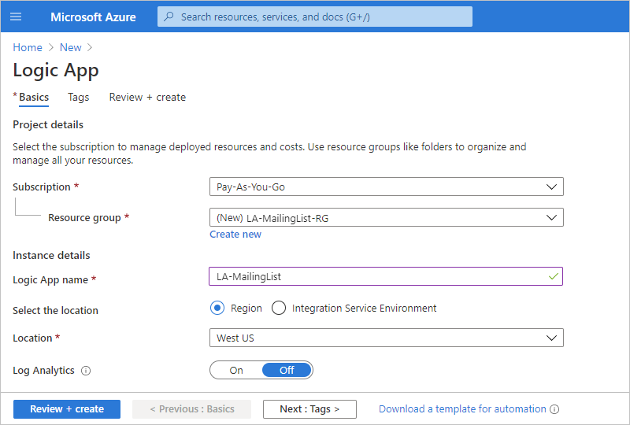

   | Property | Value | Description |
   |----------|-------|-------------|
   | **Subscription** | <*Azure-subscription-name*> | Your Azure subscription name. This example uses `Pay-As-You-Go`. |
   | **Resource group** | LA-MailingList-RG | The name for the [Azure resource group](../azure-resource-manager/management/overview.md), which is used to organize related resources. This example creates a new resource group named `LA-MailingList-RG`. |
   | **Name** | LA-MailingList | Your logic app's name, which can contain only letters, numbers, hyphens (`-`), underscores (`_`), parentheses (`(`, `)`), and periods (`.`). This example uses `LA-MailingList`. |
   | **Location** | West US | The region where to store your logic app information. This example uses `West US`. |
   | **Log Analytics** | Off | Keep the **Off** setting for diagnostic logging. |
   ||||

1. When you're done, select **Review + create**. After Azure validates the information about your logic app, select **Create**.

1. After Azure deploys your app, select **Go to resource**.

   Azure opens the Logic Apps template selection pane, which shows an introduction video, commonly used triggers, and logic app template patterns.

1. Scroll down past the video and common triggers sections to the **Templates** section, and select **Blank Logic App**.

   

Next, add an Outlook [trigger](../logic-apps/logic-apps-overview.md#logic-app-concepts) that listens for incoming emails with subscription requests. Each logic app must start with a trigger, which fires when a specific event happens or when new data meets a specific condition. For more information, see [Create your first logic app](../logic-apps/quickstart-create-first-logic-app-workflow.md).

## Add trigger to monitor emails

1. In the Logic Apps Designer search box, enter `when email arrives`, and select the trigger named **When a new email arrives**.

   * For Azure work or school accounts, select **Office 365 Outlook**.
   * For personal Microsoft accounts, select **Outlook.com**.

   This example continues by selecting Office 365 Outlook.

   

1. If you don't already have a connection, sign in and authenticate access to your email account when prompted.

   Azure Logic Apps creates a connection to your email account.

1. In the trigger, provide the criteria for checking new email.

   1. Specify the folder for checking emails, and keep the other properties set to their default values.

      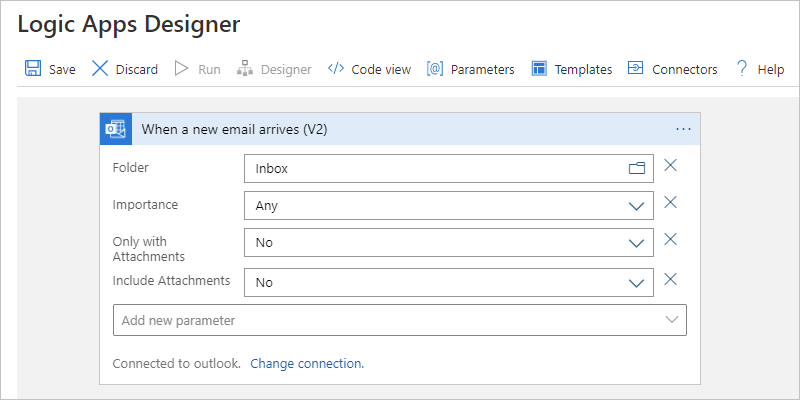

   1. Add the trigger's **Subject Filter** property so that you can filter emails based on the subject line. Open the **Add new parameter** list, and select **Subject Filter**.

      

      For more information about this trigger's properties, see the [Office 365 Outlook connector reference](/connectors/office365/) or the [Outlook.com connector reference](/connectors/outlook/).

   1. After the property appears in the trigger, enter this text: `subscribe-test-members-ML`

      

1. To hide the trigger's details for now, collapse the shape by clicking inside the shape's title bar.

   

1. Save your logic app. On the designer toolbar, select **Save**.

Your logic app is now live but doesn't do anything other than check your incoming email. So, add an action that responds when the trigger fires.

## Send approval email

Now that you have a trigger, add an [action](../logic-apps/logic-apps-overview.md#logic-app-concepts) that sends an email to approve or reject the request.

1. In the Logic Apps Designer, under the **When a new email arrives** trigger, select **New step**.

1. Under **Choose an operation**, in the search box, enter `send approval`, and select the action named **Send approval email**.

   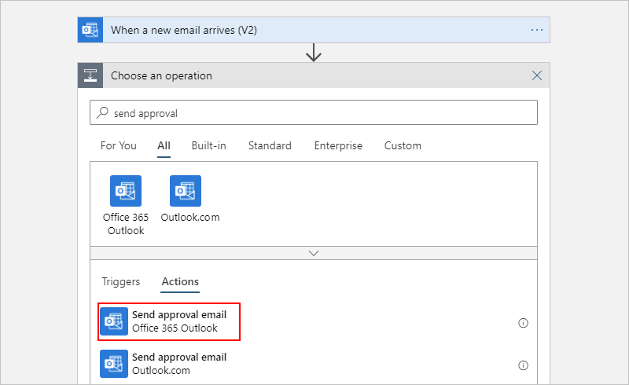

1. Now enter the values for the specified properties shown and described here. leaving all the others at their default values. For more information about these properties, see the [Office 365 Outlook connector reference](/connectors/office365/) or the [Outlook.com connector reference](/connectors/outlook/).

   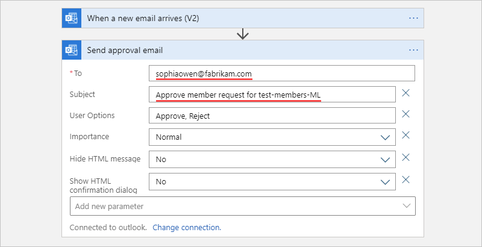

   | Property | Value | Description |
   |----------|-------|-------------|
   | **To** | <*approval-email-address*> | The approver's email address. For testing purposes, you can use your own address. This example uses the fictional `sophiaowen@fabrikam.com` email address. |
   | **Subject** | `Approve member request for test-members-ML` | A descriptive email subject |
   | **User Options** | `Approve, Reject` | Make sure that this property specifies the response options that the approver can select, which are **Approve** or **Reject** by default. |
   ||||

   > [!NOTE]
   > When you click inside some edit boxes, the dynamic content list appears, which you can ignore for now. 
   > This list shows the outputs from previous actions that are available for you to select as inputs to 
   > subsequent actions in your workflow.
 
1. Save your logic app.

Next, add a condition that checks the approver's selected response.

## Check approval response

1. Under the **Send approval email** action, select **New step**.

1. Under **Choose an operation**, select **Built-in**. In the search box, enter `condition`, and select the action named **Condition**.

   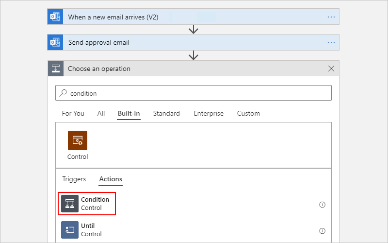

1. In the **Condition** title bar, select the **ellipses** (**...**) button, and then select **Rename**. Rename the condition with this description: `If request approved`

   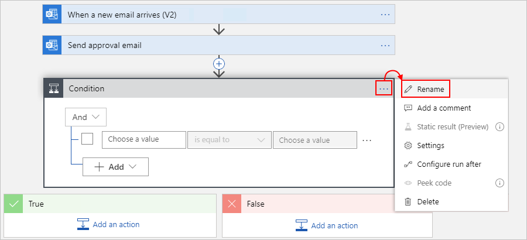

1. Build a condition that checks whether the approver selected **Approve**.

   1. On the condition's left side, click inside the **Choose a value** box.

   1. From the dynamic content list that appears, under **Send approval email**, select the **SelectedOption** property.

      

   1. In the middle comparison box, select the **is equal to** operator.

   1. On the condition's right side, in the **Choose a value** box, enter the text, `Approve`.

      When you're done, the condition looks like this example:

      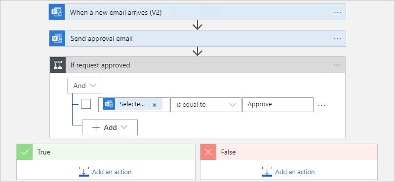

1. Save your logic app.

Next, specify the action that your logic app performs when the reviewer approves the request. 

## Add member to MailChimp list

Now add an action that adds the approved member to your mailing list.

1. In the condition's **True** branch, select **Add an action**.

1. Under the **Choose an operation** search box, select **All**. In the search box, enter `mailchimp`, and select the action named **Add member to list**.

   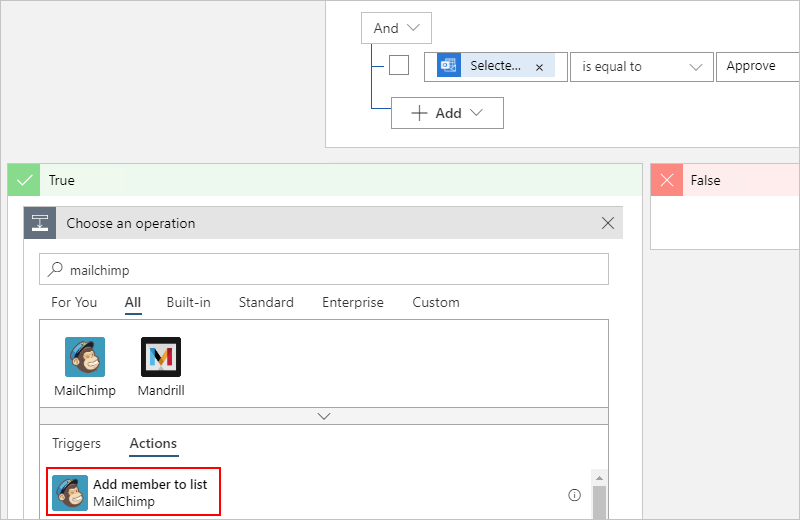

1. If you don't already have a connection to your MailChimp account, you're prompted to sign in.

1. In the **Add member to list** action, provide the information as shown and described here:

   

   | Property | Required | Value | Description |
   |----------|----------|-------|-------------|
   | **List Id** | Yes | <*mailing-list-name*> | Select the name for your MailChimp mailing list. This example uses `test-members-ML`. |
   | **Email Address** | Yes | <*new-member-email-address*> | In the dynamic content list that opens, from the **When a new email arrives** section, select **From**, which is output from the trigger and specifies the email address for the new member. |
   | **Status** | Yes | <*member-subscription-status*> | Select the subscription status to set for the new member. This example selects `subscribed`. 
For more information, see [Manage subscribers with the MailChimp API](https://developer.mailchimp.com/documentation/mailchimp/guides/manage-subscribers-with-the-mailchimp-api/). |
   |||||

   For more information about the **Add member to list** action properties, see the [MailChimp connector reference](/connectors/mailchimp/).

1. Save your logic app.

Next, add a condition so that you can check whether the new member successfully joined your mailing list. That way, your logic app can notify you whether this operation succeeded or failed.

## Check for success or failure

1. In the **True** branch, under the **Add member to list** action, select **Add an action**.

1. Under **Choose an operation**, select **Built-in**. In the search box, enter `condition`, and select the action named **Condition**.

1. Rename the condition with this description: `If add member succeeded`

1. Build a condition that checks whether the approved member succeeds or fails in joining your mailing list:

   1. On the condition's left side, click inside the **Choose a value** box. From the dynamic content list that appears, in the **Add member to list** section, select the **Status** property.

      For example, your condition looks like this example:

      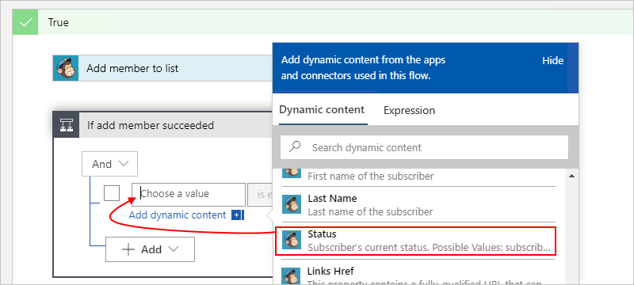

   1. In the middle comparison box, select the **is equal to** operator.

   1. On the condition's right side, in the **Choose a value** box, enter this text: `subscribed`

      When you're done, the condition looks like this example:

      

Next, set up the emails to send when the approved member either succeeds or fails in joining your mailing list.

## Send email if member added

1. Under the **If add member succeeded** condition, in the **True** branch, select **Add an action**.

   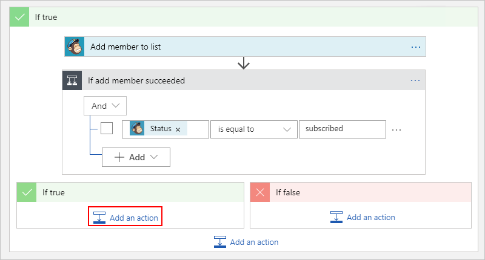

1. In the **Choose an operation** search box, enter `outlook send email`, and select the action named **Send an email**.

   

1. Rename the action with this description: `Send email on success`

1. In the **Send email on success** action, provide the information as shown and described here:

   

   | Property | Required | Value | Description |
   |----------|----------|-------|-------------|
   | **Body** | Yes | <*success-email-body*> | The body content for the success email. For this tutorial, follow these steps: 
1. Enter this text with a trailing space: `New member has joined "test-members-ML":` 
2. From the dynamic content list that appears, select the **Email Address** property. 
**Note**: If this property doesn't appear, next to the **Add member to list** section header, select **See more**. 
3. On the next row, enter this text with a trailing space: `Member opt-in status: ` 
4. From the dynamic content list, under **Add member to list**, select the **Status** property. |
   | **Subject** | Yes | <*success-email-subject*> | The subject for the success email. For this tutorial, follow these steps: 
1. Enter this text with a trailing space: `Success! Member added to "test-members-ML": ` 
2. From the dynamic content list, under **Add member to list**, select the **Email Address** property. |
   | **To** | Yes | <*your-email-address*> | The email address for where to send the success email. For testing purposes, you can use your own email address. |
   |||||

1. Save your logic app.

## Send email if member not added

1. Under the **If add member succeeded** condition, in the **False** branch, select **Add an action**.

   

1. In the **Choose an operation** search box, enter `outlook send email`, and select the action named **Send an email**.

   

1. Rename the action with this description: `Send email on failure`

1. Provide information about this action as shown and described here:

   

   | Property | Required | Value | Description |
   |----------|----------|-------|-------------|
   | **Body** | Yes | <*body-for-failure-email*> | The body content for the failure email. For this tutorial, enter this text: 
`Member might already exist. Check your MailChimp account.` |
   | **Subject** | Yes | <*subject-for-failure-email*> | The subject for the failure email. For this tutorial, follow these steps: 
1. Enter this text with a trailing space: `Failed, member not added to "test-members-ML": ` 
2. From the dynamic content list, under **Add member to list**, select the **Email Address** property. |
   | **To** | Yes | <*your-email-address*> | The email address for where to send the failure email. For testing purposes, you can use your own email address. |
   |||||

1. Save your logic app. 

Next, test your logic app, which now looks similar to this example:

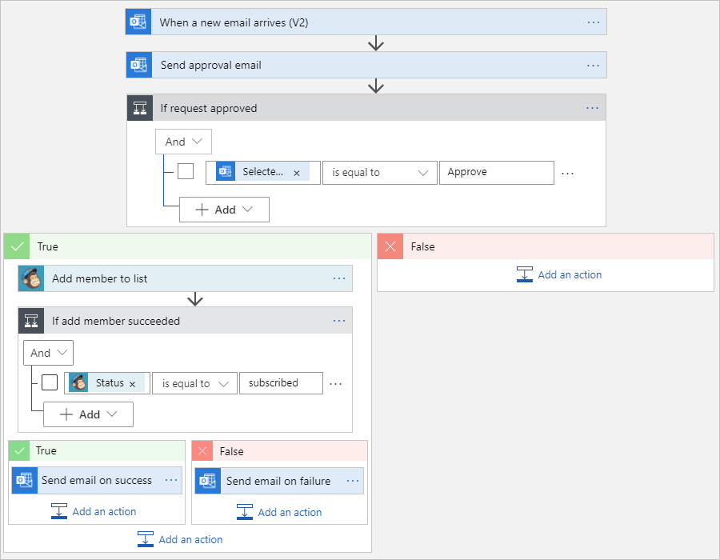

## Run your logic app

1. Send yourself an email request to join your mailing list. Wait for the request to appear in your inbox.

1. To manually start your logic app, on the designer toolbar, select **Run**. 

   If your email has a subject that matches the trigger's subject filter, your logic app sends you email to approve the subscription request.

1. In the approval email that you receive, select **Approve**.

1. If the subscriber's email address doesn't exist on your mailing list, your logic app adds that person's email address and sends you an email like this example:

   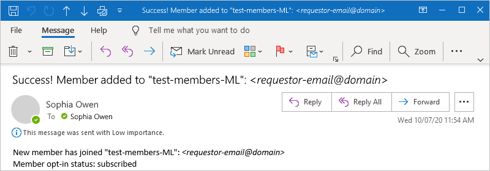

   If your logic app can't add the subscriber, you get an email like this example:

   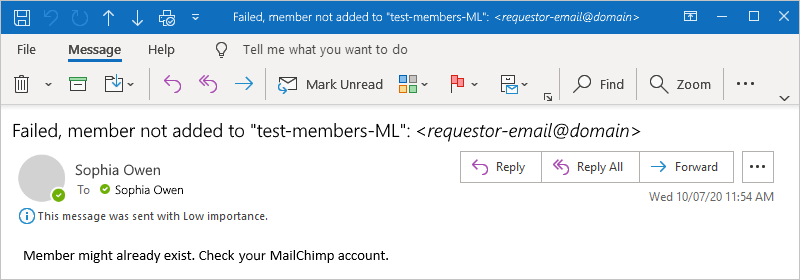

  > [!TIP]
  > If you don't get any emails, check your email's junk folder. Your email junk filter might 
  > redirect these kinds of mails. Otherwise, if you're unsure that your logic app ran correctly, 
  > see [Troubleshoot your logic app](../logic-apps/logic-apps-diagnosing-failures.md).

Congratulations, you've now created and run a logic app that integrates information across Azure, Microsoft services, and other SaaS apps.

## Clean up resources

Your logic app continues running until you disable or delete the app. When you no longer need the sample logic app, delete the resource group that contains your logic app and related resources.

1. In the Azure portal's search box, enter the name for the resource group that you created. From the results, under **Resource Groups**, select the resource group.

   This example created the resource group named `LA-MailingList-RG`.

   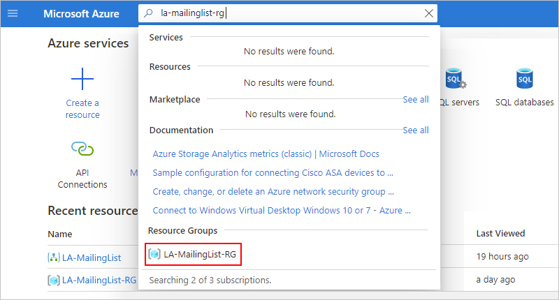

   > [!TIP]
   > If the Azure home page shows the resource group under **Recent resources**,
   > you can select the group from the home page.

1. On the resource group menu, check that **Overview** is selected. On the **Overview** pane's toolbar, select **Delete resource group**.

   

1. In the confirmation pane that appears, enter the resource group name, and select **Delete**.

## Next steps

In this tutorial, you created a logic app that handles approvals for mailing list requests. Now, learn how to build a logic app that processes and stores email attachments by integrating Azure services, such as Azure Storage and Azure Functions.

> [!div class="nextstepaction"]
> [Process email attachments](../logic-apps/tutorial-process-email-attachments-workflow.md)
