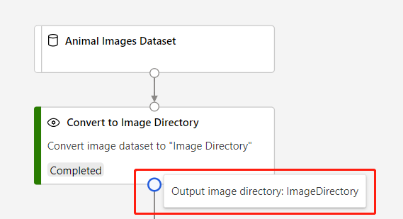

# Convert to Image Directory

This article describes how to use the Convert to Image Directory module to help convert image dataset to *Image Directory* data type, which is standardized data format in image-related tasks like image classification in Azure Machine Learning designer.

## How to use Convert to Image Directory  

1. Prepare your image dataset first. 

    For supervised learning, you need to specify the label of training dataset. The image dataset file should be in following structure:
    
    ```
    Your_image_folder_name/Category_1/xxx.png
    Your_image_folder_name/Category_1/xxy.jpg
    Your_image_folder_name/Category_1/xxz.jpeg
    
    Your_image_folder_name/Category_2/123.png
    Your_image_folder_name/Category_2/nsdf3.png
    Your_image_folder_name/Category_2/asd932_.png
    ```
    
    In the image dataset folder, there are multiple subfolders. Each subfolder contains images of one category respectively. The names of subfolders are considered as the labels for tasks like image classification. Refer to [torchvision datasets](https://pytorch.org/docs/stable/torchvision/datasets.html#imagefolder) for more information.

    > [!WARNING]
    > Currently labeled datasets exported from Data Labeling are not supported in the designer.

    Images with these extensions (in lowercase) are supported: '.jpg', '.jpeg', '.png', '.ppm', '.bmp', '.pgm', '.tif', '.tiff', '.webp'. You can also have multiple types of images in one folder. It is not necessary to contain the same count of images in each category folder.

    You can either use the folder or compressed file with extension '.zip', '.tar', '.gz', and '.bz2'. **Compressed files are recommended for better performance.** 
    
    

    For scoring, the image dataset folder only needs to contain unclassified images.

1. [Register the image dataset as a file dataset](https://docs.microsoft.com/azure/machine-learning/how-to-create-register-datasets) in your workspace, since the input of Convert to Image Directory module must be a **File dataset**.

1. Add the registered image dataset to the canvas. You can find your registered dataset in the **Datasets** category in the module list in the left of canvas. Currently Designer does not support visualize image dataset.

    > [!WARNING]
    > You **cannot** use **Import Data** module to import image dataset, because the output type of **Import Data** module is DataFrame Directory, which only contains file path string.

1. Add the **Convert to Image Directory** module to the canvas. You can find this module in the 'Computer Vision/Image Data Transformation' category in the module list. Connect it to the image dataset.
    
3.  Submit the pipeline. This module could be run on either GPU or CPU.

## Results

The output of **Convert to Image Directory** module is in **Image Directory** format, and can be connected to other image-related modules of which the input port format is also Image Directory.



## Technical notes 

###  Expected inputs  

| Name          | Type                  | Description   |
| ------------- | --------------------- | ------------- |
| Input dataset | AnyDirectory, ZipFile | Input dataset |

###  Output  

| Name                   | Type           | Description            |
| ---------------------- | -------------- | ---------------------- |
| Output image directory | ImageDirectory | Output image directory |

## Next steps

See the [set of modules available](module-reference.md) to Azure Machine Learning. 
