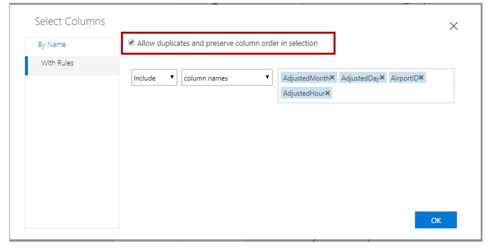

# Join Data

This article describes how to use the **Join Data** module in the Azure Machine Learning service visual interface to merge two datasets using a database-style join operation.  

## How to configure Join Data

To perform a join on two datasets, they should be related by a key column. Composite keys using multiple columns are also supported. 

1. Add the datasets you want to combine, and then drag the **Join Data** module into your experiment. 

    You can find the module in the **Data Transformation** category, under **Manipulation**.

1. Connect the datasets to the **Join Data** module. 
 
1. Select **Launch column selector** to choose key column(s). Remember to choose columns for both the left and right inputs.

    For a single key:

    Select a single key column for both inputs.
    
    For a composite key:

    Select all the key columns from left input and right input in the same order. The **Join Data** module will join the tables when all key columns match. Check the option **Allow duplicates and preserve column order in selection** if the column order isn't the same as the original table. 

    

1. Select the **Match case** option if you want to preserve case sensitivity on a text column join. 
   
1. Use the **Join type** dropdown list to specify how the datasets should be combined.  
  
    * **Inner Join**: An *inner join* is the most common join operation. It returns the combined rows only when the values of the key columns match.  
  
    * **Left Outer Join**: A *left outer join* returns joined rows for all rows from the left table. When a row in the left table has no matching rows in the right table, the returned row contains missing values for all columns that come from the right table. You can also specify a replacement value for missing values.  
  
    * **Full Outer Join**: A *full outer join* returns all rows from the left table (**table1**) and from the right table (**table2**).  
  
         For each of the rows in either table that have no matching rows in the other, the result includes a row containing missing values.  
  
    * **Left Semi-Join**: A *left semi-join* returns only the values from the left table when the values of the key columns match.  

1. For the option **Keep right key columns in joined table**:

    * Select this option to view the keys from both input tables.
    * Deselect to only return the key columns from the left input.

1. Run the experiment, or select the Join Data module and selected **Run Selected** to perform the join.

1. To view the results, right-click the **Join Data** > **Results dataset** > **Visualize**.

## Next steps

See the [set of modules available](module-reference.md) to Azure Machine Learning service. 